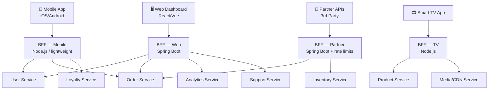
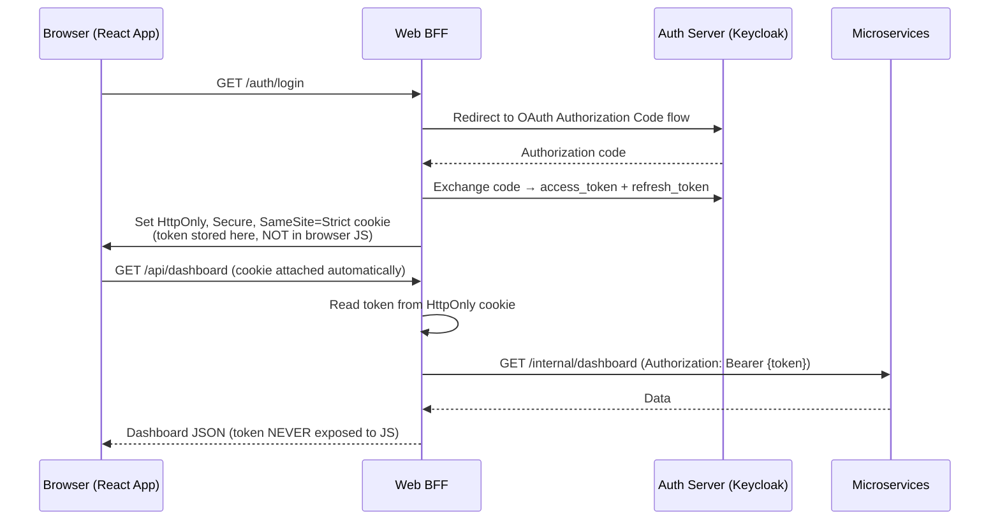

# Backend for Frontend (BFF)

The **Backend for Frontend (BFF)** pattern is an architectural approach where you create a **dedicated backend service for each type of client** — mobile app, web app, third-party API consumers — instead of maintaining one shared, generic API layer.

> **Core Idea:** Rather than forcing every client to call the same bloated APIs and discard irrelevant data, each client gets its own backend that speaks exactly its language.

---

## 👶 Beginner: What Problem Does BFF Solve?

Imagine you're building an e-commerce app with a mobile client and a web dashboard. Both clients need a "user home screen," but they need it very differently:

**Mobile app home screen needs:**
- First name, avatar thumbnail URL (small image)
- Last 3 orders (id, status, total only)
- Loyalty points badge number

**Web dashboard home screen needs:**
- Full user profile (name, email, phone, address)
- Last 20 orders (all fields including shipping address, tracking info, itemized products)
- Analytics: order frequency, lifetime value, return rate
- Recent support tickets

If you have a single shared API, you face an impossible choice:
- Make it return everything → mobile gets a 15KB JSON response when it needs 1KB
- Make it return minimal data → web dashboard must call 5+ separate endpoints and stitch together data in JavaScript

Neither is good. **BFF solves this by having one backend per client**, each returning exactly what its client needs.

---

## 🏗️ Architecture: Without vs. With BFF

### Without BFF (The Problem)

```text
                                        ┌─────────────────────┐
                                        │   Shared API Layer  │
Mobile App ────────────────────────────►│   (One for all)     │──► User Service
Web Dashboard App ──────────────────────►│                     │──► Order Service
Partner API Consumers ──────────────────►│   Every client gets │──► Product Service
Smart TV App ────────────────────────────►│   everything. Slow, │──► Analytics
                                        │   over-coupled.     │
                                        └─────────────────────┘
```

Problems this causes:
- **Over-fetching:** Mobile client receives 40 fields but renders 6. Wastes bandwidth — critical on 3G connections.
- **Under-fetching:** Web dashboard makes 5 sequential API calls to assemble one page.
- **Change coupling:** Renaming a field for web breaks the mobile app. Both teams must coordinate every release.
- **Shared team bottleneck:** The single API team becomes a choke point for every client's feature request.

### With BFF



Each BFF:
- Is **owned by the client team** — the mobile team owns the mobile BFF
- Aggregates exactly the downstream calls its client needs
- Transforms and filters data into its client's exact shape
- Has its own deployment lifecycle, independent of other BFFs

---

## ⚙️ Implementation: Java/Spring Boot Web BFF

### Project Structure

```
web-bff/
├── src/main/java/com/company/webbff/
│   ├── WebBffApplication.java
│   ├── controller/
│   │   ├── DashboardController.java     ← Aggregation endpoints
│   │   └── OrderDetailController.java
│   ├── client/
│   │   ├── UserServiceClient.java       ← Feign clients to downstream
│   │   ├── OrderServiceClient.java
│   │   └── AnalyticsServiceClient.java
│   ├── service/
│   │   └── DashboardComposerService.java  ← Fan-out + merge logic
│   └── dto/
│       ├── WebDashboardResponse.java
│       └── WebOrderDetailResponse.java
└── src/main/resources/
    └── application.yml
```

### Feign Clients to Downstream Services

```java
// client/UserServiceClient.java
@FeignClient(name = "user-service", url = "${services.user.url}",
             configuration = FeignRetryConfig.class)
public interface UserServiceClient {

    @GetMapping("/internal/users/{userId}")
    UserProfileDto getUser(@PathVariable String userId);

    @GetMapping("/internal/users")
    List<UserSummaryDto> getUsersBatch(@RequestParam("ids") List<String> userIds);
}

// client/OrderServiceClient.java
@FeignClient(name = "order-service", url = "${services.order.url}")
public interface OrderServiceClient {

    @GetMapping("/internal/orders")
    Page<OrderDto> getOrders(
        @RequestParam String userId,
        @RequestParam(defaultValue = "0") int page,
        @RequestParam(defaultValue = "20") int size,
        @RequestParam(defaultValue = "createdAt,DESC") String sort
    );

    @GetMapping("/internal/orders/{orderId}")
    OrderDetailDto getOrderDetail(@PathVariable String orderId);
}
```

### Dashboard Composer Service (Parallel Fan-Out)

```java
// service/DashboardComposerService.java
@Service
@RequiredArgsConstructor
@Slf4j
public class DashboardComposerService {

    private final UserServiceClient userClient;
    private final OrderServiceClient orderClient;
    private final AnalyticsServiceClient analyticsClient;
    private final SupportServiceClient supportClient;

    // Use virtual threads (Java 21+) — no thread pool exhaustion
    private final Executor executor = Executors.newVirtualThreadPerTaskExecutor();

    public WebDashboardResponse getDashboard(String userId, DashboardContext ctx) {

        // Fire all downstream calls concurrently
        var userFuture = CompletableFuture
            .supplyAsync(() -> userClient.getUser(userId), executor)
            .exceptionally(ex -> {
                log.error("User service failed for userId={}", userId, ex);
                return null; // degrade gracefully — don't fail the whole dashboard
            });

        var ordersFuture = CompletableFuture
            .supplyAsync(() -> orderClient.getOrders(userId, 0, 20, "createdAt,DESC"), executor)
            .exceptionally(ex -> Page.empty());

        var analyticsFuture = CompletableFuture
            .supplyAsync(() -> analyticsClient.getUserAnalytics(userId), executor)
            .exceptionally(ex -> AnalyticsDto.empty()); // analytics optional — never block dashboard

        var supportFuture = CompletableFuture
            .supplyAsync(() -> supportClient.getOpenTickets(userId), executor)
            .exceptionally(ex -> List.of());

        // Wait for all with a hard SLA timeout
        try {
            CompletableFuture.allOf(userFuture, ordersFuture, analyticsFuture, supportFuture)
                .get(3, TimeUnit.SECONDS);
        } catch (TimeoutException e) {
            log.warn("Dashboard composition timed out for userId={} — returning partial data", userId);
            // Continue — each future's exceptionally() handles its own failure
        } catch (InterruptedException | ExecutionException e) {
            throw new DashboardCompositionException("Composition failed", e);
        }

        // Map into the web-specific response shape — web gets EVERYTHING
        return WebDashboardResponse.builder()
            .user(mapUserToWebProfile(userFuture.getNow(null)))
            .orders(mapOrdersToWebSummary(ordersFuture.getNow(Page.empty())))
            .analytics(analyticsFuture.getNow(AnalyticsDto.empty()))
            .openSupportTickets(supportFuture.getNow(List.of()))
            .generatedAt(Instant.now())
            .build();
    }

    private WebUserProfileDto mapUserToWebProfile(UserProfileDto user) {
        if (user == null) return null;
        // Web gets full profile — no data reduction here
        return WebUserProfileDto.builder()
            .id(user.getId())
            .fullName(user.getFirstName() + " " + user.getLastName())
            .email(user.getEmail())
            .phone(user.getPhone())
            .addresses(user.getAddresses())   // Web needs all addresses
            .avatarUrl(user.getAvatarFullUrl()) // Full res for web
            .accountCreatedAt(user.getCreatedAt())
            .build();
    }
}
```

### Mobile BFF — Lean and Fast (Node.js)

```javascript
// mobile-bff/routes/home-screen.js
const router = require('express').Router();
const { userClient, orderClient, loyaltyClient } = require('../clients');
const { timeout } = require('promise-timeout');

router.get('/home/:userId', async (req, res) => {
  const { userId } = req.params;

  // All calls in parallel with per-service timeout
  const [userResult, ordersResult, loyaltyResult] = await Promise.allSettled([
    timeout(userClient.getProfile(userId), 1000),       // 1s per-service timeout
    timeout(orderClient.getRecentOrders(userId, 3), 1000),
    timeout(loyaltyClient.getPoints(userId), 500),
  ]);

  // Mobile gets stripped-down, minimal payload
  res.json({
    greeting: userResult.status === 'fulfilled'
      ? `Hi, ${userResult.value.firstName}!`
      : 'Hi there!',   // Graceful degradation if user service fails

    avatarUrl: userResult.status === 'fulfilled'
      ? userResult.value.avatarThumbnailUrl  // 64x64 thumbnail ONLY — not 400x400
      : null,

    pointsBadge: loyaltyResult.status === 'fulfilled'
      ? loyaltyResult.value.total
      : null,

    recentOrders: ordersResult.status === 'fulfilled'
      ? ordersResult.value.map(o => ({
          id: o.id,
          status: o.status,         // Mobile only needs status label and total
          total: o.total,
          // ← NOT: itemizedProducts, shippingAddress, trackingNumber, notes
        }))
      : [],

    _meta: {
      degraded: [userResult, ordersResult, loyaltyResult].some(r => r.status === 'rejected'),
    }
  });
});
```

---

## 🔐 Security: BFF Handles Session, Not the Client

A powerful secondary use of BFFs in browser applications is implementing the **Token Handler Pattern** (BFF for Auth). The BFF holds the OAuth access token in a secure `HttpOnly` cookie — the JavaScript browser client never sees it.



**Why this matters:**
- XSS attacks cannot steal tokens stored in `HttpOnly` cookies — JS cannot read them
- CSRF is mitigated via `SameSite=Strict` and CSRF tokens
- `localStorage`-based token storage (the alternative) is vulnerable to XSS

---

## 📊 BFF vs. GraphQL vs. API Gateway

Understanding when each approach is better:

| Aspect | BFF (REST) | GraphQL | API Gateway |
| :--- | :--- | :--- | :--- |
| **Client control over data shape** | BFF team defines shape | Client defines query | No — fixed routes |
| **Rapid client iteration** | Need BFF team to update | Client iterates independently | No — new route required |
| **N+1 query risk** | Controlled in BFF code | Needs DataLoader | N/A |
| **Type safety** | OpenAPI / Contracts | Schema enforced | OpenAPI |
| **Mobile performance** | ✅ BFF pre-fetches and denorms | ⚠️ Complex queries possible | ❌ Client must fetch more |
| **Caching** | ✅ HTTP caching on BFF | ⚠️ Harder with POST-based queries | ✅ Easy |
| **Best for** | Multiple distinct client types | Large product teams, many clients | Auth, routing, rate-limits |

> **Practical advice:** Use **API Gateway** for auth/routing + **BFF** for aggregation/transformation. You can evolve individual BFFs to use GraphQL subscriptions without touching the API Gateway.

---

## 🔁 BFF Caching Strategy

BFFs are an excellent caching layer because they know the access patterns of their specific client:

```java
@Service
@RequiredArgsConstructor
public class CachedDashboardService {

    private final DashboardComposerService composer;
    private final Cache<String, WebDashboardResponse> dashboardCache;

    // Cache the heavy composition result for 30 seconds
    // Mobile refreshes every 60s — 30s TTL gives fresh-enough data
    @Cacheable(value = "dashboardCache", key = "#userId", unless = "#result.degraded")
    public WebDashboardResponse getDashboard(String userId, DashboardContext ctx) {
        return composer.getDashboard(userId, ctx);
    }

    // Evict on write operations that the BFF knows about
    @CacheEvict(value = "dashboardCache", key = "#userId")
    public void evictUserDashboard(String userId) {
        // Called when Order Service publishes OrderCreated event
    }
}
```

---

## 📐 Team Topology Alignment

BFF aligns naturally with **Conway's Law** and **Team Topologies**:

```text
Mobile Team      → owns Mobile BFF → communicates with user/order/loyalty services
Web Team         → owns Web BFF    → communicates with user/order/analytics/support
Partner API Team → owns Partner BFF → manages rate-limiting, versioning, SLAs for 3rd parties
Platform Team    → owns API Gateway (auth, routing) + downstream microservices
```

Each team can:
- Deploy their BFF independently (separate CI/CD pipeline)
- Evolve their API contract without breaking other teams
- Choose their own technology stack (mobile BFF = Node.js, web BFF = Java)

---

## ⚠️ Pros vs. Cons

| Pros | Cons |
| :--- | :--- |
| **Optimized payload per client** — mobile gets compact, web gets rich data | **Operational overhead** — N more services to deploy, monitor, and maintain |
| **Independent team ownership** — mobile team deploys without coordinating with web team | **Risk of duplicated logic** — BFFs may independently implement similar aggregation patterns |
| **Isolates client-specific concerns** — push notification formatting, i18n differences | **Additional network hop** — adds ~5-20ms latency per call |
| **Security: Token Handler pattern** keeps tokens out of browser JS | **BFF can become a new monolith** if teams dump all logic into it |
| **Decouple client and microservice release cycles** | Requires discipline: BFF must remain a thin aggregation layer |

---

## ❗ Common Gotchas & Anti-Patterns

1. **BFF Becomes a Domain Service:**
   - *Anti-Pattern:* The mobile BFF starts calculating discounts, validating business rules, writing to databases.
   - *Fix:* If the BFF is doing domain logic, move it to a proper domain microservice. BFF = aggregate + transform only.

2. **One BFF Serving Too Many Clients:**
   - *Anti-Pattern:* One "BFF" that branches on `User-Agent: Mobile` vs `User-Agent: Web`.
   - *Fix:* Two clients = two BFFs. They can share a common utility library but must be separate deployable units.

3. **BFF Calls Services Sequentially:**
   - *Anti-Pattern:* `user = await getUser(); orders = await getOrders(); points = await getPoints();` — total time = 300ms+300ms+200ms = 800ms
   - *Fix:* Always fan out independent calls in parallel. Total time = max(300, 300, 200) = 300ms.

4. **No Fallback / Graceful Degradation:**
   - *Anti-Pattern:* If Analytics Service is down, the entire dashboard endpoint returns 503.
   - *Fix:* Analytics is optional enrichment — return the dashboard without it. Only critical services (like Auth) should block the response.

5. **Missing Timeout and Circuit Breaker:**
   - *Anti-Pattern:* BFF waits up to 30 seconds for a hanging downstream service.
   - *Fix:* Apply per-service timeouts (e.g., 1s for optional, 2s for critical) + Resilience4j circuit breakers. Fail fast, return partial data.

6. **Not Propagating Trace IDs:**
   - *Anti-Pattern:* BFF generates a new trace ID for every downstream call, breaking the distributed trace.
   - *Fix:* Forward `traceparent` / `X-Trace-Id` headers from the incoming client request to all downstream calls.
