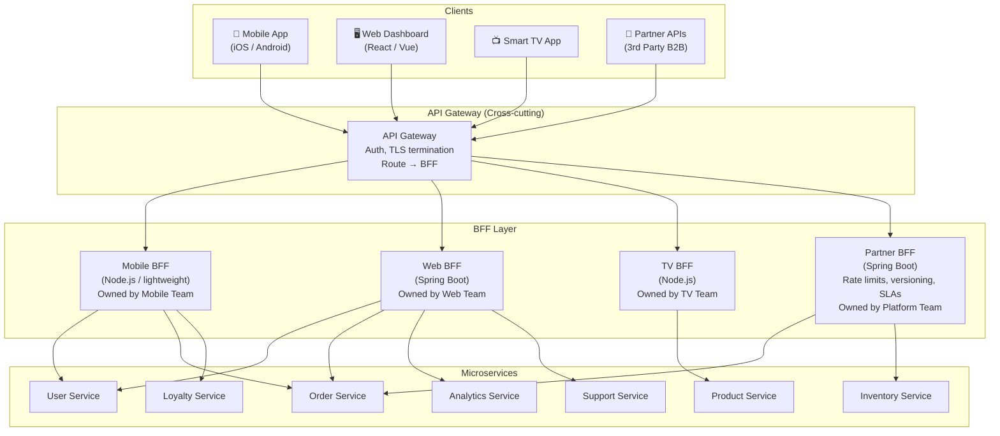

# Backend for Frontend (BFF)

The **Backend for Frontend (BFF)** pattern creates a **dedicated backend service per client type** — mobile app, web dashboard, Smart TV, third-party API — instead of one shared, generic API layer. Each BFF speaks exactly the language of its client: it fetches from the right downstream services, aggregates the data, trims it to the exact shape the client needs, and returns a single optimized response.

The name comes from Sam Newman's microservices work. The driving insight: **clients have different data needs, different bandwidth constraints, and different failure tolerance. A single shared API cannot serve all of them well without becoming a bloated mess.**

---

## The Problem Without BFF

### Over-fetching and Under-fetching

```
Mobile app home screen needs:
  firstName, avatarThumbnailUrl, last 3 orders (id, status, total), loyaltyPoints

Web dashboard home screen needs:
  fullProfile (20 fields), last 20 orders (40 fields each),
  analytics (lifetime value, return rate, frequency),
  openSupportTickets, recentActivityFeed

Shared API choice A — return everything:
  Mobile receives 15KB JSON. Needs 800 bytes. Wastes bandwidth on 3G/4G.
  Every field is a potential data exposure risk on mobile.

Shared API choice B — return minimal data:
  Web dashboard makes 5 sequential round-trips:
    GET /users/{id}              → 200ms
    GET /orders?userId={id}     → 250ms (must wait for userId first)
    GET /analytics/{id}         → 300ms
    GET /tickets?userId={id}    → 150ms
    GET /activity/{id}          → 200ms
    Total: 1,100ms — and this is sequential!
```

### Change Coupling

```
Shared API:
  Web team needs: rename "orderDate" → "createdAt" for consistency with new schema
  Mobile team has 3 million active devices still on old app version expecting "orderDate"
  
  Options:
    A. Maintain both field names forever (API bloat)
    B. Force mobile to ship an update before web changes (team coordination tax)
    C. Version the entire API (operational nightmare)

With BFF:
  Web BFF:    rename "orderDate" → "createdAt" in web BFF mapper. Done. Deploy.
  Mobile BFF: keeps "orderDate" until mobile app version adoption reaches threshold.
  Zero coordination between teams.
```

---

## Architecture: The Full Picture



**API Gateway vs. BFF responsibility split:**

| Concern | API Gateway | BFF |
|:---|:---|:---|
| TLS termination | ✅ | ❌ |
| Authentication (JWT validation) | ✅ | ❌ |
| Rate limiting | ✅ (global) | ✅ (client-specific) |
| Request routing (which BFF) | ✅ | ❌ |
| Data aggregation | ❌ | ✅ |
| Response shaping / transformation | ❌ | ✅ |
| Client-specific caching | ❌ | ✅ |
| Session / OAuth token management | ❌ | ✅ (Token Handler) |
| Circuit breaking to downstream | ❌ | ✅ |

---

## Spring Boot Web BFF — Production Implementation

### Project Structure

```
web-bff/
├── src/main/java/com/example/webbff/
│   ├── WebBffApplication.java
│   ├── config/
│   │   ├── WebClientConfig.java         ← Reactive HTTP clients (non-blocking)
│   │   ├── ResilienceConfig.java        ← Circuit breakers, timeouts
│   │   └── CacheConfig.java
│   ├── controller/
│   │   ├── DashboardController.java
│   │   └── OrderDetailController.java
│   ├── client/
│   │   ├── UserServiceClient.java
│   │   ├── OrderServiceClient.java
│   │   ├── AnalyticsServiceClient.java
│   │   └── SupportServiceClient.java
│   ├── composer/
│   │   └── DashboardComposer.java       ← Fan-out + merge + transform
│   ├── mapper/
│   │   └── WebResponseMapper.java       ← Domain → Web DTO transformation
│   └── dto/
│       ├── request/
│       └── response/
└── src/main/resources/
    └── application.yml
```

### WebClient Configuration (Non-blocking HTTP)

Use `WebClient` over `RestTemplate` or Feign in a BFF. The BFF's primary job is fan-out — launching many concurrent HTTP calls. `WebClient` is non-blocking and composed with Reactor, meaning threads are never blocked waiting for downstream responses.

```java
@Configuration
public class WebClientConfig {

    @Bean
    public WebClient userServiceClient(
            @Value("${services.user.url}") String baseUrl,
            @Value("${services.user.connect-timeout-ms:2000}") int connectTimeoutMs,
            @Value("${services.user.read-timeout-ms:5000}") int readTimeoutMs) {

        HttpClient httpClient = HttpClient.create()
            .option(ChannelOption.CONNECT_TIMEOUT_MILLIS, connectTimeoutMs)
            .responseTimeout(Duration.ofMillis(readTimeoutMs))
            .doOnConnected(conn -> conn
                .addHandlerLast(new ReadTimeoutHandler(readTimeoutMs, TimeUnit.MILLISECONDS))
                .addHandlerLast(new WriteTimeoutHandler(1000, TimeUnit.MILLISECONDS))
            );

        return WebClient.builder()
            .baseUrl(baseUrl)
            .clientConnector(new ReactorClientHttpConnector(httpClient))
            .defaultHeader(HttpHeaders.CONTENT_TYPE, MediaType.APPLICATION_JSON_VALUE)
            .filter(tracingExchangeFilterFunction())    // Propagate trace headers
            .filter(metricsExchangeFilterFunction())    // Emit latency metrics per service
            .codecs(config -> config.defaultCodecs()
                .maxInMemorySize(2 * 1024 * 1024))     // 2MB response buffer limit
            .build();
    }

    // Propagate W3C TraceContext / B3 headers downstream
    private ExchangeFilterFunction tracingExchangeFilterFunction() {
        return ExchangeFilterFunction.ofRequestProcessor(clientRequest ->
            Mono.deferContextual(contextView -> {
                ClientRequest.Builder builder = ClientRequest.from(clientRequest);
                // Micrometer Tracing context is in the Reactor context — extract and forward
                contextView.getOrEmpty(TraceContext.class).ifPresent(ctx -> {
                    builder.header("traceparent", ctx.traceId() + "-" + ctx.spanId());
                });
                return Mono.just(builder.build());
            })
        );
    }

    private ExchangeFilterFunction metricsExchangeFilterFunction() {
        return ExchangeFilterFunction.ofResponseProcessor(response -> {
            // Emit per-downstream-service latency metric
            return Mono.just(response);
        });
    }
}
```

### Downstream Service Clients

```java
@Service
@Slf4j
public class UserServiceClient {

    private final WebClient client;
    private final CircuitBreaker circuitBreaker;

    public UserServiceClient(
            @Qualifier("userServiceClient") WebClient client,
            CircuitBreakerRegistry registry) {
        this.client = client;
        this.circuitBreaker = registry.circuitBreaker("userService");
    }

    public Mono<UserProfileDto> getProfile(String userId) {
        return Mono.fromCallable(() ->
            CircuitBreaker.decorateSupplier(circuitBreaker, () -> null).get()
        ).flatMap(ignored ->
            client.get()
                .uri("/internal/v1/users/{id}", userId)
                .retrieve()
                .onStatus(HttpStatusCode::is4xxClientError, response ->
                    response.bodyToMono(String.class)
                        .flatMap(body -> switch (response.statusCode().value()) {
                            case 404 -> Mono.error(new UserNotFoundException(userId));
                            case 401, 403 -> Mono.error(new UnauthorizedException("User service auth"));
                            default -> Mono.error(new DownstreamClientException("user-service", body));
                        })
                )
                .onStatus(HttpStatusCode::is5xxServerError, response ->
                    Mono.error(new RetryableDownstreamException("user-service", response.statusCode()))
                )
                .bodyToMono(UserProfileDto.class)
                .timeout(Duration.ofSeconds(2))
                .retryWhen(Retry.backoff(2, Duration.ofMillis(200))
                    .filter(ex -> ex instanceof RetryableDownstreamException)
                    .onRetryExhaustedThrow((spec, signal) -> signal.failure()))
        )
        .transform(CircuitBreakerOperator.of(circuitBreaker));
    }

    // Batch fetch multiple users in one call — prevents N+1 in list screens
    public Mono<Map<String, UserSummaryDto>> getUsersBatch(List<String> userIds) {
        return client.get()
            .uri(builder -> builder
                .path("/internal/v1/users")
                .queryParam("ids", String.join(",", userIds))
                .build())
            .retrieve()
            .bodyToFlux(UserSummaryDto.class)
            .collectMap(UserSummaryDto::getId)
            .timeout(Duration.ofSeconds(3));
    }
}
```

### Dashboard Composer — Parallel Fan-Out

The composer is the heart of the BFF. It fires all downstream calls concurrently using Reactor, merges the results, and shapes them into the client-specific response.

```java
@Service
@Slf4j
public class DashboardComposer {

    private final UserServiceClient userClient;
    private final OrderServiceClient orderClient;
    private final AnalyticsServiceClient analyticsClient;
    private final SupportServiceClient supportClient;
    private final WebResponseMapper mapper;
    private final MeterRegistry meterRegistry;

    // HARD SLA: entire dashboard must assemble within 3 seconds
    private static final Duration DASHBOARD_SLA = Duration.ofSeconds(3);

    public Mono<WebDashboardResponse> compose(String userId, String traceId) {

        Timer.Sample sample = Timer.start(meterRegistry);

        // Critical path — user profile is required; fail fast if unavailable
        Mono<UserProfileDto> userMono = userClient.getProfile(userId)
            .doOnError(e -> log.error("User service failed. userId={} trace={}", userId, traceId, e));

        // Non-critical — return empty on failure; dashboard should still render
        Mono<List<OrderSummaryDto>> ordersMono = orderClient.getRecentOrders(userId, 20)
            .onErrorResume(e -> {
                log.warn("Order service degraded. userId={} Returning empty.", userId);
                meterRegistry.counter("bff.dashboard.degraded", "service", "orders").increment();
                return Mono.just(List.of());
            });

        Mono<AnalyticsDto> analyticsMono = analyticsClient.getUserAnalytics(userId)
            .onErrorResume(e -> {
                log.warn("Analytics service degraded. userId={} Returning empty.", userId);
                meterRegistry.counter("bff.dashboard.degraded", "service", "analytics").increment();
                return Mono.just(AnalyticsDto.empty());
            });

        Mono<List<SupportTicketDto>> ticketsMono = supportClient.getOpenTickets(userId)
            .onErrorResume(e -> Mono.just(List.of()));

        // Zip all calls — waits for all, respects individual error handling above
        return Mono.zip(userMono, ordersMono, analyticsMono, ticketsMono)
            .map(tuple -> mapper.toWebDashboard(
                tuple.getT1(),    // user
                tuple.getT2(),    // orders
                tuple.getT3(),    // analytics
                tuple.getT4(),    // tickets
                traceId
            ))
            .timeout(DASHBOARD_SLA)
            .doOnSuccess(result -> {
                sample.stop(meterRegistry.timer("bff.dashboard.latency", "status", "success"));
                log.info("Dashboard composed. userId={} degraded={} trace={}",
                    userId, result.isDegraded(), traceId);
            })
            .doOnError(TimeoutException.class, e -> {
                sample.stop(meterRegistry.timer("bff.dashboard.latency", "status", "timeout"));
                log.error("Dashboard SLA breached (>3s). userId={} trace={}", userId, traceId);
            });
    }
}
```

### Response Mapper — Client-Specific Shape

The mapper is where each BFF's value is most visible. The same downstream data is trimmed to exactly what the client needs.

```java
@Component
public class WebResponseMapper {

    public WebDashboardResponse toWebDashboard(
            UserProfileDto user,
            List<OrderSummaryDto> orders,
            AnalyticsDto analytics,
            List<SupportTicketDto> tickets,
            String traceId) {

        boolean degraded = orders.isEmpty() && analytics == AnalyticsDto.empty();

        return WebDashboardResponse.builder()
            // Web gets the FULL profile — every field the dashboard renders
            .user(user == null ? null : WebUserProfileDto.builder()
                .id(user.getId())
                .displayName(user.getFirstName() + " " + user.getLastName())
                .email(user.getEmail())
                .phone(user.getPhone())
                .addresses(user.getAddresses())            // All addresses
                .avatarUrl(user.getAvatarFullUrl())        // Full-resolution
                .memberSince(user.getCreatedAt())
                .tier(user.getLoyaltyTier())
                .build())
            // Web gets all order fields — dashboard renders shipping, tracking, etc.
            .orders(orders.stream()
                .map(o -> WebOrderSummaryDto.builder()
                    .id(o.getId())
                    .status(o.getStatus())
                    .total(o.getTotal())
                    .currency(o.getCurrency())
                    .createdAt(o.getCreatedAt())
                    .itemCount(o.getLineItems().size())
                    .shippingAddress(o.getShippingAddress())   // Web needs this
                    .trackingNumber(o.getTrackingNumber())     // Web needs this
                    .build())
                .collect(Collectors.toList()))
            .analytics(analytics)
            .openTickets(tickets)
            .degraded(degraded)
            .generatedAt(Instant.now())
            ._traceId(traceId)
            .build();
    }
}

// Compare: Mobile BFF mapper for the SAME upstream order data
@Component
public class MobileResponseMapper {

    public MobileHomeResponse toMobileHome(
            UserProfileDto user,
            List<OrderSummaryDto> orders,
            int loyaltyPoints) {

        return MobileHomeResponse.builder()
            // Mobile gets: first name only (for greeting), thumbnail only
            .greeting(user != null ? "Hi, " + user.getFirstName() + "!" : "Hi there!")
            .avatarUrl(user != null ? user.getAvatarThumbnailUrl() : null)  // 64px only
            .loyaltyPointsBadge(loyaltyPoints)
            // Mobile gets: last 3 orders, 3 fields only — nothing else
            .recentOrders(orders.stream().limit(3)
                .map(o -> MobileOrderDto.builder()
                    .id(o.getId())
                    .status(o.getStatus())
                    .total(o.getTotal())
                    // ← NOT: shippingAddress, trackingNumber, lineItems, notes, etc.
                    .build())
                .collect(Collectors.toList()))
            .build();
    }
}
```

### Controller Layer

```java
@RestController
@RequestMapping("/api/v1/dashboard")
@RequiredArgsConstructor
@Slf4j
public class DashboardController {

    private final DashboardComposer composer;

    @GetMapping
    public Mono<ResponseEntity<WebDashboardResponse>> getDashboard(
            @AuthenticationPrincipal Jwt jwt,
            @RequestHeader(value = "X-Trace-Id", required = false) String traceId,
            @RequestHeader(value = "X-App-Version", required = false) String appVersion) {

        String userId = jwt.getSubject();
        String resolvedTraceId = traceId != null ? traceId : UUID.randomUUID().toString();

        return composer.compose(userId, resolvedTraceId)
            .map(dashboard -> ResponseEntity.ok()
                .header("X-Trace-Id", resolvedTraceId)
                .header("X-BFF-Version", "web-bff-2.1.0")
                // Client-hint caching: browser may cache for 30s
                .cacheControl(CacheControl.maxAge(30, TimeUnit.SECONDS).cachePrivate())
                .body(dashboard))
            .onErrorResume(UserNotFoundException.class, e ->
                Mono.just(ResponseEntity.notFound().build()))
            .onErrorResume(TimeoutException.class, e ->
                Mono.just(ResponseEntity.status(HttpStatus.GATEWAY_TIMEOUT)
                    .header("Retry-After", "5")
                    .build()));
    }
}
```

---

## GraphQL BFF

For product teams with many client types that need fine-grained control over which fields they fetch, GraphQL is a natural fit for the BFF layer. Each client sends a query expressing exactly what it needs — no over-fetching, no under-fetching, no BFF code changes required for new field combinations.

### Dependencies

```xml
<dependency>
    <groupId>org.springframework.boot</groupId>
    <artifactId>spring-boot-starter-graphql</artifactId>
</dependency>
<dependency>
    <groupId>org.springframework.boot</groupId>
    <artifactId>spring-boot-starter-webflux</artifactId>
</dependency>
```

### Schema

```graphql
# src/main/resources/graphql/schema.graphqls

type Query {
    dashboard(userId: ID!): Dashboard
    orderDetail(orderId: ID!): OrderDetail
}

type Dashboard {
    user: UserProfile
    orders(limit: Int = 20): [OrderSummary!]!
    analytics: Analytics
    openTickets: [SupportTicket!]!
    degraded: Boolean!
}

type UserProfile {
    id: ID!
    displayName: String!
    email: String!
    phone: String
    avatarUrl: String
    memberSince: String!
    tier: LoyaltyTier!
}

enum LoyaltyTier {
    BRONZE
    SILVER
    GOLD
    PLATINUM
}

type OrderSummary {
    id: ID!
    status: String!
    total: Float!
    currency: String!
    createdAt: String!
    itemCount: Int!
    shippingAddress: Address    # Web queries this; Mobile doesn't
    trackingNumber: String      # Web queries this; Mobile doesn't
}

type Analytics {
    lifetimeValue: Float
    orderFrequency: Float
    returnRate: Float
    averageOrderValue: Float
}
```

### DataFetcher with DataLoader (N+1 Prevention)

```java
@Controller
public class DashboardGraphQLController {

    private final UserServiceClient userClient;
    private final OrderServiceClient orderClient;
    private final AnalyticsServiceClient analyticsClient;

    // Dashboard root resolver
    @QueryMapping
    public Mono<DashboardGraphQL> dashboard(@Argument String userId) {
        // Return a thin shell — child resolvers fetch their own data lazily
        return Mono.just(DashboardGraphQL.builder()
            .userId(userId)
            .build());
    }

    // Only called if client's query includes the "user" field
    @SchemaMapping(typeName = "Dashboard", field = "user")
    public Mono<UserProfileDto> user(DashboardGraphQL dashboard) {
        return userClient.getProfile(dashboard.getUserId())
            .onErrorResume(e -> Mono.empty());  // Null → field omitted
    }

    // Only called if client's query includes the "orders" field
    @SchemaMapping(typeName = "Dashboard", field = "orders")
    public Mono<List<OrderSummaryDto>> orders(
            DashboardGraphQL dashboard,
            @Argument int limit) {
        return orderClient.getRecentOrders(dashboard.getUserId(), limit)
            .onErrorResume(e -> Mono.just(List.of()));
    }

    // Only called if client's query includes "analytics" field
    @SchemaMapping(typeName = "Dashboard", field = "analytics")
    public Mono<AnalyticsDto> analytics(DashboardGraphQL dashboard) {
        return analyticsClient.getUserAnalytics(dashboard.getUserId())
            .onErrorResume(e -> Mono.just(AnalyticsDto.empty()));
    }
}
```

```java
// DataLoader: batch N user lookups into 1 request — prevents N+1 on list endpoints
@Component
public class UserDataLoader implements BatchLoaderWithContext<String, UserSummaryDto> {

    private final UserServiceClient userClient;

    @Override
    public CompletionStage<List<UserSummaryDto>> load(
            List<String> userIds, BatchLoaderEnvironment env) {

        return userClient.getUsersBatch(userIds)
            .map(userMap -> userIds.stream()
                .map(id -> userMap.getOrDefault(id, UserSummaryDto.unknown(id)))
                .collect(Collectors.toList()))
            .toFuture();
    }
}
```

### Client Queries — Mobile vs. Web

```graphql
# Mobile query — minimal fields, fast response
query MobileHome($userId: ID!) {
    dashboard(userId: $userId) {
        user {
            displayName
            avatarUrl
        }
        orders(limit: 3) {
            id
            status
            total
        }
        # ← Does NOT request: analytics, openTickets, shippingAddress, trackingNumber
        # Those resolvers never execute — zero wasted work
    }
}

# Web query — full data, all fields
query WebDashboard($userId: ID!) {
    dashboard(userId: $userId) {
        user {
            id
            displayName
            email
            phone
            memberSince
            tier
            avatarUrl
        }
        orders(limit: 20) {
            id
            status
            total
            currency
            createdAt
            itemCount
            shippingAddress { street, city, postcode, country }
            trackingNumber
        }
        analytics {
            lifetimeValue
            orderFrequency
            returnRate
        }
        openTickets {
            id
            subject
            status
            createdAt
        }
    }
}
```

**GraphQL vs. REST BFF — when to choose each:**

| Scenario | REST BFF | GraphQL BFF |
|:---|:---|:---|
| Fixed, well-known client screens | ✅ Simpler, HTTP caching works | ❌ Overhead without benefit |
| Rapidly evolving mobile/web clients | ⚠️ BFF changes needed for every new field | ✅ Clients self-serve new fields |
| Multiple distinct client types with very different needs | ✅ Each BFF is a clean separation | ✅ Single GraphQL BFF with query control |
| Public API for partners/3rd-party | ✅ REST with OpenAPI versioning | ⚠️ GraphQL introspection is a security surface |
| Response caching requirement | ✅ HTTP GET caching trivial | ⚠️ POST-based queries don't cache by default |
| Deep aggregation (nested entities) | ⚠️ Sequential waterfall unless carefully designed | ✅ DataLoader solves N+1 natively |

---

## OAuth Token Handler Pattern (BFF for Auth)

The BFF is the ideal place to implement the **Token Handler Pattern**, which keeps OAuth access tokens completely out of browser JavaScript — eliminating the XSS token theft attack surface.

```mermaid
sequenceDiagram
    participant B as Browser (React)
    participant BFF as Web BFF
    participant Auth as Auth Server (Keycloak)
    participant API as Microservices

    B->>BFF: GET /auth/login
    BFF->>Auth: Redirect → Authorization Code flow (PKCE)
    Auth-->>B: Redirect to /auth/callback?code=abc123
    B->>BFF: GET /auth/callback?code=abc123
    BFF->>Auth: POST /token {code, code_verifier, client_secret}
    Auth-->>BFF: {access_token, refresh_token, expires_in}
    BFF->>BFF: Store tokens in encrypted, server-side session
    BFF-->>B: Set-Cookie: session=<opaque-session-id> HttpOnly; Secure; SameSite=Strict
    Note over B: Browser holds ONLY the opaque session cookie<br>access_token is NEVER sent to browser JS

    B->>BFF: GET /api/dashboard (cookie auto-attached by browser)
    BFF->>BFF: Lookup session → retrieve access_token
    BFF->>API: GET /internal/dashboard\nAuthorization: Bearer {access_token}
    API-->>BFF: Dashboard data
    BFF-->>B: Dashboard JSON (no token in response)

    Note over BFF: When access_token expires:
    BFF->>Auth: POST /token {grant_type: refresh_token, refresh_token}
    Auth-->>BFF: New {access_token, refresh_token}
    BFF->>BFF: Update session. Browser unaware — transparent refresh.
```

### Spring Boot Token Handler Implementation

```java
@RestController
@RequestMapping("/auth")
@Slf4j
public class AuthController {

    private final OAuth2AuthorizedClientService authorizedClientService;
    private final TokenEncryptionService tokenEncryption;

    // Step 1: Initiate login — BFF starts OAuth flow
    @GetMapping("/login")
    public RedirectView login(HttpSession session) {
        String state = generateSecureState();
        String codeVerifier = generateCodeVerifier();  // PKCE
        String codeChallenge = generateCodeChallenge(codeVerifier);

        session.setAttribute("oauth_state", state);
        session.setAttribute("code_verifier", codeVerifier);

        String authUrl = UriComponentsBuilder
            .fromHttpUrl(authServerUrl + "/auth")
            .queryParam("response_type", "code")
            .queryParam("client_id", clientId)
            .queryParam("redirect_uri", bffCallbackUrl)
            .queryParam("scope", "openid profile email")
            .queryParam("state", state)
            .queryParam("code_challenge", codeChallenge)
            .queryParam("code_challenge_method", "S256")
            .build().toUriString();

        return new RedirectView(authUrl);
    }

    // Step 2: Handle callback — exchange code for tokens
    @GetMapping("/callback")
    public RedirectView callback(
            @RequestParam String code,
            @RequestParam String state,
            HttpSession session,
            HttpServletResponse response) {

        String storedState = (String) session.getAttribute("oauth_state");
        if (!state.equals(storedState)) {
            throw new SecurityException("OAuth state mismatch — possible CSRF attack");
        }

        String codeVerifier = (String) session.getAttribute("code_verifier");
        TokenResponse tokens = exchangeCodeForTokens(code, codeVerifier);

        // Store tokens in server-side session (never in cookie body)
        String sessionId = generateSecureSessionId();
        sessionStore.store(sessionId, TokenSession.builder()
            .accessToken(tokenEncryption.encrypt(tokens.getAccessToken()))
            .refreshToken(tokenEncryption.encrypt(tokens.getRefreshToken()))
            .expiresAt(Instant.now().plusSeconds(tokens.getExpiresIn()))
            .userId(extractUserId(tokens.getAccessToken()))
            .build());

        // Set opaque session ID in HttpOnly cookie
        ResponseCookie cookie = ResponseCookie.from("session", sessionId)
            .httpOnly(true)           // JS cannot read this cookie
            .secure(true)             // HTTPS only
            .sameSite("Strict")       // CSRF protection
            .maxAge(Duration.ofHours(8))
            .path("/")
            .build();
        response.addHeader(HttpHeaders.SET_COOKIE, cookie.toString());

        return new RedirectView("/dashboard");
    }

    // Step 3: Logout — invalidate session, clear cookie
    @PostMapping("/logout")
    public ResponseEntity<Void> logout(
            @CookieValue(value = "session", required = false) String sessionId,
            HttpServletResponse response) {

        if (sessionId != null) {
            sessionStore.invalidate(sessionId);
        }

        ResponseCookie clearCookie = ResponseCookie.from("session", "")
            .httpOnly(true)
            .secure(true)
            .sameSite("Strict")
            .maxAge(0)   // Expire immediately
            .path("/")
            .build();
        response.addHeader(HttpHeaders.SET_COOKIE, clearCookie.toString());

        return ResponseEntity.noContent().build();
    }
}
```

```java
// Spring Security filter: resolve session cookie → inject Authorization header for downstream
@Component
public class TokenResolutionFilter extends OncePerRequestFilter {

    private final SessionStore sessionStore;
    private final TokenEncryptionService encryption;
    private final TokenRefreshService refreshService;

    @Override
    protected void doFilterInternal(
            HttpServletRequest request,
            HttpServletResponse response,
            FilterChain chain) throws IOException, ServletException {

        String sessionId = extractSessionCookie(request);
        if (sessionId != null) {
            TokenSession session = sessionStore.get(sessionId);
            if (session != null) {
                String accessToken = encryption.decrypt(session.getAccessToken());

                // Transparent token refresh when within 30 seconds of expiry
                if (session.isExpiringSoon(Duration.ofSeconds(30))) {
                    accessToken = refreshService.refresh(sessionId, session);
                }

                // Store token in request attribute — BFF internal use only
                // Never put this in a response header visible to the browser
                request.setAttribute("access_token", accessToken);
            }
        }

        chain.doFilter(request, response);
    }
}
```

---

## BFF Caching Strategy

A BFF that fetches the same data on every request wastes downstream capacity. Cache aggressively — but invalidate correctly.

```java
@Configuration
public class CacheConfig {

    @Bean
    public CacheManager bffCacheManager() {
        CaffeineCacheManager manager = new CaffeineCacheManager();
        manager.setCaffeine(Caffeine.newBuilder()
            .maximumSize(10_000)
            .expireAfterWrite(30, TimeUnit.SECONDS)   // Dashboard composition: 30s TTL
            .recordStats());                           // Expose hit/miss to Micrometer
        return manager;
    }
}
```

```java
@Service
public class CachedDashboardComposer {

    private final DashboardComposer composer;
    private final Cache<String, WebDashboardResponse> cache;
    private final MeterRegistry meterRegistry;

    // Cache dashboard per user — 30 second TTL
    public Mono<WebDashboardResponse> compose(String userId, String traceId) {
        WebDashboardResponse cached = cache.getIfPresent(userId);
        if (cached != null) {
            meterRegistry.counter("bff.dashboard.cache", "result", "hit").increment();
            return Mono.just(cached);
        }

        meterRegistry.counter("bff.dashboard.cache", "result", "miss").increment();
        return composer.compose(userId, traceId)
            .doOnSuccess(result -> {
                // Only cache non-degraded responses
                if (!result.isDegraded()) {
                    cache.put(userId, result);
                }
            });
    }

    // Evict on write operations — called by event listener on order creation
    public void evict(String userId) {
        cache.invalidate(userId);
        log.debug("Evicted BFF dashboard cache for userId={}", userId);
    }
}
```

```java
// Kafka consumer: evict cache when relevant downstream events occur
@Service
public class CacheEvictionListener {

    private final CachedDashboardComposer cacheComposer;

    @KafkaListener(topics = "order-events", groupId = "web-bff-cache-eviction")
    public void onOrderEvent(OrderEvent event) {
        // When a user places or updates an order, their dashboard is stale
        cacheComposer.evict(event.getUserId());
    }
}
```

**Cache strategy per response section:**

| Section | Cache TTL | Invalidation Trigger |
|:---|:---|:---|
| User profile | 5 minutes | Profile update event |
| Recent orders | 30 seconds | OrderCreated / OrderStatusChanged event |
| Analytics | 10 minutes | Nightly recalculation event |
| Support tickets | 60 seconds | TicketCreated / TicketClosed event |
| Full dashboard | 30 seconds | Any of the above |

---

## Observability

A BFF is a composition engine — without metrics, you cannot tell which downstream service is causing latency.

```java
@Aspect
@Component
@Slf4j
public class BffMetricsAspect {

    private final MeterRegistry meterRegistry;

    // Measure per-downstream-service call latency automatically
    @Around("execution(* com.example.webbff.client.*.*(..))")
    public Object measureDownstreamCall(ProceedingJoinPoint pjp) throws Throwable {
        String serviceName = pjp.getTarget().getClass().getSimpleName()
            .replace("Client", "").toLowerCase();
        String methodName = pjp.getSignature().getName();

        Timer.Sample sample = Timer.start(meterRegistry);
        String status = "success";
        try {
            return pjp.proceed();
        } catch (Exception e) {
            status = e.getClass().getSimpleName();
            throw e;
        } finally {
            sample.stop(meterRegistry.timer("bff.downstream.latency",
                "service", serviceName,
                "method", methodName,
                "status", status));
        }
    }
}
```

**Key metrics to expose:**

```yaml
# Prometheus alert rules for BFF
groups:
- name: bff-alerts
  rules:

  - alert: BffDashboardLatencyHigh
    expr: histogram_quantile(0.99, rate(bff_dashboard_latency_seconds_bucket[5m])) > 3
    for: 2m
    labels:
      severity: warning
    annotations:
      summary: "Web BFF dashboard p99 latency > 3s SLA"

  - alert: BffDegradedResponseRateHigh
    expr: rate(bff_dashboard_degraded_total[5m]) / rate(bff_dashboard_total[5m]) > 0.05
    for: 5m
    labels:
      severity: warning
    annotations:
      summary: ">5% of BFF dashboard responses are degraded (missing data)"

  - alert: BffDownstreamErrorRateHigh
    expr: rate(bff_downstream_latency_total{status!="success"}[5m]) > 10
    for: 2m
    labels:
      severity: critical
    annotations:
      summary: "BFF downstream call error rate spike — check {{ $labels.service }}"

  - alert: BffCacheHitRateLow
    expr: rate(bff_dashboard_cache_total{result="hit"}[10m]) /
          rate(bff_dashboard_cache_total[10m]) < 0.5
    for: 5m
    labels:
      severity: info
    annotations:
      summary: "BFF cache hit rate below 50% — check TTL or eviction frequency"
```

---

## Common Gotchas and Anti-Patterns

### 1. BFF Becomes a Domain Service

**Problem:** The mobile BFF starts calculating discount prices, validating business rules, and writing to databases.

**Why it happens:** It's convenient. The BFF team needs a small piece of logic and it's faster to add it to the BFF than coordinate with the domain team.

**Why it's dangerous:** You now have business logic in two places — the domain service and the BFF. They will diverge. The BFF becomes a shadow monolith.

**Fix:** If logic belongs to a domain, create a proper microservice or add an endpoint to the existing domain service. **BFF = aggregate + transform + filter only.** No business rules. No writes to databases (except session/cache).

### 2. Sequential Downstream Calls

**Problem:**
```java
// Total time = 200ms + 250ms + 300ms = 750ms SEQUENTIAL
UserProfileDto user = userClient.getProfile(userId).block();     // 200ms
List<OrderDto> orders = orderClient.getOrders(userId).block();   // 250ms
AnalyticsDto analytics = analyticsClient.get(userId).block();    // 300ms
```

**Fix:** Use `Mono.zip()` (Reactor) or `CompletableFuture.allOf()` for all independent calls:
```java
// Total time = max(200, 250, 300) = 300ms PARALLEL
Mono.zip(
    userClient.getProfile(userId),
    orderClient.getOrders(userId),
    analyticsClient.get(userId)
)
```

### 3. Missing Per-Service Timeouts

**Problem:** One downstream service hangs. The BFF blocks all threads for 30 seconds (default HTTP timeout). Under load, thread pool exhausts — BFF becomes unresponsive to all clients.

**Fix:** Each downstream call must have an explicit, aggressive timeout:
```java
userClient.getProfile(userId)
    .timeout(Duration.ofSeconds(2))   // Per-service SLA, not global
    .onErrorResume(TimeoutException.class, e -> Mono.empty())
```

### 4. No Graceful Degradation

**Problem:** Analytics service is down for maintenance. BFF returns 503 to all users — the entire dashboard is unavailable.

**Fix:** Classify every downstream dependency as **critical** or **optional**:
- **Critical** (user profile, auth): failure = return error to client
- **Optional** (analytics, recommendations): failure = return empty/cached data; dashboard renders without it

```java
analyticsClient.get(userId)
    .onErrorResume(e -> Mono.just(AnalyticsDto.empty()))  // Always degrade gracefully
```

### 5. One BFF Serving Multiple Client Types

**Problem:** `if (userAgent.contains("Mobile")) { return compact; } else { return full; }` — one BFF with internal branching.

**Why it's wrong:** The two clients now share a deployment lifecycle. A mobile-breaking bug requires a rollback that also takes down the web BFF. Two teams contend on the same codebase.

**Fix:** Two clients = two deployed BFFs. Shared utility code belongs in a shared library, not a shared service.

### 6. Not Propagating Trace Headers

**Problem:** BFF generates a new trace ID for each downstream call. Distributed traces are fragmented — you cannot correlate what happened end-to-end for a single user request.

**Fix:** Extract the `traceparent` / `X-Trace-Id` from the incoming request and inject it into every downstream call:

```java
// In WebClient filter — propagate trace context automatically
ExchangeFilterFunction.ofRequestProcessor(request ->
    Mono.deferContextual(ctx -> {
        String traceId = (String) request.attribute("traceId").orElse(null);
        if (traceId != null) {
            return Mono.just(ClientRequest.from(request)
                .header("X-Trace-Id", traceId)
                .build());
        }
        return Mono.just(request);
    })
)
```

### 7. Caching Degraded Responses

**Problem:** Analytics service goes down. BFF returns and caches `AnalyticsDto.empty()` for 10 minutes. Service recovers after 2 minutes — but users see empty analytics for 8 more minutes.

**Fix:** Never cache degraded or empty fallback responses:
```java
.doOnSuccess(result -> {
    if (!result.isDegraded()) {   // Only cache complete, healthy responses
        cache.put(userId, result);
    }
})
```

---

## Decision Matrix

| Scenario | Recommendation |
|:---|:---|
| Multiple client types with very different data needs | Dedicated BFF per client type — primary pattern |
| Single API serving only one client type | No BFF needed — use the microservice directly |
| Clients need fine-grained field selection | GraphQL BFF — clients self-serve field requirements |
| Browser app with OAuth tokens | Token Handler Pattern — tokens in `HttpOnly` BFF session |
| Public partner API with versioning and rate limits | Dedicated Partner BFF with versioned endpoints |
| BFF response too slow | Audit for sequential calls → parallelize; add caching; tune per-service timeouts |
| BFF accumulating business logic | Stop — move logic to domain service; BFF stays thin |
| High read traffic on dashboard | BFF-level cache with event-driven invalidation; ETag-based HTTP caching |
| Cross-cutting concerns (auth, rate limiting) | API Gateway upstream of BFF — separation of concerns |