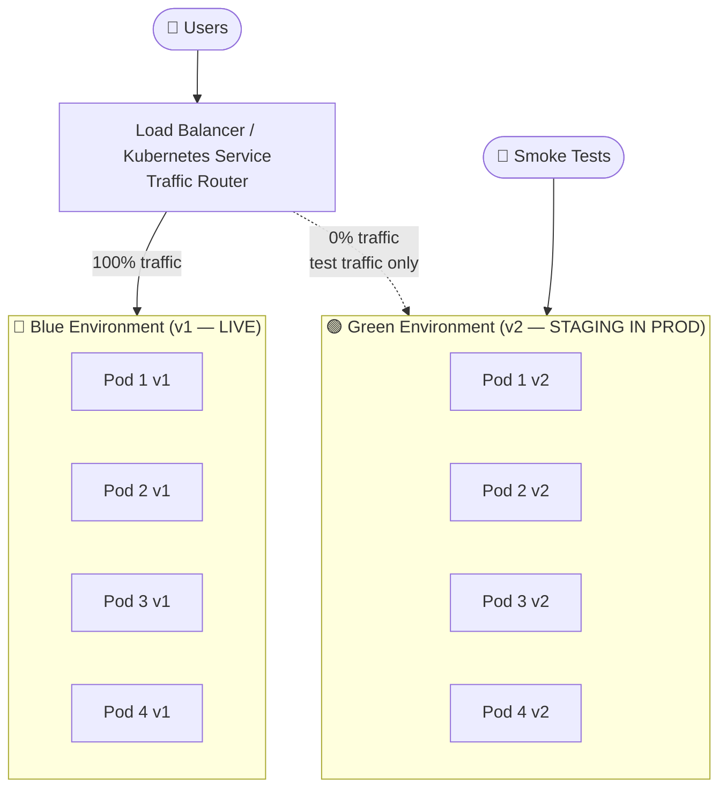
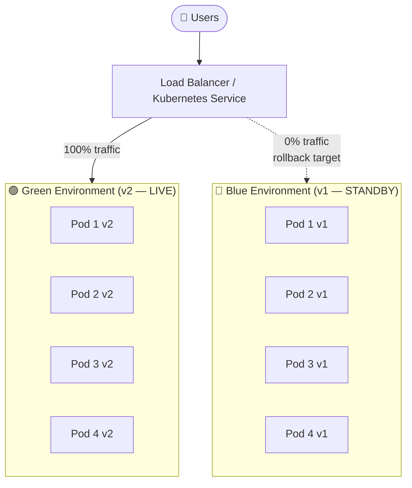

# Blue-Green Deployment

**Blue-Green Deployment** is a release strategy that maintains **two identical production environments** — Blue (current live) and Green (new version) — and switches traffic from one to the other instantaneously, enabling **zero-downtime releases** and **instant rollback** within 30 seconds.

> **The fundamental property:** At any point in time, only ONE environment is live. The other is either idle (ready for rollback) or being prepared for the next release. You never modify a live environment.

---

## 👶 Beginner: Why Traditional Deployments Are Risky

A standard rolling update replaces live servers one-by-one. During the update window:

```text
TRADITIONAL IN-PLACE / ROLLING UPDATE:
Time 0:   [v1] [v1] [v1] [v1]   ← 100% stable
Time 1:   [v2] [v1] [v1] [v1]   ← 25% v2, 75% v1 — INCONSISTENT STATE
Time 2:   [v2] [v2] [v1] [v1]   ← 50/50 split — users get different behavior!
Time 3:   [v2] [v2] [v2] [v1]   ← 75% v2
Time 4:   [v2] [v2] [v2] [v2]   ← 100% v2 deployed

Problems:
  - Users experience mixed behavior during update (some see old UI, some new)
  - Bug discovered at Time 3: must roll forward OR wait for slow rollback deploy
  - The rollback IS another rolling deploy — takes just as long as the original

BLUE-GREEN DEPLOYMENT:
Time 0:   Blue  [v1][v1][v1][v1]  ← 100% live traffic
          Green [v2][v2][v2][v2]  ← idle, testing
Time 10:  Run automated smoke tests on Green (no real user traffic)
Time 11:  Load balancer switch: Green → LIVE (atomic, < 1 second)
          Blue  [v1] ← on standby (kept warm for rollback)
          Green [v2] ← 100% traffic

Bug discovered at Time 15:
Time 15:  Load balancer switch: Blue → LIVE (< 30 seconds)
          Instant rollback. Users back on v1. Zero drama.
```

---

## 🏗️ Architecture



After the switch:


---

## ⚙️ Implementation: Kubernetes Blue-Green Deployment

Kubernetes makes Blue-Green elegantly simple: two Deployments, one Service whose `selector` is the single switch.

### Step 1: Blue Deployment (Current Live)

```yaml
# blue-deployment.yaml
apiVersion: apps/v1
kind: Deployment
metadata:
  name: order-service-blue
  labels:
    app: order-service
    slot: blue
    version: "v1.8.2"
spec:
  replicas: 4
  selector:
    matchLabels:
      app: order-service
      slot: blue
  template:
    metadata:
      labels:
        app: order-service
        slot: blue
        version: "v1.8.2"
    spec:
      containers:
        - name: order-service
          image: company/order-service:v1.8.2
          ports:
            - containerPort: 8080
          readinessProbe:
            httpGet:
              path: /actuator/health/readiness
              port: 8080
            initialDelaySeconds: 15
            periodSeconds: 5
            failureThreshold: 3
          livenessProbe:
            httpGet:
              path: /actuator/health/liveness
              port: 8080
            initialDelaySeconds: 30
            periodSeconds: 10
          resources:
            requests:
              cpu: "500m"
              memory: "512Mi"
            limits:
              cpu: "1000m"
              memory: "1024Mi"
```

### Step 2: The Service — The Single Traffic Switch

```yaml
# service.yaml — points to Blue initially
apiVersion: v1
kind: Service
metadata:
  name: order-service
  annotations:
    deployment.kubernetes.io/active-slot: "blue"   # Track which slot is live
spec:
  selector:
    app: order-service
    slot: blue    # ← THIS IS THE SWITCH: change to 'green' to flip traffic
  ports:
    - port: 80
      targetPort: 8080
  type: ClusterIP
```

### Step 3: Deploy v2 to Green (Blue Still Serves All Traffic)

```yaml
# green-deployment.yaml
apiVersion: apps/v1
kind: Deployment
metadata:
  name: order-service-green
  labels:
    app: order-service
    slot: green
    version: "v2.0.0"
spec:
  replicas: 4
  selector:
    matchLabels:
      app: order-service
      slot: green
  template:
    metadata:
      labels:
        app: order-service
        slot: green
        version: "v2.0.0"
    spec:
      containers:
        - name: order-service
          image: company/order-service:v2.0.0   # ← new version
          ports:
            - containerPort: 8080
          readinessProbe:
            httpGet:
              path: /actuator/health/readiness
              port: 8080
            initialDelaySeconds: 15
            periodSeconds: 5
```

```bash
# 1. Deploy Green — Blue is still serving 100% of traffic
kubectl apply -f green-deployment.yaml

# 2. Wait for ALL Green pods to be fully ready (readiness probes passing)
kubectl rollout status deployment/order-service-green --timeout=5m
echo "✅ Green deployment ready"
```

### Step 4: Validate Green Before Switching

```bash
# Test Green directly using its own headless service — NO real user traffic
kubectl port-forward service/order-service-green-internal 8080:80 &

# Run smoke tests against Green
./smoke-tests/run.sh --target=http://localhost:8080
# Tests: health check, key endpoints, critical user flows, contract tests
```

```java
// smoke-tests/OrderServiceSmokeTest.java
@SpringBootTest
class OrderServiceSmokeTest {

    @Value("${smoke.test.base-url}")  // http://green-internal.default.svc.cluster.local
    private String baseUrl;

    private final RestTemplate rest = new RestTemplate();

    @Test
    void healthCheckPasses() {
        ResponseEntity<Map> response = rest.getForEntity(baseUrl + "/actuator/health", Map.class);
        assertThat(response.getStatusCode()).isEqualTo(HttpStatus.OK);
        assertThat(response.getBody()).containsEntry("status", "UP");
    }

    @Test
    void createOrderEndpointResponds() {
        // Test the new v2 API contract before sending any real traffic
        CreateOrderRequest req = CreateOrderRequest.testRequest();
        ResponseEntity<OrderDto> response = rest.postForEntity(
            baseUrl + "/api/orders", req, OrderDto.class
        );
        assertThat(response.getStatusCode()).isEqualTo(HttpStatus.CREATED);
        assertThat(response.getBody().getStatus()).isEqualTo("PENDING");
    }

    @Test
    void v2ApiSchemaBackwardCompatible() {
        // Ensure v2 doesn't remove fields that clients depend on
        ResponseEntity<String> response = rest.getForEntity(
            baseUrl + "/api/orders/test-order-id", String.class
        );
        // Parse and validate against expected v1 schema — no missing fields
        assertThat(response.getBody()).contains("\"orderId\"", "\"status\"", "\"total\"");
    }
}
```

### Step 5: The Switch (Atomic, < 1 second)

```bash
# THE SWITCH: patch Service selector from blue → green
# This is atomic — Kubernetes applies immediately, no rolling change
kubectl patch service order-service \
    --type='merge' \
    -p '{"spec":{"selector":{"slot":"green"}},"metadata":{"annotations":{"deployment.kubernetes.io/active-slot":"green"}}}'

echo "✅ Traffic switched to Green (v2.0.0)"
echo "🔵 Blue (v1.8.2) remains on standby for rollback"
```

### Step 6: Monitor After Switch

```bash
# Watch error rate for 15 minutes post-switch
# (Most regression bugs surface within the first few minutes of real traffic)
watch -n 10 kubectl top pods -l app=order-service

# Monitor via Prometheus/Grafana:
# - HTTP 5xx rate should stay below baseline
# - P99 latency should not increase >20%
# - Business metric: order creation rate should not drop
```

### Step 7: Rollback (30 Seconds)

```bash
# If any anomaly is detected — flip back instantly
kubectl patch service order-service \
    --type='merge' \
    -p '{"spec":{"selector":{"slot":"blue"}},"metadata":{"annotations":{"deployment.kubernetes.io/active-slot":"blue"}}}'

echo "🔄 Rollback complete — v1.8.2 is now live"
echo "⏱️ Rollback time: < 30 seconds"
```

---

## 🚀 CI/CD Pipeline Integration

```yaml
# .github/workflows/deploy.yml (Blue-Green pipeline)
name: Blue-Green Deploy

on:
  push:
    branches: [main]

jobs:
  deploy:
    runs-on: ubuntu-latest
    steps:
      - uses: actions/checkout@v6

      - name: Determine inactive slot
        run: |
          ACTIVE=$(kubectl get service order-service -o jsonpath='{.metadata.annotations.deployment\.kubernetes\.io/active-slot}')
          INACTIVE=$([ "$ACTIVE" = "blue" ] && echo "green" || echo "blue")
          echo "ACTIVE_SLOT=$ACTIVE" >> $GITHUB_ENV
          echo "INACTIVE_SLOT=$INACTIVE" >> $GITHUB_ENV
          echo "Deploying to $INACTIVE (currently $ACTIVE is live)"

      - name: Deploy to inactive slot
        run: |
          # Deploy new version to the inactive slot
          envsubst < k8s/deployment-template.yaml | \
            sed "s/SLOT/${{ env.INACTIVE_SLOT }}/g" | \
            kubectl apply -f -

      - name: Wait for inactive slot ready
        run: |
          kubectl rollout status deployment/order-service-${{ env.INACTIVE_SLOT }} --timeout=10m

      - name: Run smoke tests
        run: |
          ./scripts/smoke-test.sh \
            --target=http://order-service-${{ env.INACTIVE_SLOT }}-internal.default.svc.cluster.local

      - name: Switch traffic
        run: |
          kubectl patch service order-service \
            --type='merge' \
            -p "{\"spec\":{\"selector\":{\"slot\":\"${{ env.INACTIVE_SLOT }}\"}},\"metadata\":{\"annotations\":{\"deployment.kubernetes.io/active-slot\":\"${{ env.INACTIVE_SLOT }}\"}}}}"
          echo "Traffic switched to ${{ env.INACTIVE_SLOT }}"

      - name: Monitor post-deploy (15 minutes)
        run: |
          ./scripts/monitor-health.sh \
            --duration=900 \
            --error-threshold=0.01 \
            --latency-p99-threshold=2000

      - name: Cleanup old slot
        if: success()
        run: |
          # Scale down old slot after successful monitoring window
          kubectl scale deployment order-service-${{ env.ACTIVE_SLOT }} --replicas=1
          # Keep 1 replica warm for instant rollback — scale to 0 only after next release

      - name: Rollback on failure
        if: failure()
        run: |
          kubectl patch service order-service \
            --type='merge' \
            -p "{\"spec\":{\"selector\":{\"slot\":\"${{ env.ACTIVE_SLOT }}\"}}}"
          echo "❌ Deploy failed. Rolled back to ${{ env.ACTIVE_SLOT }}"
          exit 1
```

---

## 🗄️ Database Migration Compatibility: The Expand-Contract Pattern

Blue-Green deployment breaks if your database migration is not backward-compatible. If v2 renames a column that v1 reads, the moment you deploy the migration, Blue crashes.

The solution is the **Expand-Contract (Parallel Change)** pattern — database changes are always backward-compatible across at least two releases:

```text
The Anti-Pattern (causes Blue to break when migration runs):
  Release 1: ALTER TABLE orders RENAME COLUMN legacy_status → new_status
  → v1 (Blue) reads legacy_status → CRASH immediately after migration

The Expand-Contract Pattern (safe):
  Release 1 (v1 code + migration):
    - ADD COLUMN new_status VARCHAR   ← Expand: add new column
    - Write to BOTH legacy_status AND new_status
    - Read from legacy_status (v1 still uses old column)

  Release 2 (v2 code, blue-green):
    - Read from new_status
    - Write to BOTH (v1 rollback still works)

  Release 3 (v3 code + migration):
    - DROP COLUMN legacy_status       ← Contract: remove old column
    - v2 no longer references it
```

```java
// Release 1 entity — writes to both columns
@Entity
public class Order {
    @Column(name = "legacy_status")
    private String legacyStatus;      // v1 reads this

    @Column(name = "new_status")
    private String newStatus;         // v2 will read this

    // Writer always populates both during transition
    public void setStatus(String status) {
        this.legacyStatus = status;
        this.newStatus = status;
    }
}

// Release 2 entity — reads new column, writes both
@Entity
public class Order {
    @Column(name = "new_status")
    private String status;

    @Column(name = "legacy_status")
    @JsonIgnore
    private String legacyStatus;      // Still written for v1 rollback compatibility

    public void setStatus(String status) {
        this.status = status;
        this.legacyStatus = status;   // Keep in sync until Release 3
    }
}
```

---

## 📊 Blue-Green vs. Canary vs. Rolling: Choosing the Right Strategy

| Strategy | Traffic Cut-Over | Rollback Speed | Infrastructure Cost | Risk Profile |
| :--- | :--- | :--- | :--- | :--- |
| **Blue-Green** | All-or-nothing, instant | < 30 seconds | 2× during release | Best for critical services with clear go/no-go |
| **Canary** | Gradual (1% → 5% → 100%) | Immediate for canary slice | ~1.1× continuous | Best for A/B testing, risk-sensitive rollouts |
| **Rolling Update** | Pod-by-pod (mixed versions live) | Slow (another rolling deploy) | 1× (in-place) | Best for tolerant stateless services |
| **Shadow / Dark Launch** | Cloned traffic (no user impact) | N/A — shadow never goes live | 2× during shadow | Best for validating performance before any traffic |

**Decision matrix:**
- **Blue-Green:** Payments, authentication, checkout — any service where mixed v1/v2 behavior is unacceptable.
- **Canary:** New features, UI changes — gradually expose and monitor with real users.
- **Rolling:** Background workers, stateless CRUD services — low risk, low complexity.

---

## ⚠️ Pros vs. Cons

| Pros | Cons |
| :--- | :--- |
| **Zero downtime** — traffic switch is atomic, no mixed versions | **2× infrastructure cost** during the release window |
| **Instant rollback** — revert in < 30 seconds by flipping the selector | **Database migration complexity** — requires expand-contract for every schema change |
| **Full pre-production validation** — Green is identical to production | **Stateful services** — caches, queue consumers need careful handling during the switch |
| **No mixed-version behavior** — all users on same version simultaneously | **Not suitable for every deployment** — too heavyweight for simple bug fixes |

---

## ❗ Common Gotchas & Anti-Patterns

1. **Destructive DB Migration in Same Release:**
   - *Anti-Pattern:* `ALTER TABLE orders DROP COLUMN legacy_status` in the same release as the Blue-Green switch.
   - *Fix:* Always use expand-contract. Schema changes are always 3 releases: Expand → Transition → Contract.

2. **Deleting Blue Too Soon:**
   - *Anti-Pattern:* `kubectl delete deployment order-service-blue` 5 minutes after the switch.
   - *Fix:* Keep Blue running (even at 1 replica) for your full monitoring window — minimum 15 minutes, ideally 1 hour. Delete only after next successful release.

3. **In-Memory Session State on Blue Pods:**
   - *Anti-Pattern:* User sessions stored in Blue pod memory. After switching to Green, users are logged out.
   - *Fix:* Always store session state externally (Redis). Never store session state in-process.

4. **Kafka Consumer Groups During Switch:**
   - *Anti-Pattern:* Both Blue and Green consumers are running simultaneously during the deployment window — they both consume the same messages. Double processing.
   - *Fix:* Scale Blue consumers to 0 BEFORE starting Green consumers. Coordinate the handoff deliberately. Or use consumer groups that Green takes over from Blue.

5. **Smoke Tests Against Wrong Target:**
   - *Anti-Pattern:* Running smoke tests against the production Service endpoint (which is still Blue), not against the Green deployment directly.
   - *Fix:* Expose a separate ClusterIP service for each slot (e.g., `order-service-green-internal`) and test that specific service before switching.

6. **Missing Readiness Probes:**
   - *Anti-Pattern:* Switching traffic to Green before it's fully warmed up (JVM JIT, connection pools, Spring context loaded).
   - *Fix:* Never switch until `kubectl rollout status` reports all Green pods ready. Readiness probe must check full application health — not just "process is running."
