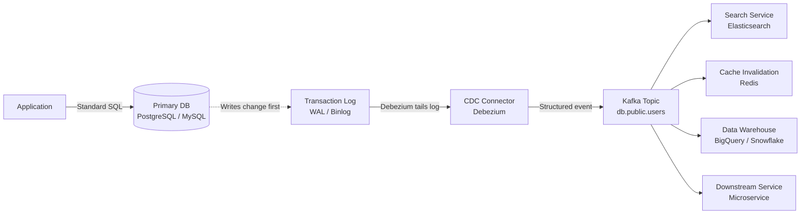

# Change Data Capture (CDC)

> **Change Data Capture (CDC)** is a set of software design patterns used to determine and track the data that has changed so that action can be taken using the changed data. Instead of periodically querying a database for changes, CDC captures every `INSERT`, `UPDATE`, and `DELETE` at the **transaction log level** and streams them as events to downstream consumers.

CDC is fundamentally about one guarantee: **if a write was committed to the database, it will eventually be delivered to consumers — even across crashes, restarts, and network partitions.** No polling. No dual writes. No data loss.

---

## 👶 Beginner View: What is CDC?

Imagine you own a bank. You have a main ledger (the Database). Whenever a customer deposits money, the teller writes it in the ledger.

**Without CDC (Polling):** The marketing department wants to send a "Thank you" email to anyone who deposits money. Every 5 minutes, a marketer runs to the teller, grabs the heavy ledger, and scans every page looking for new deposits. This wastes the teller's time (database load), emails are delayed by up to 5 minutes, and nothing is guaranteed if the marketer trips and drops the ledger halfway through.

**With CDC:** The teller is given a carbon-copy pad. Every time they write a deposit in the ledger, the carbon copy instantly creates a duplicate slip. This slip is placed on a conveyor belt (Kafka). The marketing department sits at the end of the conveyor belt and sends an email as soon as a slip arrives — in real time.

CDC turns your static database into a **real-time streaming event source** without changing a single line of application code.

### How It Works (Step-by-Step)

1. **Application writes data:** Your backend executes a standard SQL statement — `INSERT INTO users (name, email) VALUES ('Alice', 'alice@example.com')`.
2. **Database logs the change:** Before modifying the actual data file on disk, the database writes the change to an append-only transaction log (PostgreSQL's **Write-Ahead Log**, MySQL's **Binlog**, SQL Server's **Transaction Log**). This log exists primarily for crash recovery, but CDC repurposes it.
3. **CDC tool tails the log:** A connector like Debezium connects to the database as if it were a read replica. It continuously reads the transaction log in real time — without touching the actual data tables.
4. **Event emission:** The raw binary log entry is transformed into a structured event (JSON or Avro) containing the operation type (`c`=create, `u`=update, `d`=delete), the **before** state, and the **after** state of the row.
5. **Streaming to consumers:** The event is published to Kafka. Any number of consumers (search index, cache, analytics, another microservice) independently process it at their own pace.



### What a CDC Event Looks Like

```json
{
  "op": "u",
  "ts_ms": 1718000000000,
  "before": {
    "id": 1,
    "name": "Alice",
    "email": "alice@old.com",
    "balance": 1000
  },
  "after": {
    "id": 1,
    "name": "Alice",
    "email": "alice@new.com",
    "balance": 1000
  },
  "source": {
    "db": "myapp",
    "table": "users",
    "lsn": 24023128,
    "txId": 756
  }
}
```

The `before` / `after` fields are unique to CDC — no other integration pattern gives you both the old and new state of a row atomically, without any application-level code.

---

## ⚖️ Alternatives & When to Choose What

CDC is one of several approaches for propagating data changes to downstream systems. Choosing the wrong approach is a common architectural mistake.

### Pattern Comparison Matrix

| Criterion | Polling | Dual Write | Transactional Outbox | CDC (Log Tailing) |
|---|---|---|---|---|
| **Delivery guarantee** | ⚠️ At-most-once (can miss changes) | ❌ None (no atomicity) | ✅ At-least-once | ✅ At-least-once |
| **Latency** | ❌ High (poll interval) | ✅ Low | ✅ Low | ✅ Very low (ms) |
| **Missed deletes** | ❌ Can miss hard deletes | ⚠️ Risk of inconsistency | ✅ Captures deletes | ✅ Captures all operations |
| **App code changes** | ⚠️ Requires `updated_at` column | ❌ Requires changes everywhere | ⚠️ Requires outbox table writes | ✅ Zero app code changes |
| **Operational complexity** | Low | Low | Medium | High |
| **Handles DB schema changes** | ✅ Naturally | ✅ Naturally | ✅ Naturally | ⚠️ Requires schema evolution strategy |
| **Works with legacy codebases** | ⚠️ Only if `updated_at` exists | ❌ Requires refactoring | ⚠️ Requires refactoring | ✅ Yes — reads log, no code changes |
| **DB load impact** | ❌ High (repeated queries) | Low | Low | ✅ Minimal (log tailing is cheap) |

---

### 1. Polling (Timestamp-Based Sync)

The simplest approach: periodically query the source database for rows changed since the last poll, using an `updated_at` timestamp.

```sql
-- Run every 60 seconds
SELECT * FROM orders
WHERE updated_at > :lastPolledAt
ORDER BY updated_at ASC;
```

**Strengths:**
- Trivially simple to implement — no new infrastructure.
- Works with any JDBC-compatible database.
- Easy to debug (just run the SQL query manually).

**Weaknesses:**
- **Hard deletes are invisible.** A `DELETE` statement removes the row entirely; polling sees nothing. You must use soft deletes (`is_deleted = true`) to work around this.
- **Requires `updated_at` on every table.** Legacy schemas often lack this.
- **Poll interval creates inherent latency.** A 60-second interval means up to 60 seconds of lag — unacceptable for real-time use cases.
- **Polling itself is a load source.** Frequent large scans compete with production read traffic.
- **Missed changes between polls.** If a row is created and deleted within one polling interval, it is permanently invisible.

**Choose polling when:** latency requirements are loose (minutes are acceptable), the dataset is small, and hard deletes are not a concern. A nightly ETL sync is a good use case.

---

### 2. Dual Write (Application-Level Publishing)

The application code writes to the database *and* publishes an event to the message broker in the same business operation.

```java
// ❌ DANGEROUS — no atomicity between the two writes
@Service
public class OrderService {

    public void placeOrder(Order order) {
        orderRepository.save(order);         // Write 1: database
        kafkaTemplate.send("orders", order); // Write 2: Kafka
        // If Kafka is unavailable, the DB write succeeds
        // but the event is never published — permanent inconsistency
    }
}
```

**Strengths:**
- No extra infrastructure.
- Low latency — event is published in the same request thread.
- Full control over the event payload (not tied to the database schema).

**Weaknesses:**
- **No atomicity.** A crash, timeout, or network failure between the two writes leaves your systems permanently out of sync. The database has the data; Kafka does not. There is no recovery path without manual intervention.
- **Ordering is not guaranteed.** Two concurrent threads could write to the DB in one order and publish to Kafka in a different order.
- **Retry logic is complex and error-prone.** Even with retries, distinguishing "did the DB write succeed?" from "did the Kafka publish succeed?" is non-trivial.

**Choose dual write only when:** the event is genuinely non-critical (a log line, an analytics click event) and losing it occasionally is acceptable. For any data that must be consistent, dual write is not safe.

---

### 3. Transactional Outbox Pattern

A bridge between application-controlled events and guaranteed delivery. The application writes events to an `outbox` table in the same database transaction as the business data, and CDC (via a log tailer like Debezium) reads the outbox table to publish them to Kafka.

For the complete architectural design, sequence diagrams, Spring Boot entity/service implementations, and Debezium Outbox Event Router configurations, see the dedicated **[Transactional Outbox Pattern Guide](./outbox-pattern.md)**.

---

### 4. CDC (Log Tailing) — The Full Pattern

CDC reads directly from the database transaction log. No application code changes. No extra tables. Every committed write — including hard deletes — is captured.

**Strengths:**
- Zero application code changes — works transparently against any existing codebase.
- Captures all operation types including hard deletes and schema changes.
- Minimal DB load — log tailing is far cheaper than query-based polling.
- Strict ordering per row (by LSN/Binlog offset).
- Before/after state available for every row change.

**Weaknesses:**
- High operational complexity: Debezium, Kafka Connect, Schema Registry, connector configuration.
- Schema evolution is a first-class concern (see Deep Dive below).
- Tightly coupled to database internals — changing the DB engine or replication slot configuration can break the pipeline.
- Requires database-level privileges (replication role in PostgreSQL).
- Initial snapshot for large tables is operationally challenging.

**Choose CDC log tailing when:** you cannot change the application code (legacy systems), you need hard delete capture, you need the before/after row state, or you want zero-touch integration across many tables.

---

## 🛠️ When to Use CDC

### ✅ Use CDC When:

**Reliable Multi-System Synchronization (Microservices)**
When multiple services need their own optimized view of the same data, CDC ensures they all stay consistent without touching application code.

```
User Service (PostgreSQL) 
      ↓ CDC
  ├── Search Service (Elasticsearch) — full-text search
  ├── Analytics Service (BigQuery)   — aggregations
  └── Notification Service (Redis)  — cache + pub/sub
```

**Powering the Transactional Outbox**
CDC is the most robust engine for the Outbox Pattern. Debezium tails the `outbox` table and routes events to the correct Kafka topics.

**Cache Invalidation**
CDC listens to the source table and publishes invalidation events to Redis whenever a row changes — without any cache.evict() call in application code.

**Zero-Downtime Database Migrations**
CDC enables migrating from one database technology to another (e.g., MySQL → PostgreSQL) by running both systems in parallel, syncing the new DB via CDC, then performing a cutover with seconds of downtime.

**Audit Logging**
Every database mutation flows through CDC, giving you a tamper-proof external audit log without adding audit interceptors to every repository in your codebase.

### ❌ Do NOT Use CDC When:

- **Synchronous API responses are required.** CDC is async. If a user submits a form and must see the updated result immediately, CDC introduces lag.
- **The dataset is tiny and changes are infrequent.** Adding Kafka + Debezium for a database with 1,000 rows and 10 writes/day is severe over-engineering.
- **Your team has no Kafka operational experience.** CDC pipelines fail in subtle ways (connector lag, schema mismatches, snapshot failures). Without expertise to operate them, they become a liability.
- **Dropping occasional events is acceptable.** Directly publishing to Kafka from application code is simpler and sufficient for non-critical analytics events.

---

## 🧠 Senior Deep Dive: Challenges & Solutions

### 1. The Dual Write Problem: A Precise Explanation

The term "Dual Write Problem" is often used loosely. It has a precise definition:

> A Dual Write is any operation that writes to two independent systems (database + message broker) without a distributed transaction covering both. It is inherently unsafe because the two writes are not atomic.

The failure scenarios:

| Failure Point | Database State | Kafka State | Outcome |
|---|---|---|---|
| Crash after DB write, before Kafka write | ✅ Committed | ❌ Not published | **Silent data loss** — consumers never see the event |
| Crash after Kafka write, before DB commit | ❌ Rolled back | ✅ Published | **Phantom event** — consumers process an event that never existed |
| Both succeed, out of order (concurrent writes) | ✅ Correct | ⚠️ Wrong order | **Ordering violation** — consumers see stale state |

CDC eliminates all three scenarios because the event is derived from the transaction log *after* the DB write has already committed. There is no second write.

---

### 2. Setting Up Debezium with PostgreSQL (Spring Boot)

Debezium runs as a **Kafka Connect connector**. Configuration is declarative JSON deployed to the Kafka Connect REST API.

**Step 1: Enable logical replication in PostgreSQL**

```sql
-- postgresql.conf
wal_level = logical
max_wal_senders = 4
max_replication_slots = 4
```

```sql
-- Grant replication role to Debezium user
CREATE ROLE debezium WITH LOGIN REPLICATION PASSWORD 'secret';
GRANT SELECT ON ALL TABLES IN SCHEMA public TO debezium;
```

**Step 2: Deploy the Debezium PostgreSQL connector**

```json
// POST http://kafka-connect:8083/connectors
{
  "name": "orders-connector",
  "config": {
    "connector.class": "io.debezium.connector.postgresql.PostgresConnector",
    "database.hostname": "postgres",
    "database.port": "5432",
    "database.user": "debezium",
    "database.password": "secret",
    "database.dbname": "myapp",
    "database.server.name": "myapp",
    "table.include.list": "public.orders,public.users",
    "plugin.name": "pgoutput",
    "slot.name": "debezium_slot",
    "publication.name": "debezium_publication",
    "key.converter": "io.confluent.kafka.serializers.KafkaAvroSerializer",
    "value.converter": "io.confluent.kafka.serializers.KafkaAvroSerializer",
    "value.converter.schema.registry.url": "http://schema-registry:8081",
    "transforms": "unwrap",
    "transforms.unwrap.type": "io.debezium.transforms.ExtractNewRecordState",
    "transforms.unwrap.delete.handling.mode": "rewrite",
    "transforms.unwrap.add.fields": "op,ts_ms"
  }
}
```

:::tip[The `ExtractNewRecordState` SMT]
By default, Debezium wraps events in an envelope with `before`, `after`, `source`, and `op` fields. The `ExtractNewRecordState` Single Message Transform (SMT) flattens the event to just the `after` state (plus metadata you opt into via `add.fields`). Use the unwrapped form for most consumers; use the full envelope when you need the `before` state (e.g., for audit logs or computing diffs).
:::

**Step 3: Consume CDC events in a Spring Boot service**

```java
@Component
public class OrderCdcConsumer {

    private final OrderSearchRepository searchRepository;
    private final ProcessedEventRepository processedEvents;

    // Kafka topic: {server.name}.{schema}.{table} = myapp.public.orders
    @KafkaListener(topics = "myapp.public.orders", groupId = "search-sync")
    public void consume(ConsumerRecord<String, OrderEvent> record) {
        OrderEvent event = record.value();
        String eventId = record.topic() + "-" + record.partition() + "-" + record.offset();

        // Idempotency check — at-least-once means we may see duplicates
        if (processedEvents.existsById(eventId)) {
            return;
        }

        switch (event.getOp()) {
            case "c", "u" -> searchRepository.upsert(toSearchDoc(event));
            case "d"      -> searchRepository.delete(event.getId());
            case "r"      -> searchRepository.upsert(toSearchDoc(event)); // snapshot read
        }

        processedEvents.save(new ProcessedEvent(eventId));
    }

    private OrderSearchDoc toSearchDoc(OrderEvent event) {
        return OrderSearchDoc.builder()
                .id(event.getId())
                .customerId(event.getCustomerId())
                .status(event.getStatus())
                .totalAmount(event.getTotalAmount())
                .build();
    }
}
```

**Step 4: Transactional Outbox with Debezium Outbox Router**

For Spring Boot entity/service code and Debezium Kafka Connect configurations specifically tailored for logical outbox routing, see the dedicated **[Relay Strategy B: CDC with Debezium](./outbox-pattern.md#strategy-b-change-data-capture-cdc-via-debezium)** section.

---

### 3. Schema Evolution: The Most Dangerous Long-Term Risk

Once a CDC pipeline is running in production, every database schema change is a potential incident.

**Scenario:** A developer runs `ALTER TABLE orders DROP COLUMN discount_code;`.

Without schema governance, Debezium continues publishing events — but `discount_code` is gone. The Elasticsearch consumer crashes trying to map a field that no longer exists in the event. The DLQ fills up. The search index stops updating.

**Defense in layers:**

**Layer 1 — Schema Registry with compatibility rules:**

```bash
# Set BACKWARD compatibility on the Kafka topic's schema
# This means new schema must be readable by old consumers
# i.e., you can ADD optional fields, but cannot REMOVE or RENAME fields
curl -X PUT http://schema-registry:8081/config/myapp.public.orders-value \
  -H "Content-Type: application/json" \
  -d '{"compatibility": "BACKWARD"}'
```

With Schema Registry enforcing `BACKWARD` compatibility, Debezium will refuse to publish an event whose schema is incompatible — effectively blocking the migration until the downstream consumers are updated first.

**Layer 2 — Safe migration checklist (Expand/Contract):**

Never make a breaking schema change in one step. Use the **Expand/Contract** (parallel change) migration pattern:

```
Step 1 — EXPAND:   Add the new column (nullable). Deploy the new consumer that reads both old and new fields.
Step 2 — MIGRATE:  Backfill data to the new column.
Step 3 — CONTRACT: Remove the old column only after all consumers have been updated and confirmed.
```

```sql
-- Step 1: EXPAND — add new column, keep old one
ALTER TABLE orders ADD COLUMN customer_email VARCHAR(255);

-- Step 2: MIGRATE — backfill
UPDATE orders o SET customer_email = u.email
FROM users u WHERE o.customer_id = u.id;

-- Step 3: CONTRACT — only after all CDC consumers are updated
ALTER TABLE orders DROP COLUMN customer_id;
```

**Layer 3 — Upcasters for event transformation:**

Similar to Event Sourcing, you can deploy a Kafka Streams transformer that reads old event formats and upgrades them before they reach downstream consumers.

```java
@Component
public class OrderEventUpcaster {

    @Bean
    public KStream<String, JsonNode> upcaster(StreamsBuilder builder) {
        return builder
            .stream("myapp.public.orders")
            .mapValues(event -> {
                // Upcast v1 events (with customer_id) to v2 (with customer_email)
                if (event.has("customer_id") && !event.has("customer_email")) {
                    String email = userLookupService.getEmail(event.get("customer_id").asText());
                    ((ObjectNode) event).put("customer_email", email);
                }
                return event;
            });
    }
}
```

---

### 4. Snapshotting: The Bootstrap Problem

When you first attach Debezium to a running database, the WAL only contains recent changes (logs are routinely truncated). Historical data must be captured via an **initial snapshot**.

**Snapshot modes in Debezium:**

| Mode | Behavior | Use when |
|---|---|---|
| `initial` (default) | Full `SELECT *` snapshot, then switch to streaming | First-time setup on non-critical tables |
| `initial_only` | Snapshot only, no streaming | One-time data migration |
| `never` | Skip snapshot, stream from current WAL position | You don't need historical data |
| `when_needed` | Snapshot only if no valid offset exists | Resuming after a connector reset |
| `exported` | Snapshot using an existing DB export (consistent read) | Large tables where `SELECT *` is too slow |
| `parallel` (Debezium 2.x) | Chunks the table and snapshots in parallel | Multi-TB tables |

**The performance danger:**

For a 500GB table, `initial` mode runs a full `SELECT *` during business hours. This:
- Holds a consistent read snapshot lock for the duration (can block DDL).
- Causes massive I/O on the DB host.
- Can take hours.

**Production-safe bootstrap with chunked snapshotting:**

```json
{
  "snapshot.mode": "parallel",
  "snapshot.max.threads": "4",
  "snapshot.fetch.size": "10240",
  "incremental.snapshot.chunk.size": "1024",
  "snapshot.tables.order.by.row.count": "descending"
}
```

Alternatively, perform a **read-replica snapshot**: point Debezium at a read replica for the initial snapshot, then switch to the primary for streaming. This completely eliminates load on the production database.

---

### 5. Replication Slot Management (PostgreSQL-Specific)

PostgreSQL CDC relies on a **logical replication slot**. This is the most operationally dangerous aspect of a Postgres CDC setup.

**How it works:** The replication slot tracks the WAL position up to which Debezium has consumed. PostgreSQL retains all WAL segments from that position forward — it will not discard them, even if disk fills up.

**The catastrophic failure scenario:**

```
1. Debezium connector crashes or is stopped for maintenance.
2. The application continues writing to PostgreSQL.
3. PostgreSQL cannot discard WAL because the replication slot holds position.
4. WAL accumulates on disk.
5. Disk fills up.
6. PostgreSQL stops accepting writes entirely.
7. Production outage.
```

**Mitigations:**

```sql
-- Monitor replication slot lag — alert if WAL retained > 10GB
SELECT slot_name,
       pg_size_pretty(pg_wal_lsn_diff(pg_current_wal_lsn(), restart_lsn)) AS retained_wal,
       active
FROM pg_replication_slots;
```

```sql
-- Emergency: drop the slot if the connector is down for too long
-- (You will lose events between the drop point and reconnection)
SELECT pg_drop_replication_slot('debezium_slot');
```

```bash
# Set an alert in Prometheus/Grafana when retained WAL exceeds threshold
# Prometheus query:
pg_replication_slots_pg_wal_lsn_diff{slot_name="debezium_slot"} > 10737418240
```

Additionally, configure a `max_slot_wal_keep_size` in PostgreSQL 13+ to automatically invalidate a lagging slot before it causes a disk outage:

```properties
# postgresql.conf
max_slot_wal_keep_size = 10GB
```

If the slot is invalidated, Debezium will need to perform a new full snapshot — but the database stays up.

---

### 6. Ordering Guarantees and Kafka Partitioning

Debezium guarantees strict ordering **per primary key** within a single table. This is achieved by using the row's primary key as the Kafka message key — Kafka routes all messages with the same key to the same partition, maintaining order.

**What this means in practice:**

```
Events for order_id=1: → Partition 2 (ordered: INSERT → UPDATE → DELETE)
Events for order_id=2: → Partition 5 (ordered: INSERT → UPDATE)
Events for order_id=3: → Partition 2 (may be interleaved with order_id=1)
```

**Cross-table ordering is NOT guaranteed.** If your consumer needs to process an `OrderPlaced` event before a `PaymentProcessed` event for the same business transaction, and those events come from different tables (different Kafka partitions), you must implement ordering logic in the consumer (e.g., wait for both events before processing).

**Fan-out to multiple consumers:**

```
myapp.public.orders  →  Search Consumer (group: search-sync)
                     →  Analytics Consumer (group: analytics-sync)
                     →  Audit Consumer (group: audit-log)
```

Each consumer group independently tracks its own Kafka offset. A slow analytics consumer does not block or affect the search consumer.

---

### 7. Log Compaction vs. Log Retention

Kafka offers two storage strategies for CDC topics.

**Log Retention** (time-based): Retain all events for N days (e.g., 7 days), then delete. Good for replay within a short window; storage is bounded.

**Log Compaction** (key-based): For each primary key, retain only the most recent event. A consumer starting from the beginning gets the current state of every row — not the full history.

```
Without compaction (full history for user_id=1):
  user_id=1 → INSERT(name=Alice, email=a@old.com)
  user_id=1 → UPDATE(name=Alice, email=a@new.com)
  user_id=1 → UPDATE(name=Alice, email=a@final.com)

With log compaction (only current state retained):
  user_id=1 → UPDATE(name=Alice, email=a@final.com)
```

**Compaction + tombstone for deletes:** When a row is deleted, Debezium publishes a tombstone event (a message with the primary key and a `null` value). Log compaction will eventually remove all events for that key, cleaning up deleted records from the log.

```properties
# Kafka topic configuration for a CDC topic
cleanup.policy=compact
min.cleanable.dirty.ratio=0.5
delete.retention.ms=86400000  # Keep tombstones for 24h before compacting
```

**Which to choose:**

| Strategy | Use when |
|---|---|
| **Retention (time-based)** | You need full event history for replay / audit within a window |
| **Compaction** | Consumers primarily need "current state" bootstrap; storage efficiency matters |
| **Retention + Compaction** | Best of both: recent history available, old entries compacted |

---

### 8. Observability: What to Monitor in Production

A CDC pipeline has its own unique failure modes. Standard application monitoring is insufficient.

**Critical metrics to track:**

```java
// Prometheus metrics to alert on

// 1. Connector lag — how far behind Debezium is from the WAL
debezium_connector_lag_seconds > 30

// 2. Kafka consumer lag — how far behind each consumer group is
kafka_consumer_group_lag{group="search-sync", topic="myapp.public.orders"} > 10000

// 3. DLQ message count — events that failed after all retries
kafka_topic_messages_in_rate{topic="myapp.public.orders.DLQ"} > 0

// 4. PostgreSQL replication slot WAL retention
pg_replication_slot_wal_retained_bytes > 10_000_000_000 (10GB)

// 5. Connector status — should always be RUNNING
debezium_connector_status != "RUNNING"
```

```java
// Spring Boot Actuator health check for Debezium connector
@Component
public class DebeziumHealthIndicator implements HealthIndicator {

    private final KafkaConnectClient connectClient;

    @Override
    public Health health() {
        ConnectorStatus status = connectClient.getStatus("orders-connector");
        if ("RUNNING".equals(status.getState())) {
            return Health.up()
                    .withDetail("lag", status.getLagSeconds())
                    .build();
        }
        return Health.down()
                .withDetail("state", status.getState())
                .withDetail("error", status.getError())
                .build();
    }
}
```

---

## 🎯 Interview Decision Matrix

| Scenario | Recommend CDC? | Why? |
|---|---|---|
| Sync operational DB → Data Warehouse | ✅ Yes | Eliminates heavy analytics queries from the transactional DB; captures all changes including deletes. |
| Sync DB → Elasticsearch (search index) | ✅ Yes | At-least-once delivery ensures perfect eventual consistency without dual writes. |
| Cache invalidation (Redis) | ✅ Yes | CDC events drive cache eviction without any `@CacheEvict` annotations in application code. |
| Microservice event publishing (Outbox) | ✅ Yes (as Outbox engine) | Reliable, atomic event delivery without a distributed transaction. |
| Synchronous API responses | ❌ No | CDC is async. Cannot return updated data immediately to the calling user. |
| Simple event notifications (non-critical) | ⚠️ Maybe | If dropping an event is acceptable, direct Kafka publishing from the app is simpler and sufficient. |
| Zero-downtime DB migration | ✅ Yes | Run old and new DBs in parallel; CDC keeps new DB in sync until cutover. |
| Single monolith, single DB | ❌ No | Kafka + Debezium is massive operational overhead for no gain. |

:::tip[Interview Phrasing — CDC for Search Sync]
*"To keep Elasticsearch in sync with our PostgreSQL orders database, I'll avoid application-level dual writes — they carry the risk of silent inconsistency on any failure between the two writes. Instead, I'll deploy Debezium to tail the PostgreSQL WAL. Every committed INSERT, UPDATE, and DELETE is captured and published to a Kafka topic. The Elasticsearch sync consumer processes these events idempotently, using the Kafka partition offset as its deduplication key. This guarantees at-least-once delivery with no application code changes and captures hard deletes, which polling cannot."*
:::

:::tip[Interview Phrasing — Transactional Outbox]
*"When our Order Service commits a new order, it must also publish an OrderPlaced event to Kafka for downstream services. A direct dual write is unsafe — a crash between the two writes leaves systems inconsistent with no recovery path. I'll use the Transactional Outbox Pattern: the service writes both the order and the outbox event in a single ACID transaction. Debezium tails the outbox table and routes events to the correct Kafka topic via the OutboxEventRouter SMT. This guarantees that if the order commits, the event will be published — eventually, exactly once from a business perspective."*
:::

---

## 📚 Further Reading

- [Debezium Documentation](https://debezium.io/documentation/reference/stable/) — The canonical reference for connector configuration, SMTs, and deployment.
- [Debezium Outbox Event Router](https://debezium.io/documentation/reference/stable/transformations/outbox-event-router.html) — Official docs for the Outbox SMT.
- [Designing Data-Intensive Applications — Martin Kleppmann](https://dataintensive.net/) — Chapter 11 covers stream processing and CDC at depth; the best conceptual treatment available.
- [Martin Fowler — Strangler Fig Pattern](https://martinfowler.com/bliki/StranglerFigApplication.html) — CDC is a key enabler for this migration pattern.
- [Confluent — The Log: What Every Software Engineer Should Know](https://engineering.linkedin.com/distributed-systems/log-what-every-software-engineer-should-know-about-real-time-datas-unifying) — Jay Kreps' foundational essay on the database transaction log as a unifying abstraction.
- [PostgreSQL Logical Replication](https://www.postgresql.org/docs/current/logical-replication.html) — Deep dive into the WAL mechanism that powers Debezium for Postgres.