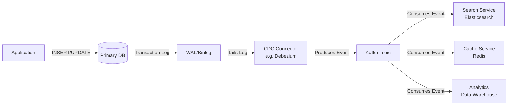

# Change Data Capture (CDC)

> **Change Data Capture (CDC)** is a set of software design patterns used to determine and track the data that has changed so that action can be taken using the changed data. Instead of periodically querying a database for changes, CDC captures every `INSERT`, `UPDATE`, and `DELETE` at the transaction log level and streams them as events.

---

## 👶 Beginner View: What is CDC?

Imagine you own a bank. You have a main ledger (the Database).
Whenever a customer deposits money, the teller writes it in the ledger.

**Without CDC (Polling):**
The marketing department wants to send a "Thank you" email to anyone who deposits money. To do this, every 5 minutes, a marketer runs to the teller, grabs the heavy ledger, and scans every page looking for new deposits. This is incredibly slow, wastes the teller's time (database load), and the emails are delayed by 5 minutes.

**With CDC:**
The teller is given a carbon-copy pad. Every time they write a deposit in the ledger, the carbon copy instantly creates a duplicate slip. This slip is placed on a conveyor belt (Kafka/Message Queue). The marketing department simply sits at the end of the conveyor belt and immediately sends an email as soon as a slip arrives.

CDC turns your static database into a **real-time streaming event source**.

### How It Works (Step-by-Step)

1. **The Application Writes Data**: Your backend service executes a standard SQL `INSERT INTO users (name) VALUES ('Alice')`.
2. **The Database Logs the Change**: Before modifying the actual table on disk, the database writes this change to an append-only log (e.g., PostgreSQL Write-Ahead Log or MySQL Binlog). This is normally used for crash recovery.
3. **The CDC Tool Listens**: A tool like Debezium acts like a "replica" database. It continuously reads the database's transaction log in real-time.
4. **Event Emission**: The CDC tool converts the raw binary log into a human-readable format (like JSON or Avro) containing the "before" and "after" state of the row.
5. **Streaming**: The event is published to an Event Streaming platform (like Kafka) so any number of consumers can react to it.



---

## 🛠️ When to Use CDC

### 1. Reliable Data Synchronization (Microservices)
Microservices often need their own optimized view of data. For example, a Search service needs data in Elasticsearch, while a User service uses PostgreSQL. 

:::warning[The Dual Write Problem]
Never do this in your application code:
```java
// ❌ THIS IS DANGEROUS! (Dual Write)
public void createUser(User user) {
    sqlDatabase.save(user);        // What if this succeeds...
    elasticsearch.save(user);      // ...but this fails (e.g. network timeout)?
}
```
If Elasticsearch fails, your systems are forever out of sync. CDC solves this by reading directly from the `sqlDatabase` transaction logs. If Elasticsearch goes down, the CDC pipeline simply pauses and resumes exactly where it left off when Elasticsearch recovers.
:::

### 2. The Transactional Outbox Pattern
When a microservice needs to update its own database AND publish a message to a message broker (like Kafka) atomically. CDC is the engine that powers the Outbox Pattern by reading the `outbox` table and safely delivering the events to Kafka.

### 3. Cache Invalidation
CDC can listen to the database and automatically send invalidation events to Redis whenever a row is updated, keeping the cache perfectly eventually consistent with the database.

### 4. Data Warehousing / Analytics
Moving operational data (OLTP) to an analytics database (OLAP) without putting massive `SELECT *` query load on the primary database.

---

## 🚫 When NOT to Use CDC

- **Synchronous API Responses**: If a user clicks a button and *needs* to see the result immediately on the next page load, CDC is the wrong choice. CDC operates asynchronously (Eventual Consistency).
- **Simple Monoliths**: If your application is a single monolith with a single database, adding Kafka and Debezium introduces massive operational overhead for little gain.
- **When Minor Data Loss is Acceptable**: If you are just tracking UI clicks or non-critical metrics, writing directly to Kafka from the application is fine. CDC is for when data consistency is strictly required.

---

## 🧠 Senior Deep Dive: CDC Architecture & Challenges

While CDC is powerful, senior engineers must design for its operational complexities.

### 1. The Schema Evolution Problem
If you drop a column from your PostgreSQL table, the CDC events will suddenly no longer contain that column. If downstream consumers (like a Data Warehouse or Elasticsearch) aren't prepared for this missing field, they will crash.
- **The Solution:** Use a **Schema Registry** (like Confluent Schema Registry). The CDC tool validates every event against a strict schema (usually Avro or Protobuf). If a developer attempts a backward-incompatible database migration (like deleting a mandatory column), the pipeline can catch it or handle it gracefully using schema evolution rules.

### 2. Snapshotting (The Bootstrap Problem)
When you first attach a CDC connector to a database, the transaction logs only contain *recent* changes (since logs are routinely purged to save disk space). How do downstream systems get the historical data?
- **The Solution:** CDC tools perform an initial **Snapshot**. They run a `SELECT * FROM table` to dump the current state of the entire database into Kafka, and *then* switch to streaming the transaction logs.
- **The Danger:** For a multi-terabyte table, a `SELECT *` can cause massive performance degradation, lock tables, or take days to complete. Advanced implementations use **Watermark Snapshotting** or chunking to read historical data in small batches without locking the tables.

### 3. Log Compaction in Kafka
If a user updates their profile 50 times, CDC will publish 50 events. A new consumer starting up would have to process all 50 events just to get the final state.
- **The Solution:** Enable **Log Compaction** on the Kafka topic. Kafka will periodically scan the topic and delete older events for a given Primary Key, keeping only the most recent event. This allows new consumers to quickly bootstrap the current state of the database without processing years of history.

### 4. Eventual Consistency & Idempotency
CDC guarantees **At-Least-Once delivery** and maintains strict ordering *per row* (or per primary key).
- However, if you are consuming CDC events to build a read model, you are operating under Eventual Consistency. There will be a replication lag (usually milliseconds, but can spike during heavy load).
- Because delivery is at-least-once, consumers **MUST be idempotent**. If a network glitch causes Kafka to redeliver the `Update(id=1, name=Bob)` event twice, your consumer must not crash or corrupt its state.

### 5. Write Amplification (Outbox Pattern)
If you use CDC for the Outbox Pattern, every business action results in two database writes: one to the business table, and one to the outbox table. This doubles the write IOPS on your database and fills up the Write-Ahead Log twice as fast.

---

## 🎯 Interview Decision Matrix

When should you propose CDC in a System Design Interview?

| Scenario | Recommend CDC? | Why? |
|----------|----------------|------|
| Syncing Data Warehouse (OLAP) | ✅ YES | Removes heavy analytics queries from the transactional DB. |
| Building Search Index (Elasticsearch) | ✅ YES | Ensures perfect eventual consistency without dual writes. |
| Synchronous API Responses | ❌ NO | CDC is asynchronous. It cannot return a result immediately to a user. |
| Simple Event Notifications | ⚠️ MAYBE | If dropping an event is acceptable, publishing directly from code is easier. If guaranteed delivery is required, use CDC (Outbox Pattern). |

:::tip[Interview Phrasing]
*"To synchronize our primary PostgreSQL database with Elasticsearch, I will avoid Dual Writes in the application tier. Instead, I'll use Change Data Capture (CDC) via Debezium to tail the Postgres Write-Ahead Log. This guarantees at-least-once delivery to Kafka, ensuring our search index remains perfectly eventually consistent even during network partitions."*
:::
