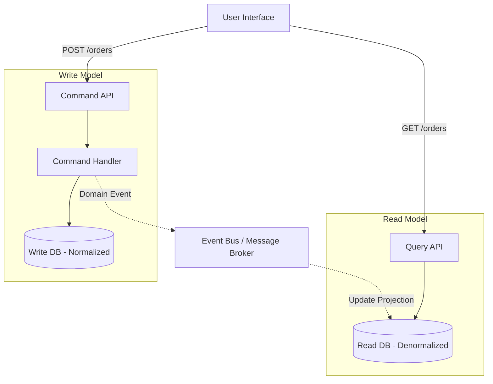

# CQRS & Event Sourcing

> **Command Query Responsibility Segregation (CQRS)** is an architectural pattern that separates the models used to read data (Queries) from the models used to update data (Commands).
> **Event Sourcing** is a complementary pattern that stores the state of an application as a sequence of immutable events rather than just the current state.

---

## 👶 Beginner View: What is CQRS?

In a traditional CRUD (Create, Read, Update, Delete) system, you use the same database model for both reading and writing. This works well for simple applications but fails under heavy load or complex business logic.

Imagine a busy restaurant kitchen:
- **CRUD:** One giant whiteboard. The waiters write new orders on it (Writes), and the chefs are constantly trying to read from the exact same board to see what to cook (Reads). They bump into each other, and it's chaotic.
- **CQRS:** The waiters hand order tickets to an expeditor (Command Model). The expeditor processes them, applies business rules, and then updates a separate, specialized screen for the chefs (Query Model) that is optimized *exactly* for what a chef needs to see.

By separating the "Write Side" and the "Read Side", you can scale and optimize them completely independently.

### Architecture Diagram



---

## 👶 Beginner View: What is Event Sourcing?

Event Sourcing goes hand-in-hand with CQRS. Instead of saving the *current state* of an entity to the database, you save the *history of all events* that happened to it.

```
// Traditional Database (Only shows current state)
Account(id: 1, balance: $1300)

// Event Sourced Database (Shows how we got here)
AccountCreated(id: 1, initialBalance: $1000)
MoneyDeposited(id: 1, amount: $500)
MoneyWithdrawn(id: 1, amount: $200)
// Current balance is calculated by replaying events: 1000 + 500 - 200 = $1300
```

### Why Use Event Sourcing?
- **Perfect Audit Trail:** You never delete or overwrite data. You have a mathematically perfect history of the system.
- **Time Travel:** You can reconstruct the state of the system at any given second in the past by replaying events up to that timestamp.
- **New Read Models:** If the business asks for a new reporting dashboard, you can build a new Read DB, replay all historical events from day one, and instantly populate the new dashboard.

---

## 🛠️ When to Use CQRS & Event Sourcing

### Use CQRS When:
- **High Read/Write Asymmetry**: (e.g., Twitter) 1000x more reads than writes. You need heavily denormalized, specialized read models (like a pre-computed news feed) to serve reads quickly.
- **Complex Domain Logic**: The Write side can focus purely on invariant checking without worrying about joining tables for the UI.
- **Independent Scaling**: You want to scale the Read API horizontally across 50 servers, but the Write API only needs 2 servers.

### Use Event Sourcing When:
- **Strict Audit Requirements**: Financial, medical, or legal systems where you must prove *exactly* how a system reached its current state.
- **Frequent Requirement Changes**: You anticipate needing to query historical data in ways you haven't invented yet.

---

## 🚫 When NOT to Use Them

- **Simple CRUD Apps**: If you are building a simple admin dashboard, CQRS and Event Sourcing are massive over-engineering. Stick to a standard 3-tier architecture.
- **Strong Consistency Needs on the UI**: If the user *must* immediately see the results of their write action in a complex query view, the eventual consistency of CQRS will cause severe UX issues.
- **Team Inexperience**: Event Sourcing requires a paradigm shift. If your team is only familiar with relational databases and ORMs, the learning curve is extremely steep.

---

## 🧠 Senior Deep Dive: Challenges & Trade-offs

Senior engineers must know how to mitigate the massive operational complexities of CQRS and Event Sourcing.

### 1. The Eventual Consistency Tax
Because the Write DB and Read DB are separate, they are synchronized asynchronously (usually via Kafka or RabbitMQ). This introduces **Eventual Consistency**.
- **The Problem:** A user clicks "Update Profile", the Command succeeds, they are redirected to their profile page (Query API), but they still see their *old* profile picture because the Read DB hasn't caught up yet! (Projection Lag).
- **The Solution:** 
  - *Read-Your-Writes Consistency:* The UI can cache the updated data locally and display it immediately (Optimistic UI).
  - *Polling/WebSockets:* The UI waits for a WebSocket confirmation event from the Read Side before refreshing.
  - *Version Checking:* The Command returns an `ETag` or version number. The UI polls the Query API until the Query API returns data matching that version.

### 2. Event Versioning & Schema Evolution
Events are immutable and stored forever. What happens if you change the structure of the `OrderPlaced` event in v2 of your application?
- **The Problem:** Your code now has to be able to deserialize and process v1 events from five years ago *and* v2 events from today.
- **The Solution:** Use strict schema registries (like Confluent Schema Registry with Avro/Protobuf). Implement **Upcasters** — middleware that catches v1 events as they are loaded from the database and maps them to the v2 structure in-memory before the application sees them.

### 3. Snapshotting (Performance Optimization)
If a bank account has 10,000 transactions, loading the account requires fetching and replaying 10,000 events just to find the current balance. This takes too long.
- **The Solution:** Periodically take a "Snapshot" of the state (e.g., every 100 events). To get the current state, you load the latest snapshot and only replay the events that occurred *after* that snapshot.

### 4. Idempotency is Mandatory
The event bus (Kafka/RabbitMQ) guarantees at-least-once delivery. This means your Read Model projectors will eventually receive duplicate events.
- **The Solution:** All Read Model update logic must be strictly idempotent. If you receive the `OrderPlaced(id=5)` event twice, the second update must not corrupt the Read DB. Use the Event ID or Sequence Number to ignore already-processed events.

### 5. Integration with Sagas
In a microservices architecture, CQRS is often combined with the **Saga Pattern**. 
- The Command Side initiates a Saga.
- The Saga emits events.
- Other services listen to these events, execute local transactions, and emit their own events.
- The Read Side projectors listen to *all* these events to build a cohesive view of the entire distributed transaction for the user.

---

## 🎯 Interview Decision Matrix

| Scenario | Recommend CQRS? | Recommend Event Sourcing? | Why? |
|----------|-----------------|---------------------------|------|
| Simple CRUD App | ❌ NO | ❌ NO | Overkill. |
| High Read Traffic (e.g. Social Feed) | ✅ YES | ❌ NO | CQRS allows pre-computing the feed into a Read DB. Event sourcing is unnecessary. |
| Banking Ledger | ⚠️ MAYBE | ✅ YES | Event Sourcing guarantees auditability. CQRS might be needed if read queries are complex. |
| Complex Domain + Many UI Views | ✅ YES | ⚠️ MAYBE | CQRS decouples the domain from the UI. |

:::tip[Interview Phrasing]
*"Because this system has a 100:1 read-to-write ratio and requires complex multi-table joins to render the UI, a standard CRUD architecture will bottleneck at the database. I propose a CQRS architecture: we will process commands and enforce invariants in a normalized write-database, and asynchronously project domain events via Kafka to a denormalized NoSQL database (like MongoDB or Elasticsearch) optimized specifically for our read queries. We must also design the UI to handle the resulting eventual consistency gracefully."*
:::
