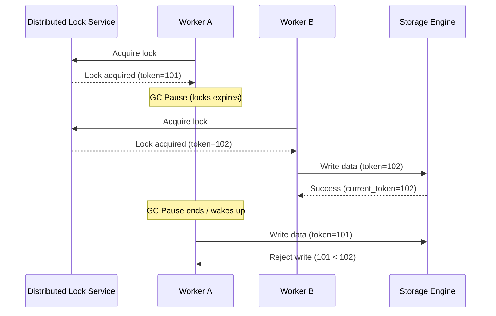

import ConsistencyModelsDiagram from '@site/src/components/ConsistencyModelsDiagram';

# Data Consistency & Transactions

> Consistency is not an on/off switch between "strong" and "eventual". Between those two poles lies an entire spectrum — read-your-writes, causal ordering, bounded staleness, consistent prefix... The real engineering skill is knowing which level to apply to which operation.

## Table of Contents

- [The Consistency Contract — What It Really Means](#the-consistency-contract--what-it-really-means)
- [The Full Consistency Spectrum (7 Levels)](#the-full-consistency-spectrum-7-levels)
  - [Data-Centric Models](#data-centric-models)
  - [Intermediate Named Tiers](#intermediate-named-tiers)
  - [Client-Centric Session Models](#client-centric-session-models)
- [The Two Lenses: Data-Centric vs Client-Centric](#the-two-lenses-data-centric-vs-client-centric)
- [Session Guarantees (Bayou Project, 1994)](#session-guarantees-bayou-project-1994)
  - [Read-Your-Writes](#read-your-writes)
  - [Monotonic Reads](#monotonic-reads)
  - [Monotonic Writes](#monotonic-writes)
  - [Writes-Follow-Reads](#writes-follow-reads)
- [Invisible Consistency Bugs & Why F5 Is the Worst Workaround](#invisible-consistency-bugs--why-f5-is-the-worst-workaround)
- [Per-Operation Consistency Selection](#per-operation-consistency-selection)
- [Real-World Database Consistency Tiers](#real-world-database-consistency-tiers)
  - [Azure Cosmos DB 5-Tier Model](#azure-cosmos-db-5-tier-model)
  - [The S3 Case Study — 14 Years of Eventual then One Day Free](#the-s3-case-study--14-years-of-eventual-then-one-day-free)
- [Beginner View](#beginner-view)
  - [ACID Properties](#acid-properties)
  - [Spring Transaction Management](#spring-transaction-management)
  - [BASE Properties (NoSQL)](#base-properties-nosql)
  - [Consistency Anomalies](#consistency-anomalies)
  - [Write Skew](#write-skew)
- [Distributed Consistency Patterns](#distributed-consistency-patterns)
- [Conflict Resolution (Multi-Master)](#conflict-resolution-multi-master)
  - [Last-Write-Wins (LWW)](#last-write-wins-lww)
  - [CRDT (Conflict-free Replicated Data Types)](#crdt-conflict-free-replicated-data-types)
  - [Application-Level Resolution](#application-level-resolution)
- [Transactional Outbox Pattern](#outbox-pattern)
- [Quorum Reads and Read Repair](#quorum-reads-and-read-repair)
  - [Beginner View](#beginner-view-1)
  - [Senior Deep Dive](#senior-deep-dive)
  - [Tradeoffs](#tradeoffs)
- [Idempotency Patterns](#idempotency-patterns)
  - [Database Constraint](#database-constraint)
  - [Application-Level](#application-level)
- [Locking Patterns: Local to Distributed](#locking-patterns-local-to-distributed)
  - [Local Database Locks](#local-database-locks)
  - [Distributed Locking \& Coordination](#distributed-locking)
- [How Transactions Work Internally](#how-transactions-work-internally)
  - [Transaction Lifecycle](#transaction-lifecycle)
  - [Write-Ahead Logging (WAL)](#write-ahead-logging-wal)
  - [Multi-Version Concurrency Control (MVCC)](#multi-version-concurrency-control-mvcc)
  - [Isolation Level Implementation](#isolation-level-implementation)
  - [Two-Phase Locking (2PL)](#two-phase-locking-2pl)
  - [Deadlock Detection](#deadlock-detection)
- [Distributed Transactions & Workflows](#distributed-transactions--workflows)
  - [Two-Phase Commit (2PC) & Three-Phase Commit (3PC)](./two-phase-commit.md)
  - [Saga Pattern](./saga-pattern.md)
- [Consensus Algorithms](#consensus-algorithms)
  - [Paxos](#paxos)
  - [Raft](#raft)
  - [Comparison](#comparison)
- [Event Sourcing and CQRS](./cqrs.md)
- [Change Data Capture (CDC)](./cdc.md)
- [Real-World Implementations](#real-world-implementations)
  - [PostgreSQL](#postgresql)
  - [MySQL](#mysql)
  - [MongoDB](#mongodb)
  - [Cassandra](#cassandra)
  - [DynamoDB](#dynamodb)
  - [Google Spanner](#google-spanner)
- [Application Transaction Integration Patterns](#application-transaction-integration-patterns)
  - [Optimistic Concurrency Control (OCC) with JPA @Version](#optimistic-concurrency-control-occ-with-jpa-version)
  - [Pessimistic Concurrency Control (PCC) with JPA @Lock](#pessimistic-concurrency-control-pcc-with-jpa-lock)
- [Pros and Cons](#pros-and-cons)
  - [Strong Consistency](#strong-consistency-pros-cons)
  - [Eventual Consistency](#eventual-consistency-pros-cons)
  - [Outbox Pattern](./outbox-pattern.md#summary-comparison-2pc-vs-saga-vs-outbox)
  - [Saga Pattern](./saga-pattern.md)
  - [CRDTs](#crdts-pros-cons)
- [Interview Questions](#interview-questions)
- [Senior Deep Dive: Advanced Topics](#senior-deep-dive-advanced-topics)
  - [Vector Clocks](#vector-clocks)
  - [Lamport Clocks](#lamport-clocks)
  - [Hybrid Logical Clocks (HLC)](#hybrid-logical-clocks-hlc)
  - [Distributed Snapshots](#distributed-snapshots)
  - [Consistency Models Hierarchy](#consistency-models-hierarchy)
  - [CAP Theorem Revisited](#cap-theorem-revisited)
  - [PACELC Theorem](#pacelc-theorem)
- [Additional Resources](#additional-resources)
- [Best Practices](#best-practices)

---

## Beginner View

### ACID Properties

| Property | Meaning | Example |
|---|---|---|
| **Atomicity** | All or nothing — no partial writes | Transfer: debit + credit, both succeed or both fail |
| **Consistency** | DB moves from one valid state to another | Balance never goes negative (constraint enforced) |
| **Isolation** | Concurrent transactions don't interfere | Two transfers don't corrupt each other |
| **Durability** | Committed data survives crashes | Power loss doesn't lose committed transactions |

### Spring Transaction Management

```java
@Transactional
public void transferMoney(Long fromId, Long toId, BigDecimal amount) {
    Account from = accountRepository.findById(fromId).orElseThrow();
    Account to = accountRepository.findById(toId).orElseThrow();

    from.debit(amount);   // Validates: throws if insufficient funds
    to.credit(amount);

    accountRepository.save(from);
    accountRepository.save(to);
    // If exception: entire transaction rolls back (atomicity)
}

// Propagation options
@Transactional(propagation = Propagation.REQUIRED)      // Join existing or create new (default)
@Transactional(propagation = Propagation.REQUIRES_NEW)  // Always new transaction
@Transactional(propagation = Propagation.NESTED)        // Savepoint within existing
@Transactional(readOnly = true)                          // Read-only optimization
@Transactional(timeout = 5)                              // 5 second timeout
@Transactional(rollbackFor = BusinessException.class)   // Rollback on checked exceptions too
```

### BASE Properties (NoSQL)

| Property | Meaning |
|---|---|
| **B**asically **A**vailable | System available most of the time |
| **S**oft state | Data may be in transition |
| **E**ventual consistency | Will converge to consistent state |

### Consistency Anomalies

#### Dirty Read
```
T1: UPDATE balance = 500  (not yet committed)
T2: READ balance = 500    (reads uncommitted data)
T1: ROLLBACK
T2: Used wrong data!
```
Fixed by: READ COMMITTED isolation level.

#### Non-Repeatable Read
```
T1: READ balance = 1000
T2: UPDATE balance = 500  (commits)
T1: READ balance = 500    (different value in same transaction!)
```
Fixed by: REPEATABLE READ.

#### Phantom Read
```
T1: SELECT COUNT(*) WHERE amount > 100  → 5 rows
T2: INSERT new row WHERE amount = 200   (commits)
T1: SELECT COUNT(*) WHERE amount > 100  → 6 rows (phantom!)
```
Fixed by: SERIALIZABLE.

#### Lost Update
```
T1: READ balance = 1000
T2: READ balance = 1000
T1: UPDATE balance = 1000 + 100 = 1100  (commits)
T2: UPDATE balance = 1000 + 50  = 1050  (overwrites T1!)
Final: 1050 instead of 1150
```
Fixed by: Pessimistic lock, optimistic lock, or `UPDATE ... SET balance = balance + 50`.

### Write Skew

Two transactions read the same data, make decisions based on it, then write different records.

```
Constraint: At least one doctor must be on call.

T1: Reads: Alice on_call=true, Bob on_call=true → Alice can go off-call
T2: Reads: Alice on_call=true, Bob on_call=true → Bob can go off-call

T1: UPDATE Alice SET on_call=false
T2: UPDATE Bob SET on_call=false

Result: Nobody on call! Constraint violated.
```

Fix: SERIALIZABLE isolation or explicit SELECT FOR UPDATE on the check.

---

## The Consistency Contract — What It Really Means

A consistency model is a **contract between the distributed system and the application developer**. It does not describe the internal implementation (Paxos, Raft, gossip protocol) — it only specifies: given a set of read and write operations issued concurrently from multiple clients, which outcomes are considered *valid* and which are *bugs*.

> **The Model Strength Trade-off**: A stronger model narrows the set of valid outcomes — making behaviour more predictable and code easier to write, but at the cost of higher latency and infrastructure expense. A weaker model widens the set of valid outcomes — making the system faster and more available, but **shifting the complexity burden to the application developer**. The complexity doesn't disappear; it only changes location.

---

## The Full Consistency Spectrum (7 Levels)

<ConsistencyModelsDiagram initialTab="spectrum" />

### Data-Centric Models

These models define global system-wide ordering properties across all nodes and replicas:

**1. Linearizability** *(Herlihy & Wing, 1990)*
- Every operation appears to execute atomically at exactly one point in real-time between invocation and response.
- After a write completes, **any** client anywhere **immediately** reads the new value.
- This is the **C in CAP theorem**. Selecting it means accepting reduced availability under network partition.
- **Production examples**: Google Spanner (TrueTime), etcd leader reads, ZooKeeper writes, CockroachDB serializable.

**2. Sequential Consistency** *(Lamport, 1979)*
- All nodes agree on a single total ordering of all operations, and per-process ordering is preserved.
- The global order need **not** match wall-clock time — the system may be uniformly slow compared to reality.
- In practice: Java `volatile` variables provide sequential consistency across threads (JMM). Rarely offered as a named DB tier since achieving it already requires consensus, at which point systems push to full linearizability.

**3. Causal Consistency** *(Mahajan, Alvisi & Dahlin, 2011)*
- Operations with a **cause-effect relationship** (causal dependency) must be observed in causal order by all nodes.
- Concurrent (unrelated) operations may appear in any order.
- **Theoretically proven to be the strongest model achievable while maintaining Availability under network Partition** — the ceiling of the "A" side of CAP.
- Classic example: Alice hides her manager from her friend list, *then* posts a beach photo during work hours. The hide must reach the manager's node **before** the post does.
- **Production examples**: MongoDB causally consistent sessions (v3.6+), COPS/Eiger (research), Cosmos DB session consistency (approximation).

**7. Eventual Consistency** *(Werner Vogels, "Eventually Consistent", 2008)*
- The system promises **one thing only**: if writes stop long enough, all replicas will converge to the same value.
- Makes **zero guarantees** about the convergence path — you may read new-then-old on successive reads, or see a write without its predecessor.
- **Production examples**: Amazon S3 (pre-Dec 2020), Apache Cassandra (default), DynamoDB eventually consistent reads (half the cost of strong reads), CouchDB, Riak.

### Intermediate Named Tiers

These are practical commercial tiers offered by cloud databases, sitting between the extremes:

**4. Bounded Staleness**
- Staleness is capped by a declared maximum: either **K versions** or **T seconds**. Once a replica exceeds the bound, reads block until it catches up.
- Transforms the vague "eventually" into a contractual SLA you can write down.
- **Production examples**: Azure Cosmos DB "Bounded Staleness" tier, MySQL replica with `max_allowed_replication_lag`.

**6. Consistent Prefix**
- Reads always observe a **valid prefix** of the write history — never a future event without its past.
- The world may be stale, but it is never internally contradictory. Like watching a TV series 2 episodes behind: you see them in order, never Episode 8 before Episode 5.
- **Production examples**: Azure Cosmos DB "Consistent Prefix" tier, Kafka consumer reads within a partition, CDC event replay streams.

### Client-Centric Session Models

**5. Session / Client-Centric Consistency**
- Within a single client session, a bundle of four guarantees applies (see [Session Guarantees](#session-guarantees-bayou-project-1994) below).
- Other sessions may see the world differently — this is explicitly a **per-user-view** contract, not a global one.
- Azure Cosmos DB's **default tier**. According to Microsoft, the vast majority of customers never change it — it resolves ~80% of real user-visible pain at moderate cost.

---

## The Two Lenses: Data-Centric vs Client-Centric

<ConsistencyModelsDiagram initialTab="two-lenses" />

Most consistency debates involve two people using different mental models without realising it:

| Lens | Question | Models |
|---|---|---|
| **Data-Centric** | "Do all the replicas, taken together, tell a consistent story?" | Linearizability, Sequential, Causal, Eventual |
| **Client-Centric** | "Does THIS specific user, within THEIR session, see a logically coherent world?" | Read-Your-Writes, Monotonic Reads, Monotonic Writes, Writes-Follow-Reads |

These two lenses measure **different dimensions** and cannot be directly compared on the same scale. A system can offer weak data-centric consistency (eventual) but still enforce strong client-centric guarantees (session), and vice versa.

---

## Session Guarantees (Bayou Project, 1994)

<ConsistencyModelsDiagram initialTab="session-guarantees" />

The four session guarantees were defined by Terry, Theimer, Petersen, Demers, Spreitzer & Hauser in the **Bayou distributed database project at Xerox PARC (1994)**. Together they form what commercial databases label "Session Consistency".

### Read-Your-Writes

A write by a process is always reflected in subsequent reads by the **same process**.

```java
// After write, route subsequent reads to primary for the session
public User updatePhoneNumber(Long userId, String newPhone) {
    User user = userRepo.save(userId, newPhone);

    // Tag session: next N seconds of reads must hit primary or check replica lag
    sessionStore.set("write_token:" + userId, user.getVersion(), Duration.ofSeconds(5));
    return user;
}

public User getUser(Long userId) {
    Long requiredVersion = sessionStore.getLong("write_token:" + userId);
    if (requiredVersion != null) {
        // Only serve from a replica that has reached at least this version
        return replicaRepo.findByIdMinVersion(userId, requiredVersion)
            .orElseGet(() -> primaryRepo.findById(userId)); // fallback to primary
    }
    return replicaRepo.findById(userId);
}
```

> **Production Bug This Prevents**: User updates phone number → sees old phone number on return. Ticket: "system lost my change." No exception, no log — the write succeeded. The read just hit a lagging replica.

**Caveat — Session Fragility**: Sticky routing to primary breaks when users switch devices, switch WiFi to 4G, or when the replica restarts. The more robust approach: **logical timestamp tokens**. The server returns a monotonic version token after each write; the client attaches it to all subsequent requests; replicas check the token and block or forward if they lag behind. This is how **MongoDB causally consistent sessions (v3.6+)** and **Cosmos DB Session Token** work. The guarantee lives in the data, not in the network path.

### Monotonic Reads

Successive reads by the same process always return the **same or more recent** values — a process never reads older data than it previously read.

```java
// Monotonic reads via version-aware replica selection
public Product getProduct(String productId, ClientSession session) {
    // Session carries the highest version token seen so far
    long minVersion = session.getMinReadVersion();
    return replicaRouter.findByIdAfterVersion(productId, minVersion)
        .orElseGet(() -> primaryRepo.findById(productId));
}
```

> **Production Bug This Prevents**: User refreshes a count: sees 1,423 → 1,419 → 1,425 → 1,418. Count appears to oscillate backwards. Root cause: load balancer round-robins across two replicas with different replication lag. Support resolution: "please refresh" (which randomly fixes nothing).

### Monotonic Writes

Writes by a single process are applied **in the order they were issued**.

> **Production Bug This Prevents**: User renames a document, then adds a paragraph. Readers see the paragraph under the OLD document name, then later the rename propagates. Root cause: two writes dispatched to different replica nodes at different replication speeds.

### Writes-Follow-Reads

If a process reads a value X and then writes Y, Y is stored at a version ≥ the version from which X was read. Any reader who sees Y must also be able to see the X that Y was based on.

> **Production Bug This Prevents**: User reads a forum post, writes a reply. Some readers see the reply but the original post is missing (orphaned reply). Root cause: the reply was written to a node that had not yet received the original post.

---

## Invisible Consistency Bugs & Why F5 Is the Worst Workaround

<ConsistencyModelsDiagram initialTab="anomalies" />

Consistency violations **do not throw exceptions**. They do not increment error counters. They do not appear in application logs. The system's write path is correct. The read path is correct. The database is behaving exactly according to its contract. And yet:

- The user sees old data immediately after saving.
- The count goes backwards on refresh.
- A reply appears with no parent post.
- The feature flag toggles mid-request.

The **only** reliable detection mechanism is user reports, arriving as sparse support tickets with titles like "system lost my change" or "the page is showing wrong information." The support team's answer — **"please try refreshing the page"** — is simultaneously the most effective consistency-bug cover-up and the most accurate description of what's happening: a refresh re-routes the request, which may hit a different replica that has since caught up.

> **Replication lag dashboards show the shadow of the problem, not the problem itself.** A 200ms lag only causes visible bugs under specific access patterns (write then immediately read by same user, or cross-replica round-robin). Lag going to 0ms doesn't guarantee the bug won't recur under different traffic distribution.

---

## Per-Operation Consistency Selection

<ConsistencyModelsDiagram initialTab="decision" />

> The expert approach is NOT "pick one consistency level for the entire system." It is to **scope the consistency requirement to each individual business operation**. Over-specifying wastes money and latency. Under-specifying destroys user trust — and some operations destroy user finances.

### The Golden Question

Before specifying consistency for any operation, ask:

> **"Who reads this data immediately after it is written, and what happens to them if they see the old value?"**

### Operation-Level Guidance

| Business Operation | Required Model | Why |
|---|---|---|
| **Inventory deduction / bank debit** | Linearizability | Concurrent debits must see each other to prevent oversell / overdraft |
| **User profile, personal settings** | Session (Read-Your-Writes) | User expects to see their own change; no other user needs real-time |
| **Comment thread ordering** | Causal Consistency | Reply must never precede its parent comment |
| **Like/share counters** | Eventual / Consistent Prefix | 3-second staleness unnoticeable; ordering still matters |
| **Activity feed / notifications** | Consistent Prefix | New items in creation order; delay acceptable; no time-travel |
| **Feature flag / config** | Session / Bounded Staleness | Consistent within request; 1–5 min staleness acceptable |
| **Global leaderboard** | Eventual / Bounded Staleness | Top-10 rank delay of 5s is fine for fun/social; not for cash prizes |

---

## Real-World Database Consistency Tiers

### Azure Cosmos DB 5-Tier Model

Cosmos DB is the clearest commercial example of collapsing both the data-centric and client-centric lenses into a single product dial:

| Tier | Underlying Model | Read Cost | Default? |
|---|---|---|---|
| **Strong** | Linearizability | 2× read units | |
| **Bounded Staleness** | Bounded Staleness | 2× read units | |
| **Session** | Session (4 guarantees) | 1× read units | ✅ Default |
| **Consistent Prefix** | Consistent Prefix | 1× read units | |
| **Eventual** | Eventual Consistency | 0.5× read units | |

The **default is Session** — not the cheapest, not the most strict. According to Microsoft, the majority of customers never change this default. It covers the most common user-visible pain points (read-your-writes, monotonic reads) at a moderate cost.

**DynamoDB takes the opposite philosophy**: eventually consistent reads cost **half** a strongly consistent read, making the eventual default an economic incentive, not just a technical one.

### The S3 Case Study — 14 Years of Eventual, then One Day Free

Amazon S3 launched in 2006 with **eventual consistency** for `GET` and `LIST` operations. A file written to S3 might not appear in a `LIST` response for several seconds. For 14 years, data pipelines built on S3 fought this guarantee:

- **Hadoop S3Guard** — a DynamoDB-backed consistency layer for S3 paths
- **Amazon EMR EMRFS Consistent View** — an entire auxiliary DynamoDB table recording "this file was just written, list operations must acknowledge it"

> One missing line in S3's consistency contract required an entire external database to compensate.

On **December 1, 2020**, AWS announced **strong read-after-write consistency** for all `GET`, `PUT`, and `LIST` operations on S3 — all objects, all regions, no extra cost, no performance penalty, no opt-in required.

An entire class of infrastructure workarounds became obsolete in a single blog post.

**The lesson**: Consistency guarantees that cost a full satellite system today may cost nothing tomorrow as storage and consensus technology advances. But understanding the model — and the gap it creates — always matters, regardless of what any vendor's current implementation provides.

---

## Distributed Consistency Patterns

### Eventual Consistency

```
Write → Primary DB → Propagate to replicas (async)
Read from replica → might get stale data

Acceptable for: Social feed, product views, analytics
Not acceptable for: Bank balance, inventory count
```

### Read-Your-Writes Consistency

```java
// After write, route subsequent reads to primary for the session
public User updateAndReturn(Long userId, UpdateRequest req) {
    User user = repo.save(mapper.toEntity(req));

    // Signal: next read for this user must hit primary
    sessionStore.set("primary_read:" + userId, "1", Duration.ofSeconds(5));
    return user;
}

public User findUser(Long userId) {
    boolean mustReadPrimary = sessionStore.exists("primary_read:" + userId);
    if (mustReadPrimary) {
        return primaryRepo.findById(userId);
    }
    return replicaRepo.findById(userId);
}
```

### Causal Consistency

Operations causally related are seen in order.

```
User posts comment → Sees own comment (read-your-writes)
User B replies → Sees original comment + reply (causal order preserved)
```

---

## Conflict Resolution (Multi-Master)

### Last-Write-Wins (LWW)

```
T1 writes value=100 at timestamp=1000
T2 writes value=200 at timestamp=1001
Winner: T2 (higher timestamp)

Problem: Clock skew — timestamps can't be trusted across nodes
```

### CRDT (Conflict-free Replicated Data Types)

Data structures that merge without conflicts.

```java
// G-Counter (grow-only) — each node tracks its own count
Map<String, Long> nodeCounters = {
    "node1": 5,
    "node2": 3,
    "node3": 7
}
// Total = sum of all = 15
// Merge: take max per node
```

### Application-Level Resolution

```java
// User profile merge: newest non-null field wins
public UserProfile merge(UserProfile local, UserProfile remote) {
    return UserProfile.builder()
        .name(newerNonNull(local.getName(), local.getNameTs(),
                           remote.getName(), remote.getNameTs()))
        .email(newerNonNull(local.getEmail(), local.getEmailTs(),
                            remote.getEmail(), remote.getEmailTs()))
        .build();
}
```

---

## Transactional Outbox Pattern (Solving the Dual-Write Problem) {/* #outbox-pattern */}

To prevent inconsistency caused by the dual-write problem (writing to a database and publishing an event to a message broker sequentially), use the **Transactional Outbox Pattern**.

This pattern guarantees **at-least-once** event publishing by saving the event payload to an `outbox_events` database table within the same local transaction as the business operation, and subsequently exporting it via a polling publisher or Change Data Capture (CDC).

For a complete guide, PostgreSQL schemas, Spring Boot implementation code, relay strategies (Polling with `SKIP LOCKED` vs. Debezium CDC), and production checklists, see the dedicated [Transactional Outbox Pattern Guide](./outbox-pattern.md).

---

## Quorum Reads and Read Repair

### Beginner View

In leaderless replication, quorum is configured with `N` replicas:
- `W` replicas must acknowledge a write
- `R` replicas are queried for a read

If `W + R > N`, reads are more likely to see latest writes.

### Senior Deep Dive

Example with `N=3`:
- Stronger freshness: `W=2, R=2`
- Higher availability: `W=1, R=1`

Read repair strategy:
1. Read from multiple replicas
2. Compare versions/vector clocks
3. Return latest to client
4. Asynchronously repair stale replicas

### Tradeoffs

- Higher `R` increases read latency but reduces stale reads
- Lower `W` improves write availability but increases reconciliation work
- Hot partitions can trigger repair storms under read-heavy load

---

## Idempotency Patterns

### Database Constraint

```sql
-- Natural idempotency via UNIQUE constraint
CREATE TABLE processed_payments (
    idempotency_key VARCHAR(100) PRIMARY KEY,
    payment_id BIGINT NOT NULL,
    result JSONB NOT NULL,
    processed_at TIMESTAMPTZ NOT NULL
);

-- On duplicate: INSERT ... ON CONFLICT DO NOTHING
```

### Application-Level

```java
public PaymentResult processPayment(PaymentRequest req) {
    return processedRepo.findByKey(req.getIdempotencyKey())
        .map(p -> p.getResult()) // Return cached result
        .orElseGet(() -> {
            PaymentResult result = doProcess(req);
            processedRepo.save(new ProcessedPayment(req.getIdempotencyKey(), result));
            return result;
        });
}
```

---

## Locking Patterns: Local to Distributed

### Local Database Locks

#### Advisory Locks (PostgreSQL)

```sql
-- Application-level lock, not tied to a row
SELECT pg_advisory_xact_lock(user_id); -- Lock for this transaction
-- OR
SELECT pg_try_advisory_lock(user_id);  -- Non-blocking attempt
```

#### SELECT FOR UPDATE SKIP LOCKED

```sql
-- Worker picks up jobs without blocking other workers
SELECT * FROM jobs
WHERE status = 'PENDING'
ORDER BY created_at
LIMIT 10
FOR UPDATE SKIP LOCKED; -- Skip rows locked by other workers
```

```java
// Spring Data JPA
@Lock(LockModeType.PESSIMISTIC_WRITE)
@Query("SELECT j FROM Job j WHERE j.status = 'PENDING' ORDER BY j.createdAt LIMIT 10")
List<Job> claimJobs();
```

### Distributed Locking & Coordination {/* #distributed-locking */}

A distributed lock coordinates mutually exclusive work across multiple independent nodes or processes (e.g., preventing two scheduled pods from running the same billing job simultaneously).

#### Why Naive Locks Fail
A naive lock implementation like `SET lock_key worker-A NX` followed by `DEL lock_key` fails in production due to:
1. **Worker Crashes:** If a worker crashes before deleting the key, the lock is stuck forever. (Mitigation: Add a Lease/TTL).
2. **GC Pauses / Network Delays:** A worker acquires a lock with a 30s TTL. A JVM Garbage Collection (GC) pause halts the worker for 35s. The lock expires, another worker acquires it, and both workers execute the critical section concurrently.
3. **Clock Skew:** Relying on physical system time sync across nodes for lock expiration leads to split ownership.

#### The Solution: Leases and Fencing Tokens
To make distributed locks safe, every lock must return a **fencing token** (a monotonically increasing number). The target storage system must validate the token on every write:
- Lock service returns token 101 to Worker A.
- Worker A goes into a GC pause. The lock expires.
- Lock service returns token 102 to Worker B.
- Worker B writes to storage (token 102 is recorded as active).
- Worker A wakes up and attempts to write to storage with token 101.
- Storage rejects Worker A's write because `101 < 102`.



#### Implementation A: Redis Distributed Lock (Jedis/Lettuce/Redisson)
Redis locking uses `SET key value NX PX milliseconds` to acquire, and an atomic Lua script to release (ensuring a worker only deletes the lock if they own it):

```java
public class RedisLock {
    private final RedisTemplate<String, String> redisTemplate;
    private final String lockKey;
    private final String ownerId;
    private final long leaseTimeMs;

    public boolean tryLock() {
        Boolean acquired = redisTemplate.opsForValue()
            .setIfAbsent(lockKey, ownerId, leaseTimeMs, TimeUnit.MILLISECONDS);
        return Boolean.TRUE.equals(acquired);
    }

    public void unlock() {
        String script = """
            if redis.call("get", KEYS[1]) == ARGV[1] then
                return redis.call("del", KEYS[1])
            else
                return 0
            end
            """;
        redisTemplate.execute(
            new DefaultRedisScript<>(script, Long.class),
            Collections.singletonList(lockKey),
            ownerId
        );
    }
}
```

##### RedLock Algorithm & Criticisms
To overcome single-point-of-failure issues, the **RedLock** algorithm acquires locks across `N` independent Redis nodes (needing a quorum of `N/2 + 1` nodes to succeed).
However, distributed systems expert Martin Kleppmann criticized RedLock because:
- It relies on physical clock synchronization (system time) to calculate lease durations, which is unsafe due to clock drift.
- It does not natively issue fencing tokens, meaning it cannot protect against GC-pause concurrency anomalies without storage-level checks.
- *Best practice:* For strict safety, use ZooKeeper or database advisory locks; for high-throughput, soft coordination, Redis is excellent.

#### Implementation B: ZooKeeper Distributed Lock
ZooKeeper achieves lock safety via **ephemeral sequential nodes** and **watchers**. Ephemeral nodes delete themselves automatically if the client's session disconnects, preventing permanent deadlocks.

```java
public class ZooKeeperLock {
    private final ZooKeeper zk;
    private final String lockPath;
    private String currentPath;

    public boolean tryLock() throws Exception {
        // 1. Create ephemeral sequential node
        currentPath = zk.create(lockPath + "/lock-",
            new byte[0], ZooDefs.Ids.OPEN_ACL_UNSAFE, CreateMode.EPHEMERAL_SEQUENTIAL);

        while (true) {
            // 2. Get all children and sort them
            List<String> children = zk.getChildren(lockPath, false);
            Collections.sort(children);

            // 3. If our node is the smallest, we have the lock
            String firstNode = children.get(0);
            if (currentPath.endsWith(firstNode)) {
                return true;
            }

            // 4. Otherwise, watch the node immediately preceding ours
            int index = children.indexOf(currentPath.substring(lockPath.length() + 1));
            String watchPath = lockPath + "/" + children.get(index - 1);

            CountDownLatch latch = new CountDownLatch(1);
            if (zk.exists(watchPath, event -> {
                if (event.getType() == EventType.NodeDeleted) {
                    latch.countDown();
                }
            }) != null) {
                latch.await(); // Block until the previous node is deleted
            }
        }
    }

    public void unlock() throws Exception {
        zk.delete(currentPath, -1);
    }
}
```

#### Implementation C: Kubernetes Lease Coordination
Kubernetes uses the `Lease` resource in `coordination.k8s.io` to coordinate leader election and active locks across controller pods:

```yaml
apiVersion: coordination.k8s.io/v1
kind: Lease
metadata:
  name: lead-election-lock
  namespace: default
spec:
  holderIdentity: pod-worker-a
  leaseDurationSeconds: 15
  acquireTime: "2026-06-05T15:00:00Z"
  renewTime: "2026-06-05T15:00:10Z"
```
Pods periodically issue heartbeat updates to the `renewTime` field. If a leader crashes, its lease expires, and other candidate pods attempt to update `holderIdentity` with their own ID.

#### Leader Election Algorithms
When operations are "leader-only," distributed systems elect a single coordinator node using consensus algorithms:
* **Bully Algorithm:** Nodes broadcast elections to nodes with higher IDs. If no higher ID responds, the caller becomes the leader.
* **Ring-based Election:** Nodes send election tokens around a logical ring. The node with the highest ID is elected when the token completes the circle.
* **Raft/Paxos Election:** Term-based candidate voting with randomized timeouts. The candidate obtaining a quorum of votes becomes the leader.

#### Distributed Coordination Patterns
- **Barriers:** Block all processes until a specified number of participants join.
- **Distributed Semaphores:** Coordinate access to a pool of `N` shared resources.
- **Distributed Counters:** Maintain a consistent numeric value (e.g., using Redis INCR or Paxos register writes).

---

## How Transactions Work Internally

### Transaction Lifecycle

```
BEGIN → Acquire locks → Execute statements → Write to WAL → Commit → Release locks
```

1. **BEGIN**: Start transaction, assign transaction ID
2. **Acquire locks**: Get read/write locks on affected rows
3. **Execute statements**: Apply changes in memory
4. **Write to WAL**: Log changes to Write-Ahead Log (durability)
5. **Commit**: Mark transaction as committed in WAL
6. **Release locks**: Free acquired locks

### Write-Ahead Logging (WAL)

WAL ensures durability by writing changes to a log before applying them to data files.

```
Transaction T1:
1. Write "BEGIN T1" to WAL
2. Write "UPDATE accounts SET balance=500 WHERE id=1" to WAL
3. Write "COMMIT T1" to WAL
4. fsync() WAL to disk
5. Apply changes to data files (can be deferred)
```

Benefits:
- Crash recovery: replay WAL to restore committed transactions
- Checkpointing: periodically flush dirty pages to reduce recovery time
- Replication: stream WAL to replicas

### Multi-Version Concurrency Control (MVCC)

MVCC allows readers to not block writers and vice versa by maintaining multiple versions of rows.

```
Row: accounts(id=1, balance=1000)

T1 (READ): Sees balance=1000 at timestamp=100
T2 (UPDATE): Creates new version balance=900 at timestamp=200
T1 (READ): Still sees balance=1000 (its snapshot)
T2 (COMMIT): New version becomes visible to transactions starting after 200
```

Implementation:
- Each row has `xmin` (creation transaction) and `xmax` (deletion transaction)
- Readers see rows where `xmin` is committed and `xmax` is not committed
- Old versions are cleaned up by vacuum process

### Isolation Level Implementation

| Isolation Level | Implementation |
|---|---|
| READ UNCOMMITTED | No locks, reads uncommitted data |
| READ COMMITTED | Acquires write locks, releases after each statement |
| REPEATABLE READ | Snapshot isolation, locks held until commit |
| SERIALIZABLE | Full predicate locking or conflict detection |

### Two-Phase Locking (2PL)

2PL ensures serializability by acquiring locks in growing phase and releasing in shrinking phase.

```
Growing phase: Acquire locks, never release
Shrinking phase: Release locks, never acquire
```

Problem: Can cause deadlocks.

### Deadlock Detection

Deadlock occurs when transactions wait for each other in a cycle.

```
T1: Locks row A, waits for row B
T2: Locks row B, waits for row A
→ Deadlock!
```

Detection:
- Wait-for graph: edges represent "waits for" relationships
- Cycle detection: find cycles in the graph
- Resolution: abort one transaction in the cycle

Prevention:
- Always acquire locks in consistent order
- Use timeouts
- Use lower isolation levels when possible

## Distributed Transactions & Workflows

Distributed systems cannot easily enforce local ACID transactions across database boundaries. Standard distributed transaction protocols and eventual consistency patterns coordinate these workflows:

- **Two-Phase Commit (2PC) & Three-Phase Commit (3PC):** Synchronous locking protocols to achieve atomic commit across multiple participants.
- **Saga Pattern:** A sequence of local ACID transactions coordinated via Orchestration (central controller) or Choreography (event-driven reactions), using compensating transactions to semantically reverse steps on failure.

For complete architectural breakdowns, comparative tables, database schemas, Spring Boot orchestrator/choreography examples, and safety invariants, see the dedicated [Two-Phase Commit (2PC) & Three-Phase Commit (3PC) Guide](./two-phase-commit.md) and [Saga Pattern Guide](./saga-pattern.md).

---

## Consensus Algorithms

### Paxos

Paxos is a consensus algorithm for achieving agreement in a distributed system.

Roles:
- **Proposer**: Proposes values
- **Acceptor**: Accepts or rejects proposals
- **Learner**: Learns the chosen value

Phases:
1. **Prepare**: Proposer sends prepare(n) to acceptors
2. **Promise**: Acceptors promise not to accept proposals < n
3. **Accept**: Proposer sends accept(n, v) to acceptors
4. **Accepted**: Acceptors accept if no higher proposal seen

```java
// Simplified Paxos proposer
class PaxosProposer {
    private int proposalNumber;
    private String acceptedValue;

    public String propose(String value) {
        // Phase 1: Prepare
        List<Promise> promises = sendPrepare(proposalNumber);
        if (promises.size() < quorum) return null;

        // Phase 2: Accept
        String valueToAccept = getValueFromPromises(promises, value);
        List<Accept> accepts = sendAccept(proposalNumber, valueToAccept);
        if (accepts.size() >= quorum) {
            return valueToAccept;
        }
        return null;
    }
}
```

### Raft

Raft is a consensus algorithm designed for understandability.

Roles:
- **Leader**: Handles all client requests
- **Follower**: Responds to leader and candidate requests
- **Candidate**: Campaigns to become leader

Phases:
1. **Leader election**: Followers timeout, become candidates, request votes
2. **Log replication**: Leader appends entries to log, replicates to followers
3. **Safety**: Leader must have all committed entries

```java
// Simplified Raft node
class RaftNode {
    private State state = State.FOLLOWER;
    private int currentTerm;
    private String votedFor;
    private List<LogEntry> log;
    private int commitIndex;
    private int lastApplied;

    public void onElectionTimeout() {
        state = State.CANDIDATE;
        currentTerm++;
        votedFor = self;
        requestVotes();
    }

    public void onVoteRequest(VoteRequest req) {
        if (req.term > currentTerm ||
            (req.term == currentTerm && votedFor == null)) {
            votedFor = req.candidateId;
            currentTerm = req.term;
            return new VoteResponse(true, currentTerm);
        }
        return new VoteResponse(false, currentTerm);
    }
}
```

### Comparison

| Algorithm | Understandability | Performance | Fault Tolerance |
|---|---|---|---|
| Paxos | Complex | High | High |
| Raft | Simple | High | High |
| ZAB | Complex | High | High |

---

## Event Sourcing and CQRS

:::info[Deep Dive: CQRS & Event Sourcing]
For a comprehensive guide on separating read and write models, synchronization via Domain Events, and Event Sourcing theory, see the centralized **[CQRS & Event Sourcing](./cqrs.md)** page.
:::

---

## Change Data Capture (CDC)

:::info[Deep Dive: Change Data Capture (CDC)]
For a comprehensive guide on how CDC works, implementations like Debezium, and how it compares to polling, see the **[Change Data Capture (CDC)](./cdc.md)** page.
:::

---

## Real-World Implementations

### PostgreSQL

- **ACID**: Full support with MVCC
- **Isolation levels**: READ COMMITTED, REPEATABLE READ, SERIALIZABLE
- **Distributed transactions**: Two-phase commit via `PREPARE TRANSACTION`
- **CDC**: Logical replication, WAL streaming

```sql
-- Set isolation level
SET TRANSACTION ISOLATION LEVEL SERIALIZABLE;

-- Advisory lock
SELECT pg_advisory_lock(12345);

-- Two-phase commit
BEGIN;
PREPARE TRANSACTION 'my_transaction';
COMMIT PREPARED 'my_transaction';
```

### MySQL

- **ACID**: Full support with InnoDB
- **Isolation levels**: READ UNCOMMITTED, READ COMMITTED, REPEATABLE READ, SERIALIZABLE
- **MVCC**: Implemented via undo log
- **Distributed transactions**: XA transactions

```sql
-- Set isolation level
SET TRANSACTION ISOLATION LEVEL READ COMMITTED;

-- XA transaction
XA START 'my_transaction';
-- ... statements ...
XA END 'my_transaction';
XA PREPARE 'my_transaction';
XA COMMIT 'my_transaction';
```

### MongoDB

- **ACID**: Multi-document ACID transactions (since 4.0)
- **Isolation levels**: Snapshot isolation
- **Consistency**: Tunable consistency (strong vs eventual)
- **Conflict resolution**: Last-write-wins

```javascript
// Multi-document transaction
const session = client.startSession();
try {
  await session.withTransaction(async () => {
    await accountsCollection.updateOne(
      { _id: fromId },
      { $inc: { balance: -amount } },
      { session }
    );
    await accountsCollection.updateOne(
      { _id: toId },
      { $inc: { balance: amount } },
      { session }
    );
  });
} finally {
  await session.endSession();
}
```

### Cassandra

- **BASE**: Eventual consistency
- **Consistency levels**: ONE, QUORUM, ALL, LOCAL_QUORUM
- **Conflict resolution**: Last-write-wins with timestamps
- **Lightweight transactions**: Paxos-based for linearizable operations

```java
// Consistency level
SimpleStatement query = SimpleStatement.builder("SELECT * FROM users WHERE id = ?")
    .setConsistencyLevel(ConsistencyLevel.QUORUM)
    .build();

// Lightweight transaction (Paxos)
PreparedStatement prepared = session.prepare(
    "INSERT INTO users (id, name) VALUES (?, ?) IF NOT EXISTS"
);
BoundStatement bound = prepared.bind(id, name);
ResultSet result = session.execute(bound);
```

### DynamoDB

- **BASE**: Eventual consistency by default
- **Consistency levels**: EVENTUAL, STRONG
- **ACID**: Transactions for multi-item operations
- **Conflict resolution**: Last-write-wins

```java
// Strong consistent read
GetItemRequest request = GetItemRequest.builder()
    .tableName("Users")
    .key(Map.of("id", AttributeValue.fromS("123")))
    .consistentRead(true)
    .build();

// Transaction
TransactWriteItemsRequest transaction = TransactWriteItemsRequest.builder()
    .transactItems(
        TransactWriteItem.builder()
            .update(Update.builder()
                .tableName("Accounts")
                .key(Map.of("id", AttributeValue.fromS("123")))
                .updateExpression("SET balance = balance - :amt")
                .expressionAttributeValues(Map.of(":amt", AttributeValue.fromN("100")))
                .build())
            .build(),
        TransactWriteItem.builder()
            .update(Update.builder()
                .tableName("Accounts")
                .key(Map.of("id", AttributeValue.fromS("456")))
                .updateExpression("SET balance = balance + :amt")
                .expressionAttributeValues(Map.of(":amt", AttributeValue.fromN("100")))
                .build())
            .build())
    .build();
```

### Google Spanner

- **ACID**: True external consistency across regions
- **Consistency**: Strong consistency via TrueTime
- **Isolation**: Serializable isolation
- **Distributed transactions**: Two-phase commit with TrueTime

```sql
-- Transaction
BEGIN TRANSACTION;

-- Read with timestamp
SELECT * FROM accounts WHERE id = 1;

-- Write
UPDATE accounts SET balance = balance - 100 WHERE id = 1;

COMMIT;
```

---

## Application Transaction Integration Patterns

### Optimistic Concurrency Control (OCC) with JPA `@Version`

Optimistic Concurrency Control is ideal when read-to-write ratios are high and concurrent collisions are rare. It avoids taking locks by checking a version number at commit time:

```java
@Entity
@Table(name = "accounts")
public class Account {
    @Id
    private Long id;
    private BigDecimal balance;
    @Version
    private Long version; // Incremented automatically by Hibernate on update
}

@Service
public class AccountService {
    @Transactional
    public void transfer(Long fromId, Long toId, BigDecimal amount) {
        Account from = accountRepository.findById(fromId).orElseThrow();
        Account to = accountRepository.findById(toId).orElseThrow();

        from.setBalance(from.getBalance().subtract(amount));
        to.setBalance(to.getBalance().add(amount));

        accountRepository.save(from);
        accountRepository.save(to);
        // If another transaction updated either account in the meantime,
        // a database-level version mismatch is detected, and Hibernate
        // throws OptimisticLockException, triggering a rollback.
    }
}
```

### Pessimistic Concurrency Control (PCC) with JPA `@Lock`

Pessimistic Concurrency Control is preferred under heavy contention. It locks the records immediately upon reading, preventing other writers from accessing them:

```java
@Service
public class AccountService {
    @Transactional
    @Lock(LockModeType.PESSIMISTIC_WRITE) // Generates SELECT ... FOR UPDATE
    public void transfer(Long fromId, Long toId, BigDecimal amount) {
        Account from = accountRepository.findById(fromId).orElseThrow();
        Account to = accountRepository.findById(toId).orElseThrow();

        from.setBalance(from.getBalance().subtract(amount));
        to.setBalance(to.getBalance().add(amount));

        accountRepository.save(from);
        accountRepository.save(to);
    }
}
```

---

## Pros and Cons

### Strong Consistency (Pros & Cons) {/* #strong-consistency-pros-cons */}

**Pros:**
- Guarantees correct data
- Simplifies application logic
- No conflict resolution needed

**Cons:**
- Lower availability
- Higher latency
- Harder to scale

### Eventual Consistency (Pros & Cons) {/* #eventual-consistency-pros-cons */}

**Pros:**
- High availability
- Low latency
- Easy to scale

**Cons:**
- Stale reads possible
- Complex conflict resolution
- Harder to reason about

### Outbox Pattern (Pros & Cons) {/* #outbox-pattern-pros-cons */}

For a complete breakdown of the trade-offs and performance characteristics of the Transactional Outbox Pattern, see the dedicated [Transactional Outbox Pattern Guide](./outbox-pattern.md#summary-comparison-2pc-vs-saga-vs-outbox).

### Saga Pattern (Pros & Cons) {/* #saga-pattern-pros-cons */}

For a detailed analysis of Saga coordination options (Orchestration vs. Choreography) and their pros/cons, see the dedicated [Saga Pattern Guide](./saga-pattern.md).

### CRDTs (Pros & Cons) {/* #crdts-pros-cons */}

**Pros:**
- Conflict-free merging
- High availability
- No coordination needed

**Cons:**
- Limited data types
- Metadata overhead
- Complex semantics

---

## Interview Questions

### Q: Explain the ACID properties. Can you have a database that satisfies all four?

**A:** ACID means atomicity, consistency, isolation, and durability for transactions. Yes, many relational systems provide all four within a node/transaction scope, though distributed scale can relax guarantees for availability.

### Q: What is a lost update and how do you prevent it?

**A:** Lost update happens when concurrent writers overwrite each other silently. Prevent with optimistic version checks, row locks, or serializable transaction boundaries.

### Q: What is write skew? How do you detect and prevent it?

**A:** Write skew occurs when concurrent transactions read shared predicates and write different rows, violating a global invariant. Prevent with serializable isolation, explicit locking on invariant rows, or materialized guard rows.

### Q: What is the dual-write problem in microservices?

**A:** Dual write is updating DB and publishing event separately, where one can succeed and the other fail. It creates inconsistent state between source of truth and downstream consumers.

### Q: What is the transactional outbox pattern?

**A:** Write business data and outbox event in one local DB transaction, then relay events asynchronously. This guarantees no event is published without its corresponding state change.

### Q: How do you implement read-your-writes consistency when using read replicas?

**A:** Route post-write reads to primary until replica catches up to the client's commit position. Use LSN/GTID tracking or sticky-session windows.

### Q: What is a CRDT? When would you use one?

**A:** CRDTs are data types that merge concurrent updates deterministically without coordination. Use them for collaborative/offline systems where availability and conflict-free sync are priorities.

### Q: What is the difference between optimistic and pessimistic concurrency control?

**A:** Optimistic control checks for conflicts at commit and retries on collision; pessimistic control locks resources before mutation. Choose based on contention level and latency sensitivity.

### Q: How do you handle conflicts in a multi-master database setup?

**A:** Define deterministic merge policy (for example last-write-wins, field-level merge, or domain-specific resolver) and track causality/version metadata. Surface irreconcilable conflicts for business-level resolution.

### Q: What database isolation level prevents phantom reads?

**A:** Serializable isolation prevents phantoms by enforcing full serial equivalence. Some engines also prevent phantoms at repeatable read using predicate/next-key locks.

### Q: Explain the two-phase commit protocol and its limitations.

**A:** 2PC coordinates atomic commit across participants via prepare and commit phases. Limitations include blocking behavior, single point of failure, and vulnerability to network partitions.

### Q: What is the difference between 2PC and 3PC?

**A:** 3PC adds a pre-commit phase to reduce blocking and improve recovery from coordinator failure, at the cost of higher latency and complexity.

### Q: How does MVCC work and what are its benefits?

**A:** MVCC maintains multiple row versions so readers don't block writers. Benefits include higher concurrency, no read locks, and consistent snapshots.

### Q: What is a saga pattern and when would you use it?

**A:** Saga breaks long transactions into local transactions with compensating actions. Use for long-running business processes across services where ACID is impractical.

### Q: How does change data capture (CDC) work?

**A:** CDC reads database transaction logs and streams changes to consumers. It provides real-time, reliable change streaming without impacting application code. For more details, see the [CDC Deep Dive](./cdc.md).

### Q: What is the difference between event sourcing and traditional state persistence?

**A:** Event sourcing stores state changes as events, enabling replay and audit trails. Traditional persistence stores only current state, losing history.

### Q: Explain the CAP theorem in the context of data consistency.

**A:** CAP states that during network partitions, you must choose between consistency (all nodes see same data) and availability (all nodes can respond). You can't have both during partitions.

### Q: How do you implement idempotency in distributed systems?

**A:** Use idempotency keys stored in a unique constraint table, or embed version/timestamp in data and check before applying changes.

### Q: What is write-ahead logging (WAL) and why is it important?

**A:** WAL writes changes to a log before applying to data files, ensuring durability and enabling crash recovery by replaying the log.

### Q: Why does a naive distributed lock (e.g., SET key NX PX) fail in production?

**A:** It fails due to GC pauses or network delays. If a worker is suspended by a JVM GC pause that exceeds the lock's TTL, the lock expires and another worker acquires it. When the first worker resumes, both execute the critical section concurrently. Naive locks also offer no protection against clock drift.

### Q: What is a fencing token and how does it prevent concurrency anomalies?

**A:** A fencing token is a monotonically increasing number returned by the lock service (e.g., ZooKeeper's node version). The storage system records the token of the last write. If a client tries to write with a lower/stale token (due to a delay or GC pause), the storage system rejects the write, ensuring safety.

### Q: How does the RedLock algorithm work and what are its main criticisms?

**A:** RedLock attempts to acquire locks on a quorum of independent Redis instances (e.g., 3 out of 5). Criticisms (e.g., by Martin Kleppmann) highlight that it relies on physical clocks for lease calculation (which drift and can jump), and it does not natively provide fencing tokens, making it unsafe for systems requiring absolute correctness.

### Q: How do you handle a saga where a step succeeds, but its corresponding compensating transaction fails?

**A:** Use exponential backoff with jitter to retry the compensation. If it continues to fail (e.g., due to an error from the external gateway), transition the saga state to `MANUAL_INTERVENTION_REQUIRED` and route it to an operator queue. Do not discard the state.

### Q: How would you design a distributed checkout flow that spans inventory, payment, and shipping?

**A:** Implement a Stateful Saga (Orchestrator). The Order Service acts as the coordinator. It writes the Saga state to its DB, then calls the Inventory Service to reserve stock. If successful, it calls the Payment Service to capture funds. If that succeeds, it calls the Shipping Service. If payment fails, the coordinator triggers compensating steps: releasing reserved stock. Each step uses unique idempotency keys to handle retries safely.

---

## Senior Deep Dive: Advanced Topics

### Vector Clocks

Vector clocks track causality across distributed nodes.

```java
public class VectorClock {
    private Map<String, Long> clock = new HashMap<>();

    public void increment(String nodeId) {
        clock.merge(nodeId, 1L, Long::sum);
    }

    public void merge(VectorClock other) {
        other.clock.forEach((node, value) ->
            clock.merge(node, value, Math::max));
    }

    public boolean happenedBefore(VectorClock other) {
        boolean anyLess = false;
        boolean anyGreater = false;

        Set<String> allNodes = new HashSet<>();
        allNodes.addAll(clock.keySet());
        allNodes.addAll(other.clock.keySet());

        for (String node : allNodes) {
            long thisValue = clock.getOrDefault(node, 0L);
            long otherValue = other.clock.getOrDefault(node, 0L);

            if (thisValue < otherValue) anyLess = true;
            if (thisValue > otherValue) anyGreater = true;
        }

        return anyLess && !anyGreater;
    }

    public boolean isConcurrent(VectorClock other) {
        return !happenedBefore(other) && !other.happenedBefore(this);
    }
}
```

### Lamport Clocks

Lamport clocks provide a partial order of events.

```java
public class LamportClock {
    private long timestamp = 0;

    public synchronized long tick() {
        return ++timestamp;
    }

    public synchronized long update(long receivedTimestamp) {
        timestamp = Math.max(timestamp, receivedTimestamp) + 1;
        return timestamp;
    }
}
```

### Hybrid Logical Clocks (HLC)

HLC combines physical and logical clocks for better ordering.

```java
public class HybridLogicalClock {
    private long physical;
    private long logical;
    private long nodeId;

    public synchronized HLCTimestamp now() {
        long nowPhysical = System.currentTimeMillis();
        if (nowPhysical > physical) {
            physical = nowPhysical;
            logical = 0;
        } else {
            logical++;
        }
        return new HLCTimestamp(physical, logical, nodeId);
    }

    public synchronized HLCTimestamp update(HLCTimestamp received) {
        long nowPhysical = System.currentTimeMillis();
        if (nowPhysical > physical && nowPhysical > received.physical) {
            physical = nowPhysical;
            logical = 0;
        } else if (received.physical > physical) {
            physical = received.physical;
            logical = received.logical + 1;
        } else if (received.physical == physical) {
            logical = Math.max(logical, received.logical) + 1;
        }
        return new HLCTimestamp(physical, logical, nodeId);
    }
}
```

### Distributed Snapshots

Distributed snapshots capture global state consistently.

```java
public class SnapshotCoordinator {
    private Map<String, SnapshotState> nodeStates = new ConcurrentHashMap<>();

    public void initiateSnapshot(String snapshotId) {
        // Send marker to all nodes
        nodes.forEach(node -> node.sendMarker(snapshotId));

        // Wait for all nodes to acknowledge
        awaitAllAcknowledgments(snapshotId);

        // Snapshot is complete
        System.out.println("Snapshot " + snapshotId + " complete");
    }

    public void onMarkerReceived(String nodeId, String snapshotId) {
        nodeStates.computeIfAbsent(nodeId, k -> new SnapshotState())
            .recordMarker(snapshotId);
    }

    public void onMessageReceived(String nodeId, String snapshotId, Message message) {
        nodeStates.computeIfAbsent(nodeId, k -> new SnapshotState())
            .recordMessage(snapshotId, message);
    }
}
```

### Consistency Models Hierarchy

```
Strongest ──────────────────────────────────────────────────── Weakest

[Data-Centric Models]
Linearizability (Herlihy & Wing, 1990)
  ↓  Relaxes real-time ordering requirement
Sequential Consistency (Lamport, 1979)
  ↓  Relaxes global total order; only causal chains required
Causal Consistency (Mahajan et al., 2011)  ← MAX for AP systems (CAP ceiling)
  ↓  Relaxes causal tracking; allows bounded lag
Bounded Staleness (Named tier: Cosmos DB)
  ↓  Relaxes lag bound; only prefix ordering guaranteed
Consistent Prefix (Named tier: Cosmos DB / Kafka partition)
  ↓  Relaxes even prefix guarantee; only eventual convergence
Eventual Consistency (Vogels, 2008)

[Orthogonal Client-Centric Axis — Session Guarantees (Bayou, 1994)]
Read-Your-Writes  +  Monotonic Reads  +  Monotonic Writes  +  Writes-Follow-Reads
  → Together = "Session Consistency" (Cosmos DB default tier)
```

> **The Key Insight**: Causal consistency is the theoretical ceiling for the AP side of CAP. Any model stronger than causal (sequential, linearizable) sacrifices availability during partition. Any model weaker (bounded staleness, eventual) relaxes global ordering guarantees. Session guarantees exist on an orthogonal axis — they are per-client promises, not global data ordering promises.

### CAP Theorem Revisited

CAP states that during network partitions, you must choose between:
- **Consistency**: All nodes see same data simultaneously
- **Availability**: Every request receives a response
- **Partition Tolerance**: System continues despite network failures

In practice:
- **CP systems**: Choose consistency over availability (for example, HBase, MongoDB with strong consistency)
- **AP systems**: Choose availability over consistency (for example, Cassandra, DynamoDB)
- **CA systems**: Not possible in distributed systems with partitions

### PACELC Theorem

PACELC extends CAP:
- **P**artition: **A**vailability vs **C**onsistency (same as CAP)
- **E**lse (no partition): **L**atency vs **C**onsistency

```
Partition:  Availability vs Consistency
No partition: Latency vs Consistency
```

Examples:
- **Cassandra**: AP (availability during partition), else latency (eventual consistency)
- **Couchbase**: AP (availability during partition), else consistency (strong consistency when no partition)
- **HBase**: CP (consistency during partition), else consistency (strong consistency always)

---

## Additional Resources

### Books
- "Designing Data-Intensive Applications" by Martin Kleppmann
- "Distributed Systems: Principles and Paradigms" by Andrew Tanenbaum
- "Database System Concepts" by Silberschatz, Korth, and Sudarshan

### Papers
- "Time, Clocks, and the Ordering of Events in a Distributed System" by Leslie Lamport
- "Paxos Made Simple" by Leslie Lamport
- "In Search of an Understandable Consensus Algorithm" by Diego Ongaro and John Ousterhout

### Tools
- **Debezium**: Open-source CDC platform
- **Apache Kafka**: Distributed event streaming
- **Apache ZooKeeper**: Distributed coordination service
- **etcd**: Distributed key-value store

### Standards
- **XA**: Two-phase commit standard
- **JTA**: Java Transaction API
- **JTS**: Java Transaction Service

---

## Best Practices

### Transaction Management
1. Keep transactions short to reduce lock contention
2. Use appropriate isolation levels for your use case
3. Handle deadlocks gracefully with retries
4. Use read-only transactions for queries

### Distributed Transactions
1. Prefer sagas over 2PC for long-running transactions
2. Use idempotency keys for safe retries
3. Implement compensating transactions for rollback
4. Monitor transaction latency and failure rates

### Eventual Consistency
1. Document consistency guarantees clearly
2. Use versioning for conflict detection
3. Implement read repair for stale data
4. Provide consistency controls to users when needed

### Outbox Pattern
1. Use ordered primary keys for outbox table
2. Implement idempotent event publishing
3. Include correlation IDs for tracing
4. Clean up published outbox entries regularly

### Conflict Resolution
1. Choose appropriate conflict resolution strategy
2. Track causality with vector clocks
3. Surface irreconcilable conflicts to users
4. Implement merge UI for collaborative editing

### Monitoring
1. Track transaction latency and throughput
2. Monitor deadlock rates and retry counts
3. Alert on outbox backlog growth
4. Measure consistency lag in eventually consistent systems

### Testing
1. Test concurrent access patterns
2. Simulate network partitions
3. Test failure scenarios and recovery
4. Verify consistency guarantees under load
