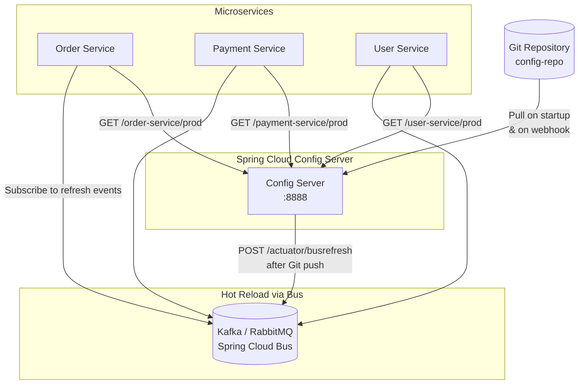

# Externalized Configuration

**Externalized Configuration** separates all environment-specific, changeable, or sensitive settings from the application's packaged binary — storing them outside the code in a centralized configuration service, environment variables, or secret stores — so that the **same binary can run across all environments without modification**.

> **12-Factor App, Principle III:** *"Store config in the environment. A litmus test: can you open source your codebase right now without compromising credentials? If not, your config is in your code."*

---

## 👶 Beginner: Why Config Must Leave the Code

### The Problem: Config Baked Into the JAR

```text
❌ ANTI-PATTERN: Config lives inside the artifact

order-service-v2.1.jar
└── application.properties:
    spring.datasource.url = jdbc:postgresql://prod-db.company.com:5432/orders
    payment.stripe.api.key = sk_live_abc123xyz  ← SECRET IN JAR!
    feature.bulk-discount = false

Problem 1: To change a DB URL → rebuild → retag → redeploy = 30-minute risk window
Problem 2: Secret is in source control, inside the artifact — every developer has it
Problem 3: Separate JARs for dev/staging/prod → they diverge silently
Problem 4: "Who changed the timeout from 5s to 30s and when?" → No audit trail
```

### The Solution: Config Flows In at Runtime

```text
✅ CORRECT: One binary, all environments

order-service-v2.1.jar  (zero env-specific content)
         ↓
   Deployed to DEV  → Config Server serves dev values  → db=dev-db, log=DEBUG
   Deployed to STG  → Config Server serves stg values  → db=stg-db, log=INFO
   Deployed to PROD → Config Server serves prod values → db=prod-db, log=WARN

Artifact is identical. Only the external config differs.
```

---

## 🏗️ The Configuration Hierarchy

In a well-designed system, configuration comes from multiple sources with a clear priority order:

```text
Priority (highest wins):
  1. Command-line arguments (--server.port=9090)
  2. Environment variables (SPRING_DATASOURCE_URL=...)
  3. External Config Server (Spring Cloud Config, Consul)
  4. Mounted Kubernetes ConfigMaps / Secrets
  5. Application-specific external file (/config/application.yml)
  6. JAR-internal application.yml (fallback defaults)
```

This hierarchy means you can always override any config at any level — a critical production fix can be applied via an environment variable override without rebuilding the artifact.

---

## 🏗️ Architecture: Spring Cloud Config Server

### Full Architecture with Git Backend



### Git Config Repository Structure

```
config-repo/
├── application.yml                    ← Shared defaults for ALL services
├── application-prod.yml               ← Shared production overrides
├── order-service.yml                  ← Order service defaults (all envs)
├── order-service-dev.yml              ← Order service + dev environment
├── order-service-staging.yml          ← Order service + staging
├── order-service-prod.yml             ← Order service + production
├── payment-service.yml
└── payment-service-prod.yml
```

```yaml
# config-repo/application.yml — Shared by ALL services
management:
  endpoints:
    web:
      exposure:
        include: health,info,metrics,prometheus
  tracing:
    sampling:
      probability: 0.1   # 10% sampling in all environments

logging:
  level:
    root: INFO
```

```yaml
# config-repo/order-service-prod.yml — Order service, production only
spring:
  datasource:
    url: jdbc:postgresql://prod-primary-db.internal:5432/orders
    hikari:
      maximum-pool-size: 50
      minimum-idle: 10
      connection-timeout: 3000

payment:
  stripe:
    api-key: ${STRIPE_API_KEY}         # Still comes from Vault/env — never in Git!
    timeout-ms: 5000

feature:
  bulk-discount: true                  # Enabled in prod only

logging:
  level:
    com.company.orders: WARN           # Quieter in prod
```

### Config Server Setup

```java
// config-server/src/main/java/com/company/ConfigServerApplication.java
@SpringBootApplication
@EnableConfigServer
public class ConfigServerApplication {
    public static void main(String[] args) {
        SpringApplication.run(ConfigServerApplication.class, args);
    }
}
```

```yaml
# config-server/src/main/resources/application.yml
server:
  port: 8888

spring:
  cloud:
    config:
      server:
        git:
          uri: https://github.com/your-org/config-repo
          default-label: main
          search-paths: "configs/{application}"   # Namespace per service
          clone-on-start: true                    # Fail fast on startup if Git unreachable
          timeout: 5                              # 5 second Git clone timeout
          refresh-rate: 60                        # Pull from Git every 60 seconds

        # High availability: Config Server uses its own local Git clone as fallback
        # if GitHub is temporarily unreachable
        git:
          basedir: /tmp/config-server-cache

# Encrypt sensitive values stored in Git (optional)
encrypt:
  key: ${CONFIG_SERVER_ENCRYPT_KEY}
```

### Client Service Setup

```yaml
# order-service/src/main/resources/application.yml
spring:
  application:
    name: order-service               # Used by Config Server to find the right file

  config:
    import: "configserver:http://config-server:8888"

  cloud:
    config:
      fail-fast: true                 # FAIL on startup if Config Server is unreachable
      retry:
        max-attempts: 6               # Retry 6 times on startup
        initial-interval: 1000        # Starting with 1s backoff
        multiplier: 1.5               # Exponential: 1s, 1.5s, 2.25s...
        max-interval: 2000

  profiles:
    active: ${SPRING_PROFILES_ACTIVE:dev}   # Default to dev, override in prod via env var
```

---

## 🔥 Hot Reload: Changing Config Without Restart

The real power of externalized config: change a feature flag or timeout value in Git, push, and it propagates to all running instances **without restarts**.

### @RefreshScope Beans

```java
// Mark beans that read @Value properties as refreshable
@RefreshScope
@Service
@Slf4j
public class FeatureFlagService {

    // These values are re-read when a refresh event is received
    @Value("${feature.bulk-discount:false}")
    private boolean bulkDiscountEnabled;

    @Value("${feature.new-checkout-flow:false}")
    private boolean newCheckoutEnabled;

    @Value("${payment.timeout-ms:5000}")
    private int paymentTimeoutMs;

    public boolean isBulkDiscountEnabled() {
        return bulkDiscountEnabled;
    }
}
```

### Spring Cloud Bus: Broadcast Refresh to All Instances

```bash
# In your CI/CD pipeline after pushing to config-repo:

# Option 1: Refresh all services listening on the bus (recommended)
curl -X POST http://config-server:8888/actuator/busrefresh

# Option 2: Refresh a specific service only
curl -X POST http://config-server:8888/actuator/busrefresh/order-service

# Spring Cloud Bus uses Kafka or RabbitMQ to broadcast the RefreshRemoteApplicationEvent
# All instances of order-service receive it and refresh their @RefreshScope beans
```

### What Gets Refreshed vs. What Requires Restart

| Config Change | Refresh | Restart |
| :--- | :---: | :---: |
| Feature flags (`@Value`) in `@RefreshScope` beans | ✅ | |
| Timeout values in `@RefreshScope` beans | ✅ | |
| Log levels (`logging.level.*`) | ✅ | |
| Spring Data JPA datasource URL | | ✅ |
| Spring Security configuration | | ✅ |
| Thread pool sizes | | ✅ |
| `@Bean` definitions | | ✅ |

---

## 🔐 Secrets Management: Never Store Secrets in Git

Even with a private Git repo, secrets (API keys, DB passwords, private certs) must not be stored in plain text. Use a dedicated secret store:

### Option A: HashiCorp Vault Integration

```yaml
# application.yml — Vault integration
spring:
  cloud:
    vault:
      host: vault.internal
      port: 8200
      scheme: https
      authentication: KUBERNETES    # Pod identity auth — no long-lived tokens
      kubernetes:
        role: order-service-role
      kv:
        enabled: true
        default-context: order-service
      config:
        lifecycle:
          enabled: true             # Auto-renew lease before expiry
```

```bash
# Vault stores secrets separately from Config Server Git
vault kv put secret/order-service \
  stripe-api-key="sk_live_abc123xyz" \
  db-password="supersecret123" \
  jwt-signing-key="eyJhbGciOiJSUzI1NiJ9..."

# Spring Boot merges Vault secrets with Config Server properties at startup
# Application sees them as regular @Value("${stripe.api-key}") properties
```

### Option B: Kubernetes Secrets + External Secrets Operator

```yaml
# externalsecret.yaml — ESO syncs from AWS Secrets Manager to K8s Secrets
apiVersion: external-secrets.io/v1beta1
kind: ExternalSecret
metadata:
  name: order-service-secrets
spec:
  refreshInterval: 1h
  secretStoreRef:
    name: aws-secrets-manager
    kind: SecretStore
  target:
    name: order-service-secrets
    creationPolicy: Owner
  data:
    - secretKey: STRIPE_API_KEY
      remoteRef:
        key: production/order-service/stripe
        property: api_key
    - secretKey: DB_PASSWORD
      remoteRef:
        key: production/order-service/database
        property: password
```

```yaml
# deployment.yaml — inject into pods as env vars
spec:
  containers:
    - name: order-service
      envFrom:
        - secretRef:
            name: order-service-secrets      # Kubernetes Secret (synced from AWS)
        - configMapRef:
            name: order-service-config       # Non-sensitive config
```

---

## 🌍 Environment-Specific Configuration Matrix

```text
Config Source            | Local Dev | CI Test | Staging  | Production
─────────────────────────┼───────────┼─────────┼──────────┼───────────
application.yml (in JAR) | ✅ Dev defaults
Config Server (Git)      |           | ✅       | ✅        | ✅
Kubernetes ConfigMaps    |           |         | ✅        | ✅
Vault / K8s Secrets      |           |         | ✅        | ✅
Environment Variables    | ✅ .env   |         |          | ✅ (overrides)
```

---

## ⚠️ Pros vs. Cons

| Pros | Cons |
| :--- | :--- |
| **Same artifact runs everywhere** — one JAR for dev/staging/prod | **Config Server is a critical dependency** — if it's down during rolling restart, services can't start |
| **Security** — secrets are never in source code or Docker images | **Bootstrap ordering** — services need Config Server healthy before they start |
| **Auditability** — Git history = complete audit log of every config change | **Config drift** — if teams edit K8s ConfigMaps directly without updating Git, environments diverge |
| **Hot reload** — change feature flags without deployments | **Complexity** — Config Server + Cloud Bus + Vault + K8s Secrets = large operational surface |
| **Environment parity** — staging config structure mirrors production | **Caching lag** — Config Server caches Git for 60s; pushes don't take effect instantly |

---

## ❗ Common Gotchas & Anti-Patterns

1. **Secrets in ConfigMaps (Not Secrets):**
   - *Anti-Pattern:* `kubectl create configmap order-config --from-literal=DB_PASSWORD=mypassword`
   - *Fix:* ConfigMaps are stored unencrypted in etcd and readable by any pod in the namespace. Always use `Secret` objects or a secret manager (Vault/AWS SM).

2. **Config Server Without High Availability:**
   - *Anti-Pattern:* Running a single Config Server replica. If it restarts during your rolling deployment, 50% of new pods fail to start.
   - *Fix:* Run Config Server with 3 replicas. Enable readiness probes. Ensure services cache the last-known-good config on disk (`spring.cloud.config.failFast=false` with a local cache for existing instances).

3. **Hardcoded Defaults That Shadow External Config:**
   - *Anti-Pattern:* `@Value("${payment.timeout-ms:30000}")` — if Config Server fails to load, service silently uses a 30-second timeout instead of failing fast.
   - *Fix:* For critical config, use `@Value("${payment.timeout-ms}")` with no default. The service will fail to start if the value is missing — better than silently using wrong values.

4. **Refreshing `@Scheduled` Tasks:**
   - *Anti-Pattern:* Expecting a `@RefreshScope` bean's `@Scheduled` method to pick up a new cron expression after refresh.
   - *Fix:* `@Scheduled` beans are not refreshable in Spring. Re-register the `ScheduledFuture` explicitly in a `@EventListener(RefreshScopeRefreshedEvent.class)` listener.

5. **Environment Variable Naming Collisions:**
   - *Anti-Pattern:* Having both `SPRING_DATASOURCE_URL` in a ConfigMap and `spring.datasource.url` in Config Server. Kubernetes env vars take priority — debugging why Config Server's value is ignored is painful.
   - *Fix:* Document the priority order for your team. Use one authoritative source per environment, not a mix.
