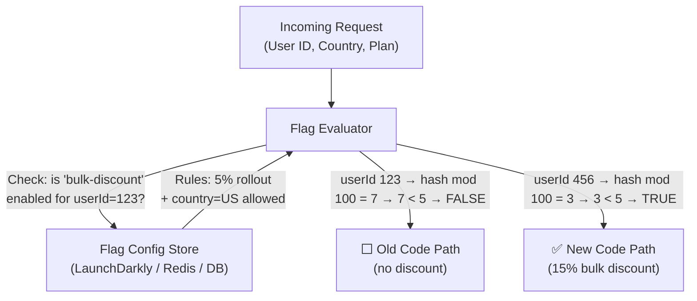
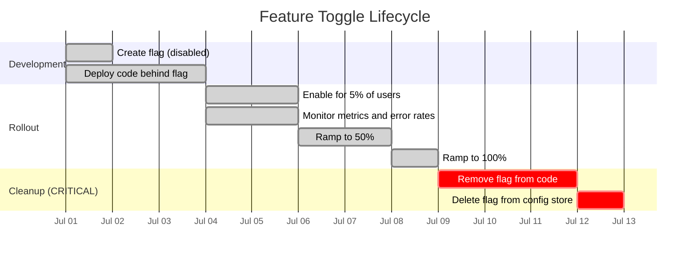

# Feature Toggles (Feature Flags)

A **Feature Toggle** (also called a **Feature Flag**) is a technique that lets you enable or disable a feature in production **without deploying new code** — by changing a configuration value in a running system.

> **The key insight:** Separate **deployment** (shipping code) from **release** (making it available to users). You can deploy code to production every day, hiding new features behind flags, and flip them on when ready — for all users, for 1% of users, or only for beta testers.

---

## 👶 Beginner: The Long-Lived Branch Problem

Without feature toggles, teams use long-lived feature branches:

```text
WITHOUT Feature Toggles:
  master: ─────────────────────────────────────────────────────────► (stable)
              └── checkout-redesign-branch (3 weeks of work)
                  └── starts diverging from master
                      └── massive merge conflict on day 14
                          └── "Integration hell" week
                              └── Big-bang release with maximum risk

WITH Feature Toggles (Trunk-Based Development):
  master: ──┬──────────────┬──────────────┬──────────────► (always deployable)
             │              │              │
             │ commit: Add  │ commit: Add  │ commit: Enable
             │ checkout UI  │ checkout API │ checkout flag
             │ (flag=OFF)   │ (flag=OFF)   │ (flag=ON → 5% users)
             
Every commit merges directly to master. No merge conflicts. Daily deploys.
```

This is the foundation of **trunk-based development** and **continuous delivery**.

---

## 🔑 The 4 Types of Feature Toggles

Understanding the type helps you decide the appropriate lifecycle and who manages the flag:

| Type | Lifetime | Owner | Example |
| :--- | :--- | :--- | :--- |
| **Release Toggle** | Short (days–weeks) | Engineering team | Hide WIP checkout redesign during development |
| **Experiment Toggle** | Short (A/B test duration) | Product + Data team | Test two variants of "Buy Now" button color |
| **Ops Toggle** | Medium (weeks–months) | SRE / Ops team | Kill switch for a fragile payment provider integration |
| **Permission Toggle** | Long (permanent-ish) | Product team | Premium feature gate, admin-only features |

**Critical rule:** Every toggle type has a different appropriate maximum lifetime. Release toggles must be removed within weeks. Permission toggles may live for years.

---

## 🏗️ How Feature Toggles Work



The key to a **stable rollout** is consistent hashing: the same user always gets the same toggle result. `hash(userId + flagName) % 100` ensures user 123 always sees the same variant.

---

## ⚙️ Implementation 1: Database-Backed (Simple)

Good for teams without a dedicated feature flag platform:

### Schema

```sql
CREATE TABLE feature_flags (
    name                VARCHAR(100) PRIMARY KEY,
    enabled             BOOLEAN NOT NULL DEFAULT FALSE,
    rollout_percentage  DECIMAL(5,2) DEFAULT 0,       -- 0.00 to 100.00
    enabled_user_ids    TEXT,                          -- comma-separated for targeted access
    enabled_tenant_ids  TEXT,                          -- multi-tenant targeting
    description         TEXT,
    expires_at          TIMESTAMP,                     -- Scheduled auto-disable date
    created_by          VARCHAR(100),
    updated_at          TIMESTAMP DEFAULT NOW()
);

-- Index for the common case: "is this flag enabled?"
CREATE INDEX idx_feature_flags_name_enabled ON feature_flags(name, enabled);
```

### Service with Caching

```java
@Service
@Slf4j
public class FeatureFlagService {

    private final FeatureFlagRepository flagRepository;
    // Caffeine cache: avoid DB query on every request
    private final Cache<String, FeatureFlag> flagCache;

    public FeatureFlagService(FeatureFlagRepository flagRepository) {
        this.flagRepository = flagRepository;
        this.flagCache = Caffeine.newBuilder()
            .maximumSize(500)
            .expireAfterWrite(30, TimeUnit.SECONDS)  // 30s TTL — flags stale at most 30s
            .recordStats()
            .build();
    }

    public boolean isEnabled(String flagName) {
        return isEnabled(flagName, null, null);
    }

    public boolean isEnabled(String flagName, String userId, String tenantId) {
        FeatureFlag flag = flagCache.get(flagName,
            k -> flagRepository.findById(k).orElse(null));

        if (flag == null || !flag.isEnabled()) return false;

        // Scheduled expiry: ops toggles with a hard end date
        if (flag.getExpiresAt() != null && Instant.now().isAfter(flag.getExpiresAt())) {
            return false;
        }

        // Specific user targeting (beta testers, internal team)
        if (userId != null && flag.getEnabledUserIds() != null) {
            List<String> allowedUsers = Arrays.asList(flag.getEnabledUserIds().split(","));
            if (allowedUsers.contains(userId)) return true;
        }

        // Tenant targeting (enterprise customers, specific organizations)
        if (tenantId != null && flag.getEnabledTenantIds() != null) {
            List<String> allowedTenants = Arrays.asList(flag.getEnabledTenantIds().split(","));
            if (allowedTenants.contains(tenantId)) return true;
        }

        // Percentage rollout — consistent hashing ensures stable assignment
        if (flag.getRolloutPercentage() > 0 && userId != null) {
            // Same user always gets same result for same flag
            int bucket = Math.abs((userId + ":" + flagName).hashCode()) % 100;
            return bucket < flag.getRolloutPercentage();
        }

        // No targeting rules — flag is either fully on or off
        return flag.isEnabled() && flag.getRolloutPercentage() == 100;
    }
}
```

### Usage in Controllers and Services

```java
@RestController
@RequiredArgsConstructor
public class CheckoutController {

    private final FeatureFlagService featureFlags;
    private final OldCheckoutService oldCheckout;
    private final NewCheckoutService newCheckout;

    @PostMapping("/checkout")
    public ResponseEntity<CheckoutResponse> checkout(
            @RequestBody CheckoutRequest request,
            @RequestHeader("X-User-Id") String userId) {

        // Evaluate flag ONCE at the start — don't call multiple times in a request
        boolean useNewFlow = featureFlags.isEnabled("new-checkout-flow", userId, request.getTenantId());

        if (useNewFlow) {
            return ResponseEntity.ok(newCheckout.process(request));
        }
        return ResponseEntity.ok(oldCheckout.process(request));
    }
}
```

---

## ⚙️ Implementation 2: LaunchDarkly (Production Grade)

LaunchDarkly is the industry-standard feature flag service for large-scale production systems:

```xml
<dependency>
    <groupId>com.launchdarkly</groupId>
    <artifactId>launchdarkly-java-server-sdk</artifactId>
    <version>7.4.0</version>
</dependency>
```

```java
@Configuration
public class LaunchDarklyConfig {

    @Value("${launchdarkly.sdk-key}")
    private String sdkKey;

    @Bean
    public LDClient launchDarklyClient() {
        LDConfig config = new LDConfig.Builder()
            .dataStore(Components.persistentDataStore(           // Redis cache for offline mode
                RedisDataStoreBuilder.dataStore(redisUri)
            ).cacheTime(Duration.ofSeconds(30)))
            .events(Components.sendEvents().flushIntervalSeconds(5))
            .offline(false)
            .build();

        LDClient client = new LDClient(sdkKey, config);

        if (!client.isInitialized()) {
            log.warn("LaunchDarkly client did not initialize within timeout — flags will use defaults");
        }
        return client;
    }
}
```

```java
@Service
@RequiredArgsConstructor
@Slf4j
public class PricingService {

    private final LDClient ldClient;
    private final PricingRepository pricingRepo;

    public BigDecimal calculatePrice(String userId, String country, String plan, BigDecimal base) {
        // Build evaluation context — LaunchDarkly uses these for targeting rules
        LDContext context = LDContext.multiBuilder()
            .add(LDContext.builder(userId)
                .kind("user")
                .set("country", country)
                .set("plan", plan)
                .set("email", getUserEmail(userId))
                .build())
            .add(LDContext.builder(getTenantId(userId))
                .kind("organization")
                .set("plan", getOrgPlan(userId))
                .build())
            .build();

        // Evaluate flags — getVariation returns default if SDK fails
        boolean bulkDiscountEnabled = ldClient.boolVariation("bulk-discount-v2", context, false);
        String pricingAlgorithm    = ldClient.stringVariation("pricing-algorithm", context, "standard");
        int maxDiscountPercent     = ldClient.intVariation("max-discount-pct", context, 0);

        // Log evaluation result for analytics (LaunchDarkly records this automatically)
        log.debug("Flag evaluation: bulkDiscount={}, algorithm={}, userId={}",
            bulkDiscountEnabled, pricingAlgorithm, userId);

        return applyPricing(base, bulkDiscountEnabled, pricingAlgorithm, maxDiscountPercent);
    }
}
```

### A/B Testing with Metrics Tracking

```java
// Track conversion events back to LaunchDarkly for experiment analysis
@Service
public class CheckoutTracker {

    private final LDClient ldClient;

    public void trackCheckoutCompletion(String userId, String experimentFlagKey,
                                         BigDecimal orderValue) {
        LDContext context = LDContext.create(userId);

        // Evaluate which variant user was in
        String variant = ldClient.stringVariation(experimentFlagKey, context, "control");

        // Send custom metric to LaunchDarkly
        ldClient.trackData(context, "checkout_completed", LDValue.of(orderValue.doubleValue()));

        // LaunchDarkly dashboard shows: variant A conversion 3.2% vs variant B 4.1% → 28% lift
        log.info("A/B checkout tracked: variant={}, userId={}, orderValue={}", variant, userId, orderValue);
    }
}
```

---

## 📊 Toggle Lifecycle & Scheduled Cleanup

The hardest discipline in feature flags is **removing them after their purpose is served**.



**Toggle debt** accumulates when flags are never removed:

```text
Year 1:  10 flags → manageable
Year 2:  47 flags → "which ones are still active?"
Year 3: 120 flags → "is it safe to remove bulk-discount-v1?"
Year 4: 300 flags → 2^300 theoretical code paths. No one dares touch the code.
```

### Enforce Cleanup in CI

```java
// FeatureFlagValidator.java — runs in CI to prevent flag debt accumulation
@Component
public class FeatureFlagValidator {

    @EventListener(ApplicationReadyEvent.class)
    public void validateFlagHealth() {
        List<FeatureFlag> flags = flagRepository.findAll();

        flags.forEach(flag -> {
            // Warn about flags with no expiry date — every flag should have one
            if (flag.getExpiresAt() == null && flag.getType() == FlagType.RELEASE) {
                log.warn("FLAG_HYGIENE: Release flag '{}' has no expiry date set", flag.getName());
            }

            // Alert on flags that have expired — should have been removed from code by now
            if (flag.getExpiresAt() != null && Instant.now().isAfter(flag.getExpiresAt())) {
                log.error("FLAG_DEBT: Expired flag '{}' still exists — remove it from code ASAP",
                    flag.getName());
            }

            // Alert on flags enabled for 100% that haven't been cleaned up in > 30 days
            if (flag.getRolloutPercentage() == 100
                    && flag.getUpdatedAt().isBefore(Instant.now().minus(30, ChronoUnit.DAYS))) {
                log.warn("FLAG_CLEANUP: Flag '{}' at 100% rollout for > 30 days — remove the branch",
                    flag.getName());
            }
        });
    }
}
```

---

## 🧪 Testing with Feature Flags

Feature flags create testing complexity — you need to test both the enabled and disabled code paths.

### Unit Testing: Override Flags Directly

```java
// OrderServiceTest.java
@ExtendWith(MockitoExtension.class)
class CheckoutServiceTest {

    @Mock
    private FeatureFlagService featureFlags;

    @InjectMocks
    private CheckoutService checkoutService;

    @Test
    void givenNewCheckoutEnabled_whenCheckout_thenUsesNewFlow() {
        when(featureFlags.isEnabled("new-checkout-flow", "user-123", "tenant-1"))
            .thenReturn(true);

        CheckoutResult result = checkoutService.checkout(testRequest("user-123"));

        assertThat(result.getFlow()).isEqualTo("new");
    }

    @Test
    void givenNewCheckoutDisabled_whenCheckout_thenUsesOldFlow() {
        when(featureFlags.isEnabled("new-checkout-flow", "user-123", "tenant-1"))
            .thenReturn(false);

        CheckoutResult result = checkoutService.checkout(testRequest("user-123"));

        assertThat(result.getFlow()).isEqualTo("legacy");
    }
}
```

### Integration Testing: Test Both Flag States

```java
// CheckoutIntegrationTest.java
@SpringBootTest
class CheckoutIntegrationTest {

    @Autowired
    private FeatureFlagRepository flagRepository;

    @BeforeEach
    void setup() {
        // Ensure clean flag state for each test
        flagRepository.save(FeatureFlag.builder()
            .name("new-checkout-flow")
            .enabled(false)
            .build());
    }

    @Test
    void whenFlagEnabled_thenNewCheckoutUsed() throws Exception {
        flagRepository.save(FeatureFlag.builder()
            .name("new-checkout-flow")
            .enabled(true)
            .rolloutPercentage(100)
            .build());

        // ... test the enabled behavior
    }

    @Test
    void whenFlagDisabled_thenLegacyCheckoutUsed() throws Exception {
        // Flag is disabled by default (set in @BeforeEach)
        // ... test the disabled behavior
    }
}
```

---

## ⚠️ Pros vs. Cons

| Pros | Cons |
| :--- | :--- |
| **Trunk-based development** — merge to main daily, no long-lived branches | **Toggle debt** — teams that add flags but never remove them accumulate dead code |
| **Controlled rollouts** — enable for 1% → watch metrics → ramp safely | **Testing complexity** — N flags = 2^N theoretical code paths to test |
| **Instant kill switch** — disable a broken feature in seconds, no deploy needed | **If/else code smell** — toggle branches make code harder to read |
| **A/B testing infrastructure** — experiment without code changes | **Flag evaluation performance** — evaluating flags on every request requires caching |
| **Dark launching** — test backend behavior in production with real traffic before UI release | **Distributed flag state** — flag evaluated differently in different instances if cache is stale |

---

## ❗ Common Gotchas & Anti-Patterns

1. **Toggle Debt / Flags That Live Forever:**
   - *Anti-Pattern:* Adding 3 flags per sprint, removing 0. After 2 years: 150+ flags, half disabled, half nobody remembers.
   - *Fix:* Every flag MUST have an `expires_at` date at creation. Run CI checks that fail on expired flags still in code.

2. **Evaluating Flags in Tight Loops:**
   - *Anti-Pattern:* `for (Item item : 10000Items) { if (featureFlags.isEnabled("feature-x")) { ... } }` — 10,000 DB queries.
   - *Fix:* Evaluate once before the loop. `boolean featureXEnabled = featureFlags.isEnabled("feature-x", userId); for (Item i : items) { if (featureXEnabled) { ... } }`

3. **Testing Only the "Flag Enabled" Path:**
   - *Anti-Pattern:* All tests run with flags enabled (or disabled). The other code path is untested.
   - *Fix:* Every feature with a flag needs at least 2 tests: one per flag state.

4. **Using Flags as Configuration (Misclassification):**
   - *Anti-Pattern:* `if (featureFlags.isEnabled("use-postgres-database")) { ... }` — this is infrastructure config, not a feature flag.
   - *Fix:* Database connections, service URLs, timeout values → externalized configuration. User-facing feature behavior → feature flags.

5. **Not Cleaning Up Code After Full Rollout:**
   - *Anti-Pattern:* Flag at 100% for 3 months but `if (featureFlags.isEnabled("new-checkout")) { newFlow() } else { oldFlow() }` still in code.
   - *Fix:* Once at 100% for 1-2 weeks with stable metrics: delete the flag, delete the old code path, delete the flag from the store. The flag is now "baked in."

6. **Inconsistent Flag State Across Instances:**
   - *Anti-Pattern:* Pod A has flag cached as disabled (30s old cache), Pod B has it as enabled (just refreshed). User gets different behavior depending on which pod handles the request.
   - *Fix:* Acceptable for percentage rollouts. Not acceptable for kill switches. Use shorter TTL (5s) for ops toggles, and Spring Cloud Bus refresh for instant propagation.
