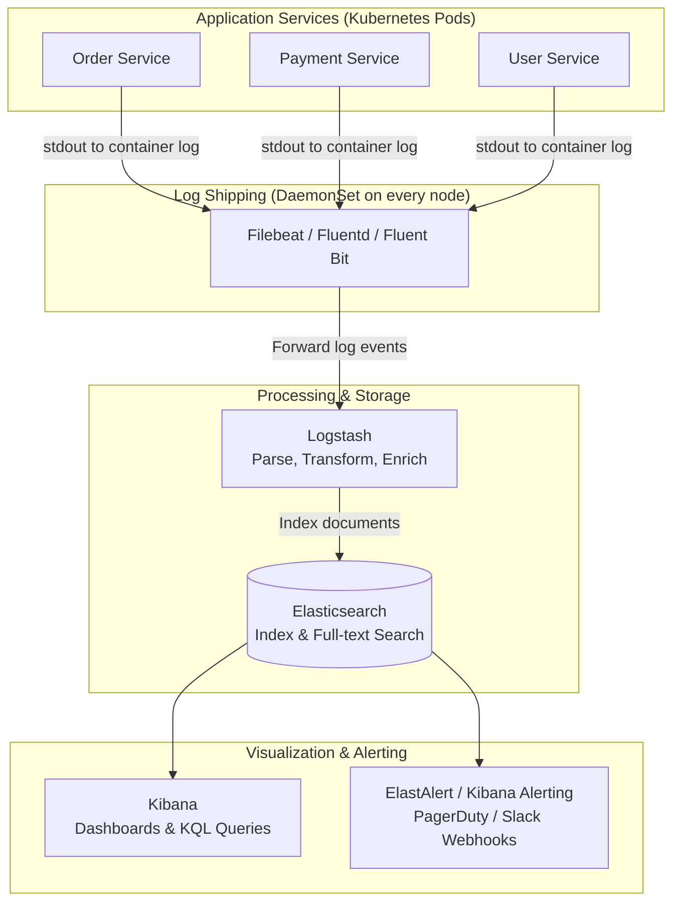
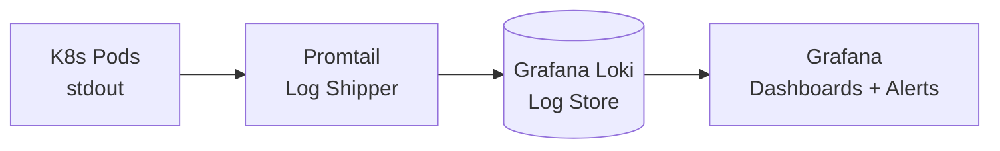
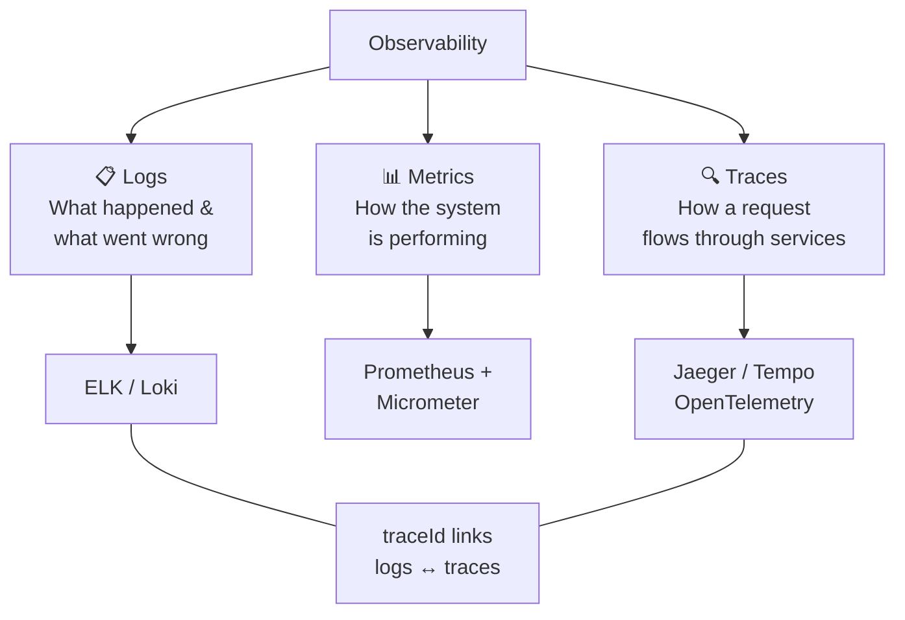

# Log Aggregation

**Log Aggregation** is the practice of collecting, centralizing, indexing, and searching log output from every service in a distributed system in one place — so that engineers can trace a user request across 20 microservices in seconds instead of hours.

> **The core problem it solves:** In a microservices architecture, a single user request touches many services running on ephemeral containers. By the time you discover a bug, the container that handled the request may have been restarted 10 times. **Logs must flow to a central store before the container dies.**

---

## 👶 Beginner: Why You Can't `grep` Logs in Microservices

In a monolith, all logs live on one server. You `ssh` in, `tail -f app.log`, and you see everything. In microservices:

```text
User reports: "My order #12345 failed at 10:15am"

WITHOUT Log Aggregation:
Step 1: Which of 30 Order Service pods handled that request? (pods are named randomly)
Step 2: kubectl exec into it... container was restarted at 10:20am. Logs are gone.
Step 3: Check Payment Service... which of 15 pods? Running on 4 nodes.
Step 4: Was it the Stripe integration? Let me check 8 Payment Service pods...
→ Debugging time: 4 hours. Incident still open.

WITH Log Aggregation (Kibana):
Search: service:"order-service" AND orderId:"12345" AND @timestamp:[10:10 TO 10:20]
→ Full trace of the request across all 30 Order Service pods AND Payment Service.
→ Debugging time: 4 minutes. Incident resolved.
```

---

## 🏗️ Architecture: The ELK/EFK Stack

The two most common architectures:



### Component Responsibilities

| Component | Role | Why not skip it? |
| :--- | :--- | :--- |
| **Fluent Bit** (preferred) | Ultra-lightweight log shipper (< 1MB memory). Runs as a DaemonSet on every K8s node. Tails container stdout/stderr. | Without it, logs stay on the node's disk — lost on restart |
| **Logstash** | Parse raw log strings into structured JSON. Add K8s metadata (pod name, namespace, node). Filter out noise (healthcheck spam). | Raw logs are unqueryable strings without parsing |
| **Elasticsearch** | Distributed inverted-index search engine. Stores JSON log documents. Handles full-text queries. | Without indexing, searching 10TB of logs is impossible |
| **Kibana** | Web UI for querying (KQL), dashboards, anomaly detection. | Required for humans to actually use the data |

---

## 📝 Structured Logging: The Critical Foundation

**Log aggregation is only useful if your logs are machine-parseable.** Plain text strings require expensive regex parsing. JSON logs are indexed instantly.

### ❌ Unstructured Log (Terrible for Search)

```text
2026-07-06 10:23:44.123 ERROR OrderService - Order processing failed for customer 123
on order 456 because payment was declined by stripe
```

You cannot query: "all payment declines for customer 123 in the last hour" — the data is embedded in a string.

### ✅ Structured JSON Log (Perfect for Elasticsearch)

```json
{
  "timestamp": "2026-07-06T10:23:44.123Z",
  "level": "ERROR",
  "service": "order-service",
  "version": "2.1.4",
  "environment": "production",
  "traceId": "d22f03aa9f4b1ec2",
  "spanId": "b9a8cf5c",
  "customerId": "123",
  "orderId": "456",
  "errorCode": "PAYMENT_DECLINED",
  "paymentProvider": "stripe",
  "durationMs": 324,
  "message": "Order processing failed — payment declined by Stripe",
  "thread": "http-nio-8080-exec-5",
  "logger": "com.company.orders.OrderProcessingService"
}
```

Kibana queries you can now run instantly:
- `errorCode: PAYMENT_DECLINED AND paymentProvider: stripe`
- `customerId: 123 AND @timestamp: [now-1h TO now]`
- `durationMs > 1000 AND service: order-service`

---

## ⚙️ Implementation: Spring Boot Structured Logging

### Step 1: Dependencies

```xml
<!-- pom.xml -->
<dependency>
    <groupId>org.springframework.boot</groupId>
    <artifactId>spring-boot-starter-web</artifactId>
</dependency>
<!-- Logstash JSON encoder — formats log output as JSON -->
<dependency>
    <groupId>net.logstash.logback</groupId>
    <artifactId>logstash-logback-encoder</artifactId>
    <version>7.4</version>
</dependency>
```

### Step 2: Logback JSON Configuration

```xml
<!-- src/main/resources/logback-spring.xml -->
<configuration>
    <springProperty name="SERVICE_NAME" source="spring.application.name"/>
    <springProperty name="SERVICE_VERSION" source="spring.application.version" defaultValue="unknown"/>

    <appender name="JSON_CONSOLE" class="ch.qos.logback.core.ConsoleAppender">
        <encoder class="net.logstash.logback.encoder.LogstashEncoder">
            <!-- Custom fields added to every log line -->
            <customFields>{"service":"${SERVICE_NAME}","version":"${SERVICE_VERSION}"}</customFields>

            <!-- Include MDC fields automatically (traceId, userId, etc.) -->
            <includeMdcKeyName>traceId</includeMdcKeyName>
            <includeMdcKeyName>spanId</includeMdcKeyName>
            <includeMdcKeyName>userId</includeMdcKeyName>
            <includeMdcKeyName>requestId</includeMdcKeyName>
            <includeMdcKeyName>customerId</includeMdcKeyName>

            <!-- Include exception stack traces -->
            <throwableConverter class="net.logstash.logback.stacktrace.ShortenedThrowableConverter">
                <maxDepthPerCause>20</maxDepthPerCause>
                <rootCauseFirst>true</rootCauseFirst>
            </throwableConverter>
        </encoder>
    </appender>

    <!-- Development: plain text for human readability -->
    <springProfile name="local,test">
        <root level="DEBUG">
            <appender-ref ref="CONSOLE"/>
        </root>
    </springProfile>

    <!-- Production: JSON only -->
    <springProfile name="prod,staging">
        <root level="INFO">
            <appender-ref ref="JSON_CONSOLE"/>
        </root>
        <!-- Suppress noisy framework logs -->
        <logger name="org.springframework.web.servlet.DispatcherServlet" level="WARN"/>
        <logger name="com.zaxxer.hikari" level="WARN"/>
    </springProfile>
</configuration>
```

### Step 3: MDC Request Context Filter

MDC (Mapped Diagnostic Context) is the mechanism that injects per-request fields (traceId, userId) into every log line automatically:

```java
// infrastructure/logging/MdcRequestContextFilter.java
@Component
@Order(Ordered.HIGHEST_PRECEDENCE)
public class MdcRequestContextFilter extends OncePerRequestFilter {

    private static final String TRACE_ID_HEADER = "X-Trace-Id";
    private static final String USER_ID_HEADER = "X-User-Id";
    private static final String CUSTOMER_ID_HEADER = "X-Customer-Id";

    @Override
    protected void doFilterInternal(HttpServletRequest request,
                                    HttpServletResponse response,
                                    FilterChain chain) throws ServletException, IOException {
        try {
            // Pull trace ID from API Gateway header (already set by Micrometer/OTel)
            String traceId = Optional.ofNullable(request.getHeader(TRACE_ID_HEADER))
                .orElse(UUID.randomUUID().toString().replace("-", ""));

            // Enrich MDC — these fields now appear on EVERY log line in this request thread
            MDC.put("traceId", traceId);
            MDC.put("spanId", generateSpanId());
            MDC.put("userId", request.getHeader(USER_ID_HEADER));
            MDC.put("customerId", request.getHeader(CUSTOMER_ID_HEADER));
            MDC.put("requestMethod", request.getMethod());
            MDC.put("requestPath", request.getRequestURI());

            // Echo trace ID back so clients can reference it in support tickets
            response.setHeader(TRACE_ID_HEADER, traceId);

            chain.doFilter(request, response);
        } finally {
            MDC.clear(); // CRITICAL: always clear to prevent MDC leaks across thread pool requests
        }
    }

    private String generateSpanId() {
        return Long.toHexString(ThreadLocalRandom.current().nextLong());
    }
}
```

### Step 4: Business Event Logging with Custom Fields

Use structured key-value arguments to add queryable fields to log lines:

```java
@Service
@Slf4j
@RequiredArgsConstructor
public class OrderProcessingService {

    private final PaymentClient paymentClient;
    private final OrderRepository orderRepo;

    public OrderResult processOrder(CreateOrderCommand cmd) {
        long startMs = System.currentTimeMillis();

        // Log business event as structured key-value pairs
        log.info("Order processing started",
            kv("orderId", cmd.getOrderId()),
            kv("customerId", cmd.getCustomerId()),
            kv("totalAmount", cmd.getTotalAmount()),
            kv("itemCount", cmd.getItems().size()),
            kv("paymentMethod", cmd.getPaymentMethod())
        );

        try {
            PaymentResult payment = paymentClient.charge(cmd);

            log.info("Order payment successful",
                kv("orderId", cmd.getOrderId()),
                kv("paymentId", payment.getId()),
                kv("amountCharged", payment.getAmountCharged()),
                kv("durationMs", System.currentTimeMillis() - startMs)
            );

            return OrderResult.success(cmd.getOrderId(), payment.getId());

        } catch (PaymentDeclinedException e) {
            // Error logs include all context for immediate Kibana alert
            log.error("Payment declined — order failed",
                kv("orderId", cmd.getOrderId()),
                kv("declineCode", e.getDeclineCode()),
                kv("declineMessage", e.getMessage()),
                kv("durationMs", System.currentTimeMillis() - startMs)
            );
            throw e;
        }
    }
}
```

Output in Elasticsearch (fully indexed, queryable):
```json
{
  "timestamp": "2026-07-06T10:23:44Z",
  "level": "ERROR",
  "message": "Payment declined — order failed",
  "traceId": "d22f03aa9f4b1ec2",
  "userId": "user-789",
  "orderId": "order-456",
  "declineCode": "insufficient_funds",
  "durationMs": 324,
  "service": "order-service"
}
```

---

## 📊 Sampling and Retention Strategy

At scale, storing every log line is prohibitively expensive:

| Log Level | Strategy | Rationale |
| :--- | :--- | :--- |
| **ERROR** | 100% — keep forever (90 days+) | Every error is a potential incident |
| **WARN** | 100% — keep 30 days | Warning trends reveal upcoming failures |
| **INFO** (business events) | 100% — keep 14 days | Order created, payment processed = audit trail |
| **INFO** (framework noise) | Filter out in Logstash | Spring DispatcherServlet logs are useless at scale |
| **DEBUG** | Never in production | Enable per-service dynamically only when debugging |

```ruby
# Logstash filter: drop noisy healthcheck and metrics scrape logs
filter {
  if [message] =~ "GET /actuator/health" {
    drop { }
  }
  if [message] =~ "GET /actuator/prometheus" {
    drop { }
  }
  if [level] == "DEBUG" and [environment] == "production" {
    drop { }
  }
}
```

---

## 🔔 Alerting on Logs

Log aggregation enables **proactive alerting** — don't wait for users to report bugs:

```yaml
# elastalert2 rule: alert when error rate spikes
name: Order Service Error Spike
type: spike
index: app-logs-*
threshold_cur: 10          # alert when error count exceeds 10
threshold_ref: 2           # compared to baseline of 2
timeframe:
  minutes: 5
spike_height: 3            # must be 3x the baseline
filter:
  - term:
      service.keyword: "order-service"
  - term:
      level.keyword: "ERROR"
alert:
  - "slack"
slack:
  slack_webhook_url: "https://hooks.slack.com/services/..."
  slack_channel_override: "#alerts-production"
  slack_msg_subject: "⚠️ Order Service error spike detected"
```

---

## 🔄 Alternative: Loki + Grafana (Cloud-Native)

For Kubernetes-native teams, **Grafana Loki** is a lighter-weight alternative to Elasticsearch:



| Aspect | ELK Stack | Loki + Grafana |
| :--- | :--- | :--- |
| **Cost** | High — Elasticsearch is resource-intensive | Low — Loki only indexes labels, not content |
| **Search power** | Full-text search on any field | Label-based indexing — full-text needs LogQL |
| **Integration** | Standalone | Native with Prometheus, Tempo (traces), Grafana |
| **Query language** | KQL (Kibana Query Language) | LogQL (similar to PromQL) |
| **Best for** | High query complexity, many teams | Kubernetes-native, cost-conscious |

---

## 📐 The Three Pillars of Observability

Log aggregation is one of three pillars that together provide complete production visibility:



The critical link is the **traceId** — the same value in log lines, spans, and metrics labels that lets you jump from a Kibana ERROR log directly to the Jaeger trace for that request.

---

## ⚠️ Pros vs. Cons

| Pros | Cons |
| :--- | :--- |
| **Single pane of glass** — one search across 30 services | **Cost** — Elasticsearch clusters are expensive; 1TB/day is realistic at scale |
| **Correlated debugging** — jump from log → trace → service graph | **Cardinality explosion** — indexing every unique UUID as a field tanks Elasticsearch performance |
| **Proactive alerting** — catch error spikes before users notice | **Indexing lag** — logs appear 10-60 seconds after emission (not instant) |
| **Audit trail** — immutable history for compliance (PCI, GDPR, SOC2) | **Log pipeline is a critical dependency** — if Logstash fails, logs are dropped unless you buffer |

---

## ❗ Common Gotchas & Anti-Patterns

1. **Logging PII / Secrets:**
   - *Anti-Pattern:* `log.info("Processing payment for card: " + cardNumber)` — GDPR violation, PCI DSS violation, automatic breach report.
   - *Fix:* Never log raw card numbers, passwords, SSNs, full email addresses. Mask: `****-****-****-4242`. Use a log sanitization filter.

2. **String Concatenation in Log Args:**
   - *Anti-Pattern:* `log.debug("Processing order " + orderId + " for user " + userId)` — allocates a String even when DEBUG is disabled.
   - *Fix:* `log.debug("Processing order {} for user {}", orderId, userId)` — parameterized logging is lazy-evaluated.

3. **Not Clearing MDC:**
   - *Anti-Pattern:* `MDC.put("userId", userId)` in a servlet filter without a `finally { MDC.clear(); }`.
   - *Fix:* Thread pools reuse threads. Without clearing, request #1's `userId` appears in request #2's logs. Always use try/finally.

4. **Logging Every Database Query at INFO:**
   - *Anti-Pattern:* Hibernate query logging at INFO level in production — generates 100x the useful log volume.
   - *Fix:* Set `org.hibernate.SQL` to `WARN` in production. Enable only when specifically debugging a query.

5. **Flat Retention Policy:**
   - *Anti-Pattern:* Storing all logs (including DEBUG, healthcheck noise) with the same 90-day retention.
   - *Fix:* Tiered retention: ERROR 90 days, WARN 30 days, INFO 14 days, DEBUG 0 days (never in prod).

6. **Not Testing Log Output:**
   - *Anti-Pattern:* Refactoring a class name changes the logger name — your Kibana dashboard alert query breaks silently.
   - *Fix:* Use log capture in tests (`@ExtendWith(OutputCaptureExtension.class)`) to assert that critical business events are logged correctly.
