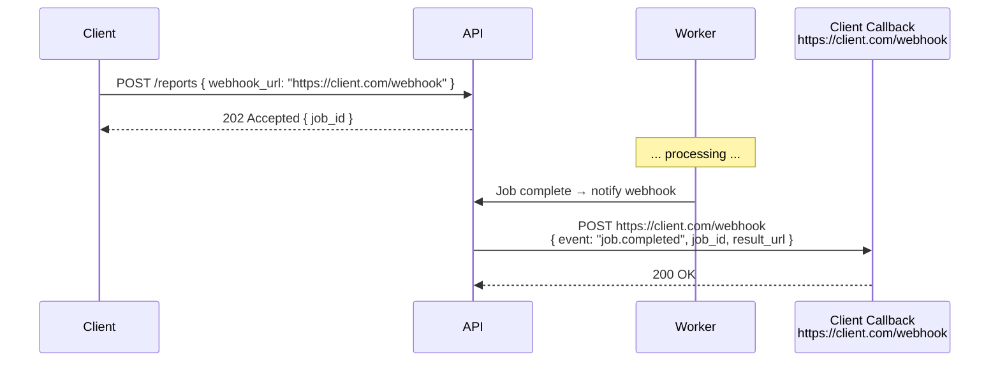

import Tabs from '@theme/Tabs';
import TabItem from '@theme/TabItem';

# Managing Long-Running Tasks

:::info Who this guide is for
- **New learners** — start at [Why Long-Running Tasks Need Special Handling](#why-long-running-tasks-need-special-handling) and [The Core Async Job Pattern](#the-core-async-job-pattern) to understand the fundamental approach.
- **Senior engineers** — jump to [Task State Machine](#task-state-machine), [Worker Reliability & Exactly-Once Processing](#worker-reliability--exactly-once-processing), [Distributed Scheduling](#distributed-scheduling), or [Production Observability](#production-observability).
:::

---

## Why Long-Running Tasks Need Special Handling

HTTP is designed for **short request-response cycles**. A typical Nginx timeout is 60 seconds, an AWS ALB times out at 60 seconds, and a client's browser may abort after 30–60 seconds.

Operations that take more than 2–5 seconds — video transcoding, PDF generation, bulk data exports, ML inference, email campaigns — **cannot safely run inside an HTTP request handler** because:

1. **Thread exhaustion** — each blocked HTTP thread cannot serve other requests, causing your server to saturate under concurrent long operations.
2. **Client-side timeouts** — the client will give up and retry, potentially triggering duplicate processing.
3. **Load balancer timeouts** — the connection is terminated by infrastructure even if the server hasn't finished.
4. **No progress visibility** — the client sees nothing until the operation completes or fails.
5. **No retry safety** — if the server crashes mid-operation, there's no record of what state things are in.

:::note The rule of thumb
Any operation expected to take more than **2 seconds** should be made asynchronous.
:::

---

## The Core Async Job Pattern

The solution is a three-step pattern:

```
Step 1: Client submits job
Client → POST /api/reports → 202 Accepted { "job_id": "abc-123", "status_url": "/api/reports/abc-123" }

Step 2: Job runs asynchronously
API Server → Job Queue → Worker Pool → Result Store

Step 3: Client polls for result
Client → GET /api/reports/abc-123 → { "status": "RUNNING", "progress": 45 }
Client → GET /api/reports/abc-123 → { "status": "COMPLETED", "result_url": "/api/reports/abc-123/result" }
Client → GET /api/reports/abc-123/result → <report data>
```

### HTTP Status Codes

| Status | When to Use |
|:---|:---|
| `202 Accepted` | Job submitted successfully, processing not yet complete |
| `200 OK` | Job status or completed result returned in body |
| `303 See Other` | Redirect to the result resource (on completion) |
| `404 Not Found` | Job ID does not exist |
| `410 Gone` | Job result has expired and been cleaned up |

---

## REST API Design for Async Jobs

```java
@RestController
@RequestMapping("/api/reports")
@RequiredArgsConstructor
@Slf4j
public class ReportController {

    private final JobService jobService;

    // Step 1: Submit job — returns immediately with 202
    @PostMapping
    public ResponseEntity<JobResponse> submitReport(@RequestBody @Valid ReportRequest req,
                                                     Authentication auth) {
        String jobId = jobService.submit(req, auth.getName());
        String statusUrl = "/api/reports/" + jobId;

        log.info("Report job {} submitted for user {}", jobId, auth.getName());

        return ResponseEntity
            .accepted()
            .header("Location", statusUrl)        // RFC-compliant: Location points to status
            .header("Retry-After", "5")           // Hint to client: poll after 5s
            .body(new JobResponse(jobId, JobStatus.PENDING, statusUrl));
    }

    // Step 2: Poll status
    @GetMapping("/{jobId}")
    public ResponseEntity<JobStatusResponse> getStatus(@PathVariable String jobId,
                                                        Authentication auth) {
        Job job = jobService.findByIdAndUser(jobId, auth.getName())
            .orElseThrow(() -> new JobNotFoundException(jobId));

        return switch (job.getStatus()) {
            case PENDING, QUEUED -> ResponseEntity.ok()
                .header("Retry-After", "3")  // poll again in 3s
                .body(JobStatusResponse.pending(job));

            case RUNNING -> ResponseEntity.ok()
                .header("Retry-After", "1")  // job is active — poll more frequently
                .body(JobStatusResponse.running(job));

            case COMPLETED -> ResponseEntity.status(HttpStatus.SEE_OTHER)
                .header("Location", "/api/reports/" + jobId + "/result")
                .body(JobStatusResponse.completed(job));

            case FAILED -> ResponseEntity.ok()
                .body(JobStatusResponse.failed(job));

            case DEAD -> ResponseEntity.ok()
                .body(JobStatusResponse.dead(job, "Job exceeded retry limit"));
        };
    }

    // Step 3: Fetch result
    @GetMapping("/{jobId}/result")
    public ResponseEntity<ReportResult> getResult(@PathVariable String jobId,
                                                   Authentication auth) {
        Job job = jobService.findByIdAndUser(jobId, auth.getName())
            .orElseThrow(() -> new JobNotFoundException(jobId));

        if (job.getStatus() != JobStatus.COMPLETED) {
            return ResponseEntity.status(HttpStatus.CONFLICT)
                .build(); // 409 — job not yet complete
        }

        ReportResult result = jobService.getResult(jobId);
        return ResponseEntity.ok()
            .header("Cache-Control", "no-store") // results may be sensitive
            .body(result);
    }
}
```

---

## Job Queue Architecture

```
                   ┌──────────────────────────────────────────────────────┐
                   │                 JOB QUEUE ARCHITECTURE               │
                   └──────────────────────────────────────────────────────┘

  Client Request
       │
       ▼
  API Server ──────► Job Metadata DB ◄──────────── Admin Dashboard
  (202 + job_id)     (PostgreSQL)                  (progress, status)
       │
       ▼
  Message Queue ──────────────────────────────────────────────┐
  (Kafka / SQS / RabbitMQ / Redis Streams)                    │
       │                                                       │
       ▼                                                       │
  Worker Pool ────► Progress Store (Redis)                     │
  (auto-scalable)         │                                    │
       │                  └──────► SSE / WebSocket ───────────┤
       ▼                           (real-time client)         │
  Result Store                                                 │
  (DB / S3 / GCS)                                             │
       │                                                       │
       ▼                                                       │
  Notification ◄──────────────────────────────────────────────┘
  (Webhook / Email / Push)
```

---

## Task State Machine

A robust job system models the job lifecycle as a **state machine** to prevent invalid state transitions and enable clear recovery logic.

```
PENDING → QUEUED → RUNNING → COMPLETED ✅
                      │
                      └──► FAILED ──► (retry counter < max) ──► QUEUED
                                 └──► (retry counter >= max) ──► DEAD ☠️
```

```java
public enum JobStatus {
    PENDING,    // Created but not yet in queue
    QUEUED,     // In the message queue, awaiting a worker
    RUNNING,    // Worker is actively processing
    COMPLETED,  // Finished successfully
    FAILED,     // Failed this attempt, eligible for retry
    DEAD;       // Exceeded max retries — manual intervention needed

    public boolean isTerminal() {
        return this == COMPLETED || this == DEAD;
    }

    public boolean isRetryable() {
        return this == FAILED;
    }
}
```

```java
@Entity
@Table(name = "jobs")
@Data
@Builder
public class Job {
    @Id private String id;

    @Enumerated(EnumType.STRING)
    private JobStatus status;

    private String type;           // e.g., "REPORT_GENERATION"
    private String userId;
    private String payload;        // serialized job parameters (JSONB)
    private String resultKey;      // S3 key or DB reference for result

    private int progress;          // 0–100
    private String progressMessage;
    private String errorMessage;

    private int retryCount;
    private int maxRetries;        // configurable per job type

    private Instant createdAt;
    private Instant startedAt;
    private Instant completedAt;
    private Instant expiresAt;     // result TTL — clean up after X days

    public void transition(JobStatus newStatus) {
        // Prevent illegal transitions
        if (this.status.isTerminal()) {
            throw new IllegalStateException(
                "Cannot transition from terminal status " + this.status);
        }
        this.status = newStatus;
    }

    public boolean canRetry() {
        return this.retryCount < this.maxRetries;
    }
}
```

---

## Worker Implementation (Spring Boot + Kafka)

### Basic Worker

```java
@Component
@RequiredArgsConstructor
@Slf4j
public class ReportWorker {

    private final JobRepository jobRepository;
    private final ReportGenerator reportGenerator;
    private final S3Service s3Service;
    private final ProgressTracker progressTracker;
    private final NotificationService notificationService;

    @KafkaListener(topics = "report-jobs", groupId = "report-workers", concurrency = "5")
    public void processJob(ReportJobMessage message, Acknowledgment ack) {
        String jobId = message.getJobId();
        log.info("Worker picked up job {}", jobId);

        Job job = jobRepository.findById(jobId).orElse(null);
        if (job == null) {
            log.warn("Job {} not found — may have been deleted. Skipping.", jobId);
            ack.acknowledge(); // don't retry — message is stale
            return;
        }

        // Check for idempotency: don't re-process a completed job
        if (job.getStatus() == JobStatus.COMPLETED) {
            log.warn("Job {} already completed — duplicate message, skipping.", jobId);
            ack.acknowledge();
            return;
        }

        // Mark as RUNNING
        job.transition(JobStatus.RUNNING);
        job.setStartedAt(Instant.now());
        jobRepository.save(job);

        try {
            // Execute the job with progress updates
            ReportResult result = reportGenerator.generate(
                message.getReportParams(),
                (percent, msg) -> progressTracker.update(jobId, percent, msg)
            );

            // Store result
            String resultKey = s3Service.store(jobId, result);

            // Mark COMPLETED
            job.transition(JobStatus.COMPLETED);
            job.setResultKey(resultKey);
            job.setCompletedAt(Instant.now());
            job.setProgress(100);
            jobRepository.save(job);

            // Notify user
            notificationService.notifyComplete(job.getUserId(), jobId);
            log.info("Job {} completed successfully in {}ms", jobId,
                Duration.between(job.getStartedAt(), job.getCompletedAt()).toMillis());

            ack.acknowledge(); // commit Kafka offset after successful processing

        } catch (Exception e) {
            handleFailure(job, e);
            ack.acknowledge(); // always ack — retry is handled via re-queueing
        }
    }

    private void handleFailure(Job job, Exception e) {
        log.error("Job {} failed (attempt {}/{}): {}", 
            job.getId(), job.getRetryCount() + 1, job.getMaxRetries(), e.getMessage(), e);

        job.setRetryCount(job.getRetryCount() + 1);
        job.setErrorMessage(e.getMessage());

        if (job.canRetry()) {
            job.transition(JobStatus.FAILED);
            jobRepository.save(job);
            // Re-queue for retry (with delay via separate scheduler or DLQ re-drive)
        } else {
            job.transition(JobStatus.DEAD);
            jobRepository.save(job);
            notificationService.notifyFailed(job.getUserId(), job.getId(), e.getMessage());
        }
    }
}
```

---

## Worker Reliability & Exactly-Once Processing

### The "Double-Processing" Problem

When a worker processes a job and then crashes **before acknowledging the Kafka message**, the message becomes visible again (after the visibility timeout) and another worker picks it up. The job runs twice.

To handle this safely:

```java
@KafkaListener(topics = "report-jobs")
@Transactional // DB operations are atomic
public void processJob(ReportJobMessage message, Acknowledgment ack) {
    // Use optimistic locking or CAS to claim the job atomically
    int updated = jobRepository.claimJob(message.getJobId(), JobStatus.QUEUED, JobStatus.RUNNING);

    if (updated == 0) {
        // Another worker already claimed this job — skip
        log.info("Job {} already claimed by another worker", message.getJobId());
        ack.acknowledge();
        return;
    }

    // ... process the job
}
```

```java
public interface JobRepository extends JpaRepository<Job, String> {
    // Atomic compare-and-set: only transitions to RUNNING if currently QUEUED
    @Modifying
    @Query("UPDATE Job j SET j.status = :newStatus, j.startedAt = :now " +
           "WHERE j.id = :jobId AND j.status = :currentStatus")
    int claimJob(@Param("jobId") String jobId,
                 @Param("currentStatus") JobStatus currentStatus,
                 @Param("newStatus") JobStatus newStatus,
                 @Param("now") Instant now);
}
```

### Checkpoint Pattern for Resumable Jobs

For very long jobs (multi-hour data exports), use checkpoints to avoid restarting from zero on failure:

```java
@Service
public class ResumableExportJob {

    public void export(String jobId, ExportParams params) {
        Job job = jobRepository.findById(jobId).orElseThrow();

        // Load last checkpoint (if resuming after crash)
        int startPage = job.getCheckpoint() != null
            ? Integer.parseInt(job.getCheckpoint())
            : 0;

        int totalPages = dataRepository.countPages(params);

        for (int page = startPage; page < totalPages; page++) {
            List<Record> batch = dataRepository.fetchPage(page, params);
            exportService.writeBatch(jobId, batch);

            // Save checkpoint after each page
            jobRepository.saveCheckpoint(jobId, String.valueOf(page + 1));
            jobRepository.updateProgress(jobId, (page + 1) * 100 / totalPages);

            // Allow graceful shutdown check
            if (Thread.currentThread().isInterrupted()) {
                throw new JobInterruptedException("Export interrupted at page " + page);
            }
        }
    }
}
```

---

## Progress Tracking

### Store Progress in Redis

```java
@Service
@RequiredArgsConstructor
public class ProgressTracker {

    private final RedisTemplate<String, String> redis;

    public void update(String jobId, int percent, String message) {
        String key = "job:progress:" + jobId;
        Map<String, String> progress = Map.of(
            "percent",   String.valueOf(percent),
            "message",   message,
            "updatedAt", Instant.now().toString()
        );
        redis.opsForHash().putAll(key, progress);
        redis.expire(key, Duration.ofHours(24)); // TTL matches job result retention
    }

    public JobProgress get(String jobId) {
        Map<Object, Object> data = redis.opsForHash().entries("job:progress:" + jobId);
        if (data.isEmpty()) return JobProgress.unknown();
        return JobProgress.fromMap(data);
    }
}
```

### Real-Time Progress via Server-Sent Events (SSE)

SSE is a lightweight protocol — a persistent HTTP connection where the server pushes events. Ideal for progress bars.

```java
@GetMapping(value = "/api/jobs/{jobId}/progress", produces = MediaType.TEXT_EVENT_STREAM_VALUE)
public SseEmitter streamProgress(@PathVariable String jobId, Authentication auth) {
    // 5-minute max duration — client must reconnect for very long jobs
    SseEmitter emitter = new SseEmitter(300_000L);

    ScheduledFuture<?> task = scheduler.scheduleAtFixedRate(() -> {
        try {
            JobProgress progress = progressTracker.get(jobId);

            emitter.send(SseEmitter.event()
                .name("progress")
                .data(progress)
                .id(String.valueOf(System.currentTimeMillis())));

            if (progress.isTerminal()) {
                emitter.complete();
            }
        } catch (IOException e) {
            emitter.completeWithError(e); // client disconnected
        }
    }, 0, 1, TimeUnit.SECONDS);

    // Clean up the scheduled task when SSE connection closes
    emitter.onCompletion(() -> task.cancel(true));
    emitter.onTimeout(() -> task.cancel(true));
    emitter.onError(ex -> task.cancel(true));

    return emitter;
}
```

### Real-Time Progress via WebSocket

For bidirectional communication (user can pause/cancel the job):

```java
@Controller
@RequiredArgsConstructor
public class JobWebSocketController {

    private final SimpMessagingTemplate messagingTemplate;

    // Worker calls this to push updates to subscribed clients
    public void pushProgress(String jobId, JobProgress progress) {
        messagingTemplate.convertAndSend(
            "/topic/jobs/" + jobId,  // client subscribes to this
            progress
        );
    }

    // Client can send a cancel command
    @MessageMapping("/jobs/{jobId}/cancel")
    public void cancelJob(@DestinationVariable String jobId, Principal user) {
        jobService.cancel(jobId, user.getName());
    }
}
```

---

## Webhooks (Push Callbacks)

Instead of the client polling, the server **pushes** a notification to a registered callback URL when the job completes.



### Reliable Webhook Delivery

```java
@Service
@RequiredArgsConstructor
@Slf4j
public class WebhookDeliveryService {

    private final WebhookRepository webhookRepository;
    private final RestTemplate restTemplate;

    @Async("webhookExecutor")
    public void deliver(String webhookId, String callbackUrl, WebhookPayload payload) {
        int maxRetries = 5;
        long[] backoffMs = {1_000, 5_000, 30_000, 300_000, 1_800_000}; // 1s, 5s, 30s, 5m, 30m

        for (int attempt = 0; attempt < maxRetries; attempt++) {
            try {
                String signature = signPayload(payload); // HMAC-SHA256

                ResponseEntity<Void> response = restTemplate.exchange(
                    RequestEntity.post(URI.create(callbackUrl))
                        .header("X-Webhook-Id", webhookId)
                        .header("X-Webhook-Signature", signature)
                        .header("X-Webhook-Timestamp", String.valueOf(Instant.now().getEpochSecond()))
                        .contentType(MediaType.APPLICATION_JSON)
                        .body(payload),
                    Void.class
                );

                if (response.getStatusCode().is2xxSuccessful()) {
                    webhookRepository.markDelivered(webhookId, attempt + 1);
                    log.info("Webhook {} delivered on attempt {}", webhookId, attempt + 1);
                    return;
                }

                log.warn("Webhook {} got non-2xx response: {} (attempt {})",
                    webhookId, response.getStatusCode(), attempt + 1);

            } catch (Exception e) {
                log.warn("Webhook {} delivery attempt {} failed: {}", webhookId, attempt + 1, e.getMessage());
            }

            if (attempt < maxRetries - 1) {
                sleep(backoffMs[attempt]);
            }
        }

        webhookRepository.markFailed(webhookId, "Exhausted " + maxRetries + " delivery attempts");
        log.error("Webhook {} permanently failed after {} attempts", webhookId, maxRetries);
    }

    private String signPayload(WebhookPayload payload) {
        // HMAC-SHA256 of payload JSON with the tenant's webhook secret
        byte[] secret = webhookSecretService.getSecret(payload.getTenantId());
        return HmacUtils.hmacSha256Hex(secret, payload.toJson());
    }
}
```

### Webhook Security

```java
// Consumer side: verify the webhook signature before processing
@PostMapping("/webhook")
public ResponseEntity<Void> handleWebhook(
        @RequestBody String rawBody,
        @RequestHeader("X-Webhook-Signature") String signature,
        @RequestHeader("X-Webhook-Timestamp") long timestamp) {

    // 1. Reject stale webhooks (replay attack prevention)
    if (Math.abs(Instant.now().getEpochSecond() - timestamp) > 300) {
        return ResponseEntity.status(HttpStatus.UNAUTHORIZED).build();
    }

    // 2. Verify HMAC signature
    String expectedSig = HmacUtils.hmacSha256Hex(webhookSecret, rawBody);
    if (!MessageDigest.isEqual(expectedSig.getBytes(), signature.getBytes())) {
        return ResponseEntity.status(HttpStatus.UNAUTHORIZED).build();
    }

    // 3. Process idempotently using X-Webhook-Id header
    // ...

    return ResponseEntity.ok().build();
}
```

---

## Job Scheduling

### Single-Node Scheduler (Spring `@Scheduled`)

```java
@Scheduled(cron = "0 0 2 * * ?")  // 2am daily — UTC
public void generateDailyReport() {
    jobService.submit(new DailyReportJobParams());
}
```

:::warning Single-node only
`@Scheduled` runs on **every instance** in a multi-node deployment. If you have 3 replicas, the job runs 3 times simultaneously.
:::

### Distributed Scheduling (ShedLock)

ShedLock uses a database (or Redis) lock to ensure **only one node** executes a scheduled job at a time:

```java
@Scheduled(fixedDelay = 60_000)
@SchedulerLock(
    name = "generateDailyReport",
    lockAtMostFor  = "PT10M",  // release lock after 10m even if node crashes
    lockAtLeastFor = "PT5M"    // hold lock for at least 5m to prevent quick re-execution
)
public void generateDailyReport() {
    // Only one node executes this at a time across the entire cluster
    jobService.submit(new DailyReportJobParams());
}
```

```sql
-- ShedLock requires this table
CREATE TABLE shedlock (
    name        VARCHAR(64)  NOT NULL,
    lock_until  TIMESTAMP(3) NOT NULL,
    locked_at   TIMESTAMP(3) NOT NULL,
    locked_by   VARCHAR(255) NOT NULL,
    PRIMARY KEY (name)
);
```

### Enterprise Scheduler (Quartz Clustered)

Quartz persists job schedules and execution history in a database, enabling **full clustering with failover**:

```java
@Configuration
public class QuartzConfig {

    @Bean
    public SchedulerFactoryBean schedulerFactory(DataSource dataSource) {
        SchedulerFactoryBean factory = new SchedulerFactoryBean();
        factory.setDataSource(dataSource);

        Properties props = new Properties();
        props.setProperty("org.quartz.scheduler.instanceId", "AUTO"); // unique per node
        props.setProperty("org.quartz.jobStore.class",
            "org.quartz.impl.jdbcjobstore.JobStoreTX");
        props.setProperty("org.quartz.jobStore.isClustered", "true");
        props.setProperty("org.quartz.jobStore.clusterCheckinInterval", "20000");
        factory.setQuartzProperties(props);
        return factory;
    }

    @Bean
    public JobDetail reportJobDetail() {
        return JobBuilder.newJob(DailyReportJob.class)
            .withIdentity("dailyReport", "reporting")
            .storeDurably()
            .build();
    }

    @Bean
    public Trigger reportTrigger(JobDetail reportJobDetail) {
        return TriggerBuilder.newTrigger()
            .forJob(reportJobDetail)
            .withSchedule(CronScheduleBuilder.cronSchedule("0 0 2 * * ?")
                .withMisfireHandlingInstructionDoNothing()) // skip misfired runs
            .build();
    }
}
```

---

## Distributed Scheduling

### Comparison of Scheduling Approaches

| Approach | Multi-Node Safe | Persistence | Failover | Complexity | Best For |
|:---|:---|:---|:---|:---|:---|
| `@Scheduled` | ❌ No | No | No | Trivial | Single-node dev/test |
| ShedLock | ✅ Yes | Lock only | Automatic (lock TTL) | Low | Most production use cases |
| Quartz Clustered | ✅ Yes | Full history | Automatic | Medium | Complex scheduling, audit trail |
| Temporal.io | ✅ Yes | Full workflow | Automatic | High | Long-running durable workflows |
| AWS EventBridge | ✅ Yes | Managed | Managed | Low | AWS-native serverless jobs |

---

## Production Observability

### Job Metrics

```java
@Component
@RequiredArgsConstructor
public class JobMetrics {

    private final MeterRegistry registry;

    public void recordSubmitted(String jobType) {
        registry.counter("jobs.submitted", "type", jobType).increment();
    }

    public void recordCompleted(String jobType, Duration duration) {
        registry.timer("jobs.duration", "type", jobType, "result", "success")
                .record(duration);
        registry.counter("jobs.completed", "type", jobType).increment();
    }

    public void recordFailed(String jobType, int retryCount) {
        registry.counter("jobs.failed", "type", jobType,
                         "retry_count", String.valueOf(retryCount)).increment();
    }

    public void recordDead(String jobType) {
        registry.counter("jobs.dead", "type", jobType).increment();
    }

    public void recordQueueDepth(String jobType, long depth) {
        registry.gauge("jobs.queue_depth", Tags.of("type", jobType), depth);
    }

    public void recordWorkerUtilization(int active, int total) {
        registry.gauge("jobs.worker.active", active);
        registry.gauge("jobs.worker.total", total);
        registry.gauge("jobs.worker.utilization_pct",
            total > 0 ? (double) active / total * 100 : 0);
    }
}
```

**Key alerts:**

| Metric | Alert Threshold | Meaning |
|:---|:---|:---|
| `jobs.queue_depth` | > 10,000 | Workers can't keep up — scale out or investigate |
| `jobs.dead` rate | Any occurrence | Permanent failures — check DLQ and error logs |
| `jobs.duration` p99 | > expected timeout | Downstream slowness or deadlock in job |
| `jobs.worker.utilization_pct` | > 90% consistently | Auto-scale workers |
| Stale `RUNNING` jobs | > 2× expected job duration | Worker crashed without updating status |

### Finding Stale/Stuck Jobs

```java
@Scheduled(fixedDelay = 60_000) // every minute
public void detectStuckJobs() {
    // Jobs that have been RUNNING for more than 2× their expected duration
    Instant staleThreshold = Instant.now().minus(Duration.ofMinutes(30));
    List<Job> stuckJobs = jobRepository.findStuckJobs(staleThreshold);

    for (Job job : stuckJobs) {
        log.warn("Detected stuck job {} (status=RUNNING since {})", job.getId(), job.getStartedAt());
        alerting.alert(Alert.warn(
            "Stuck job detected",
            Map.of("jobId", job.getId(), "type", job.getType(), "startedAt", job.getStartedAt())
        ));

        // Optionally: mark as FAILED and re-queue for retry
        if (job.canRetry()) {
            job.transition(JobStatus.FAILED);
            jobRepository.save(job);
            jobQueue.requeue(job);
        }
    }
}
```

---

## Senior Interview Questions

### Q: A worker processes a report job and writes the result to S3, but crashes before updating the job status in the database to COMPLETED. What happens when the message becomes visible again in SQS/Kafka?

**A:** Another worker picks up the message and processes the job again — writing the report to S3 a second time (overwriting or creating a duplicate key). To prevent this:
1. **Idempotency check** — before processing, check if `job.status == RUNNING` and `job.startedAt` is recent (within the visibility timeout window). If so, skip.
2. **Result key as idempotency key** — use the job ID as the S3 key. The second S3 write is identical and safe (overwrite).
3. **Atomic status update** — use a CAS (compare-and-set) DB update: `UPDATE jobs SET status='RUNNING' WHERE id=? AND status='QUEUED'`. Only one worker claims the job.

### Q: How do you design the polling endpoint to be cache-friendly for completed jobs?

**A:** For `RUNNING`/`PENDING` jobs: `Cache-Control: no-store, must-revalidate` — status changes frequently.
For `COMPLETED`/`FAILED` jobs (terminal states): `Cache-Control: public, max-age=3600` — terminal states never change, safe to cache at CDN/browser for 1 hour. This dramatically reduces DB load for popular completed jobs (e.g., a report viewed by many users).

### Q: How would you prevent a misfired Quartz job (e.g., server was down at 2am) from running 24 historical executions on restart?

**A:** Use `withMisfireHandlingInstructionDoNothing()` on the trigger. This discards misfired executions and waits for the next scheduled time. If the job **must** run (e.g., daily revenue report), use `withMisfireHandlingInstructionFireAndProceed()` — it fires once immediately on recovery and then resumes the normal schedule.

### Q: Design a system that processes 100,000 video transcoding jobs per day with progress reporting and failure retry.

**A:** Architecture:
- **Submit**: `POST /videos → 202 + job_id`. Job written to DB, message to SQS.
- **Workers**: Auto-scaling ECS/K8s workers (scale based on SQS queue depth), each running FFmpeg.
- **Progress**: Worker writes `{percent, step}` to Redis every 10s. Client polls via SSE or WebSocket.
- **Retry**: SQS visibility timeout (1hr). Failed jobs automatically reappear after 1hr. DLQ after 3 attempts.
- **Result**: Transcoded files stored in S3 with presigned URLs (24hr TTL) returned to client.
- **Scheduling**: Workers lock the job via `UPDATE SET status='RUNNING' WHERE status='QUEUED'` CAS before processing.
- **Observability**: Metrics on queue depth, worker utilization, p95 transcoding duration, DLQ depth. Alert if queue depth > 10,000 (scale event).

### Q: What is the difference between `lockAtMostFor` and `lockAtLeastFor` in ShedLock?

**A:** `lockAtMostFor` is the **maximum** time the lock is held — if the lock holder crashes, the lock automatically expires after this duration so another node can run the job. It prevents "lock orphaning". `lockAtLeastFor` is the **minimum** time the lock is held — even if the job completes in 1 second, the lock is kept for this duration to prevent the same job from immediately running again on another node before the lock release propagates.

---

## See Also

- [Dead Letter Queue (DLQ)](./dead-letter-queue.md) — Handling permanently failed job messages
- [Message Queues](./message-queues.md) — Kafka, SQS, RabbitMQ comparisons for job queues
- [Transactional Outbox Pattern](./outbox-pattern.md) — Reliable job submission as an event
- [Saga Pattern](./saga-pattern.md) — When a "job" is a multi-step distributed workflow
