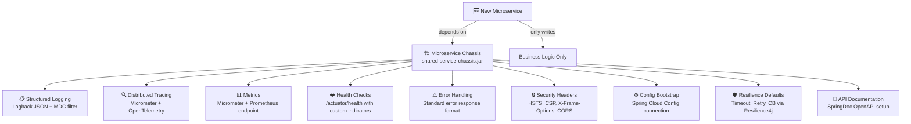

# Microservice Chassis

The **Microservice Chassis** is a pre-built framework or shared library that handles all **cross-cutting concerns** — the boilerplate infrastructure code every microservice needs — so that development teams focus exclusively on writing business logic.

> **The problem it solves:** In a company with 30 microservices, every team independently implementing logging, tracing, error handling, and health checks leads to 30 different implementations — some incomplete, some broken, all inconsistent. The chassis solves this by building the infrastructure once, correctly, and sharing it everywhere.

---

## 👶 Beginner: The Copy-Paste Microservice Problem

Imagine your company just adopted microservices. Team A builds `order-service` and wires up:
- Logback JSON configuration (they googled it, got half of it right)
- `/actuator/health` endpoint (works, but missing custom checks)
- Exception handler returning `{ "error": "..." }` format
- Micrometer metrics (never connected to Prometheus — nobody noticed)

Team B builds `payment-service`. They start fresh, copy some code from Team A, but:
- Their logging uses a different JSON field for `traceId` — log correlation breaks
- Their error format is `{ "message": "...", "code": "..." }` — clients need to handle 2 different formats
- Their security headers are missing — `X-Frame-Options` not set
- They never added Resilience4j — calls to Stripe have no circuit breaker or timeout

```text
30 services × "every team wires their own infrastructure" =
  ├── 8 different log formats (all in Kibana — impossible to query consistently)
  ├── 5 different error response schemas (clients need special handling per service)
  ├── 12 services missing distributed tracing (broken trace chains everywhere)
  ├── 20 services missing security headers (security audit fails)
  └── 3 weeks onboarding time for every new service
```

The chassis fixes this by making good infrastructure the default — teams get it for free by adding one dependency.

---

## 🏗️ What Goes Into a Chassis



---

## ⚙️ Implementation: Spring Boot Auto-Configuration Starter

A chassis is implemented as a **Spring Boot Starter** — a JAR that auto-configures itself when added to a service's classpath.

### Project Layout

```
shared-service-chassis/
├── pom.xml
└── src/main/
    ├── java/com/company/chassis/
    │   ├── ChassisAutoConfiguration.java         ← Root auto-config
    │   ├── logging/
    │   │   ├── MdcRequestContextFilter.java       ← Injects traceId/userId into MDC
    │   │   └── LoggingProperties.java             ← Config properties
    │   ├── error/
    │   │   ├── GlobalExceptionHandler.java        ← Standard error response
    │   │   ├── ErrorResponse.java                 ← Canonical error DTO
    │   │   └── ChassisExceptions.java             ← Base exception hierarchy
    │   ├── security/
    │   │   └── SecurityHeadersFilter.java         ← HSTS, CSP, X-Frame-Options
    │   ├── observability/
    │   │   ├── TracingConfiguration.java          ← OTel + Micrometer wiring
    │   │   └── ServiceHealthIndicator.java        ← Custom health check
    │   └── resilience/
    │       └── ResilienceDefaultsConfiguration.java
    └── resources/
        ├── META-INF/spring/
        │   └── org.springframework.boot.autoconfigure.AutoConfiguration.imports  ← Spring Boot 3 registration
        └── logback-spring.xml                     ← Standard JSON logging config
```

### Root Auto-Configuration

```java
// ChassisAutoConfiguration.java
@AutoConfiguration
@ConditionalOnWebApplication(type = ConditionalOnWebApplication.Type.SERVLET)
@EnableConfigurationProperties(ChassisProperties.class)
@Import({
    MdcRequestContextFilter.class,
    SecurityHeadersFilter.class,
    GlobalExceptionHandler.class,
    TracingConfiguration.class,
    ResilienceDefaultsConfiguration.class,
    ServiceHealthIndicator.class,
})
public class ChassisAutoConfiguration {

    @Bean
    @ConditionalOnMissingBean   // Allow services to override if they need custom behavior
    public RequestIdGenerator requestIdGenerator() {
        return () -> UUID.randomUUID().toString().replace("-", "");
    }
}
```

```
# META-INF/spring/org.springframework.boot.autoconfigure.AutoConfiguration.imports
com.company.chassis.ChassisAutoConfiguration
```

### MDC Request Context Filter (Logging Enrichment)

```java
// MdcRequestContextFilter.java — Applied to every HTTP request
@Component
@Order(Ordered.HIGHEST_PRECEDENCE)   // Run FIRST, before all other filters
@RequiredArgsConstructor
public class MdcRequestContextFilter extends OncePerRequestFilter {

    private final ChassisProperties props;
    private final RequestIdGenerator requestIdGenerator;

    @Override
    protected void doFilterInternal(HttpServletRequest request,
                                    HttpServletResponse response,
                                    FilterChain chain) throws ServletException, IOException {
        try {
            // Pull distributed trace ID from upstream (API Gateway / Micrometer propagates this)
            String traceId = Optional.ofNullable(request.getHeader("X-Trace-Id"))
                .filter(s -> !s.isBlank())
                .orElse(requestIdGenerator.generate());

            // Enrich all log lines in this request with these fields
            MDC.put("traceId", traceId);
            MDC.put("requestId", requestIdGenerator.generate());
            MDC.put("userId", request.getHeader("X-User-Id"));
            MDC.put("customerId", request.getHeader("X-Customer-Id"));
            MDC.put("tenantId", request.getHeader("X-Tenant-Id"));     // Multi-tenancy support
            MDC.put("requestMethod", request.getMethod());
            MDC.put("requestPath", sanitizePath(request.getRequestURI()));
            MDC.put("clientIp", getClientIp(request));

            // Echo trace ID back to caller for debugging
            response.setHeader("X-Trace-Id", traceId);

            chain.doFilter(request, response);
        } finally {
            MDC.clear();   // CRITICAL: prevent MDC leak across thread pool requests
        }
    }

    private String sanitizePath(String uri) {
        // Remove sensitive path segments (e.g., /users/123456789 → /users/{id})
        return uri.replaceAll("/[0-9a-f]{8}-[0-9a-f-]{27}", "/{uuid}")
                  .replaceAll("/\\d+", "/{id}");
    }

    private String getClientIp(HttpServletRequest request) {
        String xff = request.getHeader("X-Forwarded-For");
        return xff != null ? xff.split(",")[0].trim() : request.getRemoteAddr();
    }
}
```

### Standard Error Response Handler

```java
// GlobalExceptionHandler.java — Every service returns identical error JSON
@RestControllerAdvice
@Slf4j
public class GlobalExceptionHandler {

    @ExceptionHandler(ResourceNotFoundException.class)
    public ResponseEntity<ErrorResponse> handleNotFound(
            ResourceNotFoundException ex, HttpServletRequest req) {
        return error(HttpStatus.NOT_FOUND, "RESOURCE_NOT_FOUND", ex.getMessage(), req);
    }

    @ExceptionHandler(ValidationException.class)
    public ResponseEntity<ErrorResponse> handleValidation(
            ValidationException ex, HttpServletRequest req) {
        return error(HttpStatus.BAD_REQUEST, "VALIDATION_ERROR", ex.getMessage(), req);
    }

    @ExceptionHandler(MethodArgumentNotValidException.class)
    public ResponseEntity<ErrorResponse> handleBeanValidation(
            MethodArgumentNotValidException ex, HttpServletRequest req) {
        // Extract all field validation errors
        List<FieldError> fieldErrors = ex.getBindingResult().getFieldErrors().stream()
            .map(fe -> new FieldError(fe.getField(), fe.getDefaultMessage()))
            .toList();

        return ResponseEntity.status(HttpStatus.BAD_REQUEST).body(
            ErrorResponse.builder()
                .timestamp(Instant.now())
                .status(400)
                .errorCode("VALIDATION_FAILED")
                .message("Request validation failed")
                .fieldErrors(fieldErrors)    // Multiple field errors
                .path(req.getRequestURI())
                .traceId(MDC.get("traceId"))
                .build()
        );
    }

    @ExceptionHandler(AccessDeniedException.class)
    public ResponseEntity<ErrorResponse> handleForbidden(
            AccessDeniedException ex, HttpServletRequest req) {
        // Don't log details about what resource was denied — security hygiene
        log.warn("Access denied: path={}, userId={}", req.getRequestURI(), MDC.get("userId"));
        return error(HttpStatus.FORBIDDEN, "FORBIDDEN", "Access denied", req);
    }

    @ExceptionHandler(Exception.class)
    public ResponseEntity<ErrorResponse> handleGeneric(
            Exception ex, HttpServletRequest req) {
        // Log with full stack trace — this is always a bug
        log.error("Unhandled exception on {} {}", req.getMethod(), req.getRequestURI(), ex);
        // Return 500 with traceId so support can find the full trace in Kibana
        return error(HttpStatus.INTERNAL_SERVER_ERROR, "INTERNAL_ERROR",
            "An unexpected error occurred. Reference ID: " + MDC.get("traceId"), req);
    }

    private ResponseEntity<ErrorResponse> error(HttpStatus status, String code,
                                                  String message, HttpServletRequest req) {
        return ResponseEntity.status(status).body(
            ErrorResponse.builder()
                .timestamp(Instant.now())
                .status(status.value())
                .errorCode(code)
                .message(message)
                .path(req.getRequestURI())
                .traceId(MDC.get("traceId"))  // Link error to distributed trace
                .build()
        );
    }
}
```

All services now return this canonical error format:
```json
{
  "timestamp": "2026-07-06T10:23:44.123Z",
  "status": 404,
  "errorCode": "RESOURCE_NOT_FOUND",
  "message": "Order order-456 not found",
  "path": "/api/orders/order-456",
  "traceId": "d22f03aa9f4b1ec2"
}
```

### Security Headers Filter

```java
// SecurityHeadersFilter.java — Applied to every HTTP response
@Component
@Order(Ordered.HIGHEST_PRECEDENCE + 1)
public class SecurityHeadersFilter extends OncePerRequestFilter {

    @Override
    protected void doFilterInternal(HttpServletRequest req, HttpServletResponse res,
                                    FilterChain chain) throws ServletException, IOException {

        // Prevent clickjacking
        res.setHeader("X-Frame-Options", "DENY");

        // Prevent MIME sniffing
        res.setHeader("X-Content-Type-Options", "nosniff");

        // Force HTTPS for 1 year
        res.setHeader("Strict-Transport-Security", "max-age=31536000; includeSubDomains");

        // Content Security Policy — restrict resource loading
        res.setHeader("Content-Security-Policy",
            "default-src 'self'; script-src 'self'; style-src 'self'; img-src 'self' data:");

        // Don't send Referrer on cross-origin requests
        res.setHeader("Referrer-Policy", "strict-origin-when-cross-origin");

        // Disable dangerous browser features
        res.setHeader("Permissions-Policy", "camera=(), microphone=(), geolocation=()");

        chain.doFilter(req, res);
    }
}
```

### Resilience Defaults Configuration

```java
// ResilienceDefaultsConfiguration.java
@Configuration
@ConditionalOnClass(CircuitBreakerRegistry.class)
public class ResilienceDefaultsConfiguration {

    @Bean
    @ConditionalOnMissingBean
    public CircuitBreakerRegistry chassisCircuitBreakerRegistry() {
        // Sensible production defaults — teams can override per-service in their application.yml
        CircuitBreakerConfig config = CircuitBreakerConfig.custom()
            .slidingWindowType(CircuitBreakerConfig.SlidingWindowType.COUNT_BASED)
            .slidingWindowSize(10)
            .failureRateThreshold(50)          // Open after 50% failure rate
            .waitDurationInOpenState(Duration.ofSeconds(30))
            .permittedNumberOfCallsInHalfOpenState(3)
            .slowCallDurationThreshold(Duration.ofSeconds(2))  // Calls > 2s counted as slow
            .slowCallRateThreshold(80)
            .build();

        return CircuitBreakerRegistry.of(config);
    }

    @Bean
    @ConditionalOnMissingBean
    public TimeLimiterRegistry chassisTimeLimiterRegistry() {
        // Default: cancel calls taking longer than 5 seconds
        return TimeLimiterRegistry.of(
            TimeLimiterConfig.custom()
                .timeoutDuration(Duration.ofSeconds(5))
                .build()
        );
    }
}
```

---

## 📦 Using the Chassis in a New Service

```xml
<!-- order-service/pom.xml — everything infrastructure comes from chassis -->
<dependencies>
    <!-- Chassis provides: logging, tracing, error handling, health, security headers -->
    <dependency>
        <groupId>com.company</groupId>
        <artifactId>shared-service-chassis</artifactId>
        <version>2.3.1</version>
    </dependency>

    <!-- Domain-specific dependencies ONLY -->
    <dependency>
        <groupId>org.springframework.boot</groupId>
        <artifactId>spring-boot-starter-data-jpa</artifactId>
    </dependency>
    <dependency>
        <groupId>org.springframework.boot</groupId>
        <artifactId>spring-boot-starter-security</artifactId>
    </dependency>
</dependencies>
```

The new service automatically receives:
| Feature | How | Configurable? |
| :--- | :--- | :--- |
| JSON structured logging | `logback-spring.xml` from chassis classpath | Yes — override in service |
| MDC enrichment (traceId, userId) | Auto-registered filter | Yes — add extra fields |
| Standard error format | Auto-configured `@RestControllerAdvice` | Yes — add `@Order` lower to take precedence |
| Security headers | Auto-registered filter | Yes — override specific headers |
| `/actuator/health`, `/metrics`, `/prometheus` | Auto-configured endpoints | Yes — add custom indicators |
| Circuit breaker defaults | Auto-configured `@Bean` with `@ConditionalOnMissingBean` | Yes — define own bean to override |
| OpenTelemetry tracing | Auto-configured OTLP exporter | Via application.yml |

---

## 📐 Chassis Versioning & Governance

### Semantic Versioning Contract

```
chassis 2.x.x (major: breaking changes)
  2.0.0: Upgraded to Spring Boot 3.x — requires Java 17+
  
chassis x.3.x (minor: backward-compatible additions)
  2.3.0: Added PermissionsPolicy header
  2.3.1: Bug fix — MDC cleared in async threads
  
chassis x.x.1 (patch: bug fixes only)
  2.3.1: Fixed MDC thread leak in WebFlux contexts
```

### Upgrade Path for Teams

```text
Chassis upgrade strategy:
  Week 1: Release chassis 2.4.0, update changelog, announce deprecations
  Week 2: Run chassis-version-report to identify services on < 2.3.x
  Weeks 2-4: Services upgrade in their own sprint — no forced deadline
  Week 8: Chassis 2.2.x reaches EOL — teams must upgrade or own the risk
```

---

## ⚖️ Chassis vs. Service Mesh

They complement each other — chassis handles application-level concerns, service mesh handles network-level concerns:

| Concern | Microservice Chassis | Service Mesh (Istio / Linkerd) |
| :--- | :--- | :--- |
| **Layer** | Application code (in-process library) | Infrastructure (sidecar proxy) |
| **Structured logging** | ✅ Chassis formats log JSON | ❌ Mesh can't format app logs |
| **Business error handling** | ✅ Chassis understands HTTP 422 Unprocessable Entity | ❌ Mesh treats it as success |
| **MDC / request context** | ✅ Chassis injects into thread context | ❌ Mesh can't access Java MDC |
| **mTLS between services** | ❌ Complex to implement per-service | ✅ Automatic via sidecar |
| **Traffic splitting / canary** | ❌ Not chassis responsibility | ✅ Native mesh feature |
| **Retries at network level** | Via Resilience4j annotations | Via Envoy proxy config |

---

## ⚠️ Pros vs. Cons

| Pros | Cons |
| :--- | :--- |
| **Consistency** — all 30 services emit identical log format, same error schema, same health endpoint | **Versioning overhead** — releasing a bug in chassis deploys it to all services simultaneously |
| **Speed** — new service setup: 30 minutes instead of 2 days | **Technology lock-in** — chassis ties all services to one language/framework |
| **Enforced standards** — security headers, timeouts, trace propagation are non-negotiable | **Upgrade coordination** — major versions require all teams to migrate |
| **Reduced cognitive load** — teams don't need to know how to set up Logstash encoding | **Over-centralization risk** — wrong defaults in chassis cause subtle bugs everywhere |

---

## ❗ Common Gotchas & Anti-Patterns

1. **Chassis Becomes a God Library:**
   - *Anti-Pattern:* Adding `CustomerRepository`, `PricingEngine`, `AuditService` to the chassis.
   - *Fix:* Chassis = infrastructure only. Business code belongs in domain services.

2. **Breaking `@ConditionalOnMissingBean` Patterns:**
   - *Anti-Pattern:* Chassis registers a `RestTemplate` bean without `@ConditionalOnMissingBean` — now services that need a custom `RestTemplate` with a different timeout get the chassis default instead.
   - *Fix:* All chassis beans should be `@ConditionalOnMissingBean`. Services that need custom behavior simply declare their own bean.

3. **Ignoring Chassis Upgrade Failures in CI:**
   - *Anti-Pattern:* Services stay on chassis 1.x for 2 years because "the upgrade is a lower priority."
   - *Fix:* Enforce maximum chassis lag in CI: fail the build if chassis version is > N-2 behind latest. Make upgrades automatic via Renovate/Dependabot for minor/patch versions.

4. **Missing Async Context Propagation:**
   - *Anti-Pattern:* MDC values set by the filter are lost when code executes inside `@Async` methods or `CompletableFuture`.
   - *Fix:* Wrap thread pools in `TaskDecorator` that copies MDC context: `executor.setTaskDecorator(new MdcTaskDecorator())`.

5. **Testing With Real Chassis in Unit Tests:**
   - *Anti-Pattern:* Every service's unit tests load the full `ChassisAutoConfiguration`, connecting to Config Server, Vault, etc.
   - *Fix:* Provide a `ChassisTestConfiguration` test starter that provides no-op implementations of all chassis infrastructure.
