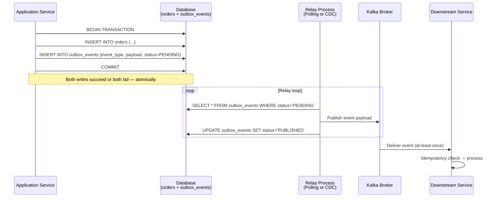

# Transactional Outbox Pattern

> The **Transactional Outbox Pattern** solves the fundamental distributed systems problem of atomically writing to a database and publishing an event to a message broker — without requiring a distributed transaction. It does so by writing the event to a dedicated `outbox` table inside the same local database transaction as the business data, then relaying it to the broker asynchronously via a separate process.

:::info[Who this guide is for]
- **New learners** — start at [The Dual-Write Problem](#the-dual-write-problem) and [The Beginner Analogy](#the-beginner-analogy).
- **Senior engineers** — jump to [Relay Strategies](#relay-strategies), [Alternatives Comparison](#alternatives--when-to-choose-what), [Ordering Guarantees](#4-ordering-guarantees), or [Production Failure Modes](#5-production-failure-modes-and-mitigations).
:::

---

## The Dual-Write Problem

In a microservices architecture, a service frequently needs to do two things simultaneously when a business action occurs:

1. **Write to its own database** — persist the new/updated business entity.
2. **Publish an event to a message broker** — notify downstream services.

The naive implementation attempts both writes in sequence:

```java
@Transactional
public Order createOrder(CreateOrderCommand cmd) {
    Order order = orderRepository.save(new Order(cmd)); // Write 1: DB
    kafkaTemplate.send("orders", new OrderCreatedEvent(order)); // Write 2: Kafka
    return order;
}
```

This is called a **Dual Write** — and it is fundamentally broken. These are two independent systems. No single ACID transaction spans both. Every possible failure scenario leads to inconsistency:

| Failure Point | DB State | Kafka State | Outcome |
|---|---|---|---|
| Crash after DB write, before Kafka publish | ✅ Committed | ❌ Never published | **Silent data loss** — downstream services never learn of the order |
| Kafka timeout, DB transaction rolled back | ❌ Rolled back | ✅ Published | **Phantom event** — consumers process an order that doesn't exist |
| Both succeed, but concurrent writes in wrong order | ✅ Correct | ⚠️ Wrong sequence | **Ordering violation** — consumers see a stale state or process events out of order |
| Retry logic re-publishes after transient failure | ✅ Correct | ✅ Duplicate | **Duplicate event** — consumer must be idempotent or will process twice |

The worst aspect of the dual-write failure is that **it is silent**. No exception is thrown that your monitoring will catch. The DB write succeeded. The application returns HTTP 200. The order exists in the database. Downstream services simply never find out about it.

:::danger[The "Retry" False Fix]
A common attempted fix is wrapping the Kafka publish in a retry loop. This does not solve the problem — it only reduces the probability of failure. A crash or a network partition between DB commit and Kafka publish will still silently lose the event, regardless of retry count. The fundamental issue is the lack of atomicity, not the reliability of a single publish attempt.
:::

---

## The Beginner Analogy

Imagine you are a CEO who must sign a contract (the database write) and mail it to your partner (publish to the message broker).

**The Dual-Write approach:** You sign the contract, seal the envelope, and walk outside to hand it to the mailman. But the mailman is not there — maybe he's on another street, maybe he left early. The contract is signed and legally binding, but your partner never receives it. You have no way of knowing whether to try again without risking sending two copies.

**The Outbox approach:** You sign the contract and drop the sealed envelope into your office's outgoing **"Outbox" tray**. Because the tray is physically inside your office (the database), you know it is safe — both the signed contract and the envelope are in the same room. Later, a dedicated mailroom clerk (the relay process) walks by, picks up everything in the tray, and takes it to the post office. If the post office is closed, the clerk holds on to it and keeps trying. Your job is done the moment you drop the envelope — the rest is the clerk's responsibility.

The key insight: **atomicity within the database** (same room = same transaction) is easy and reliable. **Atomicity across two systems** is the hard problem. The Outbox Pattern converts the hard problem into the easy one.

---

## How the Outbox Pattern Works



**Step-by-step:**

1. **Atomic write:** The application opens a database transaction, writes the business entity (e.g., `Order`), and inserts a row into `outbox_events` describing the event to be published. Both writes live in the same local ACID transaction — they either both commit or both roll back.

2. **Relay:** A separate background process (the Relay) reads `PENDING` rows from `outbox_events` and publishes them to the message broker.

3. **Acknowledgement:** Once the broker confirms receipt, the Relay marks the outbox row as `PUBLISHED` (or deletes it).

4. **At-least-once semantics:** If the Relay crashes after publishing but before marking the row as `PUBLISHED`, it will re-publish on restart. Consumers must be idempotent.

---

## Alternatives & When to Choose What

The Outbox Pattern is one of several approaches to reliable event publishing in a microservices architecture. Choosing the wrong one is a common architectural mistake.

### Pattern Comparison Matrix

| Criterion | Dual Write | Outbox + Polling | Outbox + CDC | Application Events + `@TransactionalEventListener` | Direct CDC (no Outbox) |
|---|---|---|---|---|---|
| **Atomicity** | ❌ None | ✅ Full (same TX) | ✅ Full (same TX) | ✅ Full (Spring-managed) | ✅ Full (log-derived) |
| **Delivery guarantee** | ❌ At-most-once | ✅ At-least-once | ✅ At-least-once | ✅ At-least-once | ✅ At-least-once |
| **Latency** | ✅ Very low | ⚠️ Poll interval (1–10s) | ✅ Very low (ms) | ✅ Very low | ✅ Very low (ms) |
| **Operational complexity** | Low | Low | High | Low | High |
| **Infrastructure required** | None | None | Debezium + Kafka Connect | None | Debezium + Kafka Connect |
| **Event payload control** | ✅ Full | ✅ Full | ✅ Full | ✅ Full | ❌ Tied to DB schema |
| **Captures hard deletes** | ✅ Manual | ✅ Manual | ✅ Manual | ✅ Manual | ✅ Automatic |
| **Works with legacy code** | ✅ | ✅ With outbox table | ✅ With outbox table | ❌ Requires Spring | ✅ Zero code changes |
| **DB write amplification** | 1x | 2x | 2x | 1x (uses Spring events) | 1x |

---

### 1. Dual Write (Anti-Pattern — Do Not Use)

Direct write to DB followed by direct publish to Kafka in the same method. The failure modes are documented above. Included here only for completeness — this is never the right choice for any data that must be consistent.

---

### 2. Spring `@TransactionalEventListener` (Lightweight Alternative)

Spring's `@TransactionalEventListener` fires *after* the surrounding transaction commits, solving the "crash before publish" half of the dual-write problem within a single JVM.

```java
// Service: publishes a Spring ApplicationEvent
@Service
@Transactional
public class OrderService {

    private final ApplicationEventPublisher eventPublisher;

    public Order createOrder(CreateOrderCommand cmd) {
        Order order = orderRepository.save(new Order(cmd));
        // This event is held by Spring until the TX commits
        eventPublisher.publishEvent(new OrderCreatedSpringEvent(order));
        return order;
    }
}

// Listener: fires AFTER the DB transaction commits
@Component
public class OrderEventPublisher {

    private final KafkaTemplate<String, Object> kafkaTemplate;

    @TransactionalEventListener(phase = TransactionPhase.AFTER_COMMIT)
    @Async // Run in a separate thread to avoid blocking the TX thread
    public void publish(OrderCreatedSpringEvent springEvent) {
        kafkaTemplate.send("orders", springEvent.getOrderId().toString(),
                new OrderCreatedEvent(springEvent.getOrder()));
    }
}
```

**Strengths:**
- Zero extra infrastructure — no outbox table, no Debezium.
- Very low latency — publishes immediately after TX commit.
- Low operational overhead; purely a Spring application concern.

**Weaknesses:**
- **Not crash-safe.** If the JVM crashes between the TX commit and the `kafkaTemplate.send()` call (inside `@Async`), the event is permanently lost. No retry, no recovery.
- **Not resilient to Kafka downtime.** If Kafka is unavailable at publish time, the event is lost unless you add your own retry/queue mechanism — which reintroduces the complexity the Outbox Pattern avoids.
- **No replay.** There is no durable record of published events to replay.

**Choose `@TransactionalEventListener` when:** the service is small, Kafka downtime is extremely rare in your environment, occasional event loss is acceptable, and you want to avoid outbox infrastructure. It is a pragmatic starting point for low-criticality events.

---

### 3. Outbox + Polling Publisher

An outbox table inside the application database is the source of truth. A scheduled background job periodically queries the table for `PENDING` events and publishes them to Kafka.

**Strengths:**
- Fully atomic — no event can be lost (DB transaction guarantees it).
- No extra infrastructure beyond the existing database.
- Simple to understand, debug, and operate.
- Works in any Spring Boot application with minimal setup.

**Weaknesses:**
- Poll interval introduces latency (typically 1–10 seconds).
- Polling adds read load on the database (mitigated with `SELECT FOR UPDATE SKIP LOCKED`).
- Ordering and concurrency require careful design with multiple application instances.
- Outbox table must be cleaned up (grows unboundedly otherwise).

**Choose Polling when:** you are building an MVP or a moderate-throughput service, sub-second latency is not required, and you want reliable delivery without Kafka Connect operational overhead.

---

### 4. Outbox + CDC (Debezium)

CDC replaces the polling scheduler. Debezium tails the PostgreSQL WAL (or MySQL Binlog), detects inserts to the `outbox_events` table, and streams them directly to Kafka — typically within milliseconds of commit.

**Strengths:**
- Near-real-time latency (milliseconds, not seconds).
- Zero polling load on the database query engine (WAL tailing is cheap).
- Fully decoupled — the relay is external to the application; deploying/restarting the app does not affect the relay.
- Battle-tested at scale (used by LinkedIn, Uber, Debezium/Red Hat).

**Weaknesses:**
- Requires Kafka Connect + Debezium infrastructure — a significant operational investment.
- Schema changes on the outbox table must be managed carefully (see Deep Dive below).
- PostgreSQL replication slot management carries risk (see CDC guide).

**Choose CDC when:** your service produces high event volumes, sub-second delivery latency is required, or you want to fully decouple event relay from application deployments.

---

### 5. Direct CDC on Business Tables (No Outbox)

Instead of maintaining an outbox table, Debezium tails the business tables directly (e.g., `orders`). Every insert/update/delete to the `orders` table is streamed as a Kafka event.

**Strengths:**
- Zero application code changes — works transparently on existing codebases.
- No write amplification — only one write per business operation.
- Captures hard deletes automatically.

**Weaknesses:**
- **Event payload is tied to DB schema.** The event structure is whatever the database row looks like. If a downstream service expects a richer event (with computed fields, related data, or business-level naming), you need transformation logic.
- **No control over what constitutes an "event."** Not every DB row update represents a meaningful business event. Direct CDC will emit events for internal state columns (e.g., `retry_count`, `locked_at`) that should not propagate.
- Schema changes to business tables immediately affect all consumers.

**Choose Direct CDC when:** you cannot change the application code (legacy system), the DB schema maps cleanly to the desired event format, or you need transparent audit logging of all mutations.

---

## Full Implementation: Spring Boot + PostgreSQL

### The Outbox Table Schema

```sql
CREATE TABLE outbox_events (
    id              UUID PRIMARY KEY DEFAULT gen_random_uuid(),
    aggregate_type  VARCHAR(255)  NOT NULL,  -- e.g., 'Order', 'Payment'
    aggregate_id    VARCHAR(255)  NOT NULL,  -- e.g., order UUID
    event_type      VARCHAR(255)  NOT NULL,  -- e.g., 'OrderPlaced', 'OrderCancelled'
    payload         JSONB         NOT NULL,
    status          VARCHAR(50)   NOT NULL DEFAULT 'PENDING',
    created_at      TIMESTAMPTZ   NOT NULL DEFAULT now(),
    published_at    TIMESTAMPTZ,
    retry_count     INT           NOT NULL DEFAULT 0,
    last_error      TEXT
);

-- Index for the relay query — covering index to avoid full table scan
CREATE INDEX idx_outbox_pending
    ON outbox_events (status, created_at)
    WHERE status = 'PENDING';
```

### The Write Phase

```java
@Entity
@Table(name = "outbox_events")
@Builder
public class OutboxEvent {

    @Id
    private UUID id = UUID.randomUUID();

    private String aggregateType;
    private String aggregateId;
    private String eventType;

    @Column(columnDefinition = "jsonb")
    private String payload;

    @Enumerated(EnumType.STRING)
    private OutboxStatus status = OutboxStatus.PENDING;

    private Instant createdAt = Instant.now();
    private Instant publishedAt;
    private int retryCount;
    private String lastError;
}
```

```java
@Service
@RequiredArgsConstructor
public class OrderService {

    private final OrderRepository orderRepository;
    private final OutboxRepository outboxRepository;
    private final ObjectMapper objectMapper;

    @Transactional // Single ACID transaction — both writes or neither
    public Order createOrder(CreateOrderCommand cmd) {
        Order order = Order.create(cmd);
        orderRepository.save(order);

        OutboxEvent event = OutboxEvent.builder()
                .aggregateType("Order")
                .aggregateId(order.getId().toString())
                .eventType("OrderPlaced")
                .payload(serialize(new OrderPlacedPayload(order)))
                .build();

        outboxRepository.save(event);
        return order;
    }

    @Transactional
    public Order cancelOrder(UUID orderId, CancelOrderCommand cmd) {
        Order order = orderRepository.findById(orderId)
                .orElseThrow(() -> new OrderNotFoundException(orderId));

        order.cancel(cmd.getReason()); // enforces business invariants
        orderRepository.save(order);

        outboxRepository.save(OutboxEvent.builder()
                .aggregateType("Order")
                .aggregateId(orderId.toString())
                .eventType("OrderCancelled")
                .payload(serialize(new OrderCancelledPayload(order, cmd.getReason())))
                .build());

        return order;
    }

    private String serialize(Object obj) {
        try {
            return objectMapper.writeValueAsString(obj);
        } catch (JsonProcessingException e) {
            throw new IllegalStateException("Failed to serialize outbox payload", e);
        }
    }
}
```

### Strategy A: Polling Publisher

```java
@Component
@RequiredArgsConstructor
@Slf4j
public class OutboxPollingRelay {

    private final OutboxRepository outboxRepository;
    private final KafkaTemplate<String, String> kafkaTemplate;
    private final TransactionTemplate transactionTemplate;

    private static final int BATCH_SIZE = 100;
    private static final int MAX_RETRIES = 5;

    // ShedLock ensures only ONE instance runs across all pods
    @Scheduled(fixedDelay = 1000)
    @SchedulerLock(name = "outbox-relay", lockAtLeastFor = "PT1S", lockAtMostFor = "PT30S")
    public void relay() {
        List<OutboxEvent> pending = outboxRepository
                .findPendingForUpdate(PageRequest.of(0, BATCH_SIZE));

        for (OutboxEvent event : pending) {
            try {
                publishToKafka(event);
                markPublished(event);
            } catch (Exception ex) {
                handleFailure(event, ex);
                break; // Stop processing batch to preserve ordering
            }
        }
    }

    private void publishToKafka(OutboxEvent event) throws Exception {
        String topic = "outbox." + event.getAggregateType().toLowerCase();
        kafkaTemplate.send(topic, event.getAggregateId(), event.getPayload()).get();
        // .get() makes the send synchronous — we know it succeeded before marking PUBLISHED
    }

    @Transactional
    private void markPublished(OutboxEvent event) {
        event.setStatus(OutboxStatus.PUBLISHED);
        event.setPublishedAt(Instant.now());
        outboxRepository.save(event);
    }

    @Transactional
    private void handleFailure(OutboxEvent event, Exception ex) {
        log.error("Failed to publish outbox event {}: {}", event.getId(), ex.getMessage());
        event.setRetryCount(event.getRetryCount() + 1);
        event.setLastError(ex.getMessage());

        if (event.getRetryCount() >= MAX_RETRIES) {
            event.setStatus(OutboxStatus.DEAD_LETTER);
            log.error("Outbox event {} moved to DLQ after {} retries", event.getId(), MAX_RETRIES);
        }

        outboxRepository.save(event);
    }
}
```

```java
// Repository: uses SKIP LOCKED for safe concurrent polling
// (if you ever run multiple relay instances without ShedLock)
public interface OutboxRepository extends JpaRepository<OutboxEvent, UUID> {

    @Query(value = """
            SELECT * FROM outbox_events
            WHERE status = 'PENDING'
            ORDER BY created_at ASC
            LIMIT :#{#pageable.pageSize}
            FOR UPDATE SKIP LOCKED
            """, nativeQuery = true)
    List<OutboxEvent> findPendingForUpdate(Pageable pageable);
}
```

:::tip[`SKIP LOCKED` vs. `FOR UPDATE`]
`FOR UPDATE` blocks other sessions trying to lock the same rows. `FOR UPDATE SKIP LOCKED` silently skips rows already locked by another session — enabling safe parallel polling across multiple instances. Each instance processes a different subset of pending events without blocking each other.
:::

### Strategy B: CDC with Debezium + Outbox Router SMT

When sub-second latency or high throughput is required, replace the polling scheduler with Debezium tailing the `outbox_events` table.

```json
// POST http://kafka-connect:8083/connectors
{
  "name": "outbox-connector",
  "config": {
    "connector.class": "io.debezium.connector.postgresql.PostgresConnector",
    "database.hostname": "postgres",
    "database.port": "5432",
    "database.user": "debezium",
    "database.password": "secret",
    "database.dbname": "myapp",
    "database.server.name": "myapp",

    // Only tail the outbox table — not every business table
    "table.include.list": "public.outbox_events",

    // OutboxEventRouter SMT: routes events to topic per aggregate type
    // and extracts payload from the outbox envelope
    "transforms": "outbox",
    "transforms.outbox.type": "io.debezium.transforms.outbox.EventRouter",
    "transforms.outbox.route.topic.replacement": "outbox.${routedByValue}",
    "transforms.outbox.table.field.event.key":     "aggregate_id",
    "transforms.outbox.table.field.event.type":    "event_type",
    "transforms.outbox.table.field.event.payload": "payload",
    "transforms.outbox.table.fields.additional.placement": "event_type:header",

    // DELETE events from outbox table → don't publish tombstones to Kafka
    "transforms.outbox.route.tombstone.on.empty.payload": "false",

    "key.converter":   "org.apache.kafka.connect.storage.StringConverter",
    "value.converter": "io.confluent.kafka.serializers.KafkaAvroSerializer",
    "value.converter.schema.registry.url": "http://schema-registry:8081"
  }
}
```

With the `EventRouter` SMT:
- An outbox event with `aggregate_type = "Order"` is routed to Kafka topic `outbox.order`.
- The raw outbox envelope (`id`, `status`, `created_at`) is stripped — consumers only see the `payload`.
- Kafka message key is set to `aggregate_id`, ensuring all events for the same aggregate go to the same partition (ordering guarantee).

---

## 🧠 Senior Deep Dive

### 1. Exactly-Once vs. At-Least-Once: The Real Trade-off

The Outbox Pattern guarantees **at-least-once** delivery, not exactly-once. This is a deliberate and correct design choice.

**Why not exactly-once?**

True exactly-once delivery requires a distributed transaction spanning the database and the message broker. This is possible with some brokers (Kafka transactions + idempotent producer), but:
- It couples your database transaction scope to Kafka's transaction protocol — adding significant latency.
- It is only meaningful end-to-end if the consumer also participates in the transaction (Kafka's exactly-once consumer semantics).
- The operational complexity and performance cost almost never justifies the benefit.

**The pragmatic alternative:** at-least-once delivery from the Outbox, combined with **idempotent consumers**. This achieves the same correctness guarantee with far lower complexity. Each consumer checks whether it has already processed a given event ID before applying side effects.

```java
// Idempotent consumer — safe regardless of how many times the event is delivered
@KafkaListener(topics = "outbox.order", groupId = "inventory-service")
@Transactional
public void onOrderPlaced(ConsumerRecord<String, OrderPlacedEvent> record) {
    String eventId = record.headers().lastHeader("event_id") != null
            ? new String(record.headers().lastHeader("event_id").value())
            : record.topic() + "-" + record.partition() + "-" + record.offset();

    if (processedEventRepository.existsById(eventId)) {
        log.debug("Skipping duplicate event: {}", eventId);
        return;
    }

    OrderPlacedEvent event = record.value();
    inventoryService.reserveStock(event.getOrderId(), event.getItems());
    processedEventRepository.save(new ProcessedEvent(eventId, Instant.now()));
}
```

---

### 2. Distributed Lock for Single-Instance Polling

When multiple application pods run the polling relay simultaneously, they will race to claim the same `PENDING` rows. Without coordination, you risk:

- Publishing the same event twice from two pods concurrently.
- Out-of-order publishing if two pods interleave on the same aggregate's events.

**Option A — ShedLock (recommended for simplicity):**

ShedLock uses a lock table in the same database to guarantee only one scheduler runs at a time across all pods.

```xml
<!-- pom.xml -->
<dependency>
    <groupId>net.javacrumbs.shedlock</groupId>
    <artifactId>shedlock-spring</artifactId>
    <version>5.13.0</version>
</dependency>
<dependency>
    <groupId>net.javacrumbs.shedlock</groupId>
    <artifactId>shedlock-provider-jdbc-template</artifactId>
    <version>5.13.0</version>
</dependency>
```

```java
@Configuration
@EnableSchedulerLock(defaultLockAtMostFor = "PT30S")
public class ShedLockConfig {

    @Bean
    public LockProvider lockProvider(DataSource dataSource) {
        return new JdbcTemplateLockProvider(
                JdbcTemplateLockProvider.Configuration.builder()
                        .withJdbcTemplate(new JdbcTemplate(dataSource))
                        .usingDbTime()
                        .build()
        );
    }
}
```

```sql
-- ShedLock requires this table
CREATE TABLE shedlock (
    name       VARCHAR(64)  NOT NULL,
    lock_until TIMESTAMPTZ  NOT NULL,
    locked_at  TIMESTAMPTZ  NOT NULL,
    locked_by  VARCHAR(255) NOT NULL,
    PRIMARY KEY (name)
);
```

**Option B — Partitioned Outbox (for high throughput without sacrificing parallelism):**

Partition the outbox by `aggregate_type` and assign each partition to one pod. Pod A owns `Order` events; Pod B owns `Payment` events. Ordering is preserved within each partition, and multiple pods work in parallel.

```java
@Scheduled(fixedDelay = 1000)
@SchedulerLock(name = "outbox-relay-order", lockAtMostFor = "PT30S")
public void relayOrderEvents() {
    relay("Order");
}

@Scheduled(fixedDelay = 1000)
@SchedulerLock(name = "outbox-relay-payment", lockAtMostFor = "PT30S")
public void relayPaymentEvents() {
    relay("Payment");
}
```

---

### 3. Schema Evolution of the Outbox Payload

The `payload` column in the outbox table stores a serialized representation of the event. Over time, event schemas change. A consumer may process an `OrderPlaced` event from today and an `OrderPlaced` event from two years ago in the same Kafka replay.

**The naive approach (JSON with no contract):**

```json
// v1: payload has "customer_id"
{ "orderId": "abc", "customer_id": "123", "totalAmount": 99.00 }

// v2: renamed to "customerId" (camelCase)
{ "orderId": "abc", "customerId": "123", "totalAmount": 99.00 }
```

Old events in Kafka (v1 format) will break v2 consumers that expect `customerId`.

**Safe evolution strategy — Schema Registry + Avro:**

Register each event type's schema with Confluent Schema Registry. Configure `BACKWARD` compatibility — new schemas must be readable by old consumer versions. This enforces:
- ✅ New optional fields can be added.
- ❌ Existing fields cannot be renamed or removed.
- ❌ Field types cannot be changed incompatibly.

```java
// Use Avro-generated classes for the event payload
OutboxEvent event = OutboxEvent.builder()
        .aggregateType("Order")
        .aggregateId(order.getId().toString())
        .eventType("OrderPlaced")
        .payload(avroSerializer.serialize(new OrderPlacedAvro(order))) // schema-registered
        .build();
```

**Safe evolution strategy — additive-only JSON with version field:**

If Avro/Protobuf is too heavy, embed an explicit `version` field in the payload and handle version branching in consumers:

```java
@KafkaListener(topics = "outbox.order")
public void consume(OrderPlacedEvent event) {
    switch (event.getVersion()) {
        case 1 -> handleV1(event);
        case 2 -> handleV2(event);
        default -> throw new UnknownEventVersionException(event.getVersion());
    }
}
```

---

### 4. Ordering Guarantees

The Outbox Pattern preserves ordering for events from the same aggregate, but only if you design for it explicitly.

**Kafka partition = ordering unit.** Kafka maintains strict ordering within a partition. Events from the same aggregate must go to the same partition. Both the Polling Publisher and Debezium's EventRouter use `aggregate_id` as the Kafka message key — Kafka's default hash-based partitioner will consistently route the same key to the same partition.

```
aggregate_id=order-1 → Partition 2: [OrderPlaced, OrderConfirmed, OrderShipped] (in order)
aggregate_id=order-2 → Partition 5: [OrderPlaced, OrderCancelled] (in order)
aggregate_id=order-3 → Partition 2: (interleaved with order-1, but each is internally ordered)
```

**The cross-aggregate ordering trap:**

An `OrderPlaced` event (from the `orders` table / outbox) and a `PaymentInitiated` event (from the `payments` table / outbox) published in the same business flow are in *different* Kafka topics. There is no guarantee which consumer processes first.

If your downstream service requires `PaymentInitiated` to be processed before `OrderPlaced`, you must handle this at the consumer level:

```java
// Option A — Saga / orchestrator coordinates the sequence
// Option B — Consumer buffers OrderPlaced until PaymentInitiated arrives
// Option C — Re-design: emit a single composite event from a coordinating service
```

**Out-of-order detection:**

For aggregates where ordering is critical, include a sequence number in the event payload that corresponds to the aggregate's version (optimistic locking version):

```java
OutboxEvent event = OutboxEvent.builder()
        .aggregateId(order.getId().toString())
        .eventType("OrderPlaced")
        .payload(serialize(Map.of(
                "orderId", order.getId(),
                "version", order.getVersion(), // JPA @Version value
                "status", order.getStatus()
        )))
        .build();
```

Consumers can detect and reject or re-queue events that arrive out of sequence.

---

### 5. Production Failure Modes and Mitigations

#### Failure Mode 1: Poison Pill Events

An outbox event whose payload is malformed or which consistently triggers a downstream error will block the entire relay queue (because the relay stops on failure to preserve ordering).

**Detection and mitigation:**

```java
@Transactional
private void handleFailure(OutboxEvent event, Exception ex) {
    event.setRetryCount(event.getRetryCount() + 1);
    event.setLastError(truncate(ex.getMessage(), 1000));

    if (event.getRetryCount() >= MAX_RETRIES) {
        event.setStatus(OutboxStatus.DEAD_LETTER);
        meterRegistry.counter("outbox.dlq.events",
                "event_type", event.getEventType()).increment();
        alertingService.sendAlert("Outbox DLQ: " + event.getId());
    }

    outboxRepository.save(event);
}
```

Implement a separate DLQ monitor that alerts on-call when `DEAD_LETTER` events accumulate, and provides tooling to inspect, correct, and re-enqueue them.

#### Failure Mode 2: Outbox Table Unbounded Growth

Processed events are never deleted unless you explicitly clean them up. A busy service can accumulate millions of `PUBLISHED` rows, degrading relay query performance.

```java
// Scheduled cleanup — runs daily, keeps 7 days of history
@Scheduled(cron = "0 0 3 * * *") // 3 AM daily
@Transactional
public void cleanupPublishedEvents() {
    Instant cutoff = Instant.now().minus(7, ChronoUnit.DAYS);
    int deleted = outboxRepository.deletePublishedOlderThan(cutoff);
    log.info("Cleaned up {} published outbox events older than {}", deleted, cutoff);
}
```

```java
// Repository
@Modifying
@Query("DELETE FROM OutboxEvent e WHERE e.status = 'PUBLISHED' AND e.publishedAt < :cutoff")
int deletePublishedOlderThan(@Param("cutoff") Instant cutoff);
```

#### Failure Mode 3: Kafka Backpressure During High Write Bursts

If Kafka is slow or the relay cannot publish fast enough, the `PENDING` backlog grows. The polling relay will keep selecting larger and larger result sets, increasing DB load at exactly the wrong time.

**Mitigation — adaptive batch sizing with backpressure monitoring:**

```java
@Scheduled(fixedDelay = 1000)
public void relay() {
    long pendingCount = outboxRepository.countByStatus(OutboxStatus.PENDING);
    meterRegistry.gauge("outbox.pending.count", pendingCount);

    if (pendingCount > HIGH_WATER_MARK) {
        log.warn("Outbox pending count {} exceeds high water mark {}", pendingCount, HIGH_WATER_MARK);
        // Increase batch size to catch up, or alert on-call
    }

    int batchSize = Math.min(BATCH_SIZE, (int) Math.min(pendingCount, 500));
    List<OutboxEvent> pending = outboxRepository.findPendingForUpdate(PageRequest.of(0, batchSize));
    // ... process batch
}
```

#### Failure Mode 4: Clock Skew in Multi-Pod Polling

When multiple pods poll the outbox using `ORDER BY created_at`, clock skew between pods can cause the same pod to repeatedly skip events that another pod has already picked up (because `created_at` values from pod B's clock appear earlier than pod A's clock).

**Mitigation:** Use a database-generated sequence (auto-increment or a sequence number) rather than `created_at` for ordering. The database clock is the single authority.

```sql
CREATE TABLE outbox_events (
    id              BIGSERIAL PRIMARY KEY, -- DB-generated, monotonically increasing
    aggregate_type  VARCHAR(255) NOT NULL,
    -- ... other fields
);
```

```java
// Relay orders by the DB-generated id, not created_at
@Query("""
    SELECT * FROM outbox_events
    WHERE status = 'PENDING'
    ORDER BY id ASC
    LIMIT :#{#pageable.pageSize}
    FOR UPDATE SKIP LOCKED
    """, nativeQuery = true)
List<OutboxEvent> findPendingForUpdate(Pageable pageable);
```

---

### 6. Observability: What to Monitor in Production

```java
@Component
@RequiredArgsConstructor
public class OutboxMetrics {

    private final OutboxRepository outboxRepository;
    private final MeterRegistry meterRegistry;

    @Scheduled(fixedDelay = 10_000)
    public void recordMetrics() {
        // 1. Pending event count — alert if growing continuously
        long pending = outboxRepository.countByStatus(OutboxStatus.PENDING);
        meterRegistry.gauge("outbox.pending.count", pending);

        // 2. Dead letter count — alert on ANY value > 0
        long dlq = outboxRepository.countByStatus(OutboxStatus.DEAD_LETTER);
        meterRegistry.gauge("outbox.dlq.count", dlq);

        // 3. Oldest pending event age — alert if > 5 minutes
        outboxRepository.findOldestPending().ifPresent(oldest -> {
            long ageSeconds = Duration.between(oldest.getCreatedAt(), Instant.now()).toSeconds();
            meterRegistry.gauge("outbox.oldest.pending.age.seconds", ageSeconds);
        });
    }
}
```

**Alerting thresholds to configure:**

| Metric | Warning | Critical |
|---|---|---|
| `outbox.pending.count` | > 1,000 | > 10,000 |
| `outbox.dlq.count` | > 0 | > 10 |
| `outbox.oldest.pending.age.seconds` | > 60s | > 300s |
| Relay scheduler last success | > 30s ago | > 120s ago |

---

## 🎯 Interview Decision Matrix

| Scenario | Recommended Approach | Reasoning |
|---|---|---|
| MVP / low-traffic service | `@TransactionalEventListener` → upgrade path | Minimal complexity; acceptable occasional loss risk for truly non-critical events |
| Moderate traffic, must not lose events | Outbox + Polling + ShedLock | Reliable, simple, no Kafka Connect overhead |
| High throughput, sub-second latency | Outbox + CDC (Debezium) | Polling cannot keep up; CDC scales without DB polling load |
| Legacy codebase, cannot change app code | Direct CDC on business tables | Zero code changes; Debezium handles it transparently |
| Need custom event schema separate from DB schema | Outbox (Polling or CDC) | Outbox payload is application-controlled, not tied to DB row structure |
| Strict regulatory audit of all events | Outbox + CDC + event store | Full durable history, replay, and schema versioning |

:::tip[Interview Phrasing — Outbox vs Dual Write]
*"The direct Dual Write approach is fundamentally broken — it cannot guarantee atomicity between the database write and the Kafka publish without a distributed transaction, which we don't have. A crash between the two writes silently loses the event with no recovery path. The Transactional Outbox Pattern solves this by writing the event to an `outbox_events` table in the same ACID transaction as the business entity. Atomicity within a single database is trivially guaranteed. A separate relay process — either a polling scheduler with ShedLock for simplicity, or Debezium reading the WAL for near-real-time delivery — publishes the events to Kafka asynchronously. Consumers must be idempotent since delivery is at-least-once, but this is far simpler than trying to prevent duplicate events at the producer side."*
:::

:::tip[Interview Phrasing — Polling vs CDC]
*"For the relay strategy, polling is a pragmatic starting point. A scheduled job with `SELECT FOR UPDATE SKIP LOCKED` and ShedLock for distributed locking covers most use cases with zero extra infrastructure. The trade-off is poll-interval latency — typically 1–5 seconds — and some added read load on the database. If we need sub-second delivery or the volume is high enough that polling degrades the database, I'd upgrade to Debezium tailing the WAL. CDC removes the polling load entirely and delivers events within milliseconds of commit. The operational cost is running Kafka Connect and managing Debezium connector lifecycle, but for a high-throughput service it's the right trade-off."*
:::

---

## 📚 Further Reading

- [Debezium Outbox Event Router](https://debezium.io/documentation/reference/stable/transformations/outbox-event-router.html) — Official docs for the Outbox SMT; covers topic routing and payload extraction.
- [ShedLock](https://github.com/lukas-krecan/ShedLock) — Distributed lock library for Spring scheduled tasks; the simplest way to ensure a single active poller.
- [Designing Data-Intensive Applications — Martin Kleppmann](https://dataintensive.net/) — Chapters 9 and 11 cover exactly-once semantics and the log abstraction that makes both CDC and the Outbox pattern work.
- [Microservices Patterns — Chris Richardson](https://microservices.io/patterns/data/transactional-outbox.html) — Richardson's original canonical description of the Outbox Pattern with detailed failure analysis.
- [Eventuate Tram](https://github.com/eventuate-tram/eventuate-tram-core) — A production-grade Java/Spring library that implements the Transactional Outbox Pattern out of the box, with both polling and CDC relay strategies.
- [Kafka Producer Idempotence and Transactions](https://kafka.apache.org/documentation/#semantics) — Official Kafka docs on exactly-once producer semantics; relevant when evaluating alternatives to the Outbox Pattern.