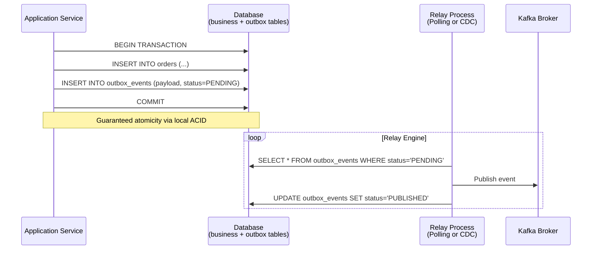

# Transactional Outbox Pattern

Event-driven architectures frequently suffer from the **Dual-Write Problem**. A service updates its local database and publishes an event to Kafka. If the database commit succeeds, but the Kafka broker throws a timeout, the system becomes inconsistent. If Kafka publish is put inside `@Transactional`, the database commit could still fail after the event was sent.

The **Transactional Outbox Pattern** solves the Dual-Write problem by writing the message payload to a database table within the same transaction as the business operation.

---

## The Dual-Write Problem



---

## Outbox Pattern Database Schema (PostgreSQL)

```sql
CREATE TABLE outbox_events (
    id              UUID PRIMARY KEY DEFAULT gen_random_uuid(),
    aggregate_type  VARCHAR(255)  NOT NULL,  -- e.g., 'Order'
    aggregate_id    VARCHAR(255)  NOT NULL,  -- e.g., order UUID
    event_type      VARCHAR(255)  NOT NULL,  -- e.g., 'OrderPlaced'
    payload         JSONB         NOT NULL,
    status          VARCHAR(50)   NOT NULL DEFAULT 'PENDING',
    created_at      TIMESTAMPTZ   NOT NULL DEFAULT now(),
    published_at    TIMESTAMPTZ,
    retry_count     INT           NOT NULL DEFAULT 0,
    last_error      TEXT
);

-- Partial index for fast relay reads
CREATE INDEX idx_outbox_pending
    ON outbox_events (status, created_at)
    WHERE status = 'PENDING';
```

---

## Spring Boot Outbox Code (Write Phase)

```java
@Service
@RequiredArgsConstructor
public class OrderService {
    private final OrderRepository orderRepository;
    private final OutboxRepository outboxRepository;
    private final ObjectMapper objectMapper;

    @Transactional // Database commit guarantees BOTH records exist, or neither
    public Order createOrder(CreateOrderCommand cmd) {
        Order order = Order.create(cmd);
        orderRepository.save(order);

        OutboxEvent outboxEvent = OutboxEvent.builder()
                .aggregateType("Order")
                .aggregateId(order.getId().toString())
                .eventType("OrderPlaced")
                .payload(toJson(new OrderPlacedEvent(order)))
                .status(OutboxStatus.PENDING)
                .createdAt(Instant.now())
                .build();

        outboxRepository.save(outboxEvent);
        return order;
    }

    private String toJson(Object obj) {
        try {
            return objectMapper.writeValueAsString(obj);
        } catch (JsonProcessingException e) {
            throw new IllegalArgumentException("Serialization failed", e);
        }
    }
}
```

---

## Relay Strategies: How to Publish Outbox Events

Once events are saved in the `outbox_events` table, they must be sent to the message broker.

### Strategy A: Polling Publisher (SKIP LOCKED)

A scheduled background worker queries the outbox table for pending records and publishes them. To scale across multiple instances without race conditions, use the `SKIP LOCKED` SQL construct:

```java
@Component
@RequiredArgsConstructor
@Slf4j
public class OutboxPollingRelay {
    private final OutboxRepository outboxRepository;
    private final KafkaTemplate<String, String> kafkaTemplate;

    @Scheduled(fixedDelay = 500)
    public void pollAndPublish() {
        // Find batch using: FOR UPDATE SKIP LOCKED
        List<OutboxEvent> batch = outboxRepository.findPendingForUpdate(Pageable.ofSize(100));

        for (OutboxEvent event : batch) {
            try {
                // Synchronous send (.get()) to confirm broker accepted before commit
                kafkaTemplate.send("orders", event.getAggregateId(), event.getPayload()).get();
                markAsPublished(event);
            } catch (Exception e) {
                handleFailure(event, e);
                break; // Stop batch to preserve ordering
            }
        }
    }
}
```

```java
public interface OutboxRepository extends JpaRepository<OutboxEvent, UUID> {
    @Query(value = """
            SELECT * FROM outbox_events
            WHERE status = 'PENDING'
            ORDER BY created_at ASC
            LIMIT :#{#pageable.pageSize}
            FOR UPDATE SKIP LOCKED
            """, nativeQuery = true)
    List<OutboxEvent> findPendingForUpdate(Pageable pageable);
}
```

* **Pros:** Simple to implement; requires no third-party infrastructure.
* **Cons:** High database CPU utilization; polling interval adds latency.

---

### Strategy B: Change Data Capture (CDC) via Debezium

Debezium tails the database Transaction Log (WAL in Postgres) and streams modifications of the `outbox_events` table directly to Kafka Connect.

```json
{
  "name": "outbox-connector",
  "config": {
    "connector.class": "io.debezium.connector.postgresql.PostgresConnector",
    "database.dbname": "myapp",
    "table.include.list": "public.outbox_events",
    "transforms": "outbox",
    "transforms.outbox.type": "io.debezium.transforms.outbox.EventRouter",
    "transforms.outbox.route.topic.replacement": "outbox.${routedByValue}",
    "transforms.outbox.table.field.event.key": "aggregate_id",
    "transforms.outbox.table.field.event.payload": "payload"
  }
}
```

* **Pros:** Near zero latency (sub-second); zero database query overhead.
* **Cons:** Operations overhead (requires Kafka Connect, Debezium configurations).

---

## Summary Comparison

| Pattern | Consistency | Availability | Performance | Best For |
| :--- | :--- | :--- | :--- | :--- |
| **Two-Phase Commit (2PC)** | Strong | Low | Low (blocking) | Critical ledgers, bank balances, financial auditing. |
| **Saga (Orchestration)** | Eventual | High | High (asynchronous) | Long-running checkouts, flight bookings, ordering pipelines. |
| **Saga (Choreography)** | Eventual | High | High | Highly decoupled microservices with simple linear flows. |
| **Transactional Outbox** | Eventual | High | High | Dual-write protection, streaming local updates reliably into event brokers. |
