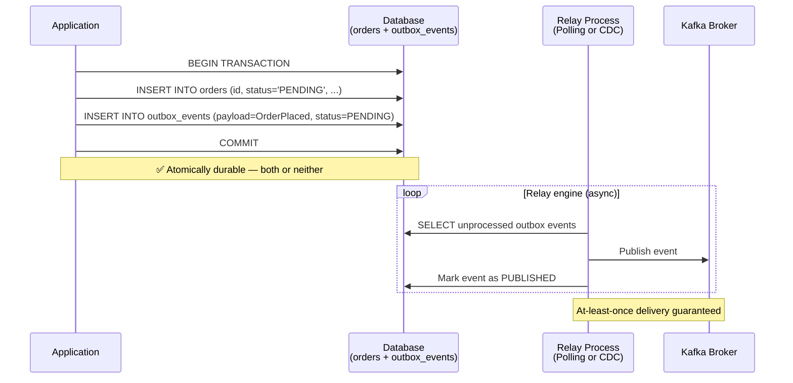

import Tabs from '@theme/Tabs';
import TabItem from '@theme/TabItem';

# Transactional Outbox Pattern

:::info[Who this guide is for]
- **New learners** — start at [The Dual-Write Problem](#the-dual-write-problem) and [The Coffee Shop Analogy](#the-coffee-shop-analogy) to build intuition.
- **Senior engineers** — jump to [How the Relay Works Internally](#how-the-relay-works-internally), [CDC vs Polling Deep Dive](#cdc-vs-polling-publisher-deep-dive), [Ordering Semantics](#ordering-semantics--partitioning), or [Production Observability](#production-observability).
:::

---

## The Dual-Write Problem

Every event-driven microservice eventually hits the same wall:

```java
@Transactional
public Order placeOrder(CreateOrderCommand cmd) {
    Order order = orderRepository.save(Order.from(cmd));   // Write #1: database
    kafkaTemplate.send("order-events", new OrderPlaced(order)); // Write #2: Kafka
    return order;
}
```

This code looks innocent but has a **fatal concurrency bug**. There are **two independent writes** to two different systems, and there is no way to make them atomic together:

| Scenario | DB Write | Kafka Write | Result |
|:---|:---|:---|:---|
| Both succeed | ✅ | ✅ | Correct |
| DB fails, Kafka succeeds | ❌ | ✅ | **Ghost event** — event for an order that doesn't exist |
| DB succeeds, Kafka fails | ✅ | ❌ | **Silent drop** — order exists but no downstream service knows |
| Process crashes between the two writes | ✅ | ❌ | **Same as above** |

The third scenario — **DB succeeds, Kafka fails** — is the most dangerous and most common. Your order service confirms the order to the user, but inventory was never reserved, the email was never sent, and payment was never triggered.

---

## The Coffee Shop Analogy

Imagine a coffee shop. When you order, the barista:
1. Writes your order on a **paper ticket** (the outbox table — in the same action as taking the order)
2. Sticks it on the **order board** (publishes to Kafka — done by a separate relay process)

Even if the board catches fire (Kafka is down), the paper ticket is still there. A new barista (relay restart) can read the ticket and re-post it to the board when it's back up.

The key insight: **the ticket (outbox record) and the order (business record) are written in one pen stroke — atomically**. The board (Kafka) gets updated eventually but reliably.

---

## The Transactional Outbox Pattern

The Transactional Outbox Pattern solves the Dual-Write Problem by writing the event payload **to the same database as the business data**, in the same local ACID transaction. A separate relay process then reads the outbox and publishes events to the message broker.



**Guarantee:** If the database transaction commits, the event **will eventually** be published to Kafka. If the transaction rolls back, no event is published. There is no window where the order exists but the event is missing.

---

## Database Schema

### PostgreSQL Outbox Table

```sql
CREATE TABLE outbox_events (
    id              UUID         PRIMARY KEY DEFAULT gen_random_uuid(),
    aggregate_type  VARCHAR(255) NOT NULL,           -- e.g., 'Order', 'Payment'
    aggregate_id    VARCHAR(255) NOT NULL,           -- e.g., order UUID
    event_type      VARCHAR(255) NOT NULL,           -- e.g., 'OrderPlaced'
    payload         JSONB        NOT NULL,           -- full event payload
    topic           VARCHAR(255) NOT NULL,           -- target Kafka topic
    partition_key   VARCHAR(255),                   -- for ordering (e.g., orderId)
    status          VARCHAR(50)  NOT NULL DEFAULT 'PENDING',
    created_at      TIMESTAMPTZ  NOT NULL DEFAULT now(),
    published_at    TIMESTAMPTZ,
    retry_count     INT          NOT NULL DEFAULT 0,
    last_error      TEXT,
    idempotency_key VARCHAR(255) UNIQUE              -- prevents duplicate inserts
);

-- Fast index for the relay process (only scans PENDING rows)
CREATE INDEX CONCURRENTLY idx_outbox_pending
    ON outbox_events (created_at ASC)
    WHERE status = 'PENDING';

-- Index for cleanup jobs (purge old PUBLISHED records)
CREATE INDEX idx_outbox_published_at
    ON outbox_events (published_at)
    WHERE status = 'PUBLISHED';
```

:::tip[Why a partial index?]
`WHERE status = 'PENDING'` makes the index only cover unpublished rows — which is the tiny minority of rows in a mature system. The relay's SELECT query scans only this index, not the full table, giving O(1) relay performance regardless of total table size.
:::

---

## Application Write Phase (Spring Boot)

```java
@Service
@RequiredArgsConstructor
@Slf4j
public class OrderService {
    private final OrderRepository orderRepository;
    private final OutboxRepository outboxRepository;
    private final ObjectMapper objectMapper;

    @Transactional // local ACID — both writes succeed or both fail
    public Order placeOrder(CreateOrderCommand cmd) {
        // Business operation
        Order order = Order.create(cmd);
        orderRepository.save(order);

        // Write event to outbox IN THE SAME TRANSACTION
        OutboxEvent event = OutboxEvent.builder()
            .aggregateType("Order")
            .aggregateId(order.getId().toString())
            .eventType("OrderPlaced")
            .topic("order-events")
            .partitionKey(order.getId().toString())  // ensures ordering per order
            .payload(serialize(new OrderPlacedEvent(order)))
            .idempotencyKey("order-placed:" + order.getId())
            .build();

        outboxRepository.save(event);

        log.info("Order {} created, outbox event {} queued", order.getId(), event.getId());
        return order;
    }

    private String serialize(Object obj) {
        try {
            return objectMapper.writeValueAsString(obj);
        } catch (JsonProcessingException e) {
            throw new IllegalStateException("Serialization failed", e);
        }
    }
}
```

---

## How the Relay Works Internally

### Strategy A: Polling Publisher (SKIP LOCKED)

A scheduled background job queries for `PENDING` rows and publishes them to Kafka. The critical detail is `FOR UPDATE SKIP LOCKED` — this prevents multiple relay instances from picking up the same events simultaneously.

```
Timeline:
t=0    Relay instance 1 queries: SELECT ... WHERE status='PENDING' FOR UPDATE SKIP LOCKED
       → Gets rows [E1, E2, E3] (locked)
t=0    Relay instance 2 queries: SELECT ... WHERE status='PENDING' FOR UPDATE SKIP LOCKED
       → Gets rows [E4, E5, E6] (different rows — instance 1's rows are SKIPped)
t=1    Instance 1 publishes E1 to Kafka, marks PUBLISHED
t=1    Instance 2 publishes E4 to Kafka, marks PUBLISHED
       → Both instances work in parallel without contention ✅
```

```java
@Component
@RequiredArgsConstructor
@Slf4j
public class OutboxPollingRelay {
    private final OutboxRepository outboxRepository;
    private final KafkaTemplate<String, String> kafkaTemplate;
    private final OutboxMetrics metrics;

    @Scheduled(fixedDelay = 500) // poll every 500ms
    @Transactional
    public void pollAndPublish() {
        List<OutboxEvent> batch = outboxRepository.findPendingForUpdate(100);

        if (batch.isEmpty()) return;

        log.debug("Processing batch of {} outbox events", batch.size());
        long startMs = System.currentTimeMillis();

        for (OutboxEvent event : batch) {
            try {
                // Synchronous send — confirms broker accepted before marking as published
                kafkaTemplate.send(
                    event.getTopic(),
                    event.getPartitionKey(),
                    event.getPayload()
                ).get(5, TimeUnit.SECONDS); // timeout after 5s

                event.markPublished();
                outboxRepository.save(event);
                metrics.recordPublished(event.getEventType());

            } catch (Exception e) {
                log.error("Failed to publish outbox event {}: {}", event.getId(), e.getMessage());
                event.recordFailure(e.getMessage());
                outboxRepository.save(event);
                metrics.recordFailure(event.getEventType());
                break; // Stop batch on failure to preserve ordering per partition key
            }
        }

        metrics.recordBatchDuration(System.currentTimeMillis() - startMs);
    }
}
```

```java
public interface OutboxRepository extends JpaRepository<OutboxEvent, UUID> {

    @Query(value = """
            SELECT *
            FROM outbox_events
            WHERE status = 'PENDING'
            ORDER BY created_at ASC
            LIMIT :#{#pageable.pageSize}
            FOR UPDATE SKIP LOCKED
            """, nativeQuery = true)
    List<OutboxEvent> findPendingForUpdate(int limit);
}
```

**Polling trade-offs:**

| Aspect | Detail |
|:---|:---|
| **Latency** | 0–500ms additional latency (poll interval) |
| **Database load** | Constant read queries every 500ms per relay instance |
| **Complexity** | Simple — no additional infrastructure |
| **Throughput** | Scales horizontally by adding relay instances |
| **Best for** | Low-to-medium volume (< 1,000 events/sec) |

---

### Strategy B: Change Data Capture (CDC) via Debezium

Debezium reads the PostgreSQL **Write-Ahead Log (WAL)** directly — the same internal mechanism PostgreSQL uses for replication. When a row is inserted into `outbox_events`, Debezium reads the WAL entry and streams it to Kafka Connect immediately — typically in **< 50ms**.

```
PostgreSQL WAL Stream:
┌──────────────────────────────────────────────────────┐
│ LSN 00001/A1B2C3: INSERT outbox_events               │
│   id=uuid-123, event_type=OrderPlaced,               │
│   aggregate_id=order-456, status=PENDING             │
└──────────────────────────────────────────────────────┘
                         ↓ Debezium reads WAL
                    Kafka Connect
                         ↓ publishes to Kafka topic
                 order-events (Kafka partition 3)
```

```json
{
  "name": "outbox-connector",
  "config": {
    "connector.class": "io.debezium.connector.postgresql.PostgresConnector",
    "tasks.max": "1",
    "database.hostname": "postgres-host",
    "database.port": "5432",
    "database.user": "debezium_user",
    "database.password": "${file:/kafka/connect-secrets:postgres.password}",
    "database.dbname": "myapp",
    "slot.name": "debezium_outbox_slot",
    "publication.name": "debezium_publication",
    "table.include.list": "public.outbox_events",
    "transforms": "outbox",
    "transforms.outbox.type": "io.debezium.transforms.outbox.EventRouter",
    "transforms.outbox.route.by.field": "aggregate_type",
    "transforms.outbox.route.topic.replacement": "${routedByValue}-events",
    "transforms.outbox.table.field.event.key": "aggregate_id",
    "transforms.outbox.table.field.event.payload": "payload",
    "transforms.outbox.table.field.event.type": "event_type",
    "heartbeat.interval.ms": "10000",
    "slot.drop.on.stop": "false"
  }
}
```

**Setting up PostgreSQL for logical replication:**

```sql
-- postgresql.conf must have:
wal_level = logical
max_replication_slots = 5  -- one per Debezium connector
max_wal_senders = 5

-- Create a Debezium user with replication privileges
CREATE USER debezium_user WITH REPLICATION LOGIN PASSWORD 'secure_pass';
GRANT SELECT ON ALL TABLES IN SCHEMA public TO debezium_user;

-- Create publication (what Debezium watches)
CREATE PUBLICATION debezium_publication FOR TABLE outbox_events;
```

**CDC trade-offs:**

| Aspect | Detail |
|:---|:---|
| **Latency** | Sub-50ms — reads WAL nearly in real time |
| **Database load** | Minimal — reads WAL stream, not polling queries |
| **Complexity** | Requires Kafka Connect + Debezium + PostgreSQL logical replication |
| **Ordering** | Preserves WAL order — events published in exact insert order |
| **Best for** | High volume (> 1,000 events/sec), strict latency requirements |

---

## CDC vs Polling Publisher Deep Dive

```
┌────────────────────────────────────────────────────────────────┐
│                    COMPARISON                                  │
├─────────────────────┬──────────────────┬───────────────────────┤
│ Dimension           │ Polling          │ CDC (Debezium)        │
├─────────────────────┼──────────────────┼───────────────────────┤
│ Latency             │ 0–500ms          │ < 50ms                │
│ DB Load             │ Queries every    │ WAL stream (low CPU)  │
│                     │ 500ms            │                       │
│ Infrastructure      │ Just app code    │ Kafka Connect +       │
│                     │                  │ Debezium + WAL config │
│ Scaling             │ Horizontal       │ Single reader per     │
│                     │ (SKIP LOCKED)    │ connector (Kafka      │
│                     │                  │ Connect partitioning) │
│ Ordering            │ Per poll-batch   │ Exact WAL order       │
│ Failure recovery    │ Restart relay    │ Debezium resumes from │
│                     │                  │ last LSN in slot      │
│ Exactly-once?       │ No (at-least-    │ No (at-least-once)    │
│                     │ once)            │                       │
│ Best TPS ceiling    │ ~1,000/sec       │ ~50,000/sec           │
└─────────────────────┴──────────────────┴───────────────────────┘
```

:::note[Both strategies deliver at-least-once]
Neither polling nor CDC guarantees exactly-once delivery to Kafka. Your consumers must handle duplicates using idempotency keys. See the [Deduplication Guide](../kafka/advanced/exactly-once-vs-dedup.md) for implementation patterns.
:::

---

## Ordering Semantics & Partitioning

Kafka preserves order **within a partition**. To ensure ordered delivery for a specific entity (e.g., all events for `orderId=123` arrive in order), all events for that entity must go to the **same partition**:

```java
// Use orderId as the partition key — Kafka hashes it to a consistent partition
OutboxEvent event = OutboxEvent.builder()
    .topic("order-events")
    .partitionKey(order.getId().toString()) // ← critical for ordering
    .payload(serialize(new OrderPlaced(order)))
    .build();
```

**What happens without a partition key:**
- Events for the same order may land on different Kafka partitions
- Consumers may process `OrderCancelled` before `OrderPlaced` (out of order)
- Downstream services corrupt state

**What to use as partition key:**

| Entity Type | Partition Key | Why |
|:---|:---|:---|
| Order events | `orderId` | All order lifecycle events stay in order |
| Customer events | `customerId` | Customer profile/preference events stay ordered |
| Payment events | `paymentId` or `orderId` | Depends on consumer needs |
| Inventory events | `productId` | Stock changes per product stay ordered |

---

## Cleanup & Table Management

The `outbox_events` table grows indefinitely without a cleanup strategy. Published events are safe to delete after a retention window.

```java
@Component
@RequiredArgsConstructor
@Slf4j
public class OutboxCleanupJob {

    private final OutboxRepository outboxRepository;

    @Scheduled(cron = "0 0 2 * * ?") // 2am daily
    @Transactional
    public void cleanupPublishedEvents() {
        Instant cutoff = Instant.now().minus(Duration.ofDays(7)); // keep 7 days
        int deleted = outboxRepository.deletePublishedBefore(cutoff);
        log.info("Cleaned up {} published outbox events older than {}", deleted, cutoff);
    }

    @Scheduled(cron = "0 */30 * * * ?") // every 30 minutes
    @Transactional
    public void retryFailedEvents() {
        // Re-queue events that have been PENDING for too long (relay may have died)
        Instant staleThreshold = Instant.now().minus(Duration.ofMinutes(5));
        List<OutboxEvent> staleEvents = outboxRepository
            .findStalePendingEvents(staleThreshold, 50);

        log.warn("Found {} stale outbox events, re-queuing", staleEvents.size());
        // They will be picked up by the next polling cycle
    }
}
```

```java
public interface OutboxRepository extends JpaRepository<OutboxEvent, UUID> {

    @Modifying
    @Query("DELETE FROM OutboxEvent e WHERE e.status = 'PUBLISHED' AND e.publishedAt < :cutoff")
    int deletePublishedBefore(@Param("cutoff") Instant cutoff);

    @Query("SELECT e FROM OutboxEvent e WHERE e.status = 'PENDING' AND e.createdAt < :threshold ORDER BY e.createdAt ASC")
    List<OutboxEvent> findStalePendingEvents(@Param("threshold") Instant threshold, Pageable page);
}
```

---

## Production Observability

```java
@Component
@RequiredArgsConstructor
public class OutboxMetrics {

    private final MeterRegistry registry;

    public void recordPublished(String eventType) {
        registry.counter("outbox.published", "event_type", eventType).increment();
    }

    public void recordFailure(String eventType) {
        registry.counter("outbox.publish_failed", "event_type", eventType).increment();
    }

    public void recordBatchDuration(long durationMs) {
        registry.timer("outbox.relay.batch_duration").record(durationMs, TimeUnit.MILLISECONDS);
    }

    // Called from a scheduled job
    public void recordPendingCount() {
        long count = outboxRepository.countByStatus("PENDING");
        registry.gauge("outbox.pending_count", count);
    }
}
```

**Key dashboards and alerts:**

| Metric | Alert Threshold | Meaning |
|:---|:---|:---|
| `outbox.pending_count` | > 1,000 | Relay is falling behind or has died |
| `outbox.pending_count` stable > 5 min | Any | Relay is stuck — check logs |
| `outbox.publish_failed` rate | > 0 for > 2 min | Kafka broker connectivity issue |
| `outbox.relay.batch_duration` p99 | > 2s | Kafka or DB performance degradation |
| Events with `retry_count` > 5 | Any | Persistent failure — check event payload and topic config |

---

## Summary Comparison: 2PC vs Saga vs Outbox

| Pattern | Consistency | Availability | Latency | Complexity | Best For |
|:---|:---|:---|:---|:---|:---|
| **2PC (XA)** | Strong (ACID) | Low (blocking) | High (sync round trips) | Medium | Collocated JDBC resources, < 500 TPS |
| **Saga (Orchestration)** | Eventual | High | Low (async) | High | Complex multi-service workflows with compensation |
| **Saga (Choreography)** | Eventual | High | Low (async) | Medium | Simple linear event chains between loosely coupled services |
| **Transactional Outbox** | Eventual (at-least-once) | High | Very low (relay async) | Low–Medium | Reliable event publishing from any service |

:::tip[The Outbox is not an alternative to Sagas — it's complementary]
Use the **Outbox Pattern inside each Saga step** to make event publishing within each step reliable. The Outbox solves "how do I reliably publish an event?". The Saga solves "how do I coordinate a multi-step workflow?". They work together.
:::

---

## Senior Interview Questions

### Q: The Transactional Outbox guarantees at-least-once delivery. How do downstream consumers handle duplicates?

**A:** Consumers must be **idempotent**. For each event, the consumer checks if it has already been processed using the event's `id` or a business-level idempotency key. Common approaches:
1. `INSERT INTO processed_events (event_id) ... ON CONFLICT DO NOTHING` — DB-backed dedup.
2. `Redis SETNX event:{id}` with a TTL — fast path check before processing.
3. Upsert the target entity using the aggregate ID — makes the operation naturally idempotent.

### Q: What is a replication slot in PostgreSQL and why does Debezium need it?

**A:** A **replication slot** is a cursor in PostgreSQL's WAL stream. It tracks how far a consumer has read, and prevents PostgreSQL from discarding WAL segments that the consumer hasn't yet processed. Debezium creates a slot and maintains its position (LSN — Log Sequence Number). If Debezium restarts, it resumes reading from its last LSN, guaranteeing no events are missed. The risk: if Debezium falls behind, PostgreSQL cannot discard old WAL — disk usage grows. Always monitor `pg_replication_slots` lag in production.

### Q: What happens if the relay publishes an event to Kafka but then crashes before marking it as `PUBLISHED` in the database?

**A:** On restart, the relay will find the event still in `PENDING` state and publish it again. Kafka will receive a **duplicate**. This is why both the relay (via `SKIP LOCKED`) and downstream consumers (via idempotency keys) must be designed for at-least-once semantics. The event's `id` should be used as the Kafka message key or included in the payload as the idempotency key.

### Q: How would you handle outbox events for multi-tenant systems where each tenant has its own schema?

**A:** Options:
1. **Single shared outbox table** with a `tenant_id` column — simple but requires partitioning strategy.
2. **Per-tenant outbox table** with dynamic table routing in the relay — flexible but complex.
3. **Per-tenant Debezium connectors** using `table.include.list` per schema — fully isolated but operationally expensive at scale.

Most teams use option 1 with `tenant_id` as part of the partition key for Kafka, ensuring per-tenant ordering.

---

## See Also

- [Saga Pattern](./saga-pattern.md) — Use Outbox inside each Saga step for reliable event publishing
- [Two-Phase Commit (2PC)](./two-phase-commit.md) — Synchronous alternative to understand the trade-offs
- [Change Data Capture (CDC)](./cdc.md) — The broader CDC pattern that Debezium implements
- [Dead Letter Queue (DLQ)](./dead-letter-queue.md) — Handling permanently failed relay events
