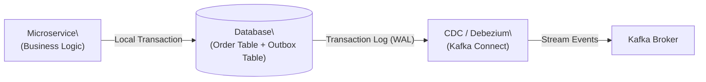

# Transactional Outbox Pattern

:::info[Who this guide is for]
- **New learners** — start at [The Dual-Write Problem](#the-dual-write-problem) and [The Analogy](#the-beginner-analogy) to understand *why* we need this pattern.
- **Senior engineers** — jump to [Relay Strategies (Polling vs CDC)](#relay-strategies), [Reliability Checklist](#reliability--failure-handling), or [Interview Questions](#interview-questions).
:::

---

## The Dual-Write Problem

In a microservices architecture, a service often needs to update its database **and** publish an event to a message broker (like Kafka or RabbitMQ) when a business action occurs.

```java
@Transactional
public Order createOrder(CreateOrderCommand cmd) {
    // 1. Write to database (Local DB Transaction)
    Order order = orderRepository.save(new Order(cmd));
    
    // 2. Publish to broker (Network Call)
    kafkaTemplate.send("orders", new OrderCreatedEvent(order)); 
    
    return order;
}
```

This causes the **Dual-Write Problem**. These are two independent systems, meaning you cannot wrap them in a single ACID transaction. If step 1 succeeds but step 2 fails (e.g., Kafka is down or network times out), the database has the new order, but downstream services never find out about it. Your system is now in an inconsistent state.

---

## The Beginner Analogy

Imagine you are a CEO writing a very important contract (the database write) and you need to mail it to your partner (the message broker).

**The Dual-Write approach:** You sign the contract, put it in an envelope, and walk outside to hand it to the mailman. But the mailman isn't there! Now you're stuck holding the envelope, and your partner never gets the contract.

**The Outbox approach:** You sign the contract and place the envelope in your office's outgoing **"Outbox" tray** on your desk. Because the Outbox tray is inside your office (the database), you know it's safe. Later, a mailroom clerk (the relay process) walks by, sees the envelope in the tray, picks it up, and takes it to the post office. If the post office is closed, the clerk just keeps trying until it's open. 

---

## How the Outbox Pattern Works

The Transactional Outbox Pattern solves the dual-write problem by writing the business entity and the event to the database **in the exact same local transaction**.

1. **The Write:** The application begins a database transaction, saves the business entity (e.g., `Order`), and inserts a record into an `outbox_events` table representing the event to be published.
2. **The Commit:** The database transaction commits. Because they are in the same local transaction, either *both* write successfully, or *neither* do. The data is safe.
3. **The Relay:** A separate background process (the "Relay") reads the `outbox_events` table and publishes the messages to the message broker.
4. **The Cleanup:** Once published successfully, the Relay deletes or marks the outbox record as processed.

### Code Example: The Write Phase (Spring Boot)

```java
@Service
public class OrderService {

    private final OrderRepository orderRepository;
    private final OutboxRepository outboxRepository;

    @Transactional // Single DB Transaction!
    public Order createOrder(CreateOrderCommand cmd) {
        // 1. Save business data
        Order order = orderRepository.save(new Order(cmd));

        // 2. Write event to outbox table IN SAME TRANSACTION
        OutboxEvent event = OutboxEvent.builder()
            .aggregateType("Order")
            .aggregateId(order.getId().toString())
            .eventType("OrderCreated")
            .payload(toJson(order))
            .status("PENDING")
            .build();
            
        outboxRepository.save(event);
        
        return order;
    }
}
```

---

## Relay Strategies

How do you get the data from the `outbox_events` table to the message broker? There are two main strategies:

### 1. Polling Publisher

A scheduled job inside your application periodically queries the outbox table for `PENDING` records.

```java
@Scheduled(fixedDelay = 1000)
public void relayEvents() {
    // Read pending events (limit batch size to avoid OOM)
    List<OutboxEvent> pending = outboxRepository.findPending(PageRequest.of(0, 100));
    
    for (OutboxEvent event : pending) {
        try {
            // Publish to Kafka
            kafkaTemplate.send(event.getAggregateType(), event.getPayload()).get();
            // Mark as published
            outboxRepository.markPublished(event.getId());
        } catch (Exception e) {
            // Stop processing this batch on failure to maintain ordering
            log.error("Failed to publish outbox event", e);
            break; 
        }
    }
}
```

- **Pros:** Very simple to implement. No extra infrastructure needed.
- **Cons:** Polling adds latency (events are delayed by the polling interval). Polling puts extra load on the database. 

### 2. Change Data Capture (CDC) with Debezium

Instead of polling, you use a tool like **Debezium**. Debezium connects directly to the database's transaction log (e.g., PostgreSQL's WAL or MySQL's binlog). When an insert happens in the `outbox_events` table, Debezium reads it from the log and instantly streams it to Kafka.



- **Pros:** Near real-time publishing (milliseconds latency). Zero polling overhead on the database query engine. Highly resilient.
- **Cons:** Requires running and managing Kafka Connect and Debezium infrastructure. More complex setup.

:::tip[Which should you use?]
Start with the **Polling Publisher** for MVPs and simple systems. Upgrade to **CDC (Debezium)** when you have high throughput requirements, need sub-second event publishing, or want to offload the relay responsibility from the application servers.
:::

---

## 🛡️ Reliability & Failure Handling

### Consumer Idempotency is Required
The Outbox Pattern guarantees **At-Least-Once** delivery, not exactly-once. 
If the Relay publishes a message to Kafka, but crashes *before* it can update the outbox table to `PUBLISHED`, it will republish that exact same message when it restarts.

:::danger[Crucial Rule]
Because the Outbox Pattern can deliver duplicate messages, **every downstream consumer must be idempotent**. They must check the event ID to ensure they haven't processed it already.
:::

### Outbox Reliability Checklist

- ✅ **Use ordered primary keys**: Ensure events are processed in the order they were generated (e.g., auto-incrementing ID or sequential UUID).
- ✅ **Clean up old data**: Outbox tables grow forever. Run a background job to delete rows marked as `PUBLISHED` that are older than X days, or move them to an archive table.
- ✅ **Handle poison pills**: If an event consistently fails to serialize or publish, it will block the relay queue. Implement a retry counter and move failed events to a Dead Letter Queue (DLQ) after a threshold.
- ✅ **Alerting**: Set up alerts if the count of `PENDING` outbox events grows too high or if the oldest `PENDING` event is older than a few minutes.

---

## Interview Questions

### 💡 For New Learners

**Q: What problem does the Outbox Pattern solve?**
**A:** It solves the "Dual-Write" problem. When an application needs to update a database and publish a message to a broker (like Kafka), it can't guarantee both will succeed simultaneously. The Outbox pattern ensures atomic execution by writing both the data and the event to the same database in a single transaction.

**Q: Where does the "outbox" live?**
**A:** The outbox is just a table inside the exact same database (and ideally the same schema) as the business data being modified. This is what allows them to share a local database transaction.

### 🧠 For Senior Engineers

**Q: Polling vs CDC for the Outbox Pattern — when would you choose one over the other?**
**A:** Polling is easier to build and doesn't require extra infrastructure, but it adds latency and database read-load. I would use CDC (like Debezium reading the Postgres WAL) when the system requires near real-time event propagation, high throughput where polling would crush the DB, or when we want to decouple the relay mechanism from the application compute nodes entirely.

**Q: How do you handle strict ordering in an outbox pattern?**
**A:** Strict ordering is hard if multiple application instances are polling the outbox table simultaneously. To solve this, you can: 1) Have only one active poller (e.g., using a distributed lock like ShedLock), 2) Use `SELECT FOR UPDATE SKIP LOCKED` combined with partitioned outbox polling, or 3) Skip polling and use a single-threaded CDC connector per partition to guarantee strict ordering based on the database transaction log.

**Q: The outbox pattern guarantees at-least-once delivery. How does this affect consumers?**
**A:** Because it guarantees at-least-once delivery, consumers *will* receive duplicates (e.g., if the relay publishes to Kafka but fails to mark the DB row as processed before crashing). Therefore, every downstream consumer must implement the Idempotent Consumer pattern, usually by tracking processed Event IDs in their own database.
