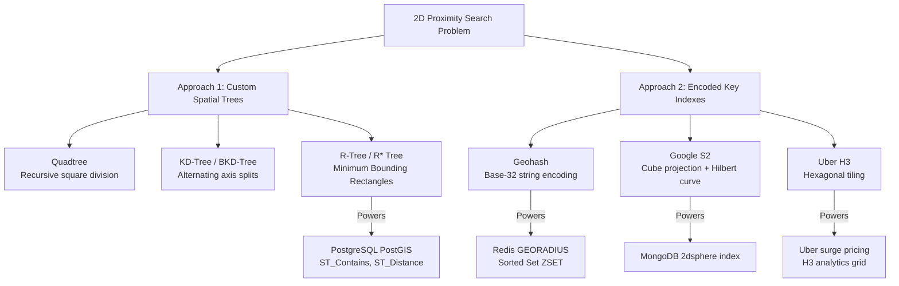
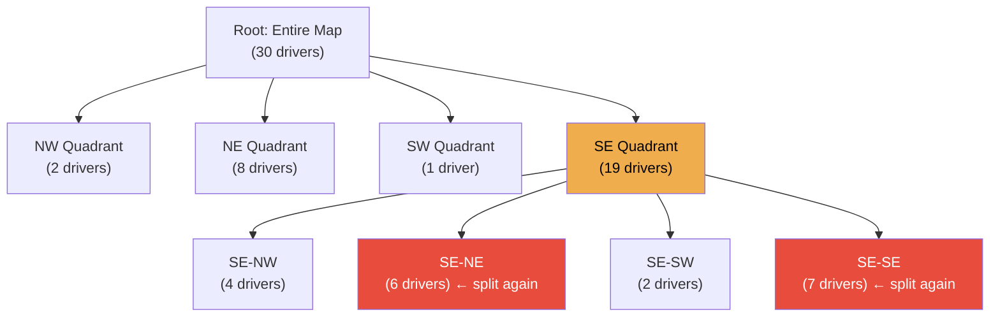
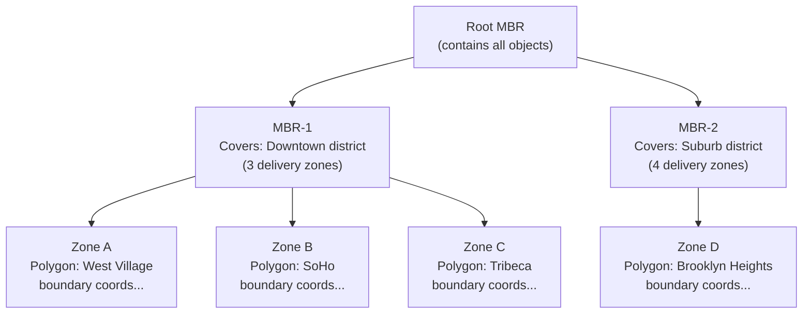
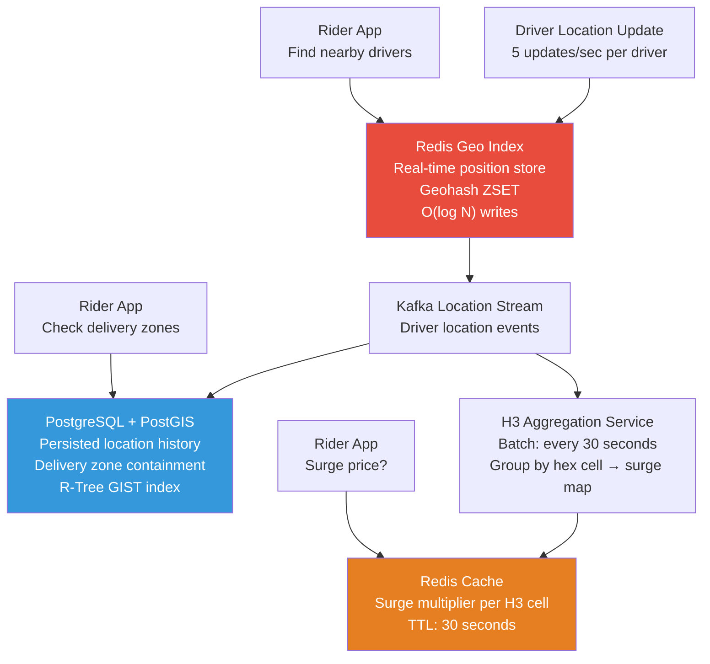

import GeospatialIndexingDiagram from '@site/src/components/GeospatialIndexingDiagram';

# Proximity Search & Geospatial Indexes

> **Proximity search** is the problem of efficiently finding all items within a given distance of a geographic point — "find the 5 nearest available drivers," "show restaurants within 2 km," "which delivery zones contain this address?" Standard database indexes fail at this problem. This guide explains why, and covers every practical solution from first principles through production implementation.

The core challenge is a dimensional mismatch: traditional database B-Trees index **one dimension** efficiently. Geographic coordinates are **two-dimensional**. Every geospatial indexing technique is fundamentally a strategy for bridging this gap — either by building natively 2D data structures, or by mathematically collapsing 2D coordinates into a 1D space that a standard B-Tree can handle.

:::info[Who this guide is for]
- **New learners** — start at [Why Standard Indexes Fail](#why-standard-indexes-fail) and [The Beginner Analogy](#beginner-analogy-the-city-map).
- **Senior engineers** — jump to [Approach 1: Spatial Trees](#approach-1-custom-spatial-trees), [Approach 2: Encoded Keys](#approach-2-encoded-key-indexes-space-filling-curves), [When They Coexist](#use-case-4-tiered-geo-index), or [Production Deep Dives](#senior-deep-dive).
:::

---

## 👶 Why Standard Indexes Fail {/* #why-standard-indexes-fail */}

Before understanding the solutions, you must deeply understand the problem.

### A Concrete Example

You have a table of 10 million restaurant locations. A user at `(lat: 40.7128, lng: -74.0060)` (New York City) wants to find all restaurants within 1 km.

**Naive attempt — two 1D range queries:**

```sql
-- Step 1: Latitude range (1 km ≈ 0.009 degrees)
SELECT * FROM restaurants
WHERE lat BETWEEN 40.7038 AND 40.7218  -- Latitude band: returns ~100,000 rows
  AND lng BETWEEN -74.0150 AND -73.9970; -- Longitude band: intersected down to ~10,000

-- Still need to compute actual distance for each of those 10,000 rows
-- and filter to the ~200 that are truly within 1 km
```

This works, but it has a critical hidden cost: **locality tearing**.

### The Locality Tearing Problem

Sorting coordinates along a single axis destroys geographic proximity. Two restaurants one block apart in Manhattan may be sorted millions of rows apart in a longitude-sorted index — because every restaurant in New Jersey, Philadelphia, and beyond falls between them in the sort order.

```
Longitude-sorted index (excerpt):
  Row 1,000,000:  Restaurant A, lng = -74.006001  (West Village, Manhattan)
  Row 1,000,001:  Restaurant B, lng = -74.006000  (West Village, Manhattan — one block from A)
  ... BUT ...
  Row   500,000:  Restaurant C, lng = -74.006050  (West Village, Manhattan — also one block from A)
                  ↑ Sorted BEFORE A because of a tiny longitude difference
```

In a real scenario the index would place geographically close items far apart, meaning range scans on one dimension pull enormous result sets from the wrong parts of the world.

### The Intersection Bottleneck

Even with two separate indexes (one on `lat`, one on `lng`), the database must:
1. Scan the latitude index → get a set of row IDs (potentially millions)
2. Scan the longitude index → get another set of row IDs
3. **Intersect** both sets in memory
4. For each surviving row, calculate `ST_Distance(point, user_location)` to verify true proximity

Step 3 is an in-memory set intersection on potentially millions of IDs. Step 4 applies Haversine distance calculations row-by-row. For 10 million restaurants and frequent queries, this is catastrophically slow.

---

## 👶 Beginner Analogy: The City Map {/* #beginner-analogy-the-city-map */}

Imagine you are trying to find all coffee shops within a 10-minute walk from your hotel.

**The B-Tree approach (wrong):** You have a phone book sorted alphabetically by shop name. To find nearby shops, you read the entire phone book, note every shop's address, calculate the walking distance to each one, and keep the ones within 10 minutes. Technically correct. Practically useless.

**The Grid approach (Geohash):** You overlay the city with a grid of numbered squares. Your hotel is in Square 47B. You look up all coffee shops in Square 47B and its eight neighboring squares — a tiny lookup with no distance calculations needed upfront.

**The Tree approach (Quadtree / R-Tree):** A city guide that divides the city into districts. If a district has too many shops to list, it is split into four sub-districts. To find nearby shops you walk down the tree: "City → Downtown → West Downtown → Block 12" — a tiny number of steps to find exactly the right shops.

**The Hexagon approach (H3):** Same as the grid, but using hexagons instead of squares. Every hexagon has exactly six neighbors at equal distance — unlike squares, where the four corner neighbors are further away than the four edge neighbors. This makes "expand the search radius by one ring" mathematically clean.

---

## 🔢 The Fundamental Approaches {/* #the-fundamental-approaches */}

Every geospatial indexing system is a variant of one of two strategies:



---

## 🌳 Approach 1: Custom Spatial Trees {/* #approach-1-custom-spatial-trees */}

Spatial trees are purpose-built data structures that partition multidimensional space natively. Rather than sorting coordinates along a single axis, they recursively divide 2D space into manageable regions, keeping geographically close items physically close in the index.

### Quadtree (1974)

**How it works:**

A Quadtree starts with a bounding box for the entire map. When a region accumulates more than a threshold number of points (e.g., 4), it splits into four equal quadrants: NW, NE, SW, SE. Each quadrant is a node in the tree. Splitting continues recursively until every leaf node is below the threshold.



**Proximity query:** To find all drivers within radius R of point P, traverse the tree. At each node, check if the query circle intersects the node's bounding box. If it does, recurse into children. If a node's box is entirely inside the circle, include all its points without recursing. If it does not intersect, prune the entire subtree — this is the key performance win.

```
Query: Find drivers within 2 km of point P
    Root: Circle intersects root? YES → recurse
        NW: Circle intersects NW? NO → ✂️ prune (skip 2 drivers)
        NE: Circle intersects NE? YES → recurse
            NE has 3 drivers → check each distance → 2 match
        SW: Circle intersects SW? NO → ✂️ prune (skip 1 driver)
        SE: Circle intersects SE? YES → recurse
            SE_NW: Entirely inside circle? YES → include all 4 drivers
            SE_NE: Intersects? YES → recurse (6 drivers → check each)
            ...

Result: O(log N + k) where k is the number of results
```

**Strengths:**
- Density-adaptive: dense urban areas (Manhattan) nest deeply while sparse areas (oceans) remain shallow nodes.
- Simple to implement in memory for real-time tracking with frequent updates.
- Natural fit for in-memory driver location tracking.

**Weaknesses:**
- Splits at geometric midpoints, not data midpoints — creating unpredictable tree depth across heterogeneous data distributions.
- In-memory implementation does not survive process restarts without persistence logic.
- Random memory pointer traversal causes poor cache locality and disk I/O bottlenecks when the dataset exceeds RAM.
- Not suited for complex polygon queries.

**Production use:** In-memory driver location caches in ride-sharing apps. Not used directly in persistent databases (R-Trees fill that role).

---

### KD-Tree (1975) and BKD-Tree (Modern)

**How it works:**

A KD-Tree (K-Dimensional Tree) is a binary tree that alternates the splitting dimension at each level. At depth 0, split by longitude. At depth 1, split by latitude. At depth 2, split by longitude again. The split point at each level is the **median** of the current dimension — ensuring a balanced tree.

```
Level 0 (split on longitude):
    Left subtree:  all points with lng < median_lng
    Right subtree: all points with lng ≥ median_lng

Level 1 (split on latitude within each subtree):
    Left-Left:  lng < median_lng AND lat < median_lat
    Left-Right: lng < median_lng AND lat ≥ median_lat
    ...
```

**BKD-Tree (Block KD-Tree):** The modern production evolution used by Elasticsearch's `geo_point` type. It packs points into disk-page-sized blocks (like a B-Tree) rather than using pointer-based nodes, achieving excellent disk locality and cache performance for range queries.

**Strengths:**
- Balanced tree depth — no density-adaptive quirks.
- Extremely fast nearest-neighbor queries.
- BKD-Tree achieves B-Tree-like disk locality.

**Weaknesses:**
- BKD-Trees are **immutable** (or append-only with periodic merges) — they are optimized for bulk construction and read performance, not high-frequency individual updates. Updating a driver's location 5 times per second across millions of drivers is impractical.
- Not suitable for complex polygon containment queries.

**Production use:** Elasticsearch `geo_point` field with `geo_distance` queries — optimized for searching static or slowly-changing geospatial data (points of interest, business locations).

---

### R-Tree and R* Tree (1984)

**How it works:**

The R-Tree is the gold standard for persistent, disk-based spatial indexing of complex geometries. It groups nearby spatial objects into **Minimum Bounding Rectangles (MBRs)** — the tightest axis-aligned rectangle that contains all the objects in a group. These MBRs are then grouped into larger MBRs at the next level, all the way up to the root.



**Query for "Is point P inside any delivery zone?":**
1. Check if P is inside Root MBR — yes (root contains everything).
2. Check if P is inside MBR-1 — yes. Recurse into its children.
3. Check if P is inside MBR-2 — no. Prune entire subtree.
4. Among MBR-1's children, check Zone A, B, C individually using exact polygon math.

**The MBR overlap problem:** MBRs at the same level can overlap each other. If point P falls inside two overlapping MBRs, the engine must traverse both subtrees. The **R* Tree** uses superior insertion heuristics — minimizing both MBR area and perimeter overlap — to reduce multi-path traversals.

```
R-Tree weakness:
    MBR-1 and MBR-2 overlap in the midtown area
    → A query for midtown traverses BOTH subtrees
    → O(log N) degrades toward O(N) in worst case

R* Tree improvement:
    Insertion algorithm minimizes overlap during tree construction
    → Fewer dual-subtree traversals in practice
```

**Strengths:**
- Handles arbitrary geometries: polygons, lines, multipolygons, circles.
- Disk-based and persistent — production-grade for relational databases.
- Powers `ST_Contains`, `ST_Intersects`, `ST_Distance` in PostGIS.
- Balanced tree — consistent query performance.
- Supports spatial joins: "find all delivery zones that intersect this highway."

**Weaknesses:**
- High write cost: every insert or update recalculates MBRs up the tree. Unsuitable for high-frequency point updates (e.g., tracking 500,000 moving drivers).
- Requires PostGIS or Oracle Spatial — not available in a vanilla PostgreSQL or MySQL.

**Production use:** PostGIS `GIST` index for delivery zones, geofencing polygons, store coverage areas, territory management. Anything involving complex shapes.

---

## 🗺️ Approach 2: Encoded Key Indexes (Space-Filling Curves) {/* #approach-2-encoded-key-indexes-space-filling-curves */}

Instead of building custom tree structures, this approach mathematically transforms 2D coordinates into a single 1D integer or string. A standard B-Tree can then index this 1D key — making proximity search a standard range scan, usable with any database.

The mathematical magic is the **Space-Filling Curve** — a path that visits every point in a 2D grid exactly once while maximizing spatial locality (nearby 2D points map to nearby 1D values).

<GeospatialIndexingDiagram initialTab="hilbert" />

---

### Geohash (2008)

**How it works:**

Geohash interleaves the binary representations of latitude and longitude to produce a single integer, then Base-32 encodes it into a human-readable string.

```
Point: lat = 40.7128, lng = -74.0060 (New York City)

Step 1: Encode latitude as binary (divide range in half repeatedly)
    World lat range: [-90, 90]
    40.7128 > 0 → bit 1 → range [0, 90]
    40.7128 < 45 → bit 0 → range [0, 45]
    40.7128 > 22.5 → bit 1 → range [22.5, 45]
    ...continuing to desired precision...
    lat binary: 10111 00011 01001...

Step 2: Encode longitude as binary similarly
    lng binary: 01001 10000 11011...

Step 3: Interleave bits (longitude first for Geohash)
    Combined: 0110 1110 0001 1100 0110 1001 ...

Step 4: Group into 5-bit chunks and Base-32 encode
    0 = '0', 1 = '1', ..., 9 = '9', 10 = 'b', ...
    Result: "dr5ru6"
```

**Precision levels:**

| Length | Cell Size | Use Case |
|---|---|---|
| 1 | 5,000 km × 5,000 km | Continent-level |
| 4 | 40 km × 20 km | City-level |
| 5 | 4.9 km × 4.9 km | District-level |
| 6 | 1.2 km × 0.6 km | Neighborhood-level |
| 7 | 152 m × 152 m | Street-level |
| 8 | 38 m × 19 m | Building-level |
| 9 | 4.8 m × 4.8 m | Room-level |

**Prefix proximity:** Cells sharing a longer prefix are geographically contained within the parent cell. `dr5ru6` is inside `dr5ru`, which is inside `dr5r`, which is inside `dr5`.

```sql
-- Prefix range scan — hits a standard B-Tree index
-- Find all drivers in the same or neighboring Geohash cells
SELECT * FROM drivers
WHERE geohash_6 IN ('dr5ru6', 'dr5ru7', 'dr5ru4', 'dr5ru5', 'dr5rug', 'dr5ruf', 'dr5rue', 'dr5rud', 'dr5ru3')
  AND ST_Distance(location, ST_MakePoint(-74.0060, 40.7128)) < 1000;
-- 9-cell neighbor scan eliminates boundary artifacts
```

**The boundary artifact — why 9 cells are needed:**

```
Cell dr5ru6: covers lat [40.708, 40.713], lng [-74.009, -74.003]

Point A: lat=40.7129, lng=-74.0061 → cell dr5ru6
Point B: lat=40.7131, lng=-74.0059 → cell dr5ru7  ← different cell!

Distance A→B: ~25 meters
But different Geohash cells → a simple single-cell lookup misses B entirely

Fix: Always query the target cell + all 8 surrounding cells (the "3x3 ring")
```

---

### Google S2 (2011)

**How it works:**

Geohash treats the Earth as a flat rectangle (Mercator projection). This creates distortion: cells near the poles are tiny in reality but the same string length as cells at the equator. Polygons crossing the anti-meridian (180° longitude) are also problematic — they wrap around and break Geohash prefix logic.

S2 solves this by using a completely different projection:

```
Step 1: Project the spherical Earth onto a cube
    The cube has 6 faces. Each face covers roughly 1/6 of the Earth's surface.
    Face 0: Front (+X)
    Face 1: Back (-X)
    Face 2: Right (+Y)
    Face 3: Left (-Y)
    Face 4: Top (+Z)    ← covers North Pole
    Face 5: Bottom (-Z) ← covers South Pole

Step 2: Apply a quadtree subdivision to each face
    Each face is recursively divided into 4 cells.
    30 levels of subdivision = ~1 cm² cells

Step 3: Traverse the cells using a Hilbert Space-Filling Curve
    Cells are numbered along the Hilbert curve for maximum locality preservation
    → Two nearby cells on Earth have nearby 64-bit S2 IDs
```

**S2 CellID:** Every point on Earth maps to a 64-bit integer. The cell hierarchy is navigated by right-shifting the bits.

```java
// Using Google S2 Java library
S2LatLng point = S2LatLng.fromDegrees(40.7128, -74.0060);
S2CellId cellId = S2CellId.fromLatLng(point);

// Get cell at level 12 (≈ 3.3 km² cells)
S2CellId cell12 = cellId.parent(12);

// Get all neighboring cells (for boundary-safe proximity search)
List<S2CellId> neighbors = new ArrayList<>();
cell12.getAllNeighbors(12, neighbors);
// neighbors contains the 8 surrounding cells — safe for radius search
```

**S2 advantages over Geohash:**
- Equal-area cells globally — no polar distortion.
- Handles anti-meridian crossings naturally (no wraparound bugs).
- Supports complex polygon covering: represent any polygon as a union of S2 cells, with a controllable precision/cell-count trade-off.
- Powers MongoDB's `2dsphere` index and Google Maps internals.

---

### Uber H3 (2018)

**How it works:**

H3 tiles the globe using a hierarchical system of **hexagons** with 15 resolution levels. At resolution 0, there are 122 base cells (110 hexagons + 12 pentagons at icosahedron vertices). Each cell is subdivided into ~7 children at the next resolution level.

**Why hexagons instead of squares?**

<GeospatialIndexingDiagram initialTab="h3_hexagons" />

**Expanding radius by one ring:**

```
H3 ring expansion (each ring adds equidistant neighbors):

Ring 0 (origin):    1 cell
Ring 1 (adjacent):  6 cells (all equidistant)
Ring 2:             12 cells (all equidistant)
Ring 3:             18 cells (all equidistant)
Ring k:             6k cells

Total cells within radius k: 1 + 6*(1+2+...+k) = 3k² + 3k + 1
```

```java
// Uber H3 Java library
H3Core h3 = H3Core.newInstance();

// Encode a point to H3 cell at resolution 9 (≈ 174 m² cells)
long h3Index = h3.geoToH3(40.7128, -74.0060, 9);

// Get all cells within 2 rings (k=2 ring expansion)
List<Long> kRing = h3.kRing(h3Index, 2);
// Returns 19 cells — all at approximately equal distances

// Get just the ring (not filled disk) — for annular queries
List<Long> ring1 = h3.hexRing(h3Index, 1); // 6 cells
List<Long> ring2 = h3.hexRing(h3Index, 2); // 12 cells
```

**H3 cell sizes by resolution:**

| Resolution | Avg Cell Area | Avg Edge Length | Use Case |
|---|---|---|---|
| 3 | 12,393 km² | 59 km | Country-level |
| 6 | 36.1 km² | 3.2 km | City district |
| 7 | 5.16 km² | 1.2 km | Neighborhood |
| 9 | 0.105 km² | 174 m | Block-level |
| 10 | 0.0150 km² | 65 m | Building-level |
| 11 | 0.00214 km² | 24 m | Room-level |

**Production use:** Uber surge pricing (aggregate driver density per hexagon, compute surge multiplier per cell), dispatch heatmaps, ETAs, coverage analysis. H3 excels at any spatial analytics workload — not just point lookup, but region-level aggregation.

---

## ⚖️ Alternatives & Decision Framework {/* #alternatives-decision-framework */}

### Full Comparison Matrix

| Criterion | Quadtree | KD-Tree / BKD-Tree | R-Tree / R* Tree | Geohash | Google S2 | Uber H3 |
|---|---|---|---|---|---|---|
| **Data type** | Points | Points | Points + shapes | Points | Points + polygons | Points + regions |
| **Write throughput** | ✅ High (in-memory) | ❌ Low (immutable BKD) | ⚠️ Moderate | ✅ Very high | ✅ Very high | ✅ Very high |
| **Complex shapes** | ❌ No | ❌ No | ✅ Yes (polygons, lines) | ❌ No | ✅ Yes (cell covering) | ⚠️ Approximate |
| **Boundary artifacts** | ❌ Yes (split lines) | ❌ Yes | ✅ No | ❌ Yes (fix: 9-cell scan) | ✅ Minimal | ✅ Minimal |
| **Polar distortion** | ❌ Yes (flat earth) | ❌ Yes | ⚠️ Depends on SRID | ❌ Yes | ✅ No | ✅ No |
| **Anti-meridian support** | ❌ | ❌ | ✅ | ❌ | ✅ | ✅ |
| **Standard DB support** | ❌ Application-layer | ✅ Elasticsearch | ✅ PostGIS | ✅ Redis, any DB | ✅ MongoDB | ✅ BigQuery, DuckDB |
| **Aggregation / analytics** | ❌ | ❌ | ⚠️ Limited | ⚠️ Limited | ⚠️ Limited | ✅ Designed for it |
| **Density-adaptive** | ✅ Yes | ✅ Yes | ✅ Yes | ❌ Fixed grid | ❌ Fixed grid | ❌ Fixed grid |
| **Operational complexity** | Medium (custom code) | Low (use Elasticsearch) | Low (use PostGIS) | Very low | Low | Low |

---

### Choosing the Right Approach

```
What is your primary data type?
│
├── POINTS only (driver locations, user positions, POIs)
│   │
│   ├── High write frequency? (>1 update/sec per entity, millions of entities)
│   │   └── → Encoded Key Index: Redis GEORADIUS (Geohash internally)
│   │
│   ├── Read-heavy, slow-changing data? (restaurants, stores, landmarks)
│   │   └── → BKD-Tree: Elasticsearch geo_point
│   │
│   ├── Need aggregation, heatmaps, surge zones?
│   │   └── → H3: Group points into hexagonal cells for analytics
│   │
│   └── Standard relational DB, moderate write rate?
│       └── → PostGIS GIST index with ST_DWithin
│
└── SHAPES (polygons, delivery zones, geofences, territories)
    │
    ├── Need exact containment / intersection?
    │   └── → R-Tree via PostGIS: ST_Contains, ST_Intersects
    │
    ├── Large-scale polygon covering / region queries?
    │   └── → Google S2: cell-union polygon representation
    │
    └── Analytics over regions?
        └── → H3: aggregate point data per hexagonal cell
```

---

## ⚙️ Production Implementation: Java & Spring Boot {/* #production-implementation-java-spring-boot */}

### Use Case 1: Real-Time Driver Tracking (Redis Geohash)

Redis internally stores geographic coordinates as 52-bit Geohash integers inside a Sorted Set (ZSET). This gives you O(log N) write performance and O(log N + k) proximity query performance using a standard skip-list.

```java
@Service
@RequiredArgsConstructor
public class DriverTrackingService {

    private final RedisTemplate<String, String> redisTemplate;
    private static final String DRIVER_GEO_KEY = "active_drivers";

    /**
     * High-frequency write: O(log N) — updates Geohash integer in ZSET.
     * Safe for millions of updates per second across all drivers.
     */
    public void updateLocation(String driverId, double longitude, double latitude) {
        redisTemplate.opsForGeo()
                .add(DRIVER_GEO_KEY, new Point(longitude, latitude), driverId);
    }

    /**
     * Proximity search: finds drivers within radiusKm, sorted by distance.
     * Redis internally handles the 9-cell neighbor scan to eliminate boundary artifacts.
     */
    public List<NearbyDriver> findNearbyDrivers(
            double longitude, double latitude, double radiusKm, int maxResults) {

        GeoSearchArgs args = GeoSearchArgs.from(longitude, latitude)
                .byRadius(radiusKm, Metrics.KILOMETERS)
                .sortAscending()
                .count(maxResults);

        GeoResults<RedisGeoCommands.GeoLocation<String>> results =
                redisTemplate.opsForGeo().search(DRIVER_GEO_KEY, args);

        return results.getContent().stream()
                .map(r -> NearbyDriver.builder()
                        .driverId(r.getContent().getName())
                        .distanceKm(r.getDistance().getValue())
                        .longitude(r.getContent().getPoint().getX())
                        .latitude(r.getContent().getPoint().getY())
                        .build())
                .toList();
    }

    /**
     * Driver goes offline — remove from the geo index.
     */
    public void removeDriver(String driverId) {
        redisTemplate.opsForGeo().remove(DRIVER_GEO_KEY, driverId);
    }

    /**
     * Get raw Geohash string for a driver — useful for cell-based partitioning.
     */
    public Optional<String> getDriverGeohash(String driverId, GeoHashCommandArgs.Precision precision) {
        List<String> hashes = redisTemplate.opsForGeo()
                .hash(DRIVER_GEO_KEY, driverId);
        return hashes.isEmpty() ? Optional.empty() : Optional.ofNullable(hashes.get(0));
    }
}
```

```java
// REST controller
@RestController
@RequestMapping("/api/drivers")
@RequiredArgsConstructor
public class DriverController {

    private final DriverTrackingService trackingService;

    @PutMapping("/{driverId}/location")
    public ResponseEntity<Void> updateLocation(
            @PathVariable String driverId,
            @RequestBody LocationUpdate location) {
        trackingService.updateLocation(driverId, location.getLongitude(), location.getLatitude());
        return ResponseEntity.ok().build();
    }

    @GetMapping("/nearby")
    public List<NearbyDriver> getNearbyDrivers(
            @RequestParam double longitude,
            @RequestParam double latitude,
            @RequestParam(defaultValue = "5.0") double radiusKm,
            @RequestParam(defaultValue = "10") int limit) {
        return trackingService.findNearbyDrivers(longitude, latitude, radiusKm, limit);
    }
}
```

---

### Use Case 2: Delivery Zone Containment (PostGIS R-Tree)

When a user submits an address, check which delivery zones service that address. This is a polygon containment problem — the domain of R-Trees via PostGIS.

```sql
-- Schema with PostGIS GIST index (R-Tree)
CREATE TABLE delivery_zones (
    id          BIGSERIAL PRIMARY KEY,
    restaurant_id BIGINT NOT NULL,
    name        VARCHAR(255) NOT NULL,
    boundary    GEOMETRY(POLYGON, 4326) NOT NULL, -- SRID 4326 = WGS84 (GPS coordinates)
    min_order   DECIMAL(10, 2),
    delivery_fee DECIMAL(10, 2)
);

-- GIST index = PostGIS R-Tree — required for ST_Contains performance
CREATE INDEX idx_delivery_zones_boundary ON delivery_zones USING GIST (boundary);

-- Sample insert: delivery zone as a polygon
INSERT INTO delivery_zones (restaurant_id, name, boundary)
VALUES (
    1,
    'West Village Zone',
    ST_GeomFromText(
        'POLYGON((-74.010 40.728, -74.004 40.728, -74.004 40.735, -74.010 40.735, -74.010 40.728))',
        4326
    )
);
```

```java
@Entity
@Table(name = "delivery_zones")
public class DeliveryZone {

    @Id @GeneratedValue(strategy = GenerationType.IDENTITY)
    private Long id;

    private Long restaurantId;
    private String name;

    @Column(columnDefinition = "geometry(Polygon, 4326)")
    private org.locationtech.jts.geom.Polygon boundary;

    private BigDecimal minOrder;
    private BigDecimal deliveryFee;
}
```

```java
@Repository
public interface DeliveryZoneRepository extends JpaRepository<DeliveryZone, Long> {

    /**
     * ST_Contains uses the GIST (R-Tree) index — fast polygon containment.
     * Returns all zones that contain the user's location point.
     */
    @Query(value = """
            SELECT dz.* FROM delivery_zones dz
            WHERE ST_Contains(
                dz.boundary,
                ST_SetSRID(ST_MakePoint(:longitude, :latitude), 4326)
            )
            ORDER BY dz.delivery_fee ASC
            """, nativeQuery = true)
    List<DeliveryZone> findZonesContaining(
            @Param("longitude") double longitude,
            @Param("latitude") double latitude);

    /**
     * Nearby zones within a radius — even if the point is outside them.
     * Uses ST_DWithin which leverages the GIST index for fast filtering.
     */
    @Query(value = """
            SELECT dz.*, ST_Distance(
                dz.boundary::geography,
                ST_SetSRID(ST_MakePoint(:longitude, :latitude), 4326)::geography
            ) AS distance_meters
            FROM delivery_zones dz
            WHERE ST_DWithin(
                dz.boundary::geography,
                ST_SetSRID(ST_MakePoint(:longitude, :latitude), 4326)::geography,
                :radiusMeters
            )
            ORDER BY distance_meters ASC
            """, nativeQuery = true)
    List<DeliveryZoneWithDistance> findZonesNear(
            @Param("longitude") double longitude,
            @Param("latitude") double latitude,
            @Param("radiusMeters") double radiusMeters);
}
```

---

### Use Case 3: Surge Pricing Heatmap (H3 Aggregation)

Aggregate driver and rider counts per hexagonal cell to compute per-cell demand ratios for surge pricing.

```java
@Service
@RequiredArgsConstructor
public class SurgePricingService {

    private final H3Core h3;
    private final DriverRepository driverRepository;
    private final RideRequestRepository rideRequestRepository;

    private static final int SURGE_RESOLUTION = 9; // ~174 m cells
    private static final double SURGE_THRESHOLD = 2.0; // 2:1 rider:driver ratio

    /**
     * Compute surge multiplier per H3 cell from raw location data.
     * Run this periodically (e.g., every 30 seconds) and cache the result.
     */
    public Map<Long, Double> computeSurgeMap(BoundingBox area) {
        // 1. Load all active drivers and encode to H3 cells
        Map<Long, Long> driversPerCell = driverRepository.findActiveInArea(area)
                .stream()
                .collect(groupingBy(
                        d -> h3.geoToH3(d.getLatitude(), d.getLongitude(), SURGE_RESOLUTION),
                        counting()
                ));

        // 2. Load all pending ride requests and encode to H3 cells
        Map<Long, Long> requestsPerCell = rideRequestRepository.findPendingInArea(area)
                .stream()
                .collect(groupingBy(
                        r -> h3.geoToH3(r.getLatitude(), r.getLongitude(), SURGE_RESOLUTION),
                        counting()
                ));

        // 3. Compute surge multiplier per cell
        Map<Long, Double> surgeMap = new HashMap<>();
        Set<Long> allCells = new HashSet<>();
        allCells.addAll(driversPerCell.keySet());
        allCells.addAll(requestsPerCell.keySet());

        for (Long cellId : allCells) {
            double drivers = driversPerCell.getOrDefault(cellId, 0L);
            double requests = requestsPerCell.getOrDefault(cellId, 0L);

            if (drivers == 0) {
                surgeMap.put(cellId, requests > 0 ? 3.0 : 1.0); // No drivers → max surge
            } else {
                double ratio = requests / drivers;
                surgeMap.put(cellId, Math.max(1.0, ratio)); // Min 1.0x
            }
        }

        return surgeMap;
    }

    /**
     * Get the surge multiplier for a specific pickup point.
     * Smooths the value by averaging across the k=1 ring for no cliff edges.
     */
    public double getSurgeMultiplier(double latitude, double longitude,
                                     Map<Long, Double> surgeMap) {
        long cellId = h3.geoToH3(latitude, longitude, SURGE_RESOLUTION);

        // Include the cell's neighbors for smoother surge boundaries
        List<Long> ring = new ArrayList<>();
        ring.add(cellId);
        ring.addAll(h3.kRing(cellId, 1));

        return ring.stream()
                .mapToDouble(c -> surgeMap.getOrDefault(c, 1.0))
                .average()
                .orElse(1.0);
    }
}
```

---

### Use Case 4: Tiered Geo Index

Production ride-sharing systems combine all three approaches in a tiered architecture:



**Why each layer:**
- **Redis Geo** handles the real-time position store — millions of writes per second from driver location updates.
- **PostGIS** handles zone containment — complex polygon math that Redis cannot express.
- **H3 cache** handles surge pricing — pre-aggregated per cell, refreshed every 30 seconds, never computed per-request.

---

## 🧠 Senior Deep Dive {/* #senior-deep-dive */}

### 1. The Haversine vs. Euclidean Distance Problem

Every geospatial system must decide which distance formula to use. The choice has correctness and performance implications.

**Euclidean distance (wrong for large distances):**

```java
// ❌ Only valid for very small distances (< 100 km) at mid-latitudes
double euclidean = Math.sqrt(
        Math.pow(lat2 - lat1, 2) + Math.pow(lng2 - lng1, 2)
);
// At equator: roughly correct
// At 60° latitude: longitude degrees are half the physical width → 40% error!
```

**Haversine formula (correct for spherical Earth):**

```java
// ✅ Haversine — correct for spherical Earth, fast to compute
public static double haversineKm(double lat1, double lng1, double lat2, double lng2) {
    final double R = 6371.0; // Earth radius in km
    double dLat = Math.toRadians(lat2 - lat1);
    double dLng = Math.toRadians(lng2 - lng1);
    double a = Math.sin(dLat / 2) * Math.sin(dLat / 2)
            + Math.cos(Math.toRadians(lat1)) * Math.cos(Math.toRadians(lat2))
            * Math.sin(dLng / 2) * Math.sin(dLng / 2);
    double c = 2 * Math.atan2(Math.sqrt(a), Math.sqrt(1 - a));
    return R * c;
}
// Error vs. true geodesic: < 0.3% for distances under 10,000 km
```

**Vincenty / geodetic formula:** For distances over 10,000 km or near-polar coordinates, Haversine error accumulates. Vincenty's formula uses an oblate spheroid Earth model — but it is ~10x slower. Use only for global-scale applications (intercontinental flight routing, satellite tracking).

**PostGIS automatically handles this:**

```sql
-- Cast to geography type — PostGIS uses geodetic calculations automatically
SELECT ST_Distance(
    ST_SetSRID(ST_MakePoint(-74.0060, 40.7128), 4326)::geography,
    ST_SetSRID(ST_MakePoint(-73.9857, 40.7484), 4326)::geography
) AS distance_meters;
-- Returns: 5570.48 (meters) — geodetically correct
-- vs. ST_Distance on geometry (not geography): returns degrees, not meters
```

---

### 2. Index Design for High-Cardinality Point Data (PostgreSQL)

For point data in PostgreSQL without PostGIS, the right index choice is non-obvious.

```sql
-- Option A: GIST index with PostGIS geometry type
CREATE INDEX idx_drivers_location_gist
    ON drivers USING GIST (location);
-- ✅ Best for proximity queries (ST_DWithin, ST_Distance)
-- ✅ Handles complex shapes
-- ❌ Slower writes than BRIN

-- Option B: BRIN index (Block Range INdex) — for INSERT-heavy append-only tables
CREATE INDEX idx_location_history_brin
    ON driver_location_history USING BRIN (recorded_at, location);
-- ✅ Very small index size (< 1% of GIST)
-- ✅ Excellent for append-only tables where rows are physically ordered by time
-- ❌ Only useful when physical row order correlates with query predicate

-- Option C: Partial GIST index — only active drivers
CREATE INDEX idx_active_drivers_location
    ON drivers USING GIST (location)
    WHERE status = 'ACTIVE';
-- ✅ Smaller index = faster queries
-- ✅ Only indexes the 5% of drivers currently active
-- ❌ Partial index not used for queries that don't include the WHERE clause predicate
```

**ST_DWithin vs. ST_Distance — why it matters:**

```sql
-- ❌ SLOW: ST_Distance does not use the GIST index for filtering
SELECT * FROM drivers
WHERE ST_Distance(location::geography,
                  ST_MakePoint(-74.006, 40.713)::geography) < 1000;
-- Full table scan — computes distance for every row, then filters

-- ✅ FAST: ST_DWithin uses the GIST index for an indexed bounding box pre-filter
SELECT * FROM drivers
WHERE ST_DWithin(location::geography,
                 ST_MakePoint(-74.006, 40.713)::geography, 1000);
-- GIST prunes non-candidate rows before distance computation
-- Effectively: index scan → bounding box filter → exact distance filter
```

---

### 3. Handling the Anti-Meridian and Polar Edge Cases

Systems that operate globally must handle two geographic pathologies:

**Anti-meridian (180° longitude):** A geofence that straddles the International Date Line has coordinates like `[170°, -170°]`. In a flat coordinate system, this appears as a line crossing the entire Pacific Ocean.

```sql
-- ❌ Wrong: ST_MakePolygon with raw coordinates crossing anti-meridian
-- The polygon appears to wrap around the globe the wrong way

-- ✅ Correct: Use geography type — PostGIS handles anti-meridian automatically
SELECT ST_Area(
    ST_MakeEnvelope(170, -10, -170, 10, 4326)::geography
) AS area_m2;
-- geography type interprets this as the correct small Pacific region
-- geometry type would interpret it as a giant rectangle covering almost all longitudes
```

**Polar coordinates:** Longitude lines converge at the poles. A 1 km radius circle at the North Pole covers all 360° of longitude — no B-Tree range scan on longitude makes sense.

```sql
-- PostGIS geography type handles polar regions correctly
-- For S2 and H3, the special 12 pentagons in H3 handle icosahedron vertices near poles
-- Always use geographic (spherical) calculations, not geometric (planar) for global data
```

---

### 4. Sharding a Geospatial Index at Scale

At 100M+ active entities, a single Redis instance or single PostGIS table is insufficient. Sharding strategies:

**Geohash-based sharding:**

```java
// Route writes and reads to the correct shard based on the Geohash prefix
public class GeoShardRouter {

    private final Map<String, RedisTemplate<String, String>> shards;

    // Shard 0: Geohash cells starting with 0-9
    // Shard 1: Geohash cells starting with b-j
    // Shard 2: Geohash cells starting with k-z
    private static final Map<Character, Integer> CHAR_TO_SHARD = buildShardMap();

    public RedisTemplate<String, String> getShardForLocation(double lng, double lat) {
        String geohash = GeoHash.encodeHash(lat, lng, 1); // 1-char prefix
        int shardIndex = CHAR_TO_SHARD.get(geohash.charAt(0));
        return shards.get("shard-" + shardIndex);
    }
}
```

**Cross-shard proximity queries:**

```
Problem: A driver near a shard boundary (e.g., Geohash cell border)
         has neighbors in an adjacent shard

Solution:
    1. Compute the target cell and all 8 neighbors
    2. Determine which shards own each of the 9 cells
    3. Query all relevant shards in parallel
    4. Merge and sort results by distance
    5. Return top-K
```

```java
public List<NearbyDriver> findNearbyAcrossShards(double lng, double lat, double radiusKm) {
    String centerCell = GeoHash.encodeHash(lat, lng, 6);
    Set<String> neighborCells = GeoHash.neighbors(centerCell);
    neighborCells.add(centerCell); // 9-cell ring

    // Group cells by target shard
    Map<Integer, Set<String>> cellsByShardId = neighborCells.stream()
            .collect(groupingBy(cell -> CHAR_TO_SHARD.get(cell.charAt(0)), toSet()));

    // Query shards in parallel
    List<CompletableFuture<List<NearbyDriver>>> futures = cellsByShardId.entrySet()
            .stream()
            .map(e -> CompletableFuture.supplyAsync(() ->
                    queryShard(e.getKey(), lng, lat, radiusKm, e.getValue())))
            .toList();

    return futures.stream()
            .map(CompletableFuture::join)
            .flatMap(List::stream)
            .sorted(Comparator.comparingDouble(NearbyDriver::getDistanceKm))
            .limit(10)
            .toList();
}
```

---

### 5. Observability: What to Monitor

```java
// Micrometer metrics for a geo index service
@Component
@RequiredArgsConstructor
public class GeoMetrics {

    private final MeterRegistry registry;

    // Track proximity query latency — alert if p99 > 50ms
    public <T> T timeProximityQuery(String indexType, Supplier<T> query) {
        return Timer.builder("geo.proximity.query.duration")
                .tag("index_type", indexType) // "redis_geohash", "postgis_rtree", "h3"
                .publishPercentiles(0.5, 0.95, 0.99)
                .register(registry)
                .record(query);
    }

    // Track active entities in the geo index — alert if drops unexpectedly
    public void recordIndexSize(String indexName, long size) {
        registry.gauge("geo.index.active_entities",
                Tags.of("index", indexName), size);
    }

    // Track 9-cell scan hit rate — high cache misses indicate shard boundary issues
    public void recordCellScanCount(int cellsScanned) {
        registry.summary("geo.proximity.cells_scanned").record(cellsScanned);
    }
}
```

**Key alerts to configure:**

| Metric | Warning | Critical |
|---|---|---|
| Proximity query p99 latency | > 50 ms | > 200 ms |
| Active entities in Redis geo index | Drops > 10% in 1 minute | Drops > 50% |
| PostGIS index bloat | > 30% dead tuples | > 50% (VACUUM needed) |
| Redis memory usage | > 70% of maxmemory | > 85% |
| Cross-shard query fan-out | > 4 shards per query | > 8 shards |

---

## 🎯 Interview Decision Matrix {/* #interview-decision-matrix */}

| Scenario | Recommended Approach | Key Reasoning |
|---|---|---|
| Real-time driver locations (millions of updates/sec) | Redis Geo (Geohash ZSET) | Extremely high write throughput; O(log N) per update |
| Delivery zone containment check | PostGIS + R-Tree (ST_Contains) | Requires exact polygon math; R-Tree is the standard |
| Restaurant / POI search (slowly changing) | Elasticsearch geo_point (BKD-Tree) | Read-optimized, full-text + geo combined queries |
| Surge pricing / demand heatmaps | H3 hexagonal grid | Uniform adjacency simplifies ring expansion; designed for aggregation |
| Global application (anti-meridian, polar) | S2 or H3 | Equal-area cells; no Mercator distortion |
| Legacy relational DB, moderate traffic | PostGIS ST_DWithin | GIST index; works without Redis or Elasticsearch |
| Geofence breach detection (point-in-polygon) | PostGIS ST_Within / ST_Contains | R-Tree prunes candidates; exact math on survivors |
| Large-scale spatial analytics (BigQuery/Spark) | H3 | Native H3 support in BigQuery, Spark, DuckDB |

:::tip[Interview Phrasing — Redis Geo]
*"For a real-time driver tracking system with 500,000 active drivers each sending location updates every 5 seconds — that's 100,000 writes per second — I'd use Redis's GEORADIUS / GEOSEARCH commands. Redis stores coordinates internally as 52-bit Geohash integers inside a Sorted Set, giving O(log N) write performance. Proximity queries use a 9-cell neighbor scan under the hood to eliminate Geohash boundary artifacts. The main architectural concern is Redis memory sizing — each geo entry is roughly 50 bytes, so 500,000 drivers require about 25 MB, well within a single Redis instance. For truly global scale, shard by Geohash prefix and fan out cross-boundary queries in parallel."*
:::

:::tip[Interview Phrasing — PostGIS Zones]
*"For delivery zone containment — 'does this address fall within a deliverable area?' — the right tool is PostgreSQL with PostGIS and a GIST index. PostGIS implements an R-Tree under the hood. When I call ST_Contains or ST_DWithin, PostGIS first uses the R-Tree to prune all zones whose bounding rectangles do not intersect the query point — this eliminates 99%+ of candidates instantly — then performs exact polygon math only on the survivors. The critical mistake to avoid is using ST_Distance in a WHERE clause instead of ST_DWithin: ST_Distance is a function call on every row and cannot use the index, so it becomes a full table scan."*
:::

:::tip[Interview Phrasing — Why Not Just Two B-Tree Indexes?]
*"Two separate B-Tree indexes on latitude and longitude fail because of the locality tearing problem. When data is sorted by a single coordinate, geographically adjacent points can be millions of rows apart in the index. A range scan on longitude for a 1 km radius in Manhattan returns every location from Alaska to Argentina that happens to fall in that longitude band. You then intersect that with the latitude scan — a huge in-memory operation — and still need to calculate Haversine distance for every survivor. The fundamental problem is that B-Trees only preserve 1D locality. Geospatial indexes preserve 2D locality either by partitioning 2D space natively (R-Trees, Quadtrees) or by encoding 2D coordinates into a 1D space-filling curve that approximately preserves 2D proximity (Geohash, S2, H3)."*
:::

---

## 📚 Further Reading {/* #further-reading */}

- [PostGIS Documentation — Spatial Indexes](https://postgis.net/workshops/postgis-intro/indexing.html) — Official PostGIS guide; covers GIST index construction, ST_DWithin vs ST_Distance, and VACUUM for index bloat.
- [Redis GEO Commands](https://redis.io/docs/data-types/geospatial/) — Complete reference for GEOADD, GEODIST, GEOSEARCH; covers the Sorted Set internals and Geohash encoding.
- [Uber Engineering — H3: Uber's Hexagonal Hierarchical Spatial Index](https://www.uber.com/blog/h3/) — The original H3 announcement blog post; explains the hexagonal tiling motivation with concrete dispatch use cases.
- [Google S2 Geometry Library](http://s2geometry.io/) — Official S2 documentation; covers the cube projection, Hilbert curve, and cell covering algorithms.
- [Geohash Explorer](http://geohash.gofreerange.com/) — Interactive visualization of Geohash cells and neighbor relationships; invaluable for building intuition about the boundary artifact.
- [Designing Data-Intensive Applications — Chapter 3](https://dataintensive.net/) — Covers B-Tree internals, column-store indexes, and the general principles that motivate spatial index design.
- [Lucene BKD-Tree implementation](https://blog.mikemccandless.com/2014/11/dimensional-points-in-apache-lucene-60.html) — Mike McCandless's original blog post explaining how Lucene (and thus Elasticsearch) implements multi-dimensional point indexing.
- [JTS Topology Suite (Java)](https://locationtech.github.io/jts/) — The Java geometry library underlying PostGIS JPA integration; covers Polygon, Point, and spatial predicate implementations.