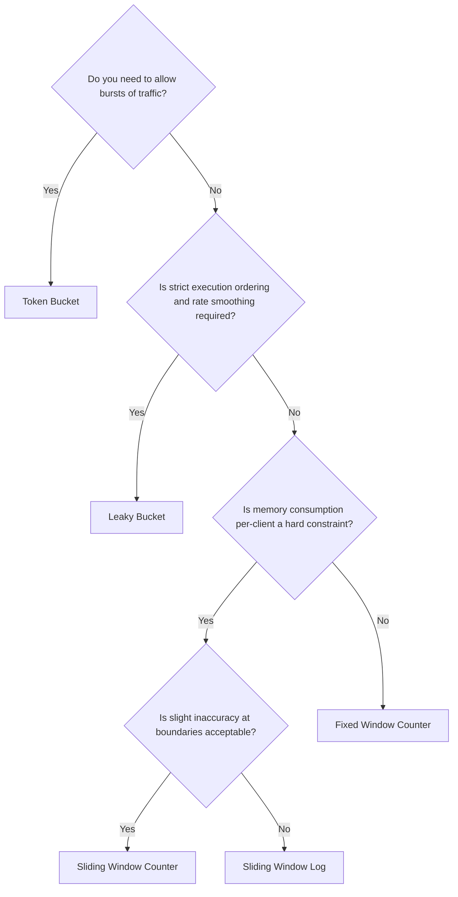
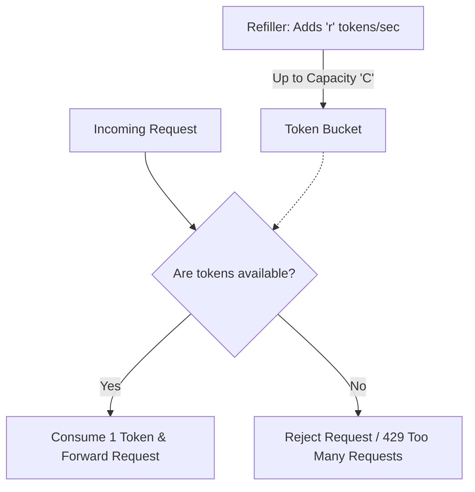
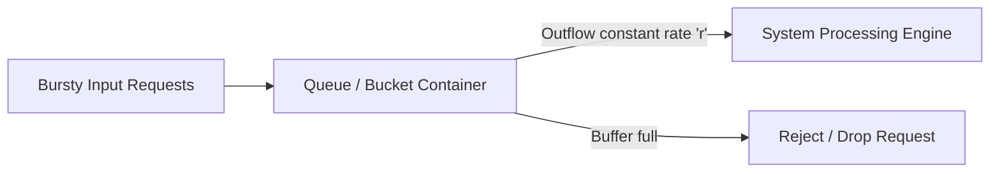

# Rate Limiting Algorithms

In high-scale distributed systems, **rate limiting** is a critical defensive pattern. It restricts the volume of requests a client can make within a given timeframe. Rate limiting prevents resource starvation, mitigates Denial of Service (DoS) attacks, manages API monetization tiers, and protects downstream databases and microservices from traffic spikes.

This guide provides a comprehensive breakdown of the core rate-limiting algorithms, explaining their internal mechanics, performance profiles, distributed trade-offs, and concrete use cases.

---

## 🗺️ Algorithmic Comparison Matrix

| Algorithm | Time Complexity (Check) | Space Complexity (Per Client) | Burst Tolerance | Distributed Coordination Cost | Best Suited For |
| :--- | :--- | :--- | :--- | :--- | :--- |
| **Token Bucket** | $O(1)$ | $O(1)$ (2 fields) | **High** (Allows token accumulation) | Low (Atomic decrement/updates) | General API traffic, handling bursty workloads |
| **Leaky Bucket** | $O(1)$ | $O(1)$ (Queue size) | **None** (Constant outflow rate) | Moderate (Locking on queue) | Throttling database writes, downstream egress |
| **Fixed Window** | $O(1)$ | $O(1)$ (1 counter) | **Poor** (Double limits at boundaries) | Very Low (Atomic increment) | Simple quota-based limits (e.g., max 10,000/day) |
| **Sliding Log** | $O(\log R)$ | $O(R)$ ($R$ is request count) | **None** (Strict enforcement) | High (Requires range deletions in Redis ZSET) | Critical, highly strict security endpoints |
| **Sliding Counter** | $O(1)$ | $O(1)$ (2 counters) | **Moderate** (Smooths boundary spikes) | Moderate (Reads multiple keys) | High-throughput, low-memory distributed APIs |

---

## 🧭 Decision Tree: Which Algorithm to Use?

Use this decision tree to match your workload characteristics to the appropriate rate-limiting algorithm:



---

## 1. Token Bucket

The **Token Bucket** algorithm is the most widely adopted general-purpose rate-limiting algorithm. It maintains a centralized bucket of capacity $C$ that is continuously refilled with tokens at a constant rate $r$ per second.



### Working Mechanics
Instead of running a background thread to add tokens (which is highly inefficient at scale), the refill logic is calculated **lazily** upon each request arrival:

1. Retrieve the timestamp of the last request and current token count.
2. Calculate the elapsed time: $\Delta t = \text{now} - \text{last request time}$.
3. Calculate the newly generated tokens: $\text{new tokens} = \Delta t \times r$.
4. Update token count: $\text{tokens} = \min(C, \text{tokens} + \text{new tokens})$.
5. If $\text{tokens} \ge 1$: consume 1 token, update $\text{last\_request\_time} = \text{now}$, and approve the request. Otherwise, reject the request.

### Java Implementation (Lazy Refill)

```java
public class TokenBucket {
    private final long capacity;
    private final double refillRatePerMs;
    
    private double tokens;
    private long lastRefillTimestamp;

    public TokenBucket(long capacity, double refillRatePerSecond) {
        this.capacity = capacity;
        this.refillRatePerMs = refillRatePerSecond / 1000.0;
        this.tokens = capacity;
        this.lastRefillTimestamp = System.currentTimeMillis();
    }

    public synchronized boolean tryAcquire() {
        long now = System.currentTimeMillis();
        long elapsedMs = now - lastRefillTimestamp;
        
        // Lazily refill tokens
        double tokensToAdd = elapsedMs * refillRatePerMs;
        this.tokens = Math.min(capacity, this.tokens + tokensToAdd);
        this.lastRefillTimestamp = now;

        if (this.tokens >= 1.0) {
            this.tokens -= 1.0;
            return true;
        }
        return false;
    }
}
```

### When to Use
* **General API Gateways**: Ideal for protecting general backend APIs (e.g., Stripe, AWS API Gateway) where clients are allowed occasional bursts of fast requests, but must be throttled over long periods.
* **MONETIZATION TIERS**: Simple to configure (e.g., Free Tier: $C=10, r=2$; Enterprise: $C=100, r=50$).

---

## 2. Leaky Bucket

The **Leaky Bucket** algorithm smooths out traffic surges by queuing incoming requests in a First-In-First-Out (FIFO) buffer and processing them at a constant, stable rate.



### Working Mechanics
1. Incoming requests enter a bounded queue of size $Q$.
2. If the queue is full, incoming requests are instantly rejected (dropped).
3. A background consumer drains the queue at a fixed interval (e.g., 1 request every $1/r$ seconds) and processes it.

### Java Implementation

```java
public class LeakyBucket {
    private final BlockingQueue<Runnable> queue;
    private final ScheduledExecutorService leakScheduler;

    public LeakyBucket(int capacity, double leakRatePerSecond) {
        this.queue = new LinkedBlockingQueue<>(capacity);
        this.leakScheduler = Executors.newSingleThreadScheduledExecutor();

        // Drain the queue at a constant frequency
        long delayUs = (long) (1_000_000.0 / leakRatePerSecond);
        this.leakScheduler.scheduleAtFixedRate(this::leak, delayUs, delayUs, TimeUnit.MICROSECONDS);
    }

    public boolean tryAcquire(Runnable requestTask) {
        // Enqueues if capacity is available, returns false instantly if full
        return queue.offer(requestTask);
    }

    private void leak() {
        Runnable task = queue.poll();
        if (task != null) {
            task.run(); // Process request task at fixed rate
        }
    }
}
```

### When to Use
* **Database Write Throttling**: Ideal when protecting downstream relational databases that are susceptible to CPU spikes under sudden write surges. By queuing inserts/updates, writes are applied at a predictable rate.
* **Egress Ingestion Rate Shaping**: Used by payment integrations or email dispatch services that need to stay strictly below target provider ceilings (e.g. max 50 emails/sec).

---

## 3. Fixed Window Counter

The **Fixed Window Counter** partition time into static windows (e.g., 1-minute blocks). A simple counter is incremented for each request within a window.

```
Window A: [00:00 - 01:00] (Max Limit: 100) -> Counter = 82 (Passed)
Window B: [01:00 - 02:00] (Max Limit: 100) -> Counter resets to 0
```

### The Boundary Spike (2x Limit) Problem
The main weakness of Fixed Window is that it can allow up to **twice the defined limit** at window boundaries:

```
Window 1: [00:00 - 01:00]              Window 2: [01:00 - 02:00]
                     ┌────── 100 requests at 00:59
                     │
                     │                 ┌────── 100 requests at 01:01
                     ▼                 ▼
             [..............|..............]
                     00:59    01:00    01:01
```
Between `00:59` and `01:01` (a 2-second span), the server processes **200 requests**, violating the 100-request-per-minute threshold.

### Java Implementation

```java
public class FixedWindowCounter {
    private final long windowSizeMs;
    private final int limit;
    
    private int counter;
    private long currentWindowStartTimestamp;

    public FixedWindowCounter(long windowSizeMs, int limit) {
        this.windowSizeMs = windowSizeMs;
        this.limit = limit;
        this.counter = 0;
        this.currentWindowStartTimestamp = System.currentTimeMillis();
    }

    public synchronized boolean tryAcquire() {
        long now = System.currentTimeMillis();
        
        // Reset counter if time has advanced beyond current window boundary
        if (now - currentWindowStartTimestamp >= windowSizeMs) {
            this.counter = 0;
            this.currentWindowStartTimestamp = now;
        }

        if (this.counter < limit) {
            this.counter++;
            return true;
        }
        return false;
    }
}
```

### When to Use
* **Quota-based Billing**: Best suited for simple high-level quotas, such as "maximum 10,000 requests per calendar day" where microsecond precision is not required, and boundary bursts do not cause system failures.

---

## 4. Sliding Window Log

The **Sliding Window Log** algorithm prevents boundary spikes by maintaining a sorted timeline log of all request timestamps for each client.

```
Timestamp Log: [ 10:00:02, 10:00:15, 10:00:44 ] (Current Time: 10:01:00, Limit Window: 60s)
1. Delete all timestamps older than 10:00:00
2. Append current timestamp 10:01:00
3. Check size of Log. If size <= Limit: Approved.
```

### Working Mechanics
1. Upon a new request, delete all logged timestamps older than $(\text{now} - \text{window size})$.
2. Append the current request's timestamp to the log.
3. Count the remaining elements in the log. If the count is less than or equal to the limit, approve the request. Otherwise, remove the newly appended timestamp (as it failed) and reject the request.

### Python/Java Pseudocode (Redis Sorted Set Implementation)
Since maintaining lists in application memory is expensive, this is typically implemented using **Redis Sorted Sets (ZSET)**:

```java
public class RedisSlidingWindowLog {
    private final RedisTemplate<String, String> redisTemplate;

    public RedisSlidingWindowLog(RedisTemplate<String, String> redisTemplate) {
        this.redisTemplate = redisTemplate;
    }

    public boolean tryAcquire(String clientKey, int limit, long windowSizeMs) {
        long now = System.currentTimeMillis();
        String redisKey = "rate_log:" + clientKey;
        long clearBefore = now - windowSizeMs;

        // Perform transaction using Redis pipeline
        List<Object> results = redisTemplate.executePipelined(new SessionCallback<Object>() {
            @Override
            public Object execute(RedisOperations operations) throws DataAccessException {
                // 1. Remove elements outside window
                operations.opsForZSet().removeRangeByScore(redisKey, 0, clearBefore);
                // 2. Add current timestamp
                operations.opsForZSet().add(redisKey, String.valueOf(now), now);
                // 3. Count remaining timestamps
                operations.opsForZSet().zCard(redisKey);
                return null;
            }
        });

        Long requestCount = (Long) results.get(2);
        if (requestCount != null && requestCount <= limit) {
            return true;
        }
        
        // Cleanup failed element
        redisTemplate.opsForZSet().remove(redisKey, String.valueOf(now));
        return false;
    }
}
```

### When to Use
* **Strict Security Enforcement**: Critical authorization or checkout payment endpoints where boundary spikes cannot be tolerated under any circumstances, and memory overhead is secondary to correctness.
* **Low-Frequency Limits**: Safe when limits are small (e.g. max 5 requests per hour).

---

## 5. Sliding Window Counter

The **Sliding Window Counter** combines Fixed Window's memory efficiency with Sliding Log's accuracy. Instead of storing every timestamp, it aggregates request rates by dynamically interpolating counts from the **previous window** and the **current window**.

```
Previous Window (Limit: 100): Counter = 80       Current Window (Limit: 100): Counter = 30
           [  Window A (80)  ]                 [  Window B (30)  ]
                             ├─────────────────┤
                              Sliding Window (60s span) - overlaps 70% of A and 30% of B
Estimate count = (80 * 0.7) + 30 = 86 -> Under limit (Approved)
```

### Mathematical Model
For a window size of 1 minute, the estimated count is calculated as:

$$\text{Estimated Count} = C_{\text{prev}} \times \left( \frac{\text{window size} - \text{elapsed time}}{\text{window size}} \right) + C_{\text{curr}}$$

Where:
* $C_{\text{prev}}$: Request count in the previous fixed window.
* $C_{\text{curr}}$: Request count in the current fixed window.
* $\text{elapsed time}$: The amount of time elapsed in the current window.

### Java Implementation

```java
public class SlidingWindowCounter {
    private final long windowSizeMs;
    private final int limit;

    private long previousWindowStart;
    private int previousCount;
    
    private long currentWindowStart;
    private int currentCount;

    public SlidingWindowCounter(long windowSizeMs, int limit) {
        this.windowSizeMs = windowSizeMs;
        this.limit = limit;
        long now = System.currentTimeMillis();
        this.currentWindowStart = now;
        this.previousWindowStart = now - windowSizeMs;
        this.currentCount = 0;
        this.previousCount = 0;
    }

    public synchronized boolean tryAcquire() {
        long now = System.currentTimeMillis();
        
        // Check if a new window needs to be initialized
        if (now - currentWindowStart >= windowSizeMs) {
            long windowsPassed = (now - currentWindowStart) / windowSizeMs;
            
            if (windowsPassed == 1) {
                this.previousCount = this.currentCount;
                this.previousWindowStart = this.currentWindowStart;
            } else {
                this.previousCount = 0;
                this.previousWindowStart = now - windowSizeMs;
            }
            this.currentCount = 0;
            this.currentWindowStart = now;
        }

        long timeElapsedInCurrentWindow = now - currentWindowStart;
        double weight = (double) (windowSizeMs - timeElapsedInCurrentWindow) / windowSizeMs;
        double estimatedCount = (previousCount * weight) + currentCount;

        if (estimatedCount < limit) {
            currentCount++;
            return true;
        }
        return false;
    }
}
```

### When to Use
* **High-Throughput Distributed APIs**: The standard for high-performance microservices (e.g., Cloudflare, Kong Gateway). It provides low, constant-space complexity ($O(1)$) with near-exact accuracy, eliminating both sliding log's memory leaks and fixed window's boundary spikes.

---

## See Also
* **[Redis Distributed Caching](../redis/redis-distributed-cache.md)**: Storing rate limit states.
* **[Redis Rate Limiting](../redis/redis-rate-limiting.md)**: Redis Lua scripts, token buckets, and sliding log implementations.
* **[Scaling Writes](./scaling-writes.md)**: Applying rate limiting and backpressure controls on database ingestion.
* **[API Gateway Guide](./reverse-proxy-load-balancer-api-gateway.md)**: Implementing rate limiting at the API gateway layer.
* **[LLD Rate Limiter Problem Description](../low-level-design/problem/rate-limiter.md)**: Strategy pattern class models and thread-safety interview guidelines.
