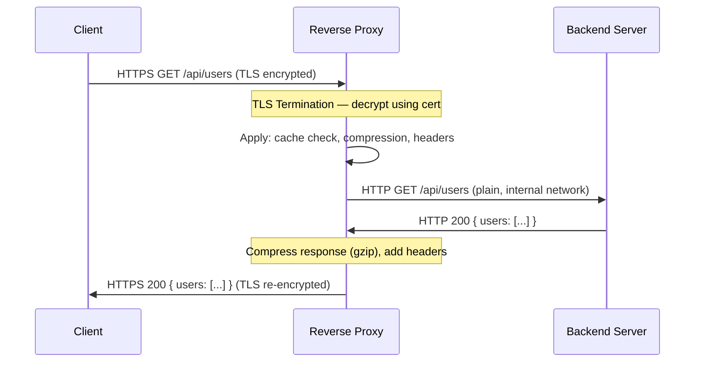
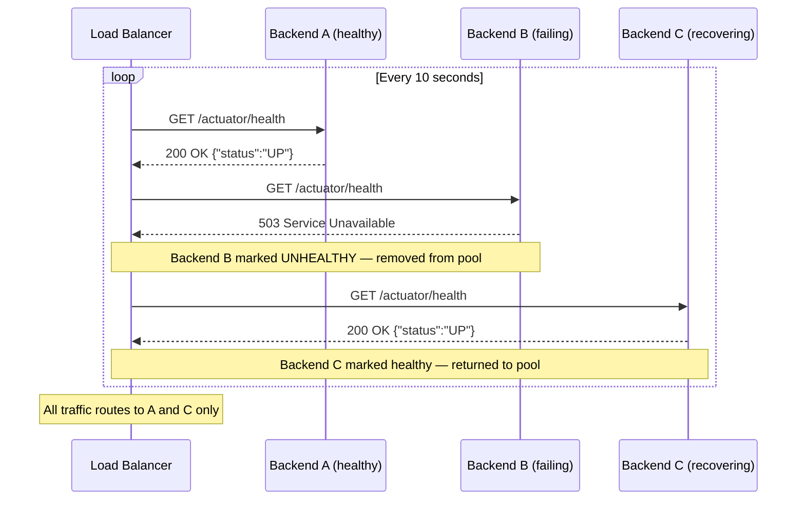
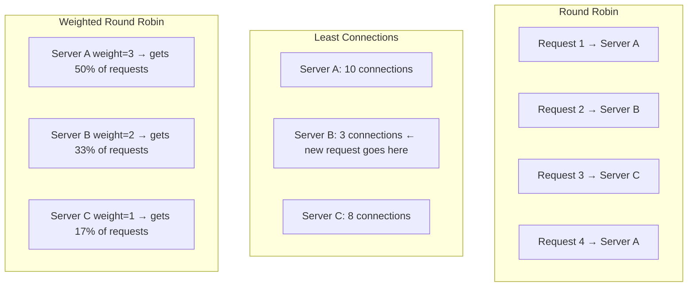
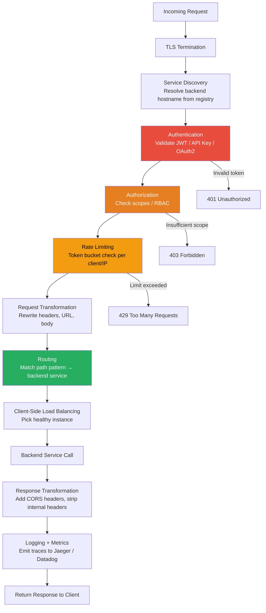
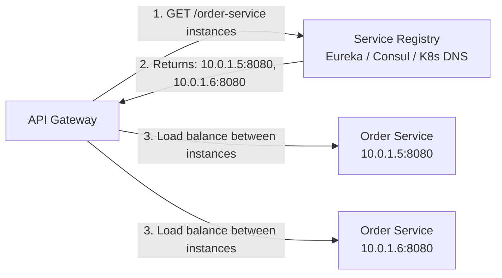
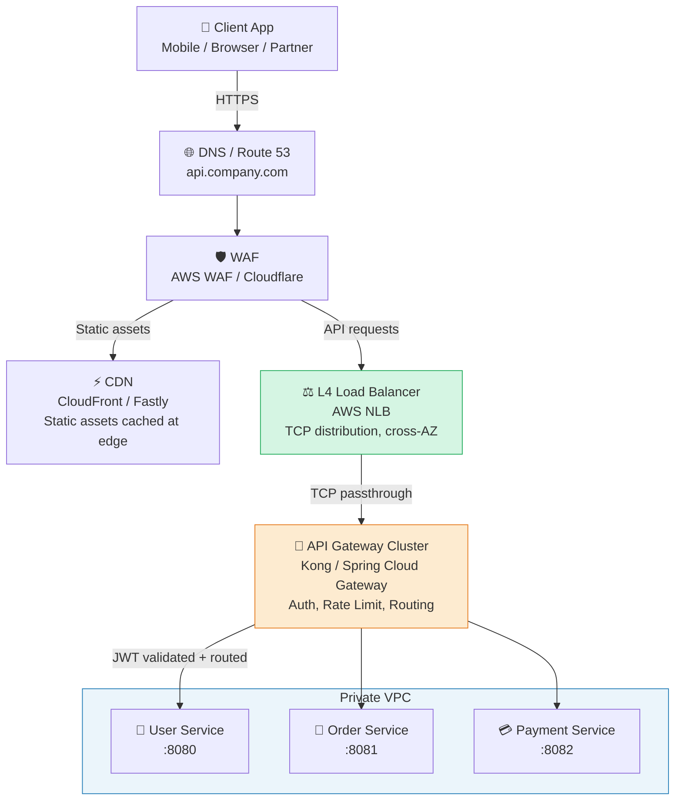
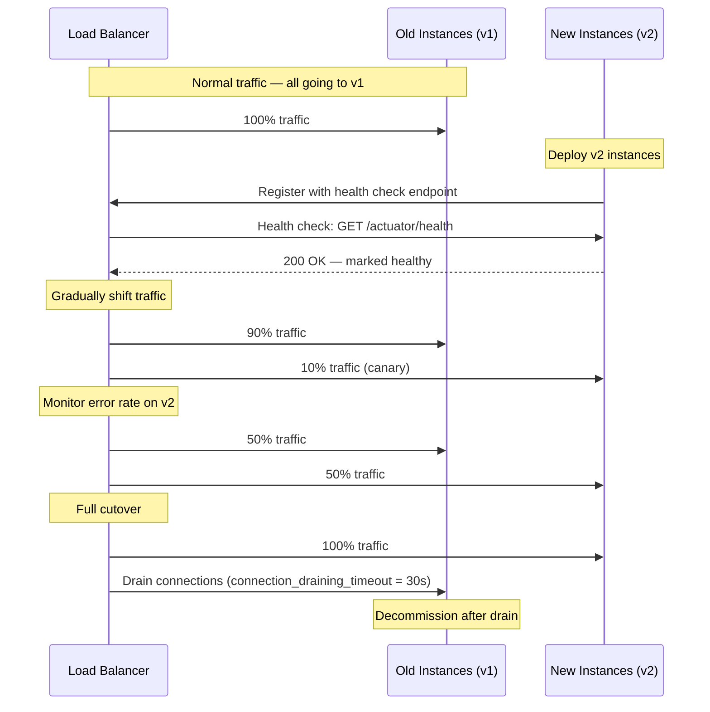

# Reverse Proxy vs. Load Balancer vs. API Gateway

> Three terms that appear at the entry point of almost every distributed system diagram — yet they are consistently conflated. All three sit between clients and backend servers. All three forward requests. But their **primary responsibilities**, **operating layers**, and **architectural purposes** are fundamentally different.

Understanding these distinctions is not just academic. Choosing the wrong component at the wrong layer leads to: API Gateway business logic leaking into load balancers, single points of failure from misunderstood health-check behavior, TLS termination at the wrong layer, and authentication gaps that create security vulnerabilities.

:::info[Who this guide is for]
- **New learners** — start at [The Airport Analogy](#the-airport-analogy) and the deep dives for each component.
- **Senior engineers** — jump to [How They Work Internally](#how-it-works-internally), [When They Coexist](#how-they-coexist-in-production), [Service Mesh Comparison](#5-service-mesh-the-fourth-entrant), or [Production Deep Dives](#senior-deep-dive).
:::

---

## The Airport Analogy

Before any diagrams, a concrete mental model:

Imagine a massive international airport:

**Reverse Proxy — The Terminal Facade:**
Passengers never enter the maintenance hangars, fuel depots, or control tower. They see only the terminal building. The terminal hides the airport's entire internal layout, terminates the security checkpoint (TLS), and presents one front door regardless of which aircraft or gate is actually serving the flight. The reverse proxy hides the specific backend servers behind a single address.

**Load Balancer — The Queue Manager:**
When 5,000 passengers arrive at security simultaneously, a queue manager directs them: "Lanes 1–5 are open, Lane 3 is full, Lane 6 is closed for maintenance." Its entire job is distributing load so no single lane is overwhelmed while others sit empty. It does not care who you are or where you are going — only which lane can serve you fastest right now.

**API Gateway — The Customs and Border Control Officer:**
Before you board your international flight, an officer checks your passport (authentication), verifies your visa type (authorization), limits how many bags you can carry (rate limiting), and translates your customs declaration form if it's in the wrong format (protocol translation). The gateway is a smart, policy-enforcing checkpoint — not just a traffic router.

In a real airport, all three exist simultaneously in a chain. So do they in production systems.

---

## 🛡️ Deep Dive: Reverse Proxy

### What It Is

A **Reverse Proxy** is an intermediary server positioned in front of one or more backend servers. Clients connect to it as if it were the destination — they never know the backend's real address. The proxy forwards the request, receives the backend's response, and returns it to the client.

```
Client (Internet)
				│  HTTPS → api.company.com
				▼
[ Reverse Proxy — Nginx / Caddy / HAProxy ]
				│  HTTP → 10.0.1.15:8080 (internal, private subnet)
				▼
[ Backend Server — Spring Boot / Node.js ]
```

The client sees only `api.company.com`. The backend's actual IP, port, and technology stack are completely hidden.

### How It Works Internally



**Step-by-step:**

1. **TLS Termination:** The proxy holds the SSL certificate. It decrypts HTTPS traffic at the edge. Traffic between the proxy and backend can travel over plain HTTP within a secured private network (VPC/subnet), offloading cryptographic CPU from backend servers.

2. **Request transformation:** Injects forwarding headers (`X-Real-IP`, `X-Forwarded-For`, `X-Forwarded-Proto`) so backends can see the original client information despite the proxy sitting in between.

3. **Cache check:** If the response for this URL is already cached (static files, TTL-based responses), the proxy returns it directly without touching the backend at all.

4. **Backend forwarding:** Forwards the request to the appropriate backend server by configured rules (URL path, hostname, etc.).

5. **Response transformation:** Compresses the response (gzip/Brotli), strips internal headers that should not leak to clients, and returns to the client over TLS.

### Core Responsibilities

| Responsibility | Description |
|---|---|
| **Server anonymity** | Hides backend IPs, ports, and internal topology from the public internet |
| **TLS/SSL termination** | Decrypts HTTPS at the edge; backends communicate over HTTP internally |
| **Static asset serving** | Serves CSS, JS, images directly from disk — never forwarding to app servers |
| **Response caching** | Caches backend responses by URL/headers to reduce repeated backend load |
| **Compression** | gzip/Brotli compression of responses before delivery to clients |
| **Request/response rewriting** | Add/remove headers, rewrite URLs, inject security headers (HSTS, CSP) |
| **DDoS surface reduction** | Backends are unreachable from the public internet; only the proxy is exposed |

### Nginx Configuration — Production Example

```nginx
# nginx.conf — production-grade reverse proxy with TLS, caching, compression, security headers
server {
		listen 443 ssl http2;
		server_name api.company.com;

		# TLS Termination
		ssl_certificate     /etc/ssl/certs/company.crt;
		ssl_certificate_key /etc/ssl/private/company.key;
		ssl_protocols       TLSv1.2 TLSv1.3;
		ssl_ciphers         HIGH:!aNULL:!MD5;

		# Compression
		gzip on;
		gzip_types application/json text/plain text/css application/javascript;
		gzip_min_length 1024;

		# Static assets — served directly, never reach the app server
		location /static/ {
				root /var/www/html;
				expires 30d;
				add_header Cache-Control "public, immutable";
		}

		# API traffic — forward to backend
		location /api/ {
				proxy_pass         http://backend-pool;  # upstream group
				proxy_http_version 1.1;

				# Preserve original client info
				proxy_set_header   Host              $host;
				proxy_set_header   X-Real-IP         $remote_addr;
				proxy_set_header   X-Forwarded-For   $proxy_add_x_forwarded_for;
				proxy_set_header   X-Forwarded-Proto $scheme;

				# Security headers
				add_header Strict-Transport-Security "max-age=31536000; includeSubDomains" always;
				add_header X-Content-Type-Options "nosniff" always;
				add_header X-Frame-Options "DENY" always;

				# Timeouts
				proxy_connect_timeout 5s;
				proxy_send_timeout    60s;
				proxy_read_timeout    60s;
		}
}

# Redirect HTTP → HTTPS
server {
		listen 80;
		server_name api.company.com;
		return 301 https://$host$request_uri;
}
```

### When to Use a Reverse Proxy

✅ You have one application server (monolith) and need TLS termination without burdening the app.
✅ You need to serve static files efficiently alongside a dynamic backend.
✅ You need to hide backend infrastructure from the public internet.
✅ You need basic URL rewriting, header injection, or response compression.
✅ You are in front of a single service — not distributing across a cluster (that is a load balancer's job).

---

## ⚖️ Deep Dive: Load Balancer

### What It Is

A **Load Balancer** is a specialized component designed to distribute incoming traffic across a pool of identical backend servers. Its singular concern is **availability and capacity** — ensuring no single server becomes a bottleneck or single point of failure.

```
												 ┌──► Backend Server A (healthy — 40 connections)
												 │
Client ──► [ Load    ] ──┼──► Backend Server B (healthy — 38 connections)
					 [ Balancer]   │
												 └──► Backend Server C (unhealthy — removed from rotation)
```

### L4 vs. L7: The Most Important Distinction

Load balancers operate at one of two layers, with fundamentally different capabilities and performance characteristics:

```mermaid
graph LR
		subgraph L4 [Layer 4 — Transport Layer]
				direction TB
				L4IN[Client TCP/UDP Packet] --> L4LB[L4 Load Balancer]
				L4LB -->|Route by IP + Port only| L4B1[Backend A]
				L4LB -->|No HTTP inspection| L4B2[Backend B]
				Note1["⚡ Extremely fast\nNo content inspection\nCannot route by URL or headers"]
		end

		subgraph L7 [Layer 7 — Application Layer]
				direction TB
				L7IN[Client HTTP Request] --> L7LB[L7 Load Balancer]
				L7LB -->|Route by URL path| L7B1[/api/users → User Service]
				L7LB -->|Route by header| L7B2[/api/orders → Order Service]
				Note2["🧠 Content-aware\nCan inspect headers, URL, cookies\nHigher latency, much richer routing"]
		end
```

| Dimension | L4 (Transport Layer) | L7 (Application Layer) |
|---|---|---|
| **Inspects** | IP address + TCP/UDP port only | HTTP headers, URL path, cookies, request body |
| **Routing basis** | IP + port tuples | URL pattern, header value, HTTP method |
| **TLS handling** | Passthrough (cannot decrypt) or terminate | Terminates TLS, inspects decrypted content |
| **Performance** | Extremely high (hardware-speed) | Lower (must parse HTTP) |
| **Use cases** | Raw TCP services, databases, non-HTTP protocols | HTTP APIs, microservices, path-based routing |
| **AWS equivalent** | NLB (Network Load Balancer) | ALB (Application Load Balancer) |
| **Examples** | AWS NLB, HAProxy TCP mode | AWS ALB, Nginx upstream, HAProxy HTTP mode |

### How It Works Internally — Health Checking

The most critical function of a load balancer that is often overlooked: **active health checking**. A load balancer that cannot detect failed backends is useless.



**Health check configuration (AWS ALB example):**

```hcl
# Terraform — ALB target group with health checks
resource "aws_lb_target_group" "api" {
	name     = "api-target-group"
	port     = 8080
	protocol = "HTTP"
	vpc_id   = aws_vpc.main.id

	health_check {
		enabled             = true
		path                = "/actuator/health"  # Spring Boot Actuator endpoint
		port                = "traffic-port"
		healthy_threshold   = 2    # 2 consecutive successes → mark healthy
		unhealthy_threshold = 3    # 3 consecutive failures → mark unhealthy
		timeout             = 5    # Seconds to wait for response
		interval            = 10   # Check every 10 seconds
		matcher             = "200" # Only HTTP 200 counts as healthy
	}
}
```

**Spring Boot health endpoint (what the load balancer calls):**

```java
// spring-boot-starter-actuator exposes /actuator/health automatically
// Returns 200 when healthy, 503 when degraded/down

// Custom health indicator — add domain-specific checks
@Component
public class DatabaseHealthIndicator implements HealthIndicator {

		private final DataSource dataSource;

		@Override
		public Health health() {
				try (Connection conn = dataSource.getConnection()) {
						conn.isValid(1);
						return Health.up()
										.withDetail("database", "reachable")
										.build();
				} catch (SQLException e) {
						// Returning DOWN causes the load balancer to remove this instance
						return Health.down()
										.withDetail("database", "unreachable")
										.withException(e)
										.build();
				}
		}
}
```

### Load Balancing Algorithms



| Algorithm | How it works | Best for |
|---|---|---|
| **Round Robin** | Distributes requests in sequential order | Stateless services with uniform request cost |
| **Weighted Round Robin** | Servers with higher weight receive proportionally more traffic | Mixed instance sizes (e.g., some pods have more CPU) |
| **Least Connections** | Routes to the server with the fewest active connections | Long-running requests (file uploads, streaming, DB queries) |
| **Least Response Time** | Routes to the server with the lowest average response time | Latency-sensitive applications |
| **IP Hash** | Hashes client IP to always route to the same server | Stateful applications requiring session affinity |
| **Random** | Picks a random healthy server | Simple, surprisingly effective at scale |
| **Resource-based** | Routes based on actual CPU/memory utilization | Cloud-native environments with heterogeneous pods |

### Session Stickiness (Sticky Sessions)

For stateful applications that store session data in-memory (legacy apps not yet using distributed sessions), the load balancer can ensure a client always hits the same backend.

```
Client with session cookie SESS=abc123
		→ Load balancer reads SESS cookie
		→ Routes to Server B (which has SESS=abc123 in its memory)
		→ NOT Server A or C
```

:::warning[Sticky Sessions Are a Scaling Anti-Pattern]
Sticky sessions mean you cannot freely remove or replace backend instances — sessions will be lost. For modern stateless services, store session state externally (Redis, a database) and remove the need for stickiness entirely.
:::

### When to Use a Load Balancer

✅ You need horizontal scaling — multiple identical instances of the same service.
✅ You need high availability — automatic failover when an instance crashes.
✅ You need zero-downtime deployments — drain connections from old instances before decommissioning.
✅ You have high raw throughput requirements — L4 load balancers handle millions of connections per second.
✅ You need to distribute traffic across Availability Zones for geographic resilience.

---

## 🚪 Deep Dive: API Gateway

### What It Is

An **API Gateway** is a specialized L7 reverse proxy purpose-built for microservices ecosystems. It acts as the single, smart, policy-enforcing entry point for all client API requests. Unlike a basic reverse proxy (which routes traffic) or a load balancer (which distributes it), the API Gateway understands API semantics and enforces cross-cutting policies: authentication, authorization, rate limiting, quota management, protocol translation, and response aggregation.

```
Mobile App / Browser / Partner API
				│
				▼
[ API Gateway — Kong / Spring Cloud Gateway / AWS API Gateway ]
	 ├── Authenticate: validate JWT / API key
	 ├── Authorize: check user scopes
	 ├── Rate limit: 1000 req/min per client
	 ├── Route: /v1/orders → Order Service
	 └── Transform: REST/HTTP → gRPC (internal)
				│
				├──► User Service     (internal gRPC)
				├──► Order Service    (internal gRPC)
				└──► Payment Service  (internal gRPC)
```

### How It Works Internally — Request Pipeline

An API gateway processes each request through an ordered **plugin/filter pipeline** — each stage can inspect, modify, reject, or short-circuit the request.



### Core Responsibilities In Depth

#### 1. Authentication & Authorization

The gateway validates identity **once at the perimeter** — downstream microservices trust that any request reaching them is already authenticated.

```yaml
# Kong Gateway — JWT plugin configuration
plugins:
	- name: jwt
		config:
			key_claim_name: kid
			claims_to_verify:
				- exp       # Token must not be expired
				- nbf       # Token must be active
			secret_is_base64: false
			run_on_preflight: true
```

```java
// Spring Cloud Gateway — JWT validation filter
@Component
public class JwtAuthenticationFilter implements GatewayFilter {

		private final JwtTokenValidator tokenValidator;

		@Override
		public Mono<Void> filter(ServerWebExchange exchange, GatewayFilterChain chain) {
				String authHeader = exchange.getRequest().getHeaders()
								.getFirst(HttpHeaders.AUTHORIZATION);

				if (authHeader == null || !authHeader.startsWith("Bearer ")) {
						exchange.getResponse().setStatusCode(HttpStatus.UNAUTHORIZED);
						return exchange.getResponse().setComplete();
				}

				String token = authHeader.substring(7);
				return tokenValidator.validate(token)
								.flatMap(claims -> {
										// Inject validated claims as headers for downstream services
										ServerHttpRequest mutatedRequest = exchange.getRequest().mutate()
														.header("X-User-Id", claims.getSubject())
														.header("X-User-Roles", String.join(",", claims.getRoles()))
														.build();
										return chain.filter(exchange.mutate().request(mutatedRequest).build());
								})
								.onErrorResume(e -> {
										exchange.getResponse().setStatusCode(HttpStatus.UNAUTHORIZED);
										return exchange.getResponse().setComplete();
								});
		}
}
```

#### 2. Rate Limiting

The gateway enforces per-client request quotas using algorithms stored in Redis (for distributed, multi-instance enforcement).

**Token Bucket algorithm (conceptual):**

```
Each client gets a "bucket" that holds N tokens.
Each request consumes 1 token.
Tokens refill at a fixed rate (e.g., 100 tokens/minute).
If bucket is empty → reject with HTTP 429.
```

```java
// Spring Cloud Gateway — Redis rate limiter
@Bean
public RouteLocator routes(RouteLocatorBuilder builder, RedisRateLimiter rateLimiter) {
		return builder.routes()
						.route("order-service", r -> r
										.path("/v1/orders/**")
										.filters(f -> f
														.requestRateLimiter(config -> config
																		.setRateLimiter(rateLimiter)
																		.setKeyResolver(userKeyResolver()) // Rate limit per user ID
														)
														.rewritePath("/v1/orders/(?<segment>.*)", "/api/${segment}")
										)
										.uri("lb://order-service") // service discovery via Eureka/Consul
						)
						.build();
}

@Bean
public RedisRateLimiter redisRateLimiter() {
		return new RedisRateLimiter(
						100,  // replenishRate: tokens added per second
						200,  // burstCapacity: max tokens in bucket
						1     // requestedTokens: tokens consumed per request
		);
}

@Bean
public KeyResolver userKeyResolver() {
		// Rate limit per authenticated user ID
		return exchange -> Mono.justOrEmpty(
						exchange.getRequest().getHeaders().getFirst("X-User-Id")
		).defaultIfEmpty("anonymous");
}
```

#### 3. Service Discovery Integration

Unlike a reverse proxy with hardcoded backend IPs, an API gateway integrates with a service registry to dynamically resolve which instances are currently healthy and where they are running.



```yaml
# Spring Cloud Gateway application.yml
spring:
	cloud:
		gateway:
			discovery:
				locator:
					enabled: true           # Auto-create routes from service registry
					lower-case-service-id: true
			routes:
				- id: order-service
					uri: lb://order-service  # lb:// prefix = resolve from service registry
					predicates:
						- Path=/v1/orders/**
					filters:
						- RewritePath=/v1/orders/(?<segment>.*), /api/${segment}
						- name: CircuitBreaker
							args:
								name: orderServiceCB
								fallbackUri: forward:/fallback/orders
```

#### 4. API Composition / Aggregation (Backend-for-Frontend Pattern)

The gateway can make parallel calls to multiple microservices and merge their responses — reducing client round-trips.

```java
// Gateway aggregates 3 microservice calls into one response for the dashboard
@RestController
public class DashboardAggregator {

		private final WebClient userClient;
		private final WebClient orderClient;
		private final WebClient notificationClient;

		@GetMapping("/v1/dashboard")
		public Mono<DashboardResponse> getDashboard(
						@RequestHeader("X-User-Id") String userId) {

				// All three calls execute in parallel
				Mono<UserProfile> userMono = userClient
								.get().uri("/users/{id}", userId)
								.retrieve().bodyToMono(UserProfile.class)
								.onErrorReturn(UserProfile.empty()); // Fallback on failure

				Mono<List<Order>> ordersMono = orderClient
								.get().uri("/orders?userId={id}&limit=5", userId)
								.retrieve().bodyToMono(new ParameterizedTypeReference<>() {})
								.onErrorReturn(List.of());

				Mono<List<Notification>> notifMono = notificationClient
								.get().uri("/notifications?userId={id}&unread=true", userId)
								.retrieve().bodyToMono(new ParameterizedTypeReference<>() {})
								.onErrorReturn(List.of());

				// zip waits for all three and combines the results
				return Mono.zip(userMono, ordersMono, notifMono)
								.map(tuple -> new DashboardResponse(
												tuple.getT1(),
												tuple.getT2(),
												tuple.getT3()
								));
		}
}
```

#### 5. Protocol Translation

The gateway exposes a REST/HTTP interface to external clients but translates internally to gRPC for high-performance inter-service communication.

```
External Client:   POST /v1/orders HTTP/1.1  (JSON over HTTP)
													↓
API Gateway:       Translates to gRPC
													↓
Internal Service:  OrderService.CreateOrder(CreateOrderRequest)  (Protobuf over HTTP/2)
```

### When to Use an API Gateway

✅ You have multiple microservices that need a unified, versioned public API surface.
✅ You need centralized authentication without duplicating JWT validation in every service.
✅ You need rate limiting, quota management, or API monetization.
✅ You need to shield clients from internal service topology changes (service renamed, split, merged).
✅ You need protocol translation (REST → gRPC, HTTP/1.1 → HTTP/2, REST → WebSocket).
✅ You need API versioning (`/v1/`, `/v2/`) without touching downstream services.

---

## ⚖️ Alternatives & When to Choose What

Before picking a component, understand the full landscape including the emerging **Service Mesh** option.

### Full Comparison Matrix

| Dimension | Reverse Proxy | L4 Load Balancer | L7 Load Balancer | API Gateway | Service Mesh |
|---|---|---|---|---|---|
| **Primary concern** | Hiding backends, TLS, caching | Raw TCP distribution | HTTP-aware distribution | API policy enforcement | East-west service-to-service |
| **OSI Layer** | L7 (L4 passthrough available) | L4 | L7 | L7 | L4 + L7 sidecar |
| **Auth / AuthZ** | ❌ Basic only | ❌ None | ❌ None | ✅ Full JWT/OAuth2 | ⚠️ mTLS only |
| **Rate limiting** | ⚠️ Basic (Nginx limit_req) | ❌ None | ❌ None | ✅ Per-client, per-route | ❌ None |
| **Service discovery** | ❌ Static config | ❌ Static | ⚠️ Manual | ✅ Dynamic (Eureka/Consul/K8s) | ✅ Automatic |
| **Health checking** | ⚠️ Passive only | ✅ Active | ✅ Active | ✅ Active + circuit breaker | ✅ Active |
| **Protocol translation** | ❌ | ❌ | ❌ | ✅ REST↔gRPC, HTTP↔WS | ❌ |
| **API composition** | ❌ | ❌ | ❌ | ✅ | ❌ |
| **Observability** | ⚠️ Access logs | ⚠️ Flow logs | ⚠️ Access logs | ✅ Distributed tracing | ✅ Automatic traces |
| **Traffic encryption** | TLS termination | TLS passthrough | TLS termination | TLS termination | mTLS between services |
| **Operational complexity** | Low | Very low | Low | Medium | High |
| **Best for** | Single app, monolith | High-volume TCP | HTTP scaling | Microservices API perimeter | Kubernetes-native service mesh |

---

### 1. Reverse Proxy Only (Monolith / Simple Services)

```
Internet → [ Nginx ] → Single App Server
```

**Choose when:** One application, one server, TLS needed, static assets to serve. Adding a load balancer or gateway would be over-engineering.

---

### 2. Reverse Proxy + L4 Load Balancer (Scaling Without Smart Routing)

```
Internet → [ AWS NLB ] → [ Nginx cluster ] → App Servers
```

**Choose when:** High raw throughput of TCP connections (millions/sec), no need for HTTP-level routing. NLB handles TCP distribution; Nginx handles TLS and static assets.

---

### 3. L7 Load Balancer with Path Routing (Simple Microservices)

```
Internet → [ AWS ALB ] → /api/users → User Service
											 → /api/orders → Order Service
```

**Choose when:** Small number of microservices, no complex auth needs, cost-sensitive (no gateway license needed). AWS ALB's listener rules cover simple path-based routing without a dedicated gateway.

---

### 4. Full Stack: L4 LB + API Gateway + Services (Production Microservices)

```
Internet → [ NLB ] → [ API Gateway ] → [ Services ]
```

**Choose when:** Production microservices with auth, rate limiting, versioning, and dynamic service discovery. This is the gold standard for most enterprise systems.

---

### 5. Service Mesh: The Fourth Entrant

A **Service Mesh** (Istio, Linkerd, Consul Connect) solves a different problem than the other three: **east-west traffic** (service-to-service inside the cluster), not north-south (client-to-cluster).

```
Without Service Mesh:
Service A → Service B  (plain HTTP, no auth, no retry, no circuit breaker)

With Service Mesh:
Service A → [Sidecar Proxy] → [Sidecar Proxy] → Service B
								(mTLS, retries, circuit breaking, distributed tracing — automatic)
```

**Service Mesh vs. API Gateway:**

| Concern | API Gateway | Service Mesh |
|---|---|---|
| **Traffic direction** | North-south (client → cluster) | East-west (service → service) |
| **Auth mechanism** | JWT / OAuth2 / API Key | mTLS (mutual TLS certificates) |
| **Scope** | External API surface | All internal service communication |
| **Protocol translation** | ✅ REST ↔ gRPC | ❌ |
| **Rate limiting** | ✅ Per external client | ❌ |
| **Deployment model** | Centralized gateway pod(s) | Sidecar injected into every pod |

They are **complementary, not alternatives.** A production Kubernetes cluster often runs both: an API Gateway for the external perimeter and a service mesh for internal security and observability.

---

## How They Coexist in Production

### Standard Enterprise Architecture



### The Request Lifecycle (Every Layer Explained)

**1. DNS Resolution:**
`api.company.com` resolves to the public IP of the WAF or CDN edge node. Route 53 can also apply geographic routing — directing Asia-Pacific users to the Singapore region, EU users to Frankfurt.

**2. WAF (Web Application Firewall):**
Sits in front of everything. Inspects raw HTTP for SQL injection patterns, XSS payloads, known CVE exploit patterns, and blocks malicious IPs. This is not a proxy, load balancer, or gateway — it is a security appliance. But it belongs in this request lifecycle.

**3. CDN Edge:**
Static assets (JS, CSS, images, API responses with long TTLs) are served directly from the CDN's edge node, never reaching your servers. Only cache misses reach the origin.

**4. L4 Load Balancer (AWS NLB):**
Handles raw TCP connection distribution across multiple API Gateway instances. Does not inspect HTTP. Does not terminate TLS (or optionally does). Operates at wire speed — millions of connections per second. Provides cross-AZ redundancy for the API Gateway cluster itself.

**5. API Gateway Cluster:**
Terminates TLS (if not done at NLB). Validates JWT tokens. Checks rate limits per user/IP in Redis. Routes based on URL path to the appropriate microservice. Injects authenticated user context as headers. Emits distributed trace spans.

**6. Microservices (Private Subnet):**
Never exposed to the public internet. Accept only connections from the API Gateway's CIDR range via security group rules. Trust `X-User-Id` and `X-User-Roles` headers injected by the gateway (they do not re-validate JWTs). Communicate with each other via service mesh mTLS.

### Zero-Downtime Deployment Flow



---

## Senior Deep Dive

### 1. The API Gateway Monolith Anti-Pattern

The most dangerous long-term failure mode for API gateways. As teams add features, the gateway accumulates business logic that belongs in services.

```
❌ Anti-pattern — business logic in the gateway:
		GET /v1/order-summary
		→ Gateway fetches order
		→ Gateway calculates discount based on user tier (BUSINESS LOGIC)
		→ Gateway fetches user loyalty points (DOMAIN KNOWLEDGE)
		→ Gateway computes final total (DOMAIN LOGIC)
		→ Returns composed response

✅ Correct — gateway stays domain-agnostic:
		GET /v1/order-summary
		→ Gateway authenticates + routes
		→ Order Service computes everything (owns the domain)
		→ Gateway returns the response unchanged
```

**Rule of thumb:** If removing the gateway's logic would require changing a service's interface or behavior, that logic does not belong in the gateway. The gateway should be replaceable with a different gateway product without rewriting business rules.

---

### 2. Circuit Breaker at the Gateway Layer

The gateway is the ideal place to implement circuit breakers — if a downstream service is degraded, the gateway can fail fast rather than letting all requests queue up and exhaust threads.

```java
// Spring Cloud Gateway — Resilience4j circuit breaker
@Bean
public RouteLocator routesWithCircuitBreaker(RouteLocatorBuilder builder) {
		return builder.routes()
						.route("payment-service", r -> r
										.path("/v1/payments/**")
										.filters(f -> f
														.circuitBreaker(config -> config
																		.setName("paymentServiceCB")
																		.setFallbackUri("forward:/fallback/payment")
																		// Open circuit after 50% failure rate in 10s window
														)
														.retry(retryConfig -> retryConfig
																		.setRetries(2)
																		.setStatuses(HttpStatus.SERVICE_UNAVAILABLE)
																		.setBackoff(Duration.ofMillis(100), Duration.ofSeconds(1), 2, false)
														)
										)
										.uri("lb://payment-service")
						)
						.build();
}

// Fallback controller — returns degraded response when circuit is open
@RestController
public class FallbackController {

		@GetMapping("/fallback/payment")
		public ResponseEntity<Map<String, String>> paymentFallback() {
				return ResponseEntity.status(HttpStatus.SERVICE_UNAVAILABLE)
								.body(Map.of(
												"error", "Payment service temporarily unavailable",
												"retryAfter", "30"
								));
		}
}
```

**Circuit breaker states:**

```
CLOSED (normal):     Requests pass through. Failure rate monitored.
												 ↓ (failure rate > threshold)
OPEN (failing fast): All requests immediately return 503. Backend gets no load.
												 ↓ (after timeout)
HALF-OPEN (probing): Small % of requests pass through to test recovery.
												 ↓ (probe succeeds)
CLOSED (recovered):  Full traffic resumes.
```

---

### 3. TLS Termination Strategy: Where to Decrypt?

TLS can be terminated at different layers, each with different security and performance implications.

```
Option A — Terminate at L4 Load Balancer (NLB):
		Client → [NLB: TLS terminate] → [API Gateway: HTTP] → [Services: HTTP]
		✅ Offloads crypto from gateway
		❌ Traffic between NLB and gateway is plain HTTP — only safe within a trusted VPC

Option B — TLS Passthrough at L4, terminate at API Gateway:
		Client → [NLB: TCP passthrough] → [API Gateway: TLS terminate] → [Services: HTTP]
		✅ Gateway can inspect SNI-based routing, perform full TLS policy enforcement
		✅ NLB never sees decrypted traffic
		✅ Most common production pattern

Option C — End-to-end TLS (mTLS to services):
		Client → [NLB: TCP passthrough] → [Gateway: TLS terminate] → [Services: mTLS]
		✅ Encrypted all the way to the service — zero trust
		✅ Required in regulated industries (PCI DSS, HIPAA)
		❌ Each service needs certificate management (service mesh handles this automatically)
```

---

### 4. Observability: What to Instrument at Each Layer

Each component should emit its own signals. Correlate them with a shared **Trace ID** (W3C `traceparent` header or `X-B3-TraceId`).

```java
// API Gateway — emit spans for every route decision and downstream call
@Component
public class TracingFilter implements GatewayFilter {

		private final Tracer tracer;

		@Override
		public Mono<Void> filter(ServerWebExchange exchange, GatewayFilterChain chain) {
				Span span = tracer.nextSpan()
								.name("api-gateway.route")
								.tag("http.method", exchange.getRequest().getMethod().name())
								.tag("http.path", exchange.getRequest().getPath().value())
								.tag("gateway.route", resolveRouteId(exchange))
								.start();

				return chain.filter(exchange)
								.doOnSuccess(v -> span.tag("http.status",
												String.valueOf(exchange.getResponse().getStatusCode().value())))
								.doOnError(e -> span.tag("error", e.getMessage()))
								.doFinally(s -> span.end());
		}
}
```

**Key metrics per layer:**

| Layer | Key Metrics | Alerts |
|---|---|---|
| **L4 Load Balancer** | Active connections, new connections/sec, unhealthy target count | Unhealthy targets > 0, connection errors spike |
| **API Gateway** | Request rate, error rate (4xx/5xx), p99 latency, auth failures, rate limit hits | Error rate > 1%, p99 latency > 2s, rate limit hit rate growing |
| **Reverse Proxy** | Cache hit ratio, upstream response time, TLS handshake errors | Cache hit ratio drops, upstream 5xx rate increases |
| **Backend Services** | JVM heap, GC pause, DB pool utilization, business error rates | Health check failures — propagate to LB immediately |

---

### 5. Choosing Between Kong, AWS API Gateway, and Spring Cloud Gateway

| Criterion | Kong Gateway | AWS API Gateway | Spring Cloud Gateway |
|---|---|---|---|
| **Deployment model** | Self-hosted (K8s / VM) or Kong Cloud | Fully managed AWS service | Embedded in Spring Boot app |
| **Protocol support** | HTTP, gRPC, WebSocket, TCP | HTTP, WebSocket | HTTP, WebSocket, gRPC (via filter) |
| **Plugin ecosystem** | 100+ plugins (OSS + Enterprise) | Lambda integrations | Spring ecosystem (Spring Security, Resilience4j, etc.) |
| **Service discovery** | Consul, Kubernetes, custom | AWS service integrations only | Eureka, Consul, Kubernetes |
| **Rate limiting** | Built-in (Redis/Postgres backed) | Built-in (usage plans) | Custom (Redis RateLimiter) |
| **Auth** | JWT, OAuth2, LDAP, OIDC plugins | IAM, Cognito, Lambda authorizer | Spring Security + custom filters |
| **Operational overhead** | Medium (K8s deployment) | Zero | Low (embedded in app) |
| **Cost** | Open source (self-hosted) | Per-call pricing ($3.50/million requests) | Free (Spring OSS) |
| **Best for** | Polyglot microservices on K8s | AWS-native serverless architectures | Spring Boot microservices teams |

---

## 🎯 Interview Decision Matrix

### Decision Flow

```
Is it ONE server / monolith that needs TLS and static serving?
		→ Reverse Proxy (Nginx)

Does it need to scale HORIZONTALLY across IDENTICAL instances?
		→ L4 Load Balancer (AWS NLB) for TCP
		→ L7 Load Balancer (AWS ALB) for HTTP with path routing

Does it serve a MICROSERVICES ecosystem needing auth + rate limiting + routing?
		→ API Gateway (Kong / Spring Cloud Gateway / AWS API Gateway)

Do services need to communicate SECURELY with each other INSIDE the cluster?
		→ Service Mesh (Istio / Linkerd) — in addition to gateway, not instead of
```

### Interview Q&A

**Q: Since an API Gateway is technically a reverse proxy, why not just call it a reverse proxy?**

> **A:** While an API Gateway uses reverse-proxying mechanics, its semantic purpose is categorically different. A reverse proxy is a general-purpose network utility — it routes traffic, terminates TLS, and caches content. An API Gateway is an application architecture component that understands APIs: it validates tokens, enforces per-client rate limits, routes by business rules, aggregates responses, and translates protocols. Calling an API Gateway a "reverse proxy" is like calling a hospital's triage nurse a "receptionist" because they both stand at the front desk.

**Q: Can Nginx replace Kong as an API Gateway?**

> **A:** Nginx can approximate some API gateway behaviors via Lua scripts (`lua-resty-*` modules) or the OpenResty distribution. For simple use cases — basic JWT validation, rate limiting with `limit_req` — this is viable. But it does not scale to production API gateway requirements: per-client rate limit tracking across pods (requires distributed Redis state), dynamic service discovery without config reloads, rich plugin ecosystems with upgrade management, or zero-downtime route configuration changes. Kong is itself built on Nginx/OpenResty — it adds the plugin architecture, admin API, and operational tooling that raw Nginx lacks.

**Q: What is the risk of putting too much logic into the API Gateway?**

> **A:** The gateway becoming a logical monolith. When domain-specific business logic (discount calculation, loyalty point checks, order validation) migrates into gateway plugins, the gateway becomes tightly coupled to every service's domain model. Changes to any service's logic now require gateway deployments. The correct boundary: the gateway handles generic, domain-agnostic perimeter concerns (auth, rate limiting, routing, TLS). Any logic that could be described as belonging to a specific service's domain must stay in that service.

**Q: How does service discovery work in dynamic environments like Kubernetes?**

> **A:** Instead of hardcoded backend IPs in static config files (which would require gateway redeployments for every pod scaling event), the API gateway integrates with the service registry. In Kubernetes, this is typically CoreDNS — the gateway routes to `order-service.default.svc.cluster.local`, and Kubernetes DNS + kube-proxy transparently distributes connections across healthy pod IPs. In non-Kubernetes environments, it integrates with Consul or Eureka, querying the registry per-request (with caching). The gateway never needs to know a specific IP — only the logical service name.

**Q: When would you use a Service Mesh instead of (or in addition to) an API Gateway?**

> **A:** They solve orthogonal problems. An API Gateway manages **north-south traffic**: external clients calling into your cluster. It enforces external-facing policies (API keys, OAuth2, rate limits, public URL structure). A Service Mesh manages **east-west traffic**: services calling each other inside the cluster. It enforces internal policies (mTLS between services, internal retries, circuit breaking, distributed tracing without code changes). In Kubernetes production systems, you typically deploy both: the API Gateway as the external perimeter, and Istio or Linkerd as the internal service-to-service security and observability layer.

:::tip[Interview Phrasing — Choosing the Stack]
*"For a production microservices platform, I would layer these components: an AWS NLB at L4 for raw TCP connection distribution and cross-AZ resilience, Kong or Spring Cloud Gateway as the API Gateway for JWT validation, rate limiting, and service routing, and each microservice exposing a Spring Actuator health endpoint so the load balancer can pull unhealthy instances from rotation automatically. For service-to-service communication inside the cluster on Kubernetes, I'd add Istio for mTLS and automatic distributed tracing, keeping the gateway focused purely on the external perimeter and not leaking internal service topology or business logic into it."*
:::

---

## 📚 Further Reading

- [NGINX Documentation — Reverse Proxy](https://nginx.org/en/docs/http/ngx_http_proxy_module.html) — Complete reference for proxy configuration, caching, and upstream management.
- [AWS — ALB vs NLB Decision Guide](https://aws.amazon.com/elasticloadbalancing/features/) — Official AWS comparison; essential for understanding the L4/L7 decision in AWS.
- [Kong Gateway Documentation](https://docs.konghq.com/gateway/latest/) — Reference for Kong plugin configuration, service discovery, and rate limiting.
- [Spring Cloud Gateway Reference](https://docs.spring.io/spring-cloud-gateway/reference/) — Official Spring Cloud Gateway docs; covers predicates, filters, circuit breakers, and service discovery.
- [Envoy Proxy Architecture](https://www.envoyproxy.io/docs/envoy/latest/intro/what_is_envoy) — Deep dive into Envoy, the proxy underlying Istio, AWS App Mesh, and many gateways.
- [Istio Service Mesh Concepts](https://istio.io/latest/docs/concepts/) — How service meshes complement API gateways for east-west traffic.
- [Designing Data-Intensive Applications — Chapter 1](https://dataintensive.net/) — Covers reliability, scalability, and maintainability foundations that motivate load balancing architecture.
- [The Twelve-Factor App](https://12factor.net/) — Principles for stateless services that make load balancing effective; especially factor VI (Processes) and IX (Disposability).
