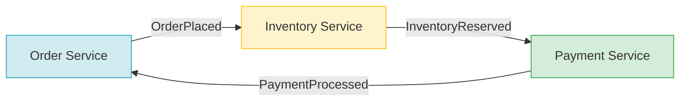
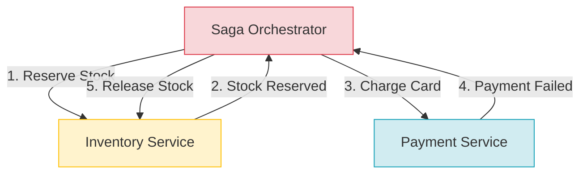

# Saga Pattern (Distributed Workflows)

Because synchronous coordination protocols (2PC/3PC) scale poorly, modern microservice architectures favor **Eventual Consistency** using the **Saga Pattern**.

This guide covers Saga coordination patterns, compensation semantics, Spring Boot code examples, and handling runtime failures in production.

---

## Saga Pattern Overview

A Saga decomposes a distributed transaction into a sequence of **local ACID transactions** ($T_1, T_2, \dots, T_n$) on individual service databases. Each local transaction updates the database and publishes an event or message to trigger the next step in the saga.

```
T1 (Order Created) ──► T2 (Stock Reserved) ──► T3 (Payment Charged) ──► Complete
```

### Compensating Transactions

If a local transaction fails (e.g., payment is declined), the saga must manually reverse previous changes by executing **compensating transactions** ($C_1, C_2, \dots, C_{n-1}$) in reverse order.

```
T1 (Order) ──► T2 (Inventory) ──► T3 (Payment) ──► FAIL (Declined)
                                                     │ (Trigger compensation)
T1_Compensate ◄─── T2_Compensate ◄───────────────────┘
```

> [!CAUTION]
> **Compensations are not database rollbacks.** They are **semantic reverses**. For instance, if $T_2$ reserves stock, $C_2$ releases the stock. If $T_3$ charges a card, $C_3$ issues a refund. If $T_1$ inserts a record, $C_1$ might mark it as `CANCELLED` rather than physically deleting it, preserving the audit trail.

---

### Saga Coordination Styles

There are two primary patterns for coordinating a Saga: **Choreography** and **Orchestration**.

#### Choreography (Event-Driven)

In a choreography, there is no central controller. Each service reacts to events from other services and publishes its own events to trigger subsequent steps.



##### Choreography Code Example (Inventory Service)

```java
@Component
@RequiredArgsConstructor
public class InventoryChoreographer {
    private final InventoryRepository inventoryRepository;
    private final KafkaTemplate<String, Object> kafkaTemplate;

    @KafkaListener(topics = "order-placed-events")
    public void onOrderPlaced(OrderPlacedEvent event) {
        try {
            inventoryRepository.reserve(event.getOrderId(), event.getItems());
            kafkaTemplate.send("inventory-reserved-events", new InventoryReservedEvent(event.getOrderId()));
        } catch (InsufficientStockException e) {
            kafkaTemplate.send("inventory-failed-events", new InventoryFailedEvent(event.getOrderId()));
        }
    }
}
```

* **Pros:** Simple to start; highly decoupled services.
* **Cons:** Hard to visualize the workflow; risk of cyclic dependencies; debugging requires complex distributed tracing.

---

#### Orchestration (Central Coordinator)

In an orchestration, a dedicated service acts as the **Orchestrator** (the brain). It issues commands to participants, waits for responses, and coordinates the execution of tasks and compensations.



##### Orchestrator Code Example

```java
@Service
@RequiredArgsConstructor
public class OrderSagaOrchestrator {
    private final OrderRepository orderRepository;
    private final InventoryClient inventoryClient;
    private final PaymentClient paymentClient;

    @Transactional
    public void executeSaga(CreateOrderCommand cmd) {
        Order order = orderRepository.save(Order.create(cmd));
        try {
            // Step 1: Reserve Stock
            inventoryClient.reserve(order.getId(), cmd.getItems());
            
            // Step 2: Process Payment
            paymentClient.charge(order.getId(), cmd.getPaymentInfo());
            
            order.markCompleted();
        } catch (InventoryException ex) {
            // Step 1 failed, abort order
            order.markFailed("Stock reservation failed");
        } catch (PaymentException ex) {
            // Step 2 failed, trigger compensation for Step 1
            inventoryClient.release(order.getId(), cmd.getItems());
            order.markFailed("Payment failed: " + ex.getMessage());
        }
        orderRepository.save(order);
    }
}
```

* **Pros:** Centralized visibility; easy to test and debug; clear separation of business workflows.
* **Cons:** Coordinator is a single point of failure (SPOF); risk of centralization anti-pattern where the orchestrator owns too much business logic.

---

### Saga Escalation Playbook

If a compensating transaction fails (e.g., inventory client throws a timeout while trying to release reserved stock), the saga coordinator cannot automatically resolve. You must build an escalation pipeline:
1. **Exponential Retry:** Retry the compensation step with exponential backoff and jitter.
2. **Transition to Manual Alerting:** If retries are exhausted, set the saga state to `MANUAL_INTERVENTION_REQUIRED` and publish a critical alert.
3. **Dedicated Admin Dashboard:** Provide operators an administrative UI to manually resolve or retry compensation tasks.
