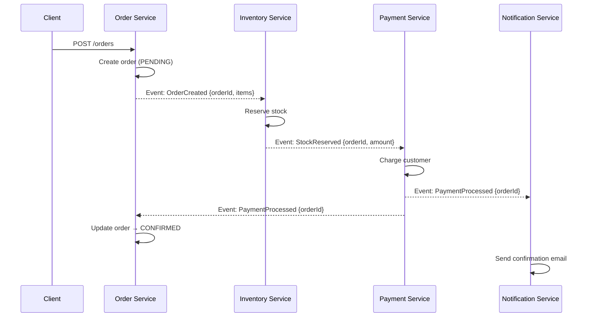
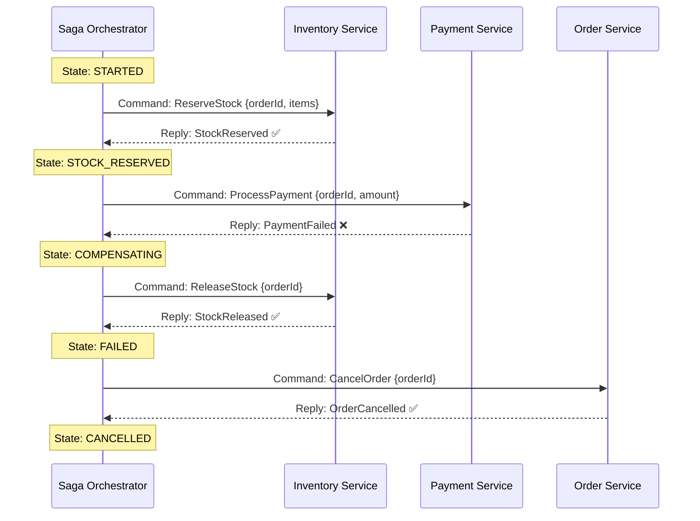

import Tabs from '@theme/Tabs';
import TabItem from '@theme/TabItem';

# Saga Pattern (Distributed Workflows)

:::info[Who this guide is for]
- **New learners** — start at [The Problem: Why Can't We Just Use a Database Transaction?](#the-problem-why-cant-we-just-use-a-database-transaction) and [The Travel Booking Analogy](#the-travel-booking-analogy) to understand the core concept.
- **Senior engineers** — jump to [Saga State Machine Design](#saga-state-machine-design), [Idempotency & Exactly-Once Semantics](#idempotency--exactly-once-semantics), [Choreography vs Orchestration Trade-offs](#choreography-vs-orchestration-trade-offs), or [Production Failure Handling](#production-failure-handling).
:::

---

## The Problem: Why Can't We Just Use a Database Transaction?

In a monolith with one database, a `@Transactional` annotation is enough. If any step fails, the database rolls everything back — atomically, durably, and consistently.

In a **microservices architecture**, each service owns its own database. There is no single database that spans all services. When an e-commerce checkout needs to:

1. Create an order in `order-service` (PostgreSQL)
2. Reserve stock in `inventory-service` (MySQL)
3. Charge the customer in `payment-service` (Stripe API)
4. Notify via `notification-service` (SendGrid API)

...there is no `BEGIN TRANSACTION` that spans all four. If Step 3 (payment) fails after Steps 1 and 2 have succeeded, you have a **partially committed operation** — the customer's stock is reserved and an order exists, but no payment has been taken. The system is now inconsistent.

---

## The Travel Booking Analogy

Imagine booking a trip: flight + hotel + car rental. Each is booked with a different company.

- You book the **flight** ✅
- You book the **hotel** ✅
- You try to book the **car rental** ❌ — no cars available at that price.

What do you do? You **cancel** the hotel and **cancel** the flight — but you call each company individually to reverse the booking. There's no one transaction that rolls all three back.

This is exactly a **Saga**: a sequence of steps where each step has a **compensating action** that undoes its effect if a later step fails.

---

## Saga Pattern Overview

A Saga decomposes a distributed transaction into a sequence of **local ACID transactions** — one per service. Each local transaction:
1. Updates its own database (local ACID guarantee)
2. Publishes an event or sends a command to trigger the next step

```
T1 (Order Created) ──► T2 (Stock Reserved) ──► T3 (Payment Charged) ──► Complete ✅
```

If a step fails, compensating transactions execute in reverse:

```
T1 (Order) ──► T2 (Inventory) ──► T3 (Payment FAIL ❌)
                                            │
              ◄── C2 (Release Stock) ◄──────┘
C1 (Cancel Order) ◄────────────────
```

### What Are Compensating Transactions?

:::caution[Compensations are NOT rollbacks]
A database rollback erases changes as if they never happened. A **compensating transaction** is a new, forward-moving operation that **semantically reverses** the effect of a previous step.

| Step | Forward Transaction | Compensation |
|:---|:---|:---|
| T1: Create Order | `INSERT INTO orders (status='PENDING')` | `UPDATE orders SET status='CANCELLED'` |
| T2: Reserve Stock | `UPDATE inventory SET reserved = reserved + 1` | `UPDATE inventory SET reserved = reserved - 1` |
| T3: Charge Card | POST to Stripe `/charges` | POST to Stripe `/refunds` |

Notice that `T1`'s compensation does not `DELETE` the order — it marks it `CANCELLED`. This preserves the **audit trail**, which is essential for financial systems.
:::

---

## Saga Coordination Styles

There are two fundamentally different ways to coordinate a Saga:

| | Choreography | Orchestration |
|:---|:---|:---|
| **Control** | Distributed — each service decides what to do next | Centralized — one orchestrator drives all steps |
| **Communication** | Events (async, reactive) | Commands (directed instructions) |
| **Visibility** | Low — workflow is implicit in event chains | High — workflow is explicit in orchestrator code |
| **Coupling** | Services coupled to event contracts | Services coupled to orchestrator |
| **Failure handling** | Complex — each service must handle compensation events | Centralized — orchestrator coordinates compensations |
| **Best for** | Simple, linear, well-understood flows | Complex, branching workflows with error recovery |

---

## Choreography (Event-Driven)

In choreography, there is no central controller. Each service **listens for events** from other services and **publishes events** to trigger subsequent steps. The workflow emerges from how events propagate through the system.



### Happy Path Code (Inventory Service — Choreography)

```java
@Component
@RequiredArgsConstructor
@Slf4j
public class InventoryChoreographer {
    private final InventoryRepository inventoryRepository;
    private final OutboxRepository outboxRepository; // use Outbox for reliable publishing

    @KafkaListener(topics = "order-events", groupId = "inventory-service")
    @Transactional // local ACID: reserve stock AND write outbox atomically
    public void onOrderCreated(OrderCreatedEvent event) {
        log.info("Reserving stock for order {}", event.getOrderId());

        try {
            inventoryRepository.reserve(event.getOrderId(), event.getItems());

            // Write success event to outbox (same DB transaction)
            outboxRepository.save(OutboxEvent.builder()
                .aggregateId(event.getOrderId())
                .eventType("StockReserved")
                .payload(new StockReservedEvent(event.getOrderId(), event.getAmount()))
                .build());

        } catch (InsufficientStockException e) {
            log.warn("Insufficient stock for order {}: {}", event.getOrderId(), e.getMessage());

            // Write failure event to outbox (same DB transaction)
            outboxRepository.save(OutboxEvent.builder()
                .aggregateId(event.getOrderId())
                .eventType("StockReservationFailed")
                .payload(new StockReservationFailedEvent(event.getOrderId(), e.getMessage()))
                .build());
        }
    }

    // Compensation: triggered by PaymentFailed event
    @KafkaListener(topics = "payment-events", groupId = "inventory-service")
    @Transactional
    public void onPaymentFailed(PaymentFailedEvent event) {
        log.info("Releasing stock reservation for order {} due to payment failure", event.getOrderId());
        inventoryRepository.release(event.getOrderId());

        outboxRepository.save(OutboxEvent.builder()
            .aggregateId(event.getOrderId())
            .eventType("StockReleased")
            .payload(new StockReleasedEvent(event.getOrderId()))
            .build());
    }
}
```

**Pros of Choreography:**
- No single point of failure (no central coordinator)
- Services are loosely coupled — each only knows its own event contracts
- Naturally maps to event-driven architectures

**Cons of Choreography:**
- Workflow is **invisible** — to understand the full flow you must read every service
- Compensation chains are **hard to reason about** — compensation events must fan out correctly
- **Cyclic dependency risk** — services can end up listening to each other's events in cycles
- Debugging requires **distributed tracing** across every service

---

## Orchestration (Central Coordinator)

In orchestration, a dedicated **Orchestrator** service acts as the brain. It explicitly issues commands to each participant, waits for responses, and decides what to do next — including triggering compensations.



### Orchestrator Code Example

```java
@Service
@RequiredArgsConstructor
@Slf4j
public class OrderSagaOrchestrator {

    private final SagaStateRepository sagaStateRepository;
    private final InventoryClient inventoryClient;
    private final PaymentClient paymentClient;
    private final OrderRepository orderRepository;

    @Transactional
    public void startSaga(String sagaId, CreateOrderCommand cmd) {
        SagaState state = SagaState.builder()
            .id(sagaId)
            .status(SagaStatus.STARTED)
            .orderId(cmd.getOrderId())
            .build();
        sagaStateRepository.save(state);

        executeStep(sagaId, cmd);
    }

    @Transactional
    public void executeStep(String sagaId, CreateOrderCommand cmd) {
        SagaState state = sagaStateRepository.findById(sagaId).orElseThrow();

        try {
            switch (state.getStatus()) {
                case STARTED -> {
                    log.info("[{}] Step 1: Reserving stock", sagaId);
                    inventoryClient.reserve(cmd.getOrderId(), cmd.getItems());
                    state.transition(SagaStatus.STOCK_RESERVED);
                    sagaStateRepository.save(state);
                    // Continue to next step
                    executeStep(sagaId, cmd);
                }
                case STOCK_RESERVED -> {
                    log.info("[{}] Step 2: Processing payment", sagaId);
                    paymentClient.charge(cmd.getOrderId(), cmd.getPaymentInfo());
                    state.transition(SagaStatus.PAYMENT_PROCESSED);
                    sagaStateRepository.save(state);
                    executeStep(sagaId, cmd);
                }
                case PAYMENT_PROCESSED -> {
                    log.info("[{}] Saga complete", sagaId);
                    orderRepository.markCompleted(cmd.getOrderId());
                    state.transition(SagaStatus.COMPLETED);
                    sagaStateRepository.save(state);
                }
            }
        } catch (InventoryException e) {
            log.error("[{}] Stock reservation failed: {}", sagaId, e.getMessage());
            state.transition(SagaStatus.FAILED);
            sagaStateRepository.save(state);
            orderRepository.markFailed(cmd.getOrderId(), "Stock unavailable");

        } catch (PaymentException e) {
            log.error("[{}] Payment failed: {}. Starting compensation.", sagaId, e.getMessage());
            state.transition(SagaStatus.COMPENSATING);
            sagaStateRepository.save(state);
            compensate(sagaId, cmd, e.getMessage());
        }
    }

    @Transactional
    private void compensate(String sagaId, CreateOrderCommand cmd, String reason) {
        try {
            log.info("[{}] Compensation Step 1: Releasing stock", sagaId);
            inventoryClient.release(cmd.getOrderId(), cmd.getItems());

            log.info("[{}] Compensation Step 2: Cancelling order", sagaId);
            orderRepository.markFailed(cmd.getOrderId(), reason);

            SagaState state = sagaStateRepository.findById(sagaId).orElseThrow();
            state.transition(SagaStatus.CANCELLED);
            sagaStateRepository.save(state);
            log.info("[{}] Saga cancelled successfully", sagaId);

        } catch (Exception compensationEx) {
            log.error("[{}] COMPENSATION FAILED: {}", sagaId, compensationEx.getMessage());
            SagaState state = sagaStateRepository.findById(sagaId).orElseThrow();
            state.transition(SagaStatus.MANUAL_INTERVENTION_REQUIRED);
            state.setFailureReason(compensationEx.getMessage());
            sagaStateRepository.save(state);
            // Alert operations team
        }
    }
}
```

---

## Saga State Machine Design

A production saga must model its lifecycle as a **formal state machine** to prevent invalid transitions and enable replay/recovery.

```
                    ┌─────────────────────────────────────────┐
                    │               SAGA STATE MACHINE        │
                    └─────────────────────────────────────────┘

  STARTED ──► STOCK_RESERVED ──► PAYMENT_PROCESSED ──► COMPLETED ✅
     │               │
     │               └──► COMPENSATING ──► CANCELLED ✅
     │                          │
     └──► FAILED ✅             └──► MANUAL_INTERVENTION_REQUIRED ⚠️
```

```java
public enum SagaStatus {
    STARTED,
    STOCK_RESERVED,
    PAYMENT_PROCESSED,
    COMPLETED,
    COMPENSATING,
    CANCELLED,
    FAILED,
    MANUAL_INTERVENTION_REQUIRED;

    public boolean isTerminal() {
        return this == COMPLETED || this == CANCELLED
            || this == FAILED || this == MANUAL_INTERVENTION_REQUIRED;
    }

    public boolean isForwardTransitionValid(SagaStatus next) {
        return switch (this) {
            case STARTED            -> next == STOCK_RESERVED || next == FAILED;
            case STOCK_RESERVED     -> next == PAYMENT_PROCESSED || next == COMPENSATING;
            case PAYMENT_PROCESSED  -> next == COMPLETED || next == COMPENSATING;
            case COMPENSATING       -> next == CANCELLED || next == MANUAL_INTERVENTION_REQUIRED;
            default                 -> false; // terminal states cannot transition
        };
    }
}
```

```java
@Entity
@Table(name = "saga_state")
@Data
@Builder
public class SagaState {
    @Id private String id;
    @Enumerated(EnumType.STRING)
    private SagaStatus status;
    private String orderId;
    private String failureReason;
    private int compensationAttempts;
    private Instant createdAt;
    private Instant updatedAt;

    public void transition(SagaStatus next) {
        if (!status.isForwardTransitionValid(next)) {
            throw new InvalidSagaTransitionException(
                "Cannot transition from " + status + " to " + next);
        }
        this.status = next;
        this.updatedAt = Instant.now();
    }
}
```

### Why Store Saga State in a Database?

1. **Durability** — if the orchestrator crashes mid-saga, it can **resume from the last known state** on restart.
2. **Observability** — you can query all running sagas and their current step.
3. **Manual intervention** — operators can inspect and manually advance stuck sagas.
4. **Replay** — you can re-drive a saga from any intermediate state (e.g., after fixing a downstream service).

---

## Idempotency & Exactly-Once Semantics

In a saga, each step may be **retried** (due to network errors, timeouts, or crashes). Every saga step **must be idempotent** — executing it twice must produce the same result as executing it once.

### Strategy 1: Idempotency Keys in Downstream Services

```java
// Inventory service — idempotent reserve endpoint
@PostMapping("/inventory/reserve")
public ResponseEntity<Void> reserve(@RequestBody ReserveCommand cmd) {
    // Check if we already processed this saga step
    if (reservationRepository.existsBySagaIdAndStep(cmd.getSagaId(), "reserve")) {
        log.info("Duplicate reserve request for saga {}, ignoring", cmd.getSagaId());
        return ResponseEntity.ok().build(); // idempotent — return success
    }

    inventoryRepository.reserve(cmd.getOrderId(), cmd.getItems());
    reservationRepository.save(new Reservation(cmd.getSagaId(), "reserve", cmd.getOrderId()));
    return ResponseEntity.ok().build();
}
```

### Strategy 2: Outbox Pattern for Event Publishing

When a service handles a saga step and publishes an event, these must be **atomic** — either both happen or neither does:

```java
@Transactional
public void reserveStock(ReserveCommand cmd) {
    // 1. Reserve stock (business operation)
    inventoryRepository.reserve(cmd.getOrderId(), cmd.getItems());

    // 2. Write event to outbox IN THE SAME TRANSACTION
    outboxRepository.save(OutboxEvent.of("StockReserved", cmd.getOrderId()));

    // If this transaction commits: both stock reservation AND outbox event are durable
    // If it fails: neither happens — perfectly safe to retry
}
```

Without the Outbox Pattern, you risk: stock reserved but event never published → saga hangs forever.

---

## Choreography vs Orchestration Trade-offs

<Tabs>
<TabItem value="choreography" label="Choreography">

**When to use:**
- Small number of services (2–4) with linear, well-understood flows
- High autonomy is more important than visibility
- Event-driven architecture is already in place

**Watch out for:**
- **Saga creep** — as requirements grow, the implicit workflow becomes increasingly hard to follow
- **Compensation fan-out** — when T3 fails, it must publish a failure event that triggers C2 and C1. What if those compensation events are lost?
- **Testing difficulty** — end-to-end testing requires running all services simultaneously

</TabItem>
<TabItem value="orchestration" label="Orchestration">

**When to use:**
- Complex, branching workflows (conditional steps, parallel steps)
- You need centralized visibility and auditability
- Compensations involve multiple services
- Regulatory/compliance requirements need a clear audit trail

**Watch out for:**
- **Orchestrator as SPOF** — the orchestrator must be highly available (multi-instance with distributed locking or event sourcing)
- **God service** — orchestrators can accumulate too much business logic; keep them as workflow coordinators, not business logic containers
- **Tight coupling** — the orchestrator knows the full workflow; adding a new step requires modifying the orchestrator

</TabItem>
</Tabs>

---

## Production Failure Handling

### Exponential Backoff with Jitter for Step Retries

```java
@Component
@RequiredArgsConstructor
@Slf4j
public class SagaStepRetryExecutor {

    public <T> T executeWithRetry(String stepName, Supplier<T> step, int maxAttempts) {
        for (int attempt = 1; attempt <= maxAttempts; attempt++) {
            try {
                return step.get();
            } catch (TransientException e) {
                if (attempt == maxAttempts) {
                    throw new SagaStepExhaustedException(
                        "Step " + stepName + " failed after " + maxAttempts + " attempts", e);
                }
                long delayMs = calculateBackoff(attempt);
                log.warn("Step {} attempt {}/{} failed. Retrying in {}ms", 
                    stepName, attempt, maxAttempts, delayMs);
                sleep(delayMs);
            }
        }
        throw new IllegalStateException("Unreachable");
    }

    private long calculateBackoff(int attempt) {
        long baseDelay = 500L; // 500ms base
        long exponential = (long) Math.pow(2, attempt) * baseDelay; // 1s, 2s, 4s, 8s
        long jitter = (long) (Math.random() * baseDelay); // ±500ms jitter
        return Math.min(exponential + jitter, 30_000L); // cap at 30s
    }
}
```

### Escalation Playbook

When compensation itself fails (e.g., the inventory service is down while you're trying to release a reservation):

```
Level 1 — Automatic Retry (0–5 minutes)
  └── Exponential backoff with jitter: 1s, 2s, 4s, 8s, 16s
  └── Log each retry attempt with sagaId, step, attempt number

Level 2 — Dead Letter Queue (5 minutes)
  └── Move failed saga to DLQ for isolated inspection
  └── Prevent blocking healthy saga traffic

Level 3 — Manual Intervention (ops alert)
  └── Saga status: MANUAL_INTERVENTION_REQUIRED
  └── PagerDuty/alerting fires
  └── Admin dashboard shows saga state, failed step, error message
  └── Operator can manually: retry a step, skip a step, force cancel

Level 4 — Business Resolution
  └── If compensation is truly impossible (e.g., payment was sent to bank):
      create a manual financial adjustment record
      involve finance/ops team for out-of-band resolution
```

```java
@Service
@RequiredArgsConstructor
public class SagaEscalationService {

    private final SagaStateRepository sagaStateRepository;
    private final AlertingService alertingService;
    private final DlqPublisher dlqPublisher;

    public void escalate(String sagaId, String step, Exception cause) {
        SagaState state = sagaStateRepository.findById(sagaId).orElseThrow();

        int attempts = state.incrementCompensationAttempts();

        if (attempts <= 5) {
            // Level 1: automatic retry (handled by retry executor)
            return;
        }

        if (attempts == 6) {
            // Level 2: DLQ
            dlqPublisher.publish(new FailedSagaMessage(sagaId, step, cause.getMessage()));
        }

        if (attempts >= 6) {
            // Level 3: alert ops
            state.transition(SagaStatus.MANUAL_INTERVENTION_REQUIRED);
            state.setFailureReason(step + ": " + cause.getMessage());
            sagaStateRepository.save(state);

            alertingService.alert(Alert.critical(
                "Saga compensation failed - manual intervention required",
                Map.of("sagaId", sagaId, "step", step, "error", cause.getMessage())
            ));
        }
    }
}
```

---

## Observability: Monitoring Sagas in Production

```java
@Component
@RequiredArgsConstructor
public class SagaMetrics {

    private final MeterRegistry registry;

    public void recordSagaStarted(String sagaType) {
        registry.counter("saga.started", "type", sagaType).increment();
    }

    public void recordSagaCompleted(String sagaType, Duration duration) {
        registry.timer("saga.duration", "type", sagaType, "result", "success")
                .record(duration);
    }

    public void recordSagaFailed(String sagaType, String step) {
        registry.counter("saga.failed", "type", sagaType, "step", step).increment();
    }

    public void recordCompensationStarted(String sagaType) {
        registry.counter("saga.compensation.started", "type", sagaType).increment();
    }

    public void recordManualIntervention(String sagaType, String step) {
        registry.counter("saga.manual_intervention", "type", sagaType, "step", step)
                .increment();
    }
}
```

**Key metrics to alert on:**

| Metric | Alert When | What It Means |
|:---|:---|:---|
| `saga.failed` rate | > 1% of started sagas | Downstream service degradation or data issue |
| `saga.manual_intervention` | Any occurrence | Critical — requires immediate ops response |
| `saga.duration` p99 | > 30s for typical flows | Downstream service slowdown or deadlock |
| `saga.compensation.started` rate | > 0.5% of sagas | Payment/inventory failures increasing |
| Sagas stuck in `COMPENSATING` > 5 min | Any | Compensation service unreachable |

---

## Senior Interview Questions

### Q: What is the difference between a saga and a distributed transaction?

**A:** A distributed transaction (like 2PC) achieves **strong ACID atomicity** across multiple databases through a synchronous locking protocol. All participants either commit or roll back together. A saga achieves **eventual consistency** — each step commits locally, and failure is handled by compensating transactions (semantically reversing earlier steps). Sagas trade ACID guarantees for scalability, availability, and independence from distributed locking.

### Q: Can a saga leave the system in a temporarily inconsistent state?

**A:** Yes, by design. While a saga is executing, the system is in an intermediate state (e.g., stock reserved but payment not yet confirmed). This is **tolerated** because the saga will either complete (reaching a consistent state) or fully compensate (returning to a consistent starting state). External observers may briefly see intermediate states — this is why saga-based systems must carefully design their **read models** and **exposure windows**.

### Q: How do you handle idempotency in saga steps?

**A:** Every saga step must be idempotent because retries are inevitable. Strategies include:
1. **Idempotency keys in the DB** — check if the step already executed for this sagaId before processing.
2. **Outbox Pattern** — write the event and business state change in one atomic local transaction, preventing the case where the event is published but the DB change is lost (or vice versa).
3. **Upsert semantics** — use `ON CONFLICT DO NOTHING` or similar to make the operation safe to repeat.

### Q: What happens if the orchestrator crashes mid-saga?

**A:** If saga state is persisted durably (in a database), the orchestrator can recover by reading its current state on restart. A recovery job queries all sagas in non-terminal states and re-drives them from their last persisted step. This is why `sagaStateRepository.save(state)` must happen **before** each network call to a downstream service — ensuring the state is durable before the action is taken.

### Q: How do you design saga compensations for operations that can't be reversed?

**A:** For truly irreversible operations (e.g., a payment was sent to a bank, an email was delivered, a 3PL warehouse shipped a parcel):
1. **Don't compensate technically** — create a **business-level adjustment record** (e.g., a refund record, a return request).
2. **Pivot the saga state** to `MANUAL_INTERVENTION_REQUIRED` and alert operations.
3. Document in the system which operations are "pivot transactions" (steps after which compensation is impossible) and architect sagas to place them at the end.

---

## See Also

- [Two-Phase Commit (2PC)](./two-phase-commit.md) — Synchronous alternative; understand why sagas exist
- [Transactional Outbox Pattern](./outbox-pattern.md) — Reliable event publishing inside saga steps
- [Dead Letter Queue (DLQ)](./dead-letter-queue.md) — Handling permanently failed saga messages
- [Microservices Patterns](./microservices-patterns.md) — Broader microservices architecture context
