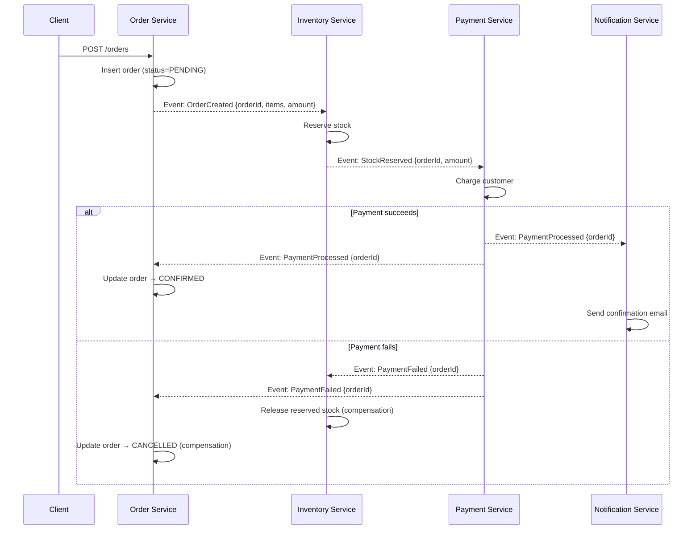
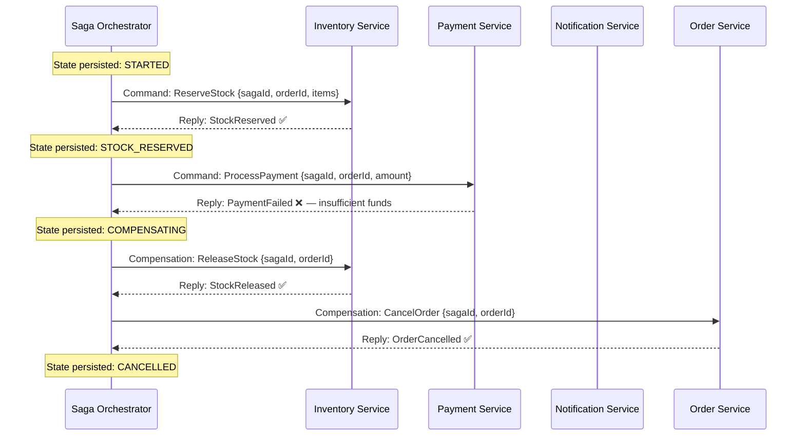

import Tabs from '@theme/Tabs';
import TabItem from '@theme/TabItem';
import TwoPhaseCommitDiagram from '@site/src/components/TwoPhaseCommitDiagram';
import SagaCoreFlowDiagram from '@site/src/components/SagaCoreFlowDiagram';
import SagaCoordinationDiagram from '@site/src/components/SagaCoordinationDiagram';
import ChoreographyComplexityDiagram from '@site/src/components/ChoreographyComplexityDiagram';
import SagaStateMachineDiagram from '@site/src/components/SagaStateMachineDiagram';
import KafkaAsyncOrchestrationDiagram from '@site/src/components/KafkaAsyncOrchestrationDiagram';
import ParallelSagaStepsDiagram from '@site/src/components/ParallelSagaStepsDiagram';
import EscalationPlaybookDiagram from '@site/src/components/EscalationPlaybookDiagram';
import SagaDecisionGuideDiagram from '@site/src/components/SagaDecisionGuideDiagram';

# Saga Pattern (Distributed Workflows)

:::info[Who this guide is for]
- **New learners** — start at [The Problem](#1-the-problem-why-cant-we-just-use-a-database-transaction) and [The Travel Booking Analogy](#2-the-travel-booking-analogy).
- **Senior engineers** — the depth is in [Saga State Machine Design](#6-saga-state-machine-design), [Failure Taxonomy](#9-failure-taxonomy--compensation-design), [Idempotency](#10-idempotency--exactly-once-semantics), and [Production Failure Handling](#11-production-failure-handling).
:::

---

## 1. The Problem: Why Can't We Just Use a Database Transaction?

In a monolith with a single database, `@Transactional` is sufficient. Any failure rolls everything back atomically, and the database is always consistent.

In a microservices architecture, **each service owns its own database**. There is no shared database connection and no distributed transaction coordinator in most modern stacks. When an e-commerce checkout must:

1. Create an order in `order-service` (PostgreSQL)
2. Reserve stock in `inventory-service` (MySQL)
3. Charge the customer via `payment-service` (Stripe API)
4. Send a confirmation via `notification-service` (SendGrid API)

...there is no `BEGIN TRANSACTION` that spans all four. If Step 3 fails after Steps 1 and 2 have succeeded, the system is partially committed — the customer's stock is reserved, an order exists, but no payment was taken.

### Why Not Two-Phase Commit (2PC)?

2PC is the classical solution: a coordinator asks all participants to "prepare" (lock resources), then issues a global "commit" or "abort". It provides true distributed ACID semantics.

<TwoPhaseCommitDiagram />

**Why 2PC fails at microservices scale:**

| Problem | Impact |
|:---|:---|
| **Blocking locks** | All participants hold locks for the entire 2PC duration — throughput collapses under concurrency |
| **Coordinator SPOF** | If the coordinator crashes between phases, participants are stuck holding locks indefinitely |
| **External API incompatibility** | Stripe, SendGrid, and most external APIs are not 2PC-aware — they cannot participate in a prepare/commit protocol |
| **Cross-database unavailability** | Postgres + MySQL + Stripe cannot share a single distributed transaction manager |
| **Availability vs consistency** | 2PC sacrifices availability — if any participant is unreachable, the whole transaction blocks |

The Saga pattern accepts **eventual consistency** instead of ACID consistency, trading distributed locking for independent service progress and explicit compensation logic.

---

## 2. The Travel Booking Analogy

Imagine booking a trip: flight + hotel + car rental. Each is booked independently with a different company.

```
Step 1:  Book flight   ✅  (Confirmed: BA-123)
Step 2:  Book hotel    ✅  (Confirmed: Marriott #456)
Step 3:  Book car      ❌  No cars available at that price

What do you do?
  → Call the hotel → Cancel booking #456
  → Call the airline → Cancel booking BA-123

There is no single "undo" button across all three.
Each cancellation is a NEW forward-moving action — not a rollback.
```

This is exactly a Saga: a sequence of local transactions, where **each step has a compensating action** that semantically undoes its effect if a later step fails.

The fundamental insight: **you cannot rewind time in a distributed system.** The order was created, the stock was reserved, the email was queued. Compensation acknowledges this — it creates new, observable business events that undo the effect, rather than pretending the earlier steps never happened.

---

## 3. Saga Pattern — Core Mechanics

A Saga decomposes a distributed business transaction into a sequence of **local ACID transactions**, one per service. Each local transaction:
1. Updates its own database (local ACID guarantee — only this service's data)
2. Signals the next step (via event or command)

### Happy Path & Failure Path

<SagaCoreFlowDiagram />

### What Are Compensating Transactions?

:::caution[Compensations are NOT database rollbacks]
A database rollback erases changes as if they never happened. A **compensating transaction** is a new, committed, observable business operation that **semantically reverses** the effect of a prior step. The prior step's commit is permanent — compensation creates new state on top of it.

| Step | Forward Transaction | Compensation |
|:---|:---|:---|
| T1: Create Order | `INSERT INTO orders (status='PENDING')` | `UPDATE orders SET status='CANCELLED'` |
| T2: Reserve Stock | `UPDATE inventory SET reserved = reserved + 1` | `UPDATE inventory SET reserved = reserved - 1` |
| T3: Charge Card | `POST /stripe/charges` | `POST /stripe/refunds` |
| T4: Send Email | `POST /sendgrid/send` | *(No compensation — email already delivered)* |

Notice T1's compensation does NOT `DELETE` the order — it marks it `CANCELLED`. This preserves the **audit trail**, which is mandatory in financial systems. T4 has no technical compensation — an email cannot be unsent. This is a **pivot transaction** (see Section 9).
:::

---

## 4. Saga Coordination Styles

Two fundamentally different patterns exist for coordinating a Saga:

<SagaCoordinationDiagram />

| Dimension | Choreography | Orchestration |
|:---|:---|:---|
| **Control** | Distributed — each service reacts to events | Centralized — one orchestrator drives all steps |
| **Communication** | Async events | Directed commands (sync or async) |
| **Workflow visibility** | ❌ Implicit — must read every service | ✅ Explicit — one place to understand the flow |
| **Coupling** | Services coupled to event contracts | Services coupled to orchestrator's command API |
| **Failure handling** | Distributed — each service emits compensation events | Centralized — orchestrator coordinates all compensations |
| **Debugging** | Requires distributed tracing across all services | Single orchestrator log shows full saga history |
| **Scaling** | Each service scales independently | Orchestrator must be HA |
| **Best for** | Simple linear flows, high team autonomy | Complex branching flows, compliance-heavy systems |

---

## 5. Choreography — Deep Dive

In choreography, each service subscribes to events from the previous service and publishes events that trigger the next service. The workflow emerges from event propagation — no central controller exists.

### Full Event Flow



### Choreography Implementation — Inventory Service

```java
@Component
@RequiredArgsConstructor
@Slf4j
public class InventoryChoreographer {

    private final InventoryRepository inventoryRepository;
    private final OutboxRepository outboxRepository;

    // Forward step: triggered by OrderCreated event
    @KafkaListener(topics = "order-events", groupId = "inventory-service")
    @Transactional   // Local ACID: reserve stock AND write outbox event atomically
    public void onOrderCreated(OrderCreatedEvent event) {
        log.info("Reserving stock for order {}", event.getOrderId());

        // Idempotency guard: skip if already processed (retry safety)
        if (inventoryRepository.reservationExists(event.getOrderId())) {
            log.info("Duplicate OrderCreated for order {} — skipping", event.getOrderId());
            return;
        }

        try {
            inventoryRepository.reserve(event.getOrderId(), event.getItems());

            // Write success event to outbox IN SAME TRANSACTION as business state
            // If this transaction commits: reservation AND event are both durable
            // If it fails: neither happens — safe to retry
            outboxRepository.save(OutboxEvent.builder()
                .aggregateId(event.getOrderId())
                .eventType("StockReserved")
                .payload(new StockReservedEvent(event.getOrderId(), event.getAmount()))
                .createdAt(Instant.now())
                .build());

        } catch (InsufficientStockException e) {
            log.warn("Insufficient stock for order {}: {}", event.getOrderId(), e.getMessage());

            // Failure event also written atomically with any partial state changes
            outboxRepository.save(OutboxEvent.builder()
                .aggregateId(event.getOrderId())
                .eventType("StockReservationFailed")
                .payload(new StockReservationFailedEvent(event.getOrderId(), e.getMessage()))
                .build());
        }
    }

    // Compensation step: triggered by PaymentFailed event
    @KafkaListener(topics = "payment-events", groupId = "inventory-service")
    @Transactional
    public void onPaymentFailed(PaymentFailedEvent event) {
        log.info("Releasing stock for order {} — payment failed", event.getOrderId());

        // Idempotency guard: skip if already compensated
        if (!inventoryRepository.reservationExists(event.getOrderId())) {
            log.info("No reservation found for order {} — already compensated or never reserved",
                event.getOrderId());
            return;
        }

        inventoryRepository.release(event.getOrderId());

        outboxRepository.save(OutboxEvent.builder()
            .aggregateId(event.getOrderId())
            .eventType("StockReleased")
            .payload(new StockReleasedEvent(event.getOrderId()))
            .build());
    }
}
```

### Choreography: The Hidden Coupling Problem

Choreography appears decoupled, but the services are implicitly coupled through the **event contract**:

```
OrderService publishes:   OrderCreated { orderId, items, customerId, amount }
InventoryService expects: orderId, items
PaymentService expects:   orderId, amount, customerId

If OrderCreated drops the "amount" field:
  → InventoryService still works (doesn't use amount)
  → PaymentService BREAKS (cannot charge without amount)
  → The coupling is invisible until runtime

With orchestration:
  The orchestrator's PaymentCommand explicitly includes amount
  The contract is visible in one place — the orchestrator
```

### When Choreography Becomes Unmanageable

<ChoreographyComplexityDiagram />

---

## 6. Orchestration — Deep Dive

An **Orchestrator** is a dedicated service that explicitly commands each participant, waits for replies, and drives the saga forward — including coordinating all compensations from one place.

### Full Orchestration Flow



### Saga State Machine

A production orchestrator must model the saga lifecycle as a **formal state machine** to prevent invalid transitions, enable recovery, and provide auditability.

<SagaStateMachineDiagram />

```java
public enum SagaStatus {
    STARTED,
    STOCK_RESERVED,
    STOCK_RESERVATION_FAILED,
    PAYMENT_PROCESSED,
    PAYMENT_FAILED,
    NOTIFIED,
    COMPLETED,
    COMPENSATING,
    CANCELLED,
    MANUAL_INTERVENTION_REQUIRED;

    // Valid forward transitions — enforced by the state machine
    private static final Map<SagaStatus, Set<SagaStatus>> VALID_TRANSITIONS = Map.of(
        STARTED,                    Set.of(STOCK_RESERVED, STOCK_RESERVATION_FAILED),
        STOCK_RESERVED,             Set.of(PAYMENT_PROCESSED, PAYMENT_FAILED),
        PAYMENT_PROCESSED,          Set.of(NOTIFIED, COMPENSATING),
        NOTIFIED,                   Set.of(COMPLETED),
        STOCK_RESERVATION_FAILED,   Set.of(CANCELLED),
        PAYMENT_FAILED,             Set.of(COMPENSATING),
        COMPENSATING,               Set.of(CANCELLED, MANUAL_INTERVENTION_REQUIRED)
    );

    public boolean canTransitionTo(SagaStatus next) {
        return VALID_TRANSITIONS.getOrDefault(this, Set.of()).contains(next);
    }

    public boolean isTerminal() {
        return switch (this) {
            case COMPLETED, CANCELLED, MANUAL_INTERVENTION_REQUIRED -> true;
            default -> false;
        };
    }
}
```

```java
@Entity
@Table(name = "saga_state")
@Data
@Builder
public class SagaState {

    @Id
    private String id;                          // sagaId — globally unique

    @Enumerated(EnumType.STRING)
    private SagaStatus status;

    private String orderId;
    private String customerId;
    private BigDecimal amount;

    private String failureReason;
    private int compensationAttempts;

    @Version
    private Long version;                       // Optimistic locking — prevents concurrent updates

    private Instant createdAt;
    private Instant updatedAt;
    private Instant completedAt;

    public void transition(SagaStatus next) {
        if (!status.canTransitionTo(next)) {
            throw new InvalidSagaTransitionException(
                String.format("Saga %s: invalid transition %s → %s", id, status, next));
        }
        this.status = next;
        this.updatedAt = Instant.now();
        if (next.isTerminal()) {
            this.completedAt = Instant.now();
        }
    }
}
```

### Full Orchestrator Implementation

```java
@Service
@RequiredArgsConstructor
@Slf4j
public class OrderSagaOrchestrator {

    private final SagaStateRepository sagaRepository;
    private final InventoryClient inventoryClient;
    private final PaymentClient paymentClient;
    private final NotificationClient notificationClient;
    private final OrderRepository orderRepository;
    private final SagaMetrics metrics;
    private final SagaEscalationService escalationService;

    // Entry point — called when a new order is placed
    @Transactional
    public void startSaga(CreateOrderCommand cmd) {
        String sagaId = UUID.randomUUID().toString();
        Instant startTime = Instant.now();

        // Persist initial state BEFORE any network call
        // If we crash after this line, recovery job can resume the saga
        SagaState state = SagaState.builder()
            .id(sagaId)
            .status(SagaStatus.STARTED)
            .orderId(cmd.getOrderId())
            .customerId(cmd.getCustomerId())
            .amount(cmd.getAmount())
            .createdAt(startTime)
            .build();
        sagaRepository.save(state);
        metrics.recordSagaStarted("order-saga");

        log.info("[Saga:{}] Started for order {}", sagaId, cmd.getOrderId());
        advanceSaga(sagaId, cmd);
    }

    // State machine driver — called on each step (and by recovery jobs)
    @Transactional
    public void advanceSaga(String sagaId, CreateOrderCommand cmd) {
        SagaState state = sagaRepository.findById(sagaId)
            .orElseThrow(() -> new SagaNotFoundException(sagaId));

        if (state.getStatus().isTerminal()) {
            log.info("[Saga:{}] Already terminal ({}), skipping", sagaId, state.getStatus());
            return;
        }

        try {
            switch (state.getStatus()) {

                case STARTED -> {
                    log.info("[Saga:{}] Step 1: Reserving stock", sagaId);
                    // Persist BEFORE calling downstream — idempotency key ensures safe retry
                    inventoryClient.reserve(ReserveStockCommand.of(sagaId, cmd));
                    state.transition(SagaStatus.STOCK_RESERVED);
                    sagaRepository.save(state);
                    log.info("[Saga:{}] Stock reserved successfully", sagaId);
                    advanceSaga(sagaId, cmd);  // Drive to next step
                }

                case STOCK_RESERVED -> {
                    log.info("[Saga:{}] Step 2: Processing payment", sagaId);
                    paymentClient.charge(ProcessPaymentCommand.of(sagaId, cmd));
                    state.transition(SagaStatus.PAYMENT_PROCESSED);
                    sagaRepository.save(state);
                    log.info("[Saga:{}] Payment processed successfully", sagaId);
                    advanceSaga(sagaId, cmd);
                }

                case PAYMENT_PROCESSED -> {
                    log.info("[Saga:{}] Step 3: Sending notification", sagaId);
                    notificationClient.sendConfirmation(NotifyCommand.of(sagaId, cmd));
                    state.transition(SagaStatus.NOTIFIED);
                    sagaRepository.save(state);
                    advanceSaga(sagaId, cmd);
                }

                case NOTIFIED -> {
                    log.info("[Saga:{}] All steps complete — marking order confirmed", sagaId);
                    orderRepository.markConfirmed(cmd.getOrderId());
                    state.transition(SagaStatus.COMPLETED);
                    sagaRepository.save(state);
                    metrics.recordSagaCompleted("order-saga",
                        Duration.between(state.getCreatedAt(), Instant.now()));
                    log.info("[Saga:{}] COMPLETED successfully", sagaId);
                }
            }

        } catch (InsufficientStockException e) {
            // Non-retryable: domain failure — no stock available
            log.warn("[Saga:{}] Stock unavailable — saga fails without compensation needed", sagaId);
            state.transition(SagaStatus.STOCK_RESERVATION_FAILED);
            state.setFailureReason("Insufficient stock: " + e.getMessage());
            sagaRepository.save(state);
            orderRepository.markFailed(cmd.getOrderId(), "Stock unavailable");
            state.transition(SagaStatus.CANCELLED);
            sagaRepository.save(state);
            metrics.recordSagaFailed("order-saga", "STOCK_RESERVATION_FAILED");

        } catch (PaymentException e) {
            // Payment failed — must compensate steps that already succeeded
            log.error("[Saga:{}] Payment failed — initiating compensation. Reason: {}",
                sagaId, e.getMessage());
            state.transition(SagaStatus.COMPENSATING);
            state.setFailureReason("Payment failed: " + e.getMessage());
            sagaRepository.save(state);
            metrics.recordSagaFailed("order-saga", "PAYMENT_FAILED");
            metrics.recordCompensationStarted("order-saga");
            compensate(sagaId, cmd);

        } catch (TransientException e) {
            // Transient failure (network blip, upstream timeout) — will be retried by recovery job
            log.warn("[Saga:{}] Transient error in step {} — will retry: {}",
                sagaId, state.getStatus(), e.getMessage());
            // Do NOT transition state — let the recovery job retry from current step
            throw e;
        }
    }

    // Compensation: executed in reverse order of forward steps
    @Transactional
    private void compensate(String sagaId, CreateOrderCommand cmd) {
        SagaState state = sagaRepository.findById(sagaId).orElseThrow();

        try {
            // Compensate Step 2 (stock reservation) — the only completed forward step
            // that needs reversal (payment failed → payment never committed → no refund needed)
            log.info("[Saga:{}] Compensation: releasing stock reservation", sagaId);
            inventoryClient.releaseReservation(ReleaseStockCommand.of(sagaId, cmd));

            log.info("[Saga:{}] Compensation: cancelling order", sagaId);
            orderRepository.markCancelled(cmd.getOrderId(), state.getFailureReason());

            state.transition(SagaStatus.CANCELLED);
            sagaRepository.save(state);
            log.info("[Saga:{}] Compensation complete — saga CANCELLED", sagaId);

        } catch (Exception compensationEx) {
            // Compensation itself failed — requires human intervention
            log.error("[Saga:{}] COMPENSATION FAILED at step: {}", sagaId, compensationEx.getMessage());
            state.setCompensationAttempts(state.getCompensationAttempts() + 1);
            sagaRepository.save(state);
            escalationService.escalate(sagaId, "compensation", compensationEx);
        }
    }
}
```

---

## 7. Async Orchestration — Kafka-Based Commands and Replies

The synchronous orchestrator above blocks while waiting for each downstream service. Under high load, this ties up threads and does not gracefully handle long-running downstream operations. A production-grade orchestrator uses async messaging.

<KafkaAsyncOrchestrationDiagram />

### Async Orchestrator

```java
@Service
@RequiredArgsConstructor
@Slf4j
public class AsyncOrderSagaOrchestrator {

    private final SagaStateRepository sagaRepository;
    private final KafkaTemplate<String, Object> kafka;
    private final OrderRepository orderRepository;

    // Step 1: Start the saga — publish first command
    @Transactional
    public void startSaga(CreateOrderCommand cmd) {
        String sagaId = UUID.randomUUID().toString();

        SagaState state = SagaState.builder()
            .id(sagaId).status(SagaStatus.STARTED)
            .orderId(cmd.getOrderId()).amount(cmd.getAmount())
            .createdAt(Instant.now()).build();
        sagaRepository.save(state);

        // Publish reserve-stock command to Kafka
        kafka.send("inventory-commands",
            sagaId,    // Use sagaId as Kafka key → all messages for this saga go to same partition
            ReserveStockCommand.of(sagaId, cmd));

        log.info("[Saga:{}] Started — ReserveStock command published", sagaId);
    }

    // Reply handler — called when inventory service responds
    @KafkaListener(topics = "inventory-replies", groupId = "saga-orchestrator")
    @Transactional
    public void onInventoryReply(SagaReply reply) {
        SagaState state = sagaRepository.findById(reply.getSagaId()).orElseThrow();

        if (state.getStatus().isTerminal()) return; // Already resolved

        if (reply instanceof StockReservedEvent event) {
            state.transition(SagaStatus.STOCK_RESERVED);
            sagaRepository.save(state);

            // Trigger next step: payment
            kafka.send("payment-commands", state.getId(),
                ProcessPaymentCommand.of(state.getId(), state.getOrderId(), state.getAmount()));
            log.info("[Saga:{}] StockReserved — ProcessPayment command published", state.getId());

        } else if (reply instanceof StockReservationFailedEvent event) {
            state.transition(SagaStatus.STOCK_RESERVATION_FAILED);
            state.setFailureReason(event.getReason());
            sagaRepository.save(state);
            orderRepository.markCancelled(state.getOrderId(), event.getReason());
            state.transition(SagaStatus.CANCELLED);
            sagaRepository.save(state);
            log.warn("[Saga:{}] StockReservationFailed — saga CANCELLED", state.getId());
        }
    }

    // Reply handler — called when payment service responds
    @KafkaListener(topics = "payment-replies", groupId = "saga-orchestrator")
    @Transactional
    public void onPaymentReply(SagaReply reply) {
        SagaState state = sagaRepository.findById(reply.getSagaId()).orElseThrow();

        if (state.getStatus().isTerminal()) return;

        if (reply instanceof PaymentProcessedEvent event) {
            state.transition(SagaStatus.PAYMENT_PROCESSED);
            sagaRepository.save(state);

            // Trigger next step: notification
            kafka.send("notification-commands", state.getId(),
                SendConfirmationCommand.of(state.getId(), state.getOrderId()));
            log.info("[Saga:{}] PaymentProcessed — SendConfirmation command published", state.getId());

        } else if (reply instanceof PaymentFailedEvent event) {
            state.transition(SagaStatus.COMPENSATING);
            state.setFailureReason("Payment: " + event.getReason());
            sagaRepository.save(state);

            // Trigger compensation: release stock
            kafka.send("inventory-commands", state.getId(),
                ReleaseStockCommand.of(state.getId(), state.getOrderId()));
            log.warn("[Saga:{}] PaymentFailed — ReleaseStock command published", state.getId());
        }
    }

    // Compensation reply handler
    @KafkaListener(topics = {"inventory-replies"}, groupId = "saga-orchestrator-compensation")
    @Transactional
    public void onCompensationReply(SagaReply reply) {
        SagaState state = sagaRepository.findById(reply.getSagaId()).orElseThrow();

        if (state.getStatus() != SagaStatus.COMPENSATING) return;

        if (reply instanceof StockReleasedEvent) {
            orderRepository.markCancelled(state.getOrderId(), state.getFailureReason());
            state.transition(SagaStatus.CANCELLED);
            sagaRepository.save(state);
            log.info("[Saga:{}] Compensation complete — CANCELLED", state.getId());
        }
    }
}
```

**Key architectural property of async orchestration**: the orchestrator's thread is never blocked waiting for a downstream response. It publishes a command and immediately handles other replies. The saga can take minutes or hours and no thread is held. This is essential for sagas involving human approval steps, external partner callbacks, or long-running processes.

---

## 8. Parallel Saga Steps

Not all saga steps are sequential. If two steps are independent (don't need each other's output), they can run in parallel — reducing saga completion time.

<ParallelSagaStepsDiagram />

```java
// Async orchestrator: trigger T2 and T3 simultaneously
@Transactional
public void afterOrderCreated(String sagaId) {
    SagaState state = sagaRepository.findById(sagaId).orElseThrow();
    state.transition(SagaStatus.PARALLEL_VALIDATION_STARTED);
    state.setPendingParallelSteps(Set.of("stock-reserve", "fraud-check")); // Track completions
    sagaRepository.save(state);

    // Publish both commands simultaneously
    kafka.send("inventory-commands", sagaId, ReserveStockCommand.of(sagaId, ...));
    kafka.send("fraud-commands", sagaId, FraudCheckCommand.of(sagaId, ...));
}

// Only advance when ALL parallel steps have completed
@Transactional
public void onParallelStepComplete(String sagaId, String completedStep) {
    SagaState state = sagaRepository.findById(sagaId).orElseThrow();
    state.getPendingParallelSteps().remove(completedStep);

    if (state.getPendingParallelSteps().isEmpty()) {
        // All parallel steps done — advance to payment
        state.transition(SagaStatus.PARALLEL_VALIDATION_COMPLETE);
        sagaRepository.save(state);
        kafka.send("payment-commands", sagaId, ProcessPaymentCommand.of(sagaId, ...));
    } else {
        sagaRepository.save(state); // Save updated pending set
    }
}
```

---

## 9. Failure Taxonomy & Compensation Design

Not all failures in a saga are equal. The correct response depends on the failure type.

### Failure Types

| Failure Type | Examples | Correct Response |
|:---|:---|:---|
| **Transient infrastructure** | Network timeout, connection reset, temporary DB unavailability | Retry with exponential backoff + jitter |
| **Transient domain** | Lock contention, optimistic locking conflict, rate limit (429) | Retry with backoff |
| **Permanent domain** | Insufficient stock, invalid payment method, fraud blocked | Fail immediately, trigger compensation — retrying will always fail |
| **Compensation failure** | Inventory service down while releasing reservation | Retry compensation; escalate to ops if exhausted |
| **Pivot transaction** | Email delivered, SMS sent, payment wire sent to bank | Cannot compensate technically — create business adjustment |

### Distinguishing Transient from Permanent Errors

```java
@Component
public class SagaErrorClassifier {

    public boolean isRetryable(Exception ex) {
        return switch (ex) {
            case ConnectException e       -> true;   // Network — transient
            case SocketTimeoutException e -> true;   // Network — transient
            case OptimisticLockException e -> true;  // DB conflict — transient
            case HttpServerErrorException e
                when e.getStatusCode().is5xxServerError()
                && e.getStatusCode().value() != 501  -> true;   // 5xx except "Not Implemented"
            case InsufficientStockException e -> false;  // Domain — permanent
            case PaymentDeclinedException e   -> false;  // Domain — permanent
            case FraudBlockedException e      -> false;  // Domain — permanent
            case HttpClientErrorException e   -> false;  // 4xx — permanent
            default -> false; // Unknown — treat as permanent; don't retry blindly
        };
    }
}
```

### Pivot Transactions — The Irreversibility Boundary

A **pivot transaction** is the point of no return in a saga — the step after which compensation becomes impossible or only possible through business-level adjustment:

```
E-commerce order saga:

  T1: Reserve stock           ← Compensable (release reservation)
  T2: Charge payment card     ← Compensable (refund)
  T3: *** PIVOT ***
  T4: Dispatch to warehouse   ← Compensable only if not yet picked (narrow window)
  T5: Ship parcel             ← NOT compensable (return process required)
  T6: Deliver to customer     ← NOT compensable (return + refund required)
```

**Design implications of pivot transactions:**

1. **Place pivot transactions as late as possible** — maximize the window for technical compensation.
2. **Handle post-pivot failures as business processes** — create return requests, refund records, or adjustment entries rather than expecting a technical undo.
3. **Pivot transitions are always `MANUAL_INTERVENTION_REQUIRED`** if something goes wrong after them.

```java
// After T4 (warehouse dispatch) — if payment later fails (e.g., chargeback discovered)
// Technical compensation is no longer possible; create a business adjustment instead
private void handlePostPivotFailure(SagaState state, String reason) {
    log.error("[Saga:{}] Failure after pivot point — creating business adjustment record", state.getId());

    // Create a return/refund request (new business process, not a technical undo)
    returnRequestService.createReturnRequest(ReturnRequest.builder()
        .orderId(state.getOrderId())
        .reason(reason)
        .requestedBy("saga-orchestrator")
        .build());

    state.transition(SagaStatus.MANUAL_INTERVENTION_REQUIRED);
    state.setFailureReason("Post-pivot failure: " + reason + " — return request created");
    sagaRepository.save(state);

    alertingService.sendCritical("Post-pivot saga failure requiring ops review",
        Map.of("sagaId", state.getId(), "orderId", state.getOrderId()));
}
```

---

## 10. Idempotency & Exactly-Once Semantics

Every saga step will be retried under failure scenarios. Every step **must be idempotent** — executing it twice must produce the same observable result as executing it once.

### Why Retries Are Inevitable

```
Scenario 1: Orchestrator sends ReserveStock command, inventory reserves stock,
            reply is lost (network partition).
            Orchestrator retries → ReserveStock command sent again.
            Without idempotency: stock reserved TWICE → inventory inconsistency.

Scenario 2: Orchestrator crashes after publishing command but before persisting
            STOCK_RESERVED state.
            Recovery job re-reads STARTED state → re-publishes ReserveStock command.
            Without idempotency: second reservation attempt.

Conclusion: every participant must be idempotent with respect to sagaId + stepName.
```

### Strategy 1 — sagaId as Idempotency Key

```java
// Inventory service: idempotent reserve endpoint
@PostMapping("/inventory/reserve")
@Transactional
public ResponseEntity<Void> reserve(@RequestBody ReserveStockCommand cmd) {
    String idempotencyKey = "reserve:" + cmd.getSagaId();

    // Atomic check-then-insert with unique constraint
    try {
        processedCommandRepository.insert(
            new ProcessedCommand(idempotencyKey, Instant.now())
        );
    } catch (DataIntegrityViolationException e) {
        // Already processed this saga step — return success (idempotent)
        log.info("Duplicate reserve command for saga {} — idempotent skip", cmd.getSagaId());
        return ResponseEntity.ok().build();
    }

    // Only reached if this is the first time we've seen this sagaId + step
    inventoryRepository.reserve(cmd.getOrderId(), cmd.getItems());
    return ResponseEntity.ok().build();
}
```

### Strategy 2 — Outbox Pattern (Atomic Event Publishing)

The single most important reliability pattern in saga step implementations:

```java
@Transactional
public void reserveStock(ReserveStockCommand cmd) {
    // Problem without Outbox Pattern:
    // 1. Reserve stock in DB    ← DB commit
    // 2. Publish StockReserved to Kafka ← might fail!
    //
    // If step 2 fails: stock is reserved but orchestrator never hears about it
    // → Orchestrator times out → retries → double reservation
    //
    // With Outbox Pattern: both DB write and event are in the SAME transaction

    // Business operation
    inventoryRepository.reserve(cmd.getOrderId(), cmd.getItems());

    // Event written to outbox IN THE SAME TRANSACTION
    // Outbox relay (Debezium CDC or polling) publishes it to Kafka reliably
    outboxRepository.save(OutboxEvent.builder()
        .sagaId(cmd.getSagaId())
        .aggregateType("Inventory")
        .aggregateId(cmd.getOrderId())
        .eventType("StockReserved")
        .payload(objectMapper.writeValueAsString(
            new StockReservedEvent(cmd.getSagaId(), cmd.getOrderId())))
        .build());

    // If this transaction commits:
    //   → stock reserved ✅, outbox event written ✅
    //   → Outbox relay will publish to Kafka reliably (at-least-once)
    // If this transaction rolls back:
    //   → neither happens ✅ — safe to retry
}
```

### Strategy 3 — Saga-Step-Aware Upsert

For steps that represent full entity state (not incremental actions):

```java
// Order status update — idempotent by design
@Transactional
public void updateOrderStatus(String orderId, OrderStatus targetStatus) {
    jdbcTemplate.update("""
        UPDATE orders
        SET status = ?, updated_at = now()
        WHERE order_id = ?
          AND status != ?   -- Only update if not already in target status
        """,
        targetStatus.name(), orderId, targetStatus.name()
    );
    // Re-running this with the same targetStatus is a no-op — idempotent by SQL semantics
}
```

---

## 11. Production Failure Handling

### Saga Timeout and Recovery

Sagas that are stuck (waiting for a reply that never comes) must be detected and re-driven:

```java
@Service
@RequiredArgsConstructor
@Slf4j
public class SagaRecoveryJob {

    private final SagaStateRepository sagaRepository;
    private final AsyncOrderSagaOrchestrator orchestrator;

    @Scheduled(fixedDelay = 60_000)  // Run every 60 seconds
    public void recoverStuckSagas() {
        Instant stuckThreshold = Instant.now().minus(Duration.ofMinutes(5));

        // Find sagas that haven't progressed in 5 minutes and aren't terminal
        List<SagaState> stuckSagas = sagaRepository
            .findByStatusNotInAndUpdatedAtBefore(
                Set.of(SagaStatus.COMPLETED, SagaStatus.CANCELLED,
                       SagaStatus.MANUAL_INTERVENTION_REQUIRED),
                stuckThreshold
            );

        log.info("Recovery job found {} stuck sagas", stuckSagas.size());

        for (SagaState state : stuckSagas) {
            try {
                log.warn("[Saga:{}] Recovering stuck saga in state {}", state.getId(), state.getStatus());
                // Re-drive from current persisted state
                orchestrator.advanceSaga(state.getId(), buildCommandFromState(state));
            } catch (Exception e) {
                log.error("[Saga:{}] Recovery failed: {}", state.getId(), e.getMessage());
            }
        }
    }
}
```

### Retry with Exponential Backoff + Jitter

```java
@Component
@RequiredArgsConstructor
public class SagaStepExecutor {

    private static final int MAX_ATTEMPTS = 5;
    private static final long BASE_DELAY_MS = 500L;
    private static final long MAX_DELAY_MS = 30_000L;

    private final SagaErrorClassifier errorClassifier;

    public <T> T executeWithRetry(String sagaId, String step, Supplier<T> action) {
        Exception lastException = null;

        for (int attempt = 1; attempt <= MAX_ATTEMPTS; attempt++) {
            try {
                return action.get();
            } catch (Exception e) {
                if (!errorClassifier.isRetryable(e)) {
                    // Permanent failure — do not retry, propagate immediately
                    log.error("[Saga:{}] Step {} permanently failed: {}", sagaId, step, e.getMessage());
                    throw e;
                }

                lastException = e;
                if (attempt == MAX_ATTEMPTS) break;

                long delay = calculateBackoff(attempt);
                log.warn("[Saga:{}] Step {} attempt {}/{} failed (transient). Retrying in {}ms. Error: {}",
                    sagaId, step, attempt, MAX_ATTEMPTS, delay, e.getMessage());

                try { Thread.sleep(delay); }
                catch (InterruptedException ie) { Thread.currentThread().interrupt(); throw new RuntimeException(ie); }
            }
        }

        throw new SagaStepExhaustedException(
            String.format("Saga %s step %s failed after %d attempts", sagaId, step, MAX_ATTEMPTS),
            lastException);
    }

    private long calculateBackoff(int attempt) {
        // Exponential backoff with full jitter
        long exponential = BASE_DELAY_MS * (1L << (attempt - 1));  // 500ms, 1s, 2s, 4s, 8s
        long capped = Math.min(exponential, MAX_DELAY_MS);
        return (long) (Math.random() * capped);  // Full jitter: random(0, capped)
    }
}
```

### Escalation Playbook

<EscalationPlaybookDiagram />

```java
@Service
@RequiredArgsConstructor
public class SagaEscalationService {

    private final SagaStateRepository sagaRepository;
    private final AlertingService alertingService;
    private final DlqPublisher dlqPublisher;

    public void escalate(String sagaId, String failedStep, Exception cause) {
        SagaState state = sagaRepository.findById(sagaId).orElseThrow();
        int attempts = state.incrementCompensationAttempts();
        sagaRepository.save(state);

        if (attempts <= 5) {
            // Level 1: let retry executor handle it
            return;
        }

        if (attempts == 6) {
            // Level 3: publish to DLQ for isolation
            dlqPublisher.publish(FailedSagaMessage.of(sagaId, failedStep, cause));
            log.error("[Saga:{}] Published to DLQ after {} compensation attempts", sagaId, attempts);
        }

        // Level 4: alert ops immediately
        state.transition(SagaStatus.MANUAL_INTERVENTION_REQUIRED);
        state.setFailureReason(failedStep + ": " + cause.getMessage());
        sagaRepository.save(state);

        alertingService.sendCritical("Saga requires manual intervention",
            Map.of(
                "sagaId", sagaId,
                "failedStep", failedStep,
                "compensationAttempts", String.valueOf(attempts),
                "error", cause.getMessage()
            ));
    }
}
```

---

## 12. Observability — Metrics, Tracing, and Alerting

### Saga Metrics

```java
@Component
@RequiredArgsConstructor
public class SagaMetrics {

    private final MeterRegistry registry;

    public void recordSagaStarted(String sagaType) {
        registry.counter("saga.started", "type", sagaType).increment();
    }

    public void recordSagaCompleted(String sagaType, Duration duration) {
        registry.timer("saga.duration", "type", sagaType, "result", "completed")
                .record(duration);
    }

    public void recordSagaFailed(String sagaType, String failedStep) {
        registry.counter("saga.failed", "type", sagaType, "step", failedStep).increment();
    }

    public void recordCompensationStarted(String sagaType) {
        registry.counter("saga.compensation.started", "type", sagaType).increment();
    }

    public void recordManualIntervention(String sagaType, String step) {
        registry.counter("saga.manual_intervention", "type", sagaType, "step", step).increment();
    }

    public void recordStepDuration(String sagaType, String step, Duration duration) {
        registry.timer("saga.step.duration", "type", sagaType, "step", step)
                .record(duration);
    }
}
```

### Prometheus Alert Rules

```yaml
groups:
  - name: saga-alerts
    rules:
      # Critical: manual intervention required
      - alert: SagaManualInterventionRequired
        expr: increase(saga_manual_intervention_total[5m]) > 0
        labels:
          severity: critical
        annotations:
          summary: "Saga requires manual intervention: {{ $labels.type }} step {{ $labels.step }}"

      # Warning: compensation rate elevated
      - alert: SagaCompensationRateHigh
        expr: >
          rate(saga_compensation_started_total[5m])
          / rate(saga_started_total[5m]) > 0.05
        for: 5m
        labels:
          severity: warning
        annotations:
          summary: "Saga compensation rate >5% — downstream service may be degrading"

      # Warning: saga failure rate elevated
      - alert: SagaFailureRateHigh
        expr: >
          rate(saga_failed_total[5m])
          / rate(saga_started_total[5m]) > 0.01
        for: 5m
        labels:
          severity: warning
        annotations:
          summary: "Saga failure rate >1% for {{ $labels.type }}"

      # Warning: saga p99 duration elevated
      - alert: SagaDurationHigh
        expr: histogram_quantile(0.99, rate(saga_duration_seconds_bucket[5m])) > 30
        for: 10m
        labels:
          severity: warning
        annotations:
          summary: "Saga p99 duration >30s — downstream bottleneck suspected"

      # Critical: sagas stuck in COMPENSATING
      - alert: SagasStuckInCompensating
        expr: >
          count(saga_state == "COMPENSATING" and saga_updated_at < now() - 300) > 0
        for: 5m
        labels:
          severity: critical
        annotations:
          summary: "Sagas stuck in COMPENSATING state — compensation service may be down"
```

### Structured Logging for Distributed Tracing

```java
// Every saga log line must include sagaId and orderId for correlation
// Use MDC to automatically include in all log output within the thread
MDC.put("sagaId", sagaId);
MDC.put("orderId", orderId);
MDC.put("sagaStep", currentStep);

// Trace propagation: pass traceId/spanId through Kafka message headers
// so distributed traces span all services involved in the saga
ProducerRecord<String, Object> record = new ProducerRecord<>(topic, sagaId, command);
record.headers()
    .add("X-Trace-Id",  traceId.getBytes())
    .add("X-Span-Id",   spanId.getBytes())
    .add("X-Saga-Id",   sagaId.getBytes())
    .add("X-Order-Id",  orderId.getBytes());
```

---

## 13. Choreography vs Orchestration — Full Decision Guide

<SagaDecisionGuideDiagram />

---

## 14. Senior Interview Questions

**Q: What is the difference between a Saga and a distributed transaction (2PC)?**

> A distributed transaction (2PC) achieves strong ACID atomicity across databases by holding locks during a two-phase prepare/commit protocol. All participants commit or abort together — strongly consistent but blocking, slow, and impossible with external APIs. A Saga achieves eventual consistency through a sequence of local ACID transactions, with explicit compensating transactions for failure recovery. Sagas accept that the system may be temporarily inconsistent during execution, in exchange for availability, scalability, and compatibility with any API.

**Q: Can a Saga leave the system in a temporarily inconsistent state?**

> Yes — by design. While a saga executes, the system is in an intermediate state (e.g., stock reserved but payment not yet processed). External observers can see this intermediate state. This is the price of eventual consistency. The saga guarantees the system will *eventually* reach a consistent terminal state — either fully completed or fully compensated. Systems using sagas must account for this exposure window in their read models (e.g., don't show the order as "confirmed" until all saga steps complete).

**Q: How do you handle a compensation transaction that itself fails?**

> Compensation failures are the hardest case in saga design. The response depends on the failure type: transient failures (network, timeout) are retried with exponential backoff. If retries are exhausted, the saga transitions to `MANUAL_INTERVENTION_REQUIRED` and alerts operations. If the compensation is for a post-pivot transaction (e.g., a payment already sent to a bank), no technical compensation is possible — a new business process is created (refund request, return order) and finance teams are involved. The key principle is: never silently discard a failed compensation — always escalate to human oversight.

**Q: How do you ensure idempotency in saga steps?**

> Every saga step must be idempotent because retries are guaranteed. The primary mechanism is a `processed_commands` table keyed by `sagaId + stepName` with a unique constraint. Before processing, insert this key — if the insert fails with a unique constraint violation, the step was already processed and we return success. The business state change and the outbox event must both be written in the same local database transaction (Outbox Pattern) to prevent the case where state is changed but the event is lost, or the event is published but the state change is rolled back.

**Q: What is a pivot transaction and why does it matter?**

> A pivot transaction is the point in a saga after which compensation becomes technically impossible — for example, dispatching an order to a warehouse or sending a wire transfer to a bank. After the pivot, failure handling becomes a business process (returns, refunds, adjustments) rather than a technical undo. Good saga design places pivot transactions as late as possible in the flow, validates all preconditions before reaching the pivot, and transitions to `MANUAL_INTERVENTION_REQUIRED` on post-pivot failures rather than attempting futile technical compensation.

**Q: Choreography or Orchestration — which do you prefer and when?**

> Orchestration for any production system with more than trivial complexity. The orchestrator's persisted state machine provides auditability, debuggability, and a single place to understand and modify the workflow. Choreography's apparent decoupling is often illusory — services are still coupled through event contracts, but that coupling is invisible. The first time you need to debug a cross-service failure at 2 AM and have to correlate events across 6 services simultaneously, you appreciate having one orchestrator log that shows the full saga history. I would choose choreography only for truly simple, well-bounded flows where the team is disciplined about distributed tracing and the workflow is unlikely to grow in complexity.

---

## 15. See Also

- [Two-Phase Commit (2PC)](./two-phase-commit.md) — Synchronous alternative with strong consistency
- [Outbox Pattern](./outbox-pattern.md) — Reliable event publishing inside saga steps
- [Idempotency in Distributed Systems](./idempotency.md) — Key prerequisite for safe saga retries
- [Dead Letter Queue (DLQ)](./dead-letter-queue.md) — Handling permanently failed saga messages
- [Compensating Transactions](./compensating-transactions.md) — Deeper design patterns for reversible operations
- [Event Sourcing](./event-sourcing.md) — Natural complement to saga orchestration
- [CQRS Pattern](./cqrs.md) — Read model design for eventually consistent saga state