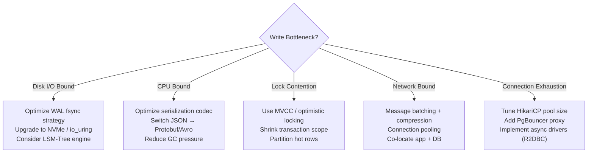
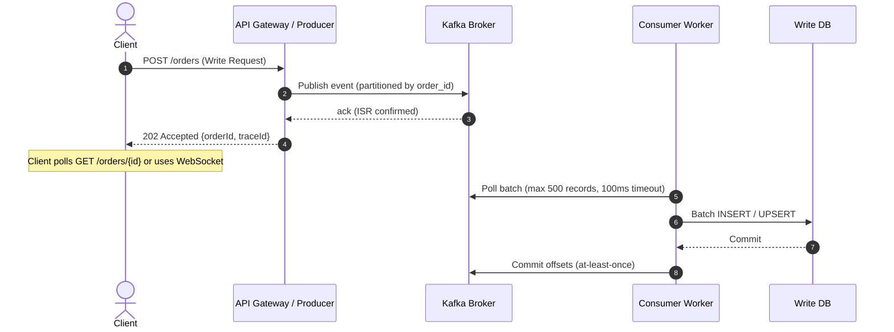
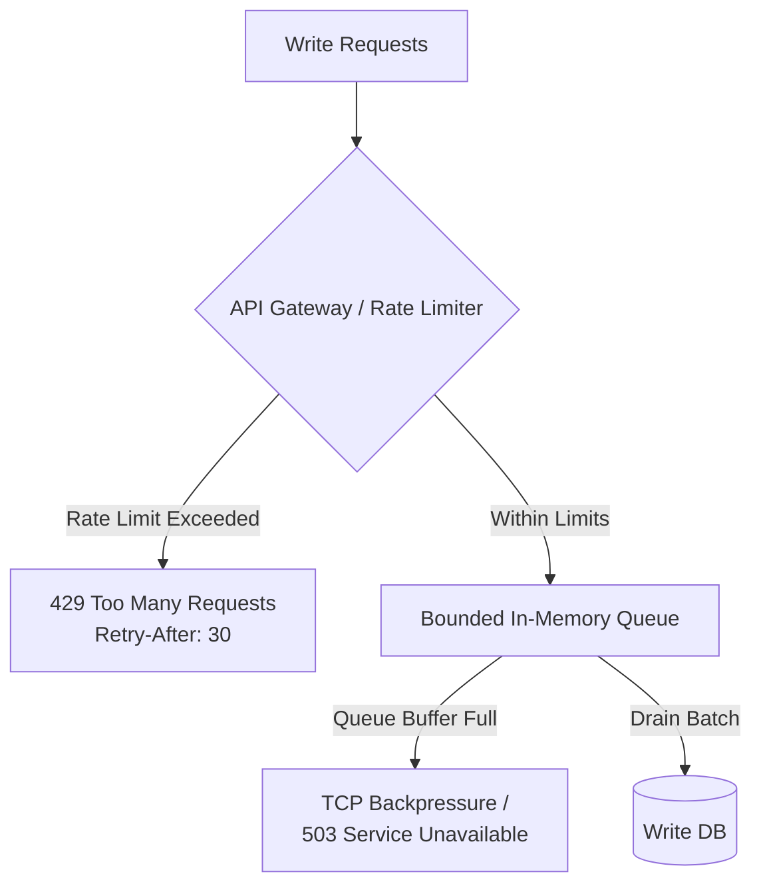
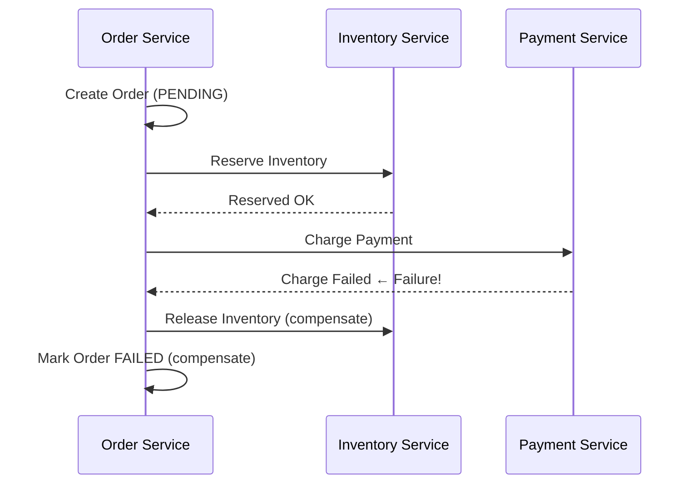

# Scaling Writes

Write scaling is fundamentally more challenging than read scaling. Reads can be scaled almost indefinitely with caches and read replicas. **Writes mutate shared state** — which means every optimization must reason about consistency, ordering, durability, and contention simultaneously.

This guide is a deep dive into the internals, tradeoffs, and production patterns for scaling write throughput in distributed Java/Spring systems.

---

## Mental Model: The Write Pipeline

Every database write traverses multiple layers before being considered durable:

```
Application Thread
       │
       ▼
  SQL/ORM Layer  ──── serialization, query planning, connection acquisition
       │
       ▼
  Network Socket  ──── TCP, TLS overhead, latency to DB host
       │
       ▼
  DB Process Buffer ── shared_buffers (PostgreSQL) / buffer pool (MySQL InnoDB)
       │
       ▼
  WAL / Redo Log  ──── sequential disk append (the "fast" path)
       │
       ▼
  fsync()         ──── OS page cache → physical disk commit (durability guarantee)
       │
       ▼
  Table Pages     ──── random I/O, B-tree page splits (deferred via checkpointing)
```

The bottleneck is almost always at one of: **lock contention → fsync latency → network round-trips → serialization CPU**. Measure before optimizing.

---

## Write Bottleneck Diagnosis

Before architecting a solution, instrument and identify the actual constraint:



### Key Metrics to Measure

| Metric | Tool | Warning Threshold |
|:---|:---|:---|
| **fsync latency** | `pg_stat_bgwriter`, iostat | > 5ms average |
| **Lock wait time** | `pg_locks`, `pg_stat_activity` | > 10ms p99 |
| **Write Amplification Factor (WAF)** | iostat bytes_written / app bytes | > 10× |
| **Connection wait time** | HikariCP `pool.Wait` metric | > 50ms |
| **Replication lag** | `pg_stat_replication` | > 500ms |
| **Kafka consumer lag** | `kafka-consumer-groups --describe` | > 100k messages |

### Write Amplification Explained

**Write Amplification** is the ratio of bytes physically written to disk versus bytes logically written by the application.

```
WAF = Physical bytes written to storage / Logical bytes written by app
```

Sources of write amplification:
- **B-tree page rewrites**: Updating a single integer column rewrites the entire 8KB page it lives on
- **WAL duplication**: The same change is written to WAL _and_ eventually to the table page
- **Replication**: WAL records are streamed to each replica
- **Vacuum/Compaction**: PostgreSQL VACUUM rewrites dead tuple space; LSM compaction rewrites SSTables

Target WAF < 3–5× for OLTP workloads. NVMe drives reduce the cost of high WAF but don't eliminate it.

---

## Async Write Pipelines

The core technique: **decouple the HTTP response from the database write**. Return `202 Accepted` immediately and persist asynchronously through a durable message queue.



### Guarantees and Failure Modes

| Scenario | Behavior |
|:---|:---|
| Kafka broker crashes after ack | Message replicated to ISRs; no loss with `acks=all` |
| Consumer crashes mid-batch | Offsets not committed → batch re-consumed (idempotent writes required) |
| DB rejects batch | Route to DLQ; alert on-call; replay after fix |
| Consumer is slow (lag builds) | Scale consumer instances up to partition count |

### Kafka Producer Tuning for High Throughput

```yaml
# application.yml
spring:
  kafka:
    producer:
      bootstrap-servers: kafka-1:9092,kafka-2:9092,kafka-3:9092
      key-serializer: org.apache.kafka.common.serialization.StringSerializer
      value-serializer: org.springframework.kafka.support.serializer.JsonSerializer
      acks: all                    # Wait for all ISR replicas
      properties:
        enable.idempotence: true   # Prevent duplicate records on retry (requires acks=all)
        max.in.flight.requests.per.connection: 5  # Safe with idempotence enabled
        batch.size: 65536          # 64KB batch accumulation buffer per partition
        linger.ms: 20              # Wait up to 20ms to fill batches; zero means send immediately
        compression.type: snappy   # snappy = low CPU + good ratio; lz4 = lowest latency; zstd = best ratio
        retries: 2147483647        # Retry indefinitely; rely on delivery.timeout.ms to bound
        delivery.timeout.ms: 120000
        request.timeout.ms: 30000
```

**Understanding `linger.ms` vs `batch.size` interaction:**
- If `batch.size` fills first → send immediately (throughput-limited case)
- If `linger.ms` expires first → send whatever is buffered (latency-limited case)
- At high ingestion rates, `batch.size` dominates. At low rates, `linger.ms` controls latency.

**`enable.idempotence` internals:** Each producer is assigned a **Producer ID (PID)** and attaches a **sequence number** to every batch. The broker deduplicates retransmitted batches with the same PID+sequence within the epoch. This protects against duplicates from transient network failures, but not application-level retries from a restarted JVM (different PID).

### Consumer-Side Batch Processing

```java
@Configuration
public class KafkaConsumerConfig {

    @Bean
    public ConcurrentKafkaListenerContainerFactory<String, OrderEvent> kafkaListenerContainerFactory(
            ConsumerFactory<String, OrderEvent> consumerFactory) {
        var factory = new ConcurrentKafkaListenerContainerFactory<String, OrderEvent>();
        factory.setConsumerFactory(consumerFactory);
        factory.setBatchListener(true);                     // Enable batch consumption
        factory.getContainerProperties().setAckMode(ContainerProperties.AckMode.MANUAL_IMMEDIATE);
        factory.getContainerProperties().setPollTimeout(3000);
        return factory;
    }
}

@Service
@Slf4j
public class OrderEventConsumer {

    private final OrderRepository orderRepository;
    private final MeterRegistry meterRegistry;

    @KafkaListener(
        topics = "orders",
        groupId = "order-writer",
        concurrency = "6"           // Match partition count; never exceed it
    )
    public void consume(List<ConsumerRecord<String, OrderEvent>> records, Acknowledgment ack) {
        long start = System.currentTimeMillis();
        try {
            List<Order> orders = records.stream()
                .map(r -> toEntity(r.value(), r.offset()))
                .collect(Collectors.toList());

            orderRepository.saveAllAndFlush(orders);  // Single batch INSERT

            ack.acknowledge();  // Commit offsets only after successful DB write

            meterRegistry.counter("kafka.consumer.processed", "topic", "orders")
                         .increment(records.size());
            meterRegistry.timer("kafka.consumer.batch.duration")
                         .record(System.currentTimeMillis() - start, TimeUnit.MILLISECONDS);

        } catch (Exception e) {
            log.error("Batch processing failed. Size={}, FirstOffset={}, LastOffset={}",
                records.size(),
                records.get(0).offset(),
                records.get(records.size() - 1).offset(), e);
            // Do NOT ack — Kafka will re-deliver the batch
            // After max retries, route to DLQ via SeekToCurrentErrorHandler
            throw e;
        }
    }
}
```

**Concurrency rule:** `concurrency` must be ≤ partition count. Extra threads sit idle and waste resources. Scale partitions first, then match consumer concurrency.

---

## Batching Writes

### Why Batching Matters — The Math

Every individual SQL `INSERT` has fixed overhead: TCP round-trip (~0.1–1ms), query parse + plan (~0.05ms), transaction commit + fsync (~2–10ms).

```
1,000 individual INSERTs × 5ms overhead = 5,000ms = 5 seconds
1 batch INSERT of 1,000 rows × 5ms overhead = 5ms
```

Batch inserts deliver **3–4 orders of magnitude improvement** on commit-heavy workloads.

### The Accumulator Pattern

An accumulator buffers writes in-memory and flushes on two triggers:
1. **Size trigger**: Buffer reaches capacity (e.g., 500 items)
2. **Time trigger**: Max age elapsed (e.g., 100ms) — prevents unbounded latency on low-traffic periods

```java
@Service
@Slf4j
public class WriteBatchAccumulator<T> implements Closeable {

    private final List<T> buffer = new CopyOnWriteArrayList<>();
    private final int maxBatchSize;
    private final long maxDelayMs;
    private final Consumer<List<T>> flushFn;
    private final ScheduledExecutorService scheduler;
    private final AtomicLong lastFlushEpoch = new AtomicLong(System.currentTimeMillis());
    private final ReentrantLock flushLock = new ReentrantLock();
    private final MeterRegistry meterRegistry;

    public WriteBatchAccumulator(
            Consumer<List<T>> flushFn,
            int maxBatchSize,
            long maxDelayMs,
            MeterRegistry meterRegistry) {
        this.flushFn = flushFn;
        this.maxBatchSize = maxBatchSize;
        this.maxDelayMs = maxDelayMs;
        this.meterRegistry = meterRegistry;
        this.scheduler = Executors.newSingleThreadScheduledExecutor(
            r -> new Thread(r, "batch-flush-scheduler"));
        // Poll every 10ms — fine-grained enough for 100ms max delay
        this.scheduler.scheduleWithFixedDelay(this::timedFlushCheck, 10, 10, TimeUnit.MILLISECONDS);
    }

    public void add(T item) {
        buffer.add(item);
        meterRegistry.gauge("batch.buffer.size", buffer, List::size);
        if (buffer.size() >= maxBatchSize) {
            flush("size-trigger");
        }
    }

    private void timedFlushCheck() {
        long age = System.currentTimeMillis() - lastFlushEpoch.get();
        if (age >= maxDelayMs && !buffer.isEmpty()) {
            flush("time-trigger");
        }
    }

    private void flush(String trigger) {
        // ReentrantLock prevents double-flush from concurrent size + time triggers
        if (!flushLock.tryLock()) return;
        try {
            if (buffer.isEmpty()) return;

            List<T> batch = new ArrayList<>(buffer);
            buffer.clear();
            lastFlushEpoch.set(System.currentTimeMillis());

            meterRegistry.counter("batch.flush.count", "trigger", trigger).increment();
            meterRegistry.timer("batch.flush.size").record(batch.size(), TimeUnit.MILLISECONDS);

            // Async flush — does not block ingestion thread
            CompletableFuture.runAsync(() -> {
                try {
                    flushFn.accept(batch);
                } catch (Exception e) {
                    log.error("Flush failed. Batch size={}. Routing to DLQ.", batch.size(), e);
                    routeToDlq(batch, e);
                }
            });
        } finally {
            flushLock.unlock();
        }
    }

    private void routeToDlq(List<T> failedBatch, Exception cause) {
        // Persist to a dead_letter_writes table or send to a Kafka DLQ topic
        // Emit alert metric
        meterRegistry.counter("batch.flush.dlq").increment(failedBatch.size());
    }

    @Override
    public void close() {
        scheduler.shutdown();
        flush("shutdown");  // Drain buffer on graceful shutdown
    }
}
```

**Critical subtlety:** Use `ReentrantLock.tryLock()` (non-blocking) — not `synchronized` — to avoid the time-trigger thread blocking the ingestion thread during a size-trigger flush.

### Spring JPA Batch Insert Configuration

JPA/Hibernate silently disables batching by default. You must configure it explicitly:

```yaml
spring:
  jpa:
    properties:
      hibernate:
        jdbc:
          batch_size: 500           # Max rows per JDBC batch
          batch_versioned_data: true # Enable batching for versioned entities
          order_inserts: true        # Group INSERTs by entity type to avoid interleaving
          order_updates: true        # Same for UPDATEs
        generate_statistics: true    # Enable for debugging batch efficiency
```

**Critical:** If your entity uses `@GeneratedValue(strategy = GenerationType.IDENTITY)`, Hibernate **cannot batch inserts** because it needs to return each generated ID immediately after each row. Switch to `SEQUENCE` strategy:

```java
@Entity
public class Order {

    @Id
    @GeneratedValue(strategy = GenerationType.SEQUENCE, generator = "order_seq")
    @SequenceGenerator(
        name = "order_seq",
        sequenceName = "order_id_seq",
        allocationSize = 500          // Pre-allocate 500 IDs per DB call — huge performance boost
    )
    private Long id;
    // ...
}
```

`allocationSize = 500` means one `SELECT NEXTVAL('order_id_seq')` call allocates 500 IDs in memory. ID generation becomes lock-free until the block is exhausted.

### Bulk Insert SQL Patterns

```sql
-- FAST: Single statement, single parse, one transaction commit
INSERT INTO events (id, type, payload, created_at) VALUES
  (1, 'ORDER_PLACED', '{"amount":100}', NOW()),
  (2, 'ORDER_PLACED', '{"amount":200}', NOW()),
  -- ... up to 500-1000 rows per statement
;

-- FASTER for conflicts: UPSERT with ON CONFLICT
INSERT INTO order_states (order_id, status, updated_at)
VALUES (101, 'CONFIRMED', NOW()), (102, 'SHIPPED', NOW())
ON CONFLICT (order_id) DO UPDATE
  SET status = EXCLUDED.status,
      updated_at = EXCLUDED.updated_at;

-- For analytics / time-series: COPY protocol (PostgreSQL)
-- COPY is 5-10x faster than INSERT for bulk loads — bypasses query planner entirely
COPY events (id, type, payload, created_at) FROM STDIN WITH (FORMAT binary);
```

For COPY via JDBC:

```java
// Using postgresql JDBC CopyManager for maximum bulk insert throughput
@Repository
public class EventBulkRepository {

    @PersistenceContext
    private EntityManager em;

    public void bulkInsert(List<Event> events) throws SQLException, IOException {
        var connection = em.unwrap(SessionImpl.class)
                           .getJdbcConnectionAccess()
                           .obtainConnection();
        var copyManager = new CopyManager((BaseConnection) connection);

        StringBuilder csv = new StringBuilder();
        for (Event e : events) {
            csv.append(e.getId()).append('\t')
               .append(e.getType()).append('\t')
               .append(e.getPayload()).append('\t')
               .append(e.getCreatedAt()).append('\n');
        }

        // Streams rows directly into PostgreSQL COPY protocol — no ORM overhead
        copyManager.copyIn(
            "COPY events (id, type, payload, created_at) FROM STDIN",
            new StringReader(csv.toString())
        );
    }
}
```

---

## Write-Ahead Log (WAL) Internals

The WAL is the heart of database durability. Understanding it deeply allows you to tune fsync behavior, replication lag, and checkpoint frequency.

### WAL Write Path (PostgreSQL)

```
Client COMMIT
      │
      ▼
WAL Writer Thread appends LSN record to WAL segment file (pg_wal/)
      │
      ├──── fsync() ──── OS flushes kernel page cache → physical disk platters
      │         └── This is the durability guarantee. Without fsync, a crash = data loss.
      │
      ▼
Client receives "COMMIT OK"
      │
      (background)
      ▼
Checkpoint Process flushes dirty buffer pool pages → heap files (table pages)
      │
      └── WAL segments before the checkpoint LSN are now eligible for recycling
```

### Key WAL Concepts

**Log Sequence Number (LSN):** A monotonically increasing 64-bit integer identifying every WAL record. LSNs are used to:
- Track replication progress (replica sends its `replay_lsn`; primary knows how far behind it is)
- Coordinate crash recovery (`pg_control` stores the last checkpoint LSN; recovery replays WAL from there)
- Time travel queries (logical decoding reads WAL from a specific LSN)

```sql
-- Query current WAL position
SELECT pg_current_wal_lsn();

-- Measure replication lag in bytes
SELECT client_addr, sent_lsn, replay_lsn,
       (sent_lsn - replay_lsn) AS lag_bytes
FROM pg_stat_replication;
```

**Checkpointing:** The process of writing all dirty (modified-in-memory) buffer pool pages to their respective table files on disk. After a checkpoint, everything before that checkpoint LSN is safe — WAL segments can be recycled.

Too-frequent checkpoints = excessive I/O. Too-infrequent = longer crash recovery time and large WAL accumulation.

```
# Tuning checkpoint behavior in postgresql.conf:
checkpoint_completion_target = 0.9  # Spread checkpoint I/O over 90% of checkpoint_timeout
checkpoint_timeout = 15min          # Maximum time between automatic checkpoints
max_wal_size = 4GB                  # Triggers checkpoint if WAL grows beyond this
```

**WAL Durability vs. Performance Tradeoff:**

```
# synchronous_commit controls the fsync guarantee:

synchronous_commit = on          # DEFAULT: fsync before COMMIT returns. Full durability.
synchronous_commit = off         # Return COMMIT immediately; fsync happens async (~200ms lag).
                                 # Risk: up to ~200ms of committed transactions lost on crash.
                                 # Gain: 3-5x write throughput improvement on fsync-bound workloads.
synchronous_commit = remote_apply # Wait for standby to apply WAL before COMMIT returns.
                                  # Strong consistency reads from replica guaranteed.
```

`synchronous_commit = off` is safe for workloads that can tolerate ~200ms of data loss on a crash (e.g., analytics event ingestion, session data). **Never use it for financial transactions or orders.**

### WAL and Replication

Streaming replication works by shipping WAL records from primary to standby in real-time:

```
Primary WAL Writer ──── WAL segments ────► WAL Receiver (Standby)
                                                │
                                                └──► WAL Applier replays records
                                                     updating standby's buffer pool
```

Logical Replication (used by CDC tools like Debezium) decodes WAL records into row-level change events. This requires `wal_level = logical` — which writes additional metadata into WAL, increasing WAL volume ~20–30%.

---

## Sharding (Horizontal Partitioning)

### When to Shard

Sharding is expensive operationally. Exhaust these options first:
1. Read replicas (for read-heavy workloads)
2. Vertical scaling (faster CPU, more RAM, NVMe)
3. Table partitioning (within a single DB instance)
4. Caching hot data

Shard when: single-node write throughput is maxed AND you've exhausted vertical options.

### Shard Key Selection — The Most Critical Decision

A bad shard key causes hotspots that negate all benefits of sharding.

| Shard Key | Distribution | Hotspot Risk | Cross-Shard Query Risk |
|:---|:---|:---|:---|
| `user_id` (random UUID) | Even | Low | Medium |
| `timestamp` / `created_at` | Monotonic | **Critical** — all writes hit newest shard | Low for time-range queries |
| `tenant_id` | Uneven if tenants vary in size | **High** for large tenants | Low |
| `order_id` (UUID) | Even | Low | Medium |
| Composite `(tenant_id, user_id)` | Even within tenant | Low | Low for tenant-scoped queries |

**Never shard on a monotonically increasing sequence** (auto-increment, timestamps). All writes concentrate on the "last" shard, turning sharding into a single-node bottleneck with extra operational complexity.

### Hash-Based Sharding

```java
@Service
public class ShardRouter {

    private final List<DataSource> shards;   // One DataSource per shard
    private final int shardCount;

    public ShardRouter(List<DataSource> shards) {
        this.shards = shards;
        this.shardCount = shards.size();
    }

    public DataSource getShardForKey(String shardKey) {
        // MurmurHash3 — better distribution than Java's hashCode()
        int hash = Hashing.murmur3_32().hashString(shardKey, StandardCharsets.UTF_8).asInt();
        int shardIndex = Math.abs(hash % shardCount);
        return shards.get(shardIndex);
    }
}
```

**Problem with naive hash modulo:** Adding a new shard changes `N`, which remaps ~(N-1)/N keys — requiring massive data migration.

### Consistent Hashing

Consistent hashing places both nodes and keys on a virtual ring (0 to 2³²-1). A key is owned by the first node clockwise from its hash position.

```
Ring position:  0 ──── NodeA(100) ──── NodeB(200) ──── NodeC(300) ──── 2^32
Key "user-42" hashes to position 150 → owned by NodeB
Key "user-99" hashes to position 250 → owned by NodeC
```

Adding NodeD at position 250: only keys between 200–250 (previously owned by NodeC) migrate to NodeD. All other keys are unaffected.

**Virtual nodes (vnodes):** Each physical node gets multiple positions on the ring (e.g., 150 vnodes per node). This distributes load more evenly when node counts are small and handles heterogeneous hardware.

```java
@Component
public class ConsistentHashRouter {

    private final TreeMap<Long, DataSource> ring = new TreeMap<>();
    private static final int VNODES_PER_NODE = 150;

    public void addNode(String nodeId, DataSource ds) {
        for (int i = 0; i < VNODES_PER_NODE; i++) {
            long position = hash(nodeId + "-vnode-" + i);
            ring.put(position, ds);
        }
    }

    public DataSource getNode(String key) {
        if (ring.isEmpty()) throw new IllegalStateException("No nodes available");
        long hash = hash(key);
        // Find the first node at or after the key's hash position
        Map.Entry<Long, DataSource> entry = ring.ceilingEntry(hash);
        // Wrap around the ring if no node found clockwise
        return (entry != null ? entry : ring.firstEntry()).getValue();
    }

    private long hash(String key) {
        return Hashing.murmur3_128().hashString(key, StandardCharsets.UTF_8).asLong() & 0x7FFFFFFFL;
    }
}
```

### Cross-Shard Operations — The Hard Problems

Sharding eliminates global ACID transactions. Strategies:

| Problem | Solution |
|:---|:---|
| Cross-shard JOIN | Denormalize data; embed foreign data at write time |
| Cross-shard aggregation | Scatter-gather: query all shards in parallel, merge in app layer |
| Cross-shard transactions | Saga pattern with compensating transactions |
| Re-sharding (adding nodes) | Double-write to old + new shard; backfill; cutover |

---

## LSM Trees vs. B-Trees — Write Path Internals

### B-Tree Write Path (PostgreSQL, MySQL InnoDB)

```
INSERT INTO users VALUES (...)
        │
        ▼
1. Locate target leaf page in buffer pool (or load from disk — random I/O)
2. Write WAL record (sequential I/O — fast)
3. Modify leaf page in-memory (buffer pool)
4. If page is full → page split: allocate new page, redistribute keys, update parent
5. Mark page "dirty" for background flush
```

**Write amplification sources in B-trees:**
- Page splits cascade upward (a full leaf splits; its parent may also split)
- Entire 8KB page written for any change within it
- VACUUM (PostgreSQL) rewrites pages to reclaim dead tuple space

### LSM-Tree Write Path (Cassandra, RocksDB, LevelDB)

```
INSERT/UPDATE
      │
      ▼
1. Append to Write-Ahead Log (sequential I/O — durability)
2. Write to Memtable (in-memory sorted structure — essentially a Red-Black Tree)
3. Return "write success" to caller  ← DONE. Extremely fast.

Background (async):
4. When Memtable reaches threshold (e.g., 64MB) → flush to immutable SSTable on disk (sequential I/O)
5. Compaction: merge overlapping SSTables, remove tombstones, sort keys
```

```
Memtable (memory):     [k3:v3, k7:v7, k9:v9]  ← current writes
SSTable L0:            [k1:v1, k3:v2, k8:v8]  ← older flushes (may overlap)
SSTable L1:            [k1:v1, k2:v2, ..., k100:v100]  ← compacted, no overlap
SSTable L2:            [k1:v1, ..., k10000:v10000]  ← further compacted
```

**Read amplification** is the LSM tradeoff: to read key K, check Memtable → L0 SSTables (may be many) → L1 → L2. Each level may require a disk seek. Bloom filters eliminate most false-positive disk reads.

**Compaction strategies:**

| Strategy | Write Amplification | Read Amplification | Space Amplification | Use Case |
|:---|:---|:---|:---|:---|
| **Leveled** (RocksDB default) | High | Low | Low | Read-heavy with occasional writes |
| **Size-Tiered** (Cassandra default) | Low | High | High | Write-heavy, time-series |
| **FIFO** | Lowest | Highest | Low | TTL-based data (metrics, logs) |
| **Tiered + Leveled (TWCS)** | Medium | Medium | Medium | Time-series with time-window TTL |

### When to Choose LSM over B-Tree

Choose LSM (Cassandra, ScyllaDB, RocksDB) when:
- Write throughput > 100k writes/sec on a single node
- Data is append-heavy with infrequent point-reads
- Time-series or event store patterns
- You can tolerate eventual consistency (tunable with quorum reads)

Choose B-Tree (PostgreSQL, MySQL) when:
- Complex SQL queries, JOINs, full ACID transactions
- Balanced read/write workloads
- Strong consistency required

---

## Append-Only / Event Sourcing

### Why Appends Beat Updates

```sql
-- In-place UPDATE: touches existing page, generates WAL, may cause lock contention
UPDATE accounts SET balance = balance - 50 WHERE id = 1204;

-- Append-only INSERT: sequential, lock-free, naturally auditable
INSERT INTO account_ledger (account_id, amount_delta, event_type, event_id, created_at)
VALUES (1204, -50.00, 'WITHDRAWAL', gen_random_uuid(), NOW());
```

Appends are faster because:
- No need to locate and lock existing rows
- Sequential I/O (ideal for both B-trees and LSM)
- No dead-tuple accumulation (no VACUUM needed on ledger tables)
- Naturally immutable — safe to cache, replicate, and audit

### Projection Rebuilding

Current state is derived by replaying events:

```java
@Service
public class AccountProjectionService {

    private final LedgerRepository ledgerRepository;

    // Naive: scan all events — O(n). Acceptable only for small histories.
    public BigDecimal getCurrentBalance(Long accountId) {
        return ledgerRepository.findByAccountId(accountId)
            .stream()
            .map(LedgerEntry::getAmountDelta)
            .reduce(BigDecimal.ZERO, BigDecimal::add);
    }
}
```

### Snapshot Pattern

Snapshots solve the O(n) replay problem:

```
Events:     E1 → E2 → ... → E999 → [Snapshot: balance=5000 at E1000] → E1001 → E1002
                                          ▲
                              Reads start here — only replay E1001+
```

```java
@Entity
public class AccountSnapshot {
    @Id
    private Long accountId;
    private BigDecimal balance;
    private Long lastEventSequence;   // LSN / event sequence at snapshot time
    private Instant snapshotAt;
}

@Service
public class AccountProjectionService {

    private final LedgerRepository ledgerRepository;
    private final AccountSnapshotRepository snapshotRepository;

    public BigDecimal getCurrentBalance(Long accountId) {
        // 1. Load latest snapshot (if any)
        AccountSnapshot snapshot = snapshotRepository.findLatest(accountId);
        long fromSequence = snapshot != null ? snapshot.getLastEventSequence() : 0L;
        BigDecimal base = snapshot != null ? snapshot.getBalance() : BigDecimal.ZERO;

        // 2. Apply only events after snapshot
        List<LedgerEntry> recentEvents = ledgerRepository
            .findByAccountIdAndSequenceGreaterThan(accountId, fromSequence);

        return recentEvents.stream()
            .map(LedgerEntry::getAmountDelta)
            .reduce(base, BigDecimal::add);
    }

    // Triggered by a scheduled job or after every N events
    @Scheduled(fixedDelay = 60_000)
    public void rebuildSnapshots() {
        List<Long> activeAccounts = ledgerRepository.findAccountsWithUnsnapshotedEvents(1000);
        activeAccounts.forEach(accountId -> {
            BigDecimal balance = getCurrentBalance(accountId);
            long lastSeq = ledgerRepository.findMaxSequence(accountId);
            snapshotRepository.save(new AccountSnapshot(accountId, balance, lastSeq, Instant.now()));
        });
    }
}
```

---

## Backpressure & Rate Limiting Writes

### Why Backpressure is Not Optional

Without backpressure, a traffic spike causes:
```
Spike → DB connection pool exhaustion → Thread pool exhaustion → OOM / GC storms → Full outage
```

With backpressure:
```
Spike → Bounded queue fills → New requests get 429 → System remains stable
```



### Token Bucket vs. Leaky Bucket

| Algorithm | Burst Behavior | Output Rate | Use Case |
|:---|:---|:---|:---|
| **Token Bucket** | Allows bursts up to bucket capacity | Variable (burst + sustained) | API rate limiting; allows legitimate burst traffic |
| **Leaky Bucket** | No bursts; excess dropped/queued | Constant | Protecting DB write rate; smoothing ingestion |
| **Sliding Window Counter** | Smooth; no burst at window boundary | Smooth | Distributed API limiting with Redis |
| **Fixed Window Counter** | Burst at window boundary | Jagged | Simple cases; avoid for high-precision limiting |

### Distributed Sliding Window Rate Limiter (Redis)

```java
@Service
public class RedisSlidingWindowRateLimiter {

    private final RedisTemplate<String, String> redisTemplate;
    private final MeterRegistry meterRegistry;

    public boolean isAllowed(String clientKey, int maxRequests, Duration window) {
        long now = System.currentTimeMillis();
        long windowMs = window.toMillis();
        long clearBefore = now - windowMs;
        String redisKey = "rate_limit:" + clientKey;

        List<Object> results = redisTemplate.executePipelined(new SessionCallback<Object>() {
            @Override
            public Object execute(RedisOperations operations) throws DataAccessException {
                // Atomic pipeline: remove expired, count, add current, set TTL
                operations.opsForZSet().removeRangeByScore(redisKey, 0, clearBefore);
                operations.opsForZSet().zCard(redisKey);
                operations.opsForZSet().add(redisKey, String.valueOf(now) + "-" + UUID.randomUUID(), now);
                operations.expire(redisKey, window);
                return null;
            }
        });

        Long currentCount = (Long) results.get(1);  // Count BEFORE current request added
        boolean allowed = currentCount != null && currentCount < maxRequests;

        meterRegistry.counter("rate_limiter.requests",
            "client", clientKey,
            "allowed", String.valueOf(allowed)).increment();

        return allowed;
    }
}

// Spring MVC interceptor integration
@Component
public class WriteLimitInterceptor implements HandlerInterceptor {

    private final RedisSlidingWindowRateLimiter limiter;

    @Override
    public boolean preHandle(HttpServletRequest request, HttpServletResponse response, Object handler) throws Exception {
        String clientId = request.getHeader("X-Client-Id");
        if (!limiter.isAllowed(clientId, 1000, Duration.ofMinutes(1))) {
            response.setStatus(HttpStatus.TOO_MANY_REQUESTS.value());
            response.setHeader("Retry-After", "30");
            response.setHeader("X-RateLimit-Limit", "1000");
            return false;
        }
        return true;
    }
}
```

**Redis pipeline atomicity note:** `executePipelined` sends all commands in a single network round-trip but is **not atomic** — another client can insert between commands. For strict atomicity, use a **Lua script**:

```lua
-- atomic_rate_limit.lua (execute via RedisTemplate.execute(RedisScript))
local key = KEYS[1]
local now = tonumber(ARGV[1])
local window = tonumber(ARGV[2])
local limit = tonumber(ARGV[3])

redis.call('ZREMRANGEBYSCORE', key, 0, now - window)
local count = redis.call('ZCARD', key)
if count < limit then
    redis.call('ZADD', key, now, now .. '-' .. math.random(1, 1000000))
    redis.call('PEXPIRE', key, window)
    return 1
end
return 0
```

---

## Idempotent Writes

### Why Idempotency is Required in Distributed Systems

Any write in a distributed system can produce:
- **At-most-once**: If you don't retry on failure → data loss
- **At-least-once**: If you retry on timeout → possible duplicates
- **Exactly-once**: Idempotent writes + deduplication → safe retries

Network timeouts are ambiguous — the server may have processed the request and the response was lost. **Always retry with idempotency keys.**

### Idempotency Key Pattern

```java
@Entity
@Table(name = "idempotency_keys", indexes = {
    @Index(name = "idx_idem_key", columnList = "idempotency_key", unique = true)
})
public class IdempotencyRecord {
    @Id @GeneratedValue
    private Long id;

    @Column(unique = true, nullable = false)
    private String idempotencyKey;       // UUID provided by client

    @Enumerated(EnumType.STRING)
    private IdempotencyStatus status;    // PROCESSING, COMPLETED, FAILED

    @Column(columnDefinition = "jsonb")
    private String responseBody;         // Cached response for duplicate requests

    private Instant createdAt;
    private Instant expiresAt;           // TTL — clean up after 24h
}

@Service
@Transactional
public class IdempotentOrderService {

    private final IdempotencyRepository idempotencyRepo;
    private final OrderRepository orderRepo;

    public OrderResponse createOrder(String idempotencyKey, CreateOrderRequest request) {
        // 1. Check for existing record
        return idempotencyRepo.findByKey(idempotencyKey)
            .map(record -> switch (record.getStatus()) {
                case COMPLETED -> deserialize(record.getResponseBody(), OrderResponse.class);
                case PROCESSING -> throw new ConflictException("Request already in flight");
                case FAILED -> throw new PreviousRequestFailedException(record.getResponseBody());
            })
            .orElseGet(() -> {
                // 2. Reserve the key (unique constraint prevents races)
                var record = idempotencyRepo.save(new IdempotencyRecord(
                    idempotencyKey, PROCESSING, Instant.now(), Instant.now().plus(24, HOURS)
                ));

                try {
                    // 3. Execute the actual write
                    Order order = orderRepo.save(toEntity(request));
                    OrderResponse response = toResponse(order);

                    // 4. Store cached response
                    record.setStatus(COMPLETED);
                    record.setResponseBody(serialize(response));
                    idempotencyRepo.save(record);

                    return response;
                } catch (Exception e) {
                    record.setStatus(FAILED);
                    record.setResponseBody(e.getMessage());
                    idempotencyRepo.save(record);
                    throw e;
                }
            });
    }
}
```

### Compare-And-Swap (Optimistic Locking)

CAS prevents the lost-update problem when multiple writers race on the same row:

```java
@Entity
public class Account {
    @Id private Long id;
    private BigDecimal balance;

    @Version                          // JPA optimistic lock version column
    private Long version;
}

@Service
public class AccountService {

    @Retryable(
        value = ObjectOptimisticLockingFailureException.class,
        maxAttempts = 3,
        backoff = @Backoff(delay = 50, multiplier = 2)
    )
    @Transactional
    public void debit(Long accountId, BigDecimal amount) {
        Account account = accountRepo.findById(accountId)
            .orElseThrow(() -> new AccountNotFoundException(accountId));

        if (account.getBalance().compareTo(amount) < 0) {
            throw new InsufficientFundsException();
        }

        account.setBalance(account.getBalance().subtract(amount));
        // Hibernate generates: UPDATE accounts SET balance=?, version=N+1 WHERE id=? AND version=N
        // If version mismatch → OptimisticLockException → @Retryable kicks in
        accountRepo.save(account);
    }
}
```

**When to use optimistic vs. pessimistic locking:**

| | Optimistic (`@Version`) | Pessimistic (`SELECT FOR UPDATE`) |
|:---|:---|:---|
| **Best for** | Low contention (most reads succeed) | High contention (many concurrent writes to same row) |
| **Failure mode** | Retry on conflict | Long lock wait / deadlock |
| **Throughput** | Higher (no lock overhead) | Lower (serialized access) |
| **Deadlock risk** | None | Yes — always acquire locks in consistent order |

---

## Connection Pooling Deep Dive

### HikariCP Sizing Formula

```
Pool Size = Tn × (Cm - 1) + 1

Where:
  Tn = Number of threads doing DB work concurrently
  Cm = Number of simultaneous queries each thread can send

For typical web apps: Pool Size ≈ (CPU cores × 2) + effective_spindle_count

Example: 8-core machine, SSD (no spindle seek):
  Pool Size = (8 × 2) + 1 = 17 connections
```

The Hikari team's recommendation: **don't over-pool**. A 10-connection pool often outperforms a 100-connection pool on PostgreSQL because:
- Each connection = a PostgreSQL backend process (~5MB RAM)
- Too many connections cause OS scheduler contention and lock manager overhead

```yaml
spring:
  datasource:
    hikari:
      maximum-pool-size: 20          # Upper bound — tune based on workload
      minimum-idle: 5               # Keep warm connections ready
      connection-timeout: 3000      # Max wait for a connection (3s — fail fast)
      idle-timeout: 600000          # Remove idle connections after 10min
      max-lifetime: 1800000         # Recycle connections every 30min (avoids DB-side timeouts)
      keepalive-time: 30000         # Send keepalive to prevent firewall drops
      pool-name: "write-pool"
      data-source-properties:
        prepareThreshold: 5         # PostgreSQL: use server-side prepared statements after 5 uses
        preparedStatementCacheQueries: 256
        tcpKeepAlive: true
```

### PgBouncer for C10K Write Workloads

For services with thousands of threads competing for DB connections, put PgBouncer in front:

```
10,000 app threads → PgBouncer (pool: 100 connections) → PostgreSQL
```

PgBouncer modes:
- **Session mode**: Connection held for entire client session. Best compatibility; least pooling benefit.
- **Transaction mode**: Connection returned to pool after each transaction. Best for high concurrency. Incompatible with `SET` statements and advisory locks.
- **Statement mode**: Connection returned after each statement. Incompatible with multi-statement transactions.

Use **transaction mode** for microservices that issue short-lived write transactions.

---

## Distributed Transactions

### Two-Phase Commit (2PC)

2PC provides atomic commit across multiple databases or services:

```
Phase 1 (Prepare):
  Coordinator → Participant A: "Can you commit txn-123?"
  Coordinator → Participant B: "Can you commit txn-123?"
  Participant A → Coordinator: "Yes (PREPARED)" — locks held
  Participant B → Coordinator: "Yes (PREPARED)" — locks held

Phase 2 (Commit):
  Coordinator → Participant A: "Commit txn-123"
  Coordinator → Participant B: "Commit txn-123"
  Participants commit and release locks
```

**2PC failure modes:**

| Failure | Impact |
|:---|:---|
| Participant crashes after PREPARE but before COMMIT | Participant holds locks indefinitely until coordinator recovers |
| Coordinator crashes after PREPARE | All participants blocked — **in-doubt transaction** — requires manual DBA intervention |
| Network partition during commit | Split-brain: some participants commit, others don't |

**2PC is rarely used in microservices** because of the blocking failure mode. Use **Saga** instead.

### Saga Pattern

A Saga replaces a distributed transaction with a sequence of local transactions + compensating actions:



```java
// Choreography-based Saga via Kafka events
@Service
@Slf4j
public class InventoryService {

    @KafkaListener(topics = "order.created")
    public void onOrderCreated(OrderCreatedEvent event) {
        try {
            inventoryRepository.reserveStock(event.getProductId(), event.getQuantity());
            eventPublisher.publish(new InventoryReservedEvent(event.getOrderId()));
        } catch (InsufficientStockException e) {
            // Publish failure event — Order Service listens and compensates
            eventPublisher.publish(new InventoryReservationFailedEvent(event.getOrderId(), e.getMessage()));
        }
    }

    @KafkaListener(topics = "payment.failed")
    public void onPaymentFailed(PaymentFailedEvent event) {
        // Compensating transaction — release the reservation
        inventoryRepository.releaseReservation(event.getOrderId());
        log.info("Released inventory reservation for order={}", event.getOrderId());
    }
}
```

**Orchestration vs. Choreography:**

| | Choreography | Orchestration |
|:---|:---|:---|
| **How** | Services react to events; no central coordinator | Central Saga orchestrator drives each step |
| **Coupling** | Low — services only know event schemas | Medium — orchestrator knows all participants |
| **Observability** | Hard — flow distributed across services | Easy — single orchestrator tracks state |
| **Failure handling** | Each service must know all compensation logic | Orchestrator centralizes failure logic |
| **Best for** | Simple 2–3 step flows | Complex multi-step flows with many failure modes |

---

## Observability for Write Systems

Metrics every write-heavy service must expose:

```java
@Component
public class WriteMetrics {

    private final MeterRegistry registry;
    private final Timer writeLatencyTimer;
    private final Counter writesTotal;
    private final Counter writeFailures;
    private final DistributionSummary batchSizeHistogram;

    public WriteMetrics(MeterRegistry registry) {
        this.registry = registry;
        this.writeLatencyTimer = Timer.builder("db.write.latency")
            .description("End-to-end write latency including connection wait")
            .percentiles(0.5, 0.95, 0.99, 0.999)
            .publishPercentileHistogram()
            .register(registry);
        this.writesTotal = Counter.builder("db.writes.total").register(registry);
        this.writeFailures = Counter.builder("db.writes.failed").register(registry);
        this.batchSizeHistogram = DistributionSummary.builder("db.batch.size")
            .percentiles(0.5, 0.95, 0.99)
            .register(registry);
    }
}
```

**Key SLOs for write systems:**

| Metric | Warning | Critical |
|:---|:---|:---|
| Write p99 latency | > 100ms | > 500ms |
| Write error rate | > 0.1% | > 1% |
| Kafka consumer lag | > 10k messages | > 100k messages |
| DB connection wait p99 | > 50ms | > 200ms |
| Batch flush failure rate | > 0.01% | > 0.1% |
| WAL replication lag | > 100MB | > 1GB |

---

## Best Practices for Senior Engineers

1. **Profile before optimizing.** `pg_stat_statements`, async-profiler, and Hikari metrics will tell you what to fix. Architecture changes based on assumptions are expensive.

2. **Append-first schema design.** Build tables as immutable event logs from day one. Adding `updated_at` mutation semantics later is much harder than projecting state from an append-only log.

3. **Sequence strategy over identity.** `SEQUENCE` + `allocationSize` eliminates the Hibernate batch insert limitation and reduces DB round-trips for ID generation.

4. **Tune `synchronous_commit` per transaction class.** Use `SET LOCAL synchronous_commit = off` inside high-throughput, loss-tolerant write transactions. Never apply globally to a mixed workload.

5. **Shard key is forever.** You cannot change a shard key in production without a full data migration. Invest heavily in shard key analysis before going live.

6. **Exactly-once requires idempotent consumers.** `enable.idempotence=true` on the producer prevents broker-level duplicates but not application-level retries. Build idempotent write operations at every consumer.

7. **Rate limit at the perimeter, not in the DB.** Your database should never be the first thing to feel a spike. API Gateway → bounded queue → DB is the correct blast radius containment hierarchy.

8. **Never let 2PC touch your critical path.** The blocking failure mode of 2PC will eventually bring down your write pipeline. Saga + eventual consistency is operationally safer for all non-financial distributed writes.

9. **Batch sizes are empirical, not theoretical.** Start at 500, measure throughput and latency under production load, adjust. The optimal batch size depends on row width, network RTT, and DB CPU — it cannot be calculated.

10. **Design for replay.** Every async write pipeline will have a bug or failure. If your writes are idempotent and your events are in Kafka (with infinite retention or a DLQ), you can always replay and self-heal without data loss.