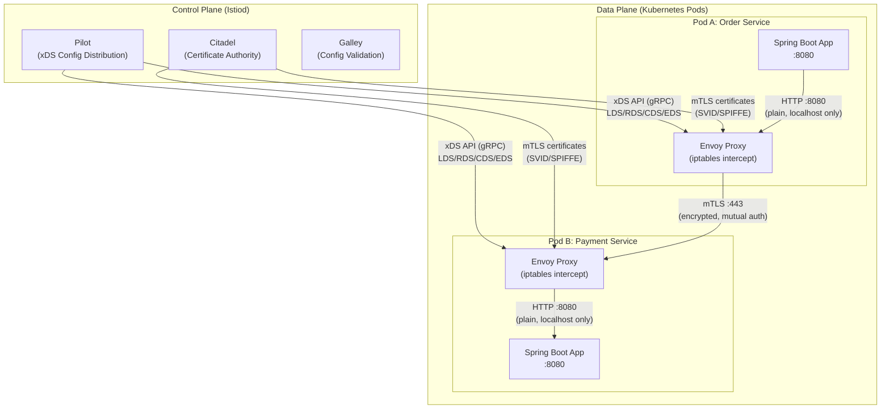
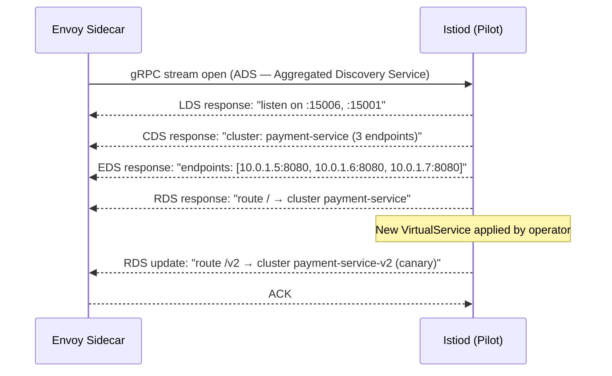
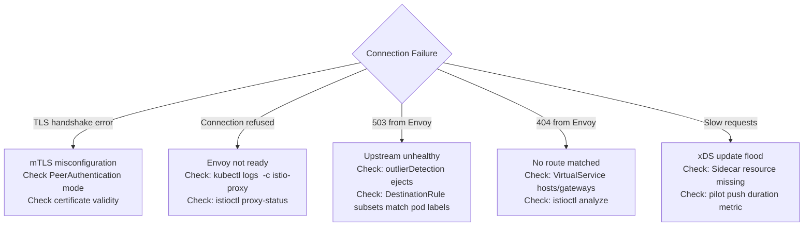

# Service Mesh

A **Service Mesh** is a dedicated infrastructure layer that handles **secure, observable, and reliable service-to-service communication** in microservices deployments — shifting network concerns (mTLS, retries, circuit breaking, traffic shaping) out of application code and into infrastructure-managed sidecar proxies.

Without a service mesh, every team re-implements the same networking boilerplate in application code: TLS configuration, retry logic, timeout tuning, circuit breakers, distributed tracing headers. A service mesh centralizes all of this as infrastructure policy, consistently enforced across every service regardless of language or framework.

---

## The Problem It Solves

In a polyglot microservices environment at scale, the application-layer networking problem grows combinatorially:

```
Without Service Mesh:
  Order Service (Java/Spring)    → must implement: mTLS, retries, timeouts, tracing, auth
  Payment Service (Go)           → must implement: mTLS, retries, timeouts, tracing, auth
  Inventory Service (Node.js)    → must implement: mTLS, retries, timeouts, tracing, auth
  Notification Service (Python)  → must implement: mTLS, retries, timeouts, tracing, auth
  
  Each team implements differently. Security posture is inconsistent. Audit is impossible.

With Service Mesh:
  All services                   → implement: business logic only
  Sidecar Proxy (Envoy)          → handles: mTLS, retries, timeouts, tracing, auth
  
  Consistent, auditable, centrally configurable.
```

---

## Architecture: Control Plane vs. Data Plane



### Data Plane: Envoy Proxy

**Envoy** is a high-performance L7 proxy written in C++. It is the universal data plane for modern service meshes (Istio, Consul Connect, AWS App Mesh all use Envoy).

Every pod gets an Envoy sidecar injected by a Kubernetes `MutatingWebhookAdmissionController`. Envoy intercepts **all inbound and outbound traffic** via `iptables` rules installed by an `istio-init` init container — the application is completely unaware of this interception.

```
Pod network traffic flow:

Outbound (App → Remote):
  App (port 8080) 
    → iptables REDIRECT → Envoy (port 15001, outbound listener)
    → TLS handshake + certificate validation
    → Remote Envoy sidecar (port 15006, inbound listener)
    → iptables REDIRECT → Remote App (port 8080)

The application code calls http://payment-service:8080 (plain HTTP).
Envoy transparently upgrades to mTLS. App sees nothing.
```

### Control Plane: Istiod

**Istiod** (Istio Daemon) consolidates three formerly separate components into one binary:

| Component | Responsibility |
|:---|:---|
| **Pilot** | Translates Istio CRDs (`VirtualService`, `DestinationRule`) into Envoy xDS configuration and streams it to every sidecar proxy via gRPC |
| **Citadel** | Acts as an internal Certificate Authority — issues SPIFFE-compliant X.509 certificates (SVIDs) to every workload, rotates them before expiry |
| **Galley** | Validates Istio CRD schemas and configuration correctness before applying them to the mesh |

---

## xDS API: How the Control Plane Talks to Envoy

The **xDS (Discovery Service) API** is the protocol over which Istiod pushes configuration to Envoy. Understanding xDS is essential for debugging mesh behavior.

```
xDS API components:

LDS (Listener Discovery Service)  → Which ports/addresses Envoy listens on
RDS (Route Discovery Service)     → Which HTTP routes match which clusters
CDS (Cluster Discovery Service)   → Which upstream service clusters exist
EDS (Endpoint Discovery Service)  → Which pod IPs back each cluster
SRDS (Scoped Route Discovery)     → Route tables scoped per virtual host
```



Envoy processes configuration updates **without restarting** — hot reload via the xDS stream. This is why Istio traffic changes take effect in seconds without pod restarts.

**Debugging xDS state on a running pod:**

```bash
# Dump Envoy's current xDS config (full)
kubectl exec -n prod <pod-name> -c istio-proxy -- \
  pilot-agent request GET config_dump | jq .

# Check which clusters Envoy knows about
kubectl exec -n prod <pod-name> -c istio-proxy -- \
  pilot-agent request GET clusters

# Check listener configuration
kubectl exec -n prod <pod-name> -c istio-proxy -- \
  pilot-agent request GET listeners

# Istioctl proxy-status — see which proxies are in sync with control plane
istioctl proxy-status

# Describe a pod's effective Istio policy (what rules apply)
istioctl experimental describe pod <pod-name> -n prod
```

---

## mTLS: Certificate Lifecycle and SPIFFE

### What mTLS Provides

Standard TLS: client verifies server identity. Server does not verify client.
**Mutual TLS (mTLS)**: both sides present certificates. Both identities are cryptographically verified.

```
Envoy A handshake:
  → presents certificate: "SPIFFE://cluster.local/ns/prod/sa/order-service"
  ← Envoy B verifies: "Is this certificate signed by our mesh CA? Is SA authorized?"
  ← presents certificate: "SPIFFE://cluster.local/ns/prod/sa/payment-service"
  → Envoy A verifies: "Is this the service I expected to talk to?"
  
  Connection established. Both identities proven cryptographically.
  No API keys. No shared secrets. No JWT tokens needed between services.
```

### SPIFFE: Identity Standard

Istio uses the **SPIFFE (Secure Production Identity Framework for Everyone)** standard for workload identity:

```
SPIFFE ID format:
  spiffe://<trust-domain>/ns/<namespace>/sa/<service-account>

Example:
  spiffe://cluster.local/ns/prod/sa/order-service
  spiffe://cluster.local/ns/prod/sa/payment-service
```

Every pod's Envoy sidecar holds an X.509 certificate encoding its SPIFFE ID. Citadel (inside Istiod) acts as the CA that signs these certificates.

### Certificate Rotation

```
Default certificate lifetime: 24 hours
Rotation trigger: at 80% of lifetime (after ~19 hours)

Rotation flow:
  1. Envoy sends CSR to Istiod (via SDS — Secret Discovery Service)
  2. Istiod's CA signs new certificate
  3. Envoy installs new cert via SDS without interrupting active connections
  4. Old cert expires gracefully
```

This is transparent to the application — Spring Boot never knows certificates are rotating.

---

## Traffic Management Deep Dive

### VirtualService: L7 Routing Rules

A `VirtualService` defines **how** traffic is routed to a service. It operates at L7 (HTTP/gRPC), allowing routing by headers, URIs, methods, and weights.

```yaml
apiVersion: networking.istio.io/v1beta1
kind: VirtualService
metadata:
  name: payment-service
  namespace: prod
spec:
  hosts:
  - payment-service          # Applies to traffic destined for "payment-service"
  http:

  # Rule 1: Route internal test traffic to canary
  - match:
    - headers:
        x-test-user:
          exact: "true"      # Header-based routing — QA team always hits canary
    route:
    - destination:
        host: payment-service
        subset: v2
      weight: 100

  # Rule 2: Canary traffic split (10% to v2)
  - route:
    - destination:
        host: payment-service
        subset: v1
      weight: 90
    - destination:
        host: payment-service
        subset: v2
      weight: 10

    # Retry policy — Envoy handles retries, not application code
    retries:
      attempts: 3
      perTryTimeout: 2s
      retryOn: "5xx,reset,connect-failure,retriable-4xx"

    # Timeout — overall request deadline (across all retry attempts)
    timeout: 10s

    # Fault injection — inject failures for chaos testing without code changes
    fault:
      delay:
        percentage:
          value: 5.0         # Inject 500ms delay on 5% of requests
        fixedDelay: 500ms
```

### DestinationRule: L4/L7 Policy per Subset

A `DestinationRule` defines **what** Envoy does when it connects to a service: which pod subsets exist, what TLS mode to use, and connection pool settings.

```yaml
apiVersion: networking.istio.io/v1beta1
kind: DestinationRule
metadata:
  name: payment-service
  namespace: prod
spec:
  host: payment-service
  
  # TLS mode for Envoy → upstream connection
  trafficPolicy:
    tls:
      mode: ISTIO_MUTUAL      # Envoy presents its SPIFFE certificate
    
    # Connection pool limits — protect upstream from being overwhelmed
    connectionPool:
      http:
        http2MaxRequests: 1000
        h2UpgradePolicy: UPGRADE      # Use HTTP/2 for gRPC services
      tcp:
        maxConnections: 100
        connectTimeout: 3s
    
    # Outlier detection — Envoy's built-in circuit breaker at the endpoint level
    outlierDetection:
      consecutiveGatewayErrors: 5     # Eject endpoint after 5 consecutive 5xx
      consecutive5xxErrors: 5
      interval: 30s                   # Scan interval
      baseEjectionTime: 30s           # Minimum ejection duration
      maxEjectionPercent: 50          # Never eject more than 50% of endpoints
      minHealthPercent: 50

  # Pod subsets for traffic splitting (matched to pod labels)
  subsets:
  - name: v1
    labels:
      version: v1
    trafficPolicy:
      loadBalancer:
        simple: LEAST_CONN            # v1: route to least-loaded pod
  
  - name: v2
    labels:
      version: v2
    trafficPolicy:
      loadBalancer:
        simple: ROUND_ROBIN           # v2 canary: round-robin
```

### Outlier Detection vs. Application Circuit Breaker

These two mechanisms are **complementary, not alternatives**:

| | Istio Outlier Detection | Resilience4j Circuit Breaker |
|:---|:---|:---|
| **Operates at** | Endpoint (pod IP) level | Service (hostname) level |
| **Ejects** | Individual unhealthy pod from load balancing | Entire downstream service |
| **Scope** | Envoy sidecar (infra) | Application code (Spring) |
| **Fallback logic** | None — traffic rerouted to healthy pods | Full Java fallback method |
| **Visibility** | Envoy metrics | Micrometer / Actuator |
| **Use together?** | Yes — layers of protection |

Use both: outlier detection removes bad pods, circuit breaker protects when the entire service is down.

### Gateway: Ingress into the Mesh

For traffic entering from outside the cluster:

```yaml
apiVersion: networking.istio.io/v1beta1
kind: Gateway
metadata:
  name: api-gateway
  namespace: prod
spec:
  selector:
    istio: ingressgateway     # Targets the Istio Ingress Gateway deployment
  servers:
  - port:
      number: 443
      name: https
      protocol: HTTPS
    tls:
      mode: SIMPLE            # TLS termination at gateway (external TLS)
      credentialName: api-tls-cert   # Kubernetes Secret containing TLS cert
    hosts:
    - "api.example.com"
  - port:
      number: 80
      name: http
      protocol: HTTP
    hosts:
    - "api.example.com"
    tls:
      httpsRedirect: true     # Redirect all HTTP → HTTPS

---
# Bind VirtualService to the Gateway
apiVersion: networking.istio.io/v1beta1
kind: VirtualService
metadata:
  name: api-ingress-routing
spec:
  hosts:
  - "api.example.com"
  gateways:
  - api-gateway              # Traffic from external gateway
  - mesh                     # Also applies to internal mesh traffic
  http:
  - match:
    - uri:
        prefix: /api/orders
    route:
    - destination:
        host: order-service
        port:
          number: 8080
  - match:
    - uri:
        prefix: /api/payments
    route:
    - destination:
        host: payment-service
        port:
          number: 8080
```

### ServiceEntry: Egress to External Services

Control and observe traffic leaving the mesh to external APIs:

```yaml
apiVersion: networking.istio.io/v1beta1
kind: ServiceEntry
metadata:
  name: stripe-api
  namespace: prod
spec:
  hosts:
  - api.stripe.com
  ports:
  - number: 443
    name: https
    protocol: HTTPS
  location: MESH_EXTERNAL
  resolution: DNS

---
# Apply retry + timeout policy to external Stripe calls
apiVersion: networking.istio.io/v1beta1
kind: VirtualService
metadata:
  name: stripe-api-policy
spec:
  hosts:
  - api.stripe.com
  http:
  - timeout: 5s
    retries:
      attempts: 2
      perTryTimeout: 2s
      retryOn: "5xx,connect-failure"
```

Without `ServiceEntry` + `EgressGateway`, external calls bypass all mesh policy — no retry, no timeout, no telemetry. All external dependencies should be registered.

---

## Security: Authorization Policies

mTLS handles authentication (who you are). `AuthorizationPolicy` handles authorization (what you can do).

```yaml
# Allow only order-service to call payment-service /charge endpoint
apiVersion: security.istio.io/v1beta1
kind: AuthorizationPolicy
metadata:
  name: payment-service-authz
  namespace: prod
spec:
  selector:
    matchLabels:
      app: payment-service
  action: ALLOW
  rules:
  - from:
    - source:
        principals:
          # Only pods with this SPIFFE identity may call payment-service
          - "cluster.local/ns/prod/sa/order-service"
    to:
    - operation:
        methods: ["POST"]
        paths: ["/api/v1/charge", "/api/v1/refund"]

---
# Deny-all default: reject everything not explicitly allowed
apiVersion: security.istio.io/v1beta1
kind: AuthorizationPolicy
metadata:
  name: deny-all-default
  namespace: prod
spec:
  {}   # Empty spec = deny all traffic to all services in namespace
```

This enforces **zero-trust networking**: even if an attacker compromises a pod, they cannot call payment-service unless that pod's service account is explicitly in the allowlist. No API keys to steal.

---

## Observability: The Golden Signals — for Free

Istio automatically generates **metrics, traces, and logs** for every service-to-service call without any application code changes.

### Automatic Metrics (Prometheus)

```
# Istio-generated metrics (sample — available for every service pair):
istio_requests_total{
  source_app="order-service",
  destination_app="payment-service",
  response_code="200",
  connection_security_policy="mutual_tls"
}

istio_request_duration_milliseconds_bucket{
  source_app="order-service",
  destination_app="payment-service",
  le="100"
}

istio_tcp_connections_opened_total{...}
istio_tcp_received_bytes_total{...}
```

### Distributed Tracing (Jaeger / Zipkin)

Istio injects trace context headers (`x-request-id`, `x-b3-traceid`, `x-b3-spanid`) into every request. Envoy reports spans to a tracing backend automatically.

**One caveat for Spring Boot services:** Envoy propagates trace headers **inbound**, but your application must **forward** those headers on outbound calls. Envoy cannot do this for you — it does not know which outbound calls correspond to which inbound request.

```java
// Spring Boot: propagate Istio trace headers on outbound RestClient calls
@Configuration
public class TracingHeaderPropagationConfig {

    // Using Micrometer Tracing (Spring Boot 3+) — auto-propagates W3C TraceContext
    // and B3 headers if spring-boot-starter-actuator + micrometer-tracing are on classpath
    // No additional config needed for standard B3 propagation

    // For manual propagation with RestClient (if not using Micrometer Tracing):
    @Bean
    public RestClient tracingRestClient(RestClient.Builder builder) {
        return builder
            .requestInterceptor((request, body, execution) -> {
                // Forward Istio/B3 trace headers from incoming request
                HttpServletRequest currentRequest = getCurrentHttpRequest();
                if (currentRequest != null) {
                    List<String> istioHeaders = List.of(
                        "x-request-id", "x-b3-traceid", "x-b3-spanid",
                        "x-b3-parentspanid", "x-b3-sampled", "x-b3-flags",
                        "x-ot-span-context", "traceparent", "tracestate"
                    );
                    istioHeaders.forEach(header -> {
                        String value = currentRequest.getHeader(header);
                        if (value != null) {
                            request.getHeaders().add(header, value);
                        }
                    });
                }
                return execution.execute(request, body);
            })
            .build();
    }

    private HttpServletRequest getCurrentHttpRequest() {
        ServletRequestAttributes attrs =
            (ServletRequestAttributes) RequestContextHolder.getRequestAttributes();
        return attrs != null ? attrs.getRequest() : null;
    }
}
```

:::warning[Trace Propagation is the Application's Responsibility]
Envoy generates entry and exit spans automatically. But if your Spring Boot service calls three downstream services, Envoy cannot correlate those outbound calls to the original inbound request. Your application must forward the B3/W3C headers on every outbound `RestClient` or `WebClient` call. Missing this breaks the distributed trace graph.
:::

### Kiali: Service Graph Visualization

Kiali reads Istio metrics and renders the real-time service dependency graph, traffic rates, error rates, and mTLS status:

```bash
# Port-forward Kiali dashboard
kubectl port-forward svc/kiali -n istio-system 20001:20001

# Open http://localhost:20001
# Shows: live request rates, error rates, latency, mTLS padlock per edge
```

---

## Sidecar Resource: Controlling xDS Scope

By default, every Envoy sidecar receives configuration for **every service in the mesh**. In large clusters (500+ services), this creates massive xDS payloads, high memory usage, and slow config propagation.

The `Sidecar` resource restricts what each proxy needs to know about:

```yaml
apiVersion: networking.istio.io/v1beta1
kind: Sidecar
metadata:
  name: order-service-sidecar
  namespace: prod
spec:
  workloadSelector:
    labels:
      app: order-service
  egress:
  # order-service only needs to talk to these services
  - hosts:
    - "prod/payment-service"
    - "prod/inventory-service"
    - "istio-system/*"       # Always include for control plane communication
  ingress:
  - port:
      number: 8080
      protocol: HTTP
      name: http
    defaultEndpoint: 0.0.0.0:8080
```

**Production impact:** In a cluster with 200 services, without `Sidecar` resources each proxy holds config for all 200 services (~50MB xDS payload per proxy). With `Sidecar` scoped to actual dependencies, this drops to ~5–10 services per proxy, reducing memory from ~200MB to ~50MB per pod and cutting xDS update propagation time from minutes to seconds.

---

## Spring Boot Integration Patterns

### Zero Code Change (Default)

For most use cases, the service mesh is entirely transparent to Spring Boot. Deploy the app to a mesh-enabled namespace — mTLS, retries, tracing, and metrics are automatic.

```bash
# Enable Istio injection for a namespace
kubectl label namespace prod istio-injection=enabled

# Deploy Spring Boot app — Istio webhook auto-injects Envoy sidecar
kubectl apply -f order-service-deployment.yaml
```

### Mesh-Aware Spring Boot Configuration

When the mesh handles retries and timeouts, disable redundant application-layer implementations:

```yaml
# application.yml — when running in a service mesh

# Disable Resilience4j retries (Istio VirtualService handles retries)
# Keep circuit breaker for business-logic fallbacks that Istio cannot provide
resilience4j:
  retry:
    instances:
      paymentService:
        maxAttempts: 1          # No retries — Istio retries at the proxy level

# Use shorter connect timeouts — Envoy handles the retry window
spring:
  web:
    client:
      connect-timeout: 1000     # 1s connect timeout — fast fail to Envoy's retry
      read-timeout: 5000        # 5s read timeout — Istio VirtualService timeout is 10s

# Disable application-level TLS to payment-service (mTLS handled by Envoy)
# Keep external TLS (to Stripe, AWS APIs, etc.) — those go through ServiceEntry
```

### Health Check Configuration for Istio

Kubernetes liveness/readiness probes are sent from the kubelet — outside the mesh. By default, Istio blocks these because they arrive without mTLS certificates. Istio automatically rewrites probe calls to go through the Envoy proxy to fix this, but it must be configured:

```yaml
# deployment.yaml
spec:
  template:
    metadata:
      annotations:
        # Istio rewrites probe calls to go through Envoy (avoids mTLS rejection)
        sidecar.istio.io/rewriteAppHTTPProbers: "true"
    spec:
      containers:
      - name: order-service
        image: order-service:1.0.0
        ports:
        - containerPort: 8080
        livenessProbe:
          httpGet:
            path: /actuator/health/liveness
            port: 8080          # Istio rewrites this to port 15020 (Envoy rewrite port)
          initialDelaySeconds: 30
          periodSeconds: 10
        readinessProbe:
          httpGet:
            path: /actuator/health/readiness
            port: 8080
          initialDelaySeconds: 10
          periodSeconds: 5
```

### Startup Race Condition: App Starts Before Envoy

Kubernetes starts both the application container and the Envoy sidecar simultaneously. If the Spring Boot app starts faster and makes an outbound call before Envoy is ready, the call bypasses the mesh entirely.

```yaml
# Fix: Add a postStart hook to wait for Envoy readiness
spec:
  containers:
  - name: order-service
    lifecycle:
      postStart:
        exec:
          command:
          - /bin/sh
          - -c
          - |
            until curl -sf http://localhost:15021/healthz/ready; do
              echo "Waiting for Envoy sidecar..."
              sleep 1
            done
```

Or configure `holdApplicationUntilProxyStarts` in Istio's `MeshConfig`:

```yaml
apiVersion: install.istio.io/v1alpha1
kind: IstioOperator
spec:
  meshConfig:
    defaultConfig:
      holdApplicationUntilProxyStarts: true   # Block app start until Envoy is ready
```

---

## Failure Modes and Debugging

### Failure Taxonomy



### Debugging Toolkit

```bash
# 1. Check proxy sync status — are all proxies up to date with control plane?
istioctl proxy-status

# Output:
# NAME                          CDS    LDS    EDS    RDS    ISTIOD
# order-service-abc-123         SYNCED SYNCED SYNCED SYNCED istiod-xyz

# 2. Validate Istio configuration for errors
istioctl analyze -n prod

# 3. Check effective policy on a specific pod
istioctl x describe pod order-service-abc-123 -n prod

# 4. Check Envoy access logs for a pod (every request logged)
kubectl logs order-service-abc-123 -c istio-proxy -n prod --tail=100

# Access log format: [timestamp] "METHOD /path HTTP/version" STATUS BYTES DURATION "USER-AGENT" "x-forwarded-for"
# [2025-01-01T00:00:00.000Z] "POST /api/v1/charge HTTP/1.1" 200 1234 45 "-" "-" "trace-id-xyz" "order-service" "payment-service"

# 5. Check certificate validity in a running pod
istioctl proxy-config secret order-service-abc-123 -n prod

# 6. Verify mTLS is active between two services
istioctl x check-inject -n prod

# 7. Dump Envoy clusters (upstream service endpoints Envoy knows about)
istioctl proxy-config cluster order-service-abc-123 -n prod

# 8. Check outlier detection ejections (circuit breaker at Envoy level)
istioctl proxy-config endpoint order-service-abc-123 -n prod \
  | grep -E "HEALTHY|UNHEALTHY"
```

---

## Common Gotchas & Anti-Patterns

### 1. Double TLS (Application + Mesh)

**Problem:** Spring Boot is configured with `server.ssl.enabled=true`, and Istio mTLS is also active. Envoy cannot inspect the application-level TLS — it sees an encrypted blob, cannot route by HTTP headers, and mutual authentication fails because two TLS sessions are nested.

**Fix:** Disable application-level TLS for service-to-service calls inside the mesh. Let Envoy handle mTLS. Keep application-level TLS only for external clients calling through the ingress gateway (terminate at gateway, re-encrypt with mTLS internally).

```yaml
# application.yml — inside the mesh
server:
  ssl:
    enabled: false   # Envoy handles mTLS; app speaks plain HTTP on localhost
```

### 2. Missing Sidecar Resource in Large Clusters

**Problem:** In a cluster with 300+ services, each Envoy holds full configuration for all 300 services. Control plane pushes on every config change affect all proxies. Memory usage is excessive; xDS propagation takes minutes.

**Fix:** Create `Sidecar` resources for every namespace, scoping each service to only its actual dependencies. This is not optional beyond ~100 services.

### 3. Retry Storms from Stacked Retries

**Problem:** Application (Resilience4j) retries 3× AND Istio `VirtualService` retries 3×. A single failing request generates 9 actual calls to the downstream service, amplifying load exactly when the service is struggling.

**Fix:** Choose one retry layer. Prefer Istio retries for network-level failures (connection reset, 503) and Resilience4j for business-logic retries that require fallback behavior. Set `maxAttempts: 1` in Resilience4j when Istio handles retries.

### 4. Ignoring Envoy Access Logs in Debugging

**Problem:** A 503 error is investigated by reading Spring Boot logs. Spring Boot logs show nothing — the connection failed at the Envoy layer, before the request reached the app.

**Fix:** Always check `kubectl logs <pod> -c istio-proxy` first when debugging connectivity issues. Envoy logs every connection attempt, status code, and duration.

### 5. Namespace-Level PeerAuthentication Without Deny-All Default

**Problem:** `PeerAuthentication` is set to `STRICT` mTLS for a namespace, but no `AuthorizationPolicy` exists. Any service in the mesh — even from other namespaces — can call any service, as long as it has a valid mesh certificate.

**Fix:** Always pair mTLS enforcement with a default-deny `AuthorizationPolicy` and explicit allow rules:

```yaml
# Step 1: Require mTLS
apiVersion: security.istio.io/v1beta1
kind: PeerAuthentication
metadata:
  name: default
  namespace: prod
spec:
  mtls:
    mode: STRICT

---
# Step 2: Deny everything by default
apiVersion: security.istio.io/v1beta1
kind: AuthorizationPolicy
metadata:
  name: deny-all
  namespace: prod
spec: {}   # Empty = deny all

---
# Step 3: Explicit allow rules per service
apiVersion: security.istio.io/v1beta1
kind: AuthorizationPolicy
metadata:
  name: allow-order-to-payment
  namespace: prod
spec:
  selector:
    matchLabels:
      app: payment-service
  action: ALLOW
  rules:
  - from:
    - source:
        principals: ["cluster.local/ns/prod/sa/order-service"]
```

### 6. Fail-Open Sidecar Initialization

**Problem:** The Envoy sidecar fails to initialize (OOMKilled, image pull error), but the application container starts normally and accepts traffic with no security policy applied. The pod silently operates outside the mesh.

**Fix:**
```yaml
# Set strict sidecar injection annotation — pod fails to schedule if sidecar cannot start
metadata:
  annotations:
    sidecar.istio.io/inject: "true"
    proxy.istio.io/config: |
      terminationDrainDuration: 5s

# Monitor injection failures
kubectl get pods -n prod | grep -v "2/2"   # Pods with <2 containers may be missing sidecar
```

---

## Alternatives Comparison

| | Istio + Envoy | Linkerd | Consul Connect | AWS App Mesh |
|:---|:---|:---|:---|:---|
| **Data plane** | Envoy (C++) | linkerd-proxy (Rust) | Envoy | Envoy |
| **Performance overhead** | ~3ms p99 latency | ~1ms p99 latency | ~3ms p99 | ~3ms p99 |
| **Operational complexity** | High | Low | Medium | Low (managed) |
| **Feature richness** | Highest (L7 routing, WASM filters) | Medium | Medium | Medium |
| **mTLS** | Yes (SPIFFE) | Yes (automatic) | Yes | Yes |
| **Best for** | Full control, complex traffic management | Simplicity, low overhead | HashiCorp stack | AWS-native workloads |

---

## Decision Matrix

| Requirement | Configuration |
|:---|:---|
| Zero-trust between all microservices | `PeerAuthentication STRICT` + default-deny `AuthorizationPolicy` |
| Canary deployment (10% → 100%) | `VirtualService` with weight-based routing + `DestinationRule` subsets |
| A/B testing by user segment | `VirtualService` with header-based routing |
| External API rate limiting | `EnvoyFilter` with local rate limit filter |
| Large cluster (100+ services) | `Sidecar` resource per namespace scoping egress |
| Multicluster / multi-region | Istio `east-west gateway` + `ServiceEntry` cross-cluster |
| Gradual mTLS rollout | `PeerAuthentication` in `PERMISSIVE` mode → migrate → `STRICT` |
| Debugging connectivity failures | `istioctl analyze` → Envoy access logs → `proxy-config cluster` |