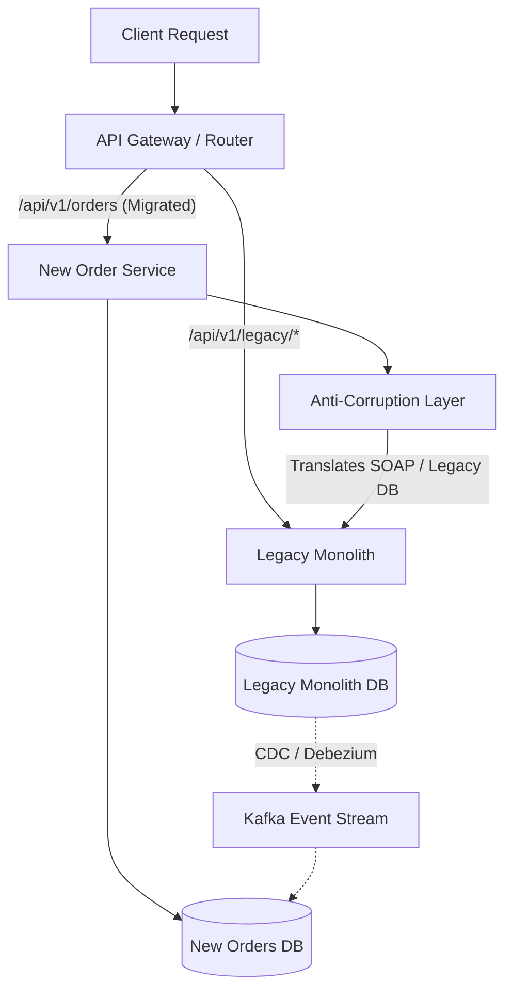

# Strangler Fig Pattern

The **Strangler Fig** pattern is the industry-standard approach for migrating a legacy monolithic application to a microservices architecture. Instead of a high-risk, "big-bang" rewrite, new features are built in new services, and legacy endpoints are gradually routed to these services over time until the monolith is completely retired.

It is named after the Australian strangler fig tree, which germinates in the branches of a host tree, slowly grows down to the ground, and eventually envelopes and replaces the original host.

---

## Bounded Context Decomposition: Finding the Seams

Before writing any new services, you must identify where to cut the monolith. This requires finding the **domain seams** using Domain-Driven Design (DDD) principles:

```text
Spaghetti Monolith Database (Coupled)
┌────────────────────────────────────────────────────────┐
│  Customers JOIN Orders JOIN Shipments JOIN Payments    │
└────────────────────────────────────────────────────────┘
                           │
                           ▼ Bounded Context Mapping (Target)
┌────────────────────┐   ┌────────────────────┐   ┌────────────────────┐
│   Customer Service │   │    Order Service   │   │   Payment Service  │
│  ┌──────────────┐  │   │  ┌──────────────┐  │   │  ┌──────────────┐  │
│  │ Customers DB │  │   │  │  Orders DB   │  │   │  │  Payments DB  │  │
│  └──────────────┘  │   │  └──────────────┘  │   │  └──────────────┘  │
└────────────────────┘   └────────────────────┘   └────────────────────┘
```

### Strategic Splitting Strategy:
1. **Analyze Domain Volatility**: Identify parts of the monolith that undergo frequent changes (high feature velocity). Extracting these first yields immediate business value.
2. **Determine Scaling Mismatch**: Locate modules that have high resource requirements (e.g. PDF generation, heavy report calculation). Isolate them to scale them independently.
3. **Isolate Reads from Writes**: It is far easier to extract read-only paths (e.g. `/catalog/items`) first. They do not require complex dual-writing databases and can be safely tested using static caches or simple read-replicas.
4. **Define Team Boundaries**: Align extracted contexts to distinct engineering teams ("Two-Pizza teams") to eliminate release coordination bottlenecks.

---

## Migration Architecture & Components



1. **Routing Layer (Gateway)**: Kong, Nginx, or Spring Cloud Gateway routes incoming traffic based on URI paths.
2. **Anti-Corruption Layer (ACL)**: A translation bridge between the new microservice and the legacy monolith. It prevents messy legacy schemas, SOAP protocols, or outdated naming conventions from leaking into the new microservice's domain model.
3. **Data Synchronizer**: Near real-time replication pipelines (e.g. Kafka, Change Data Capture) that keep the legacy database and the new database in sync during the transitional phase.

---

## Implementing an Anti-Corruption Layer (ACL) in Spring Boot

During migration, the new `Order Service` needs user details. Instead of letting the new service query the legacy database or speak SOAP directly, we build an ACL adapter.

### 1. Define the Clean Microservice Domain Model
```java
// Clean domain representation in the new Order Service
public record UserInfo(
    String userId,
    String email,
    boolean isActive,
    CustomerTier tier
) {}
```

### 2. Implement the ACL Translator
The ACL acts as an adapter, translating the messy legacy JSON response into the clean domain model:

```java
@Component
@RequiredArgsConstructor
@Slf4j
public class LegacyUserAntiCorruptionLayer {

    private final RestTemplate restTemplate;
    private final LegacyConfig legacyConfig;

    public UserInfo fetchUserInfo(String userId) {
        String legacyUrl = legacyConfig.getMonolithUrl() + "/legacy/users/query?usr_id=" + userId;
        
        try {
            // Monolith returns legacy object with weird schemas and naming
            LegacyUserResponse legacyResponse = restTemplate.getForObject(legacyUrl, LegacyUserResponse.class);
            
            if (legacyResponse == null) {
                throw new UserNotFoundException("User not found in legacy system: " + userId);
            }
            
            // Translate legacy model to clean domain model
            return translate(legacyResponse);
        } catch (Exception ex) {
            log.error("Failed to fetch user from legacy monolith. Applying fallback. Error: {}", ex.getMessage());
            return applyFallback(userId);
        }
    }

    private UserInfo translate(LegacyUserResponse legacy) {
        // Map legacy active codes (e.g., "1" = active, "0" = suspended) to clean boolean
        boolean active = "1".equals(legacy.getAcc_status());
        
        // Map legacy string flags (e.g., "VIP_GOLD") to clean Enum
        CustomerTier tier = switch (legacy.getCust_profile_lvl()) {
            case "VIP_GOLD" -> CustomerTier.GOLD;
            case "PREM_SLVR" -> CustomerTier.SILVER;
            default -> CustomerTier.STANDARD;
        };

        return new UserInfo(
            legacy.getUsr_id(),
            legacy.getPrimary_email_addr(),
            active,
            tier
        );
    }

    private UserInfo applyFallback(String userId) {
        // Fallback: return a restricted standard profile to maintain system availability
        return new UserInfo(userId, "unknown@fallback.com", true, CustomerTier.STANDARD);
    }
}
```

---

## Data Synchronization Strategies

When moving writes out of the monolith, you must keep databases synchronized.

### 1. Change Data Capture (CDC) with Debezium
The new microservice database registers as a consumer. As database commits occur in the Monolith, Debezium reads the database transaction logs (e.g. Postgres WAL or MySQL binlog) and streams changes to Kafka. A sync process consumes these events and updates the microservice database.
- **Pros**: Zero impact on monolith application code; guarantees transaction order.
- **Cons**: Requires dedicated CDC infrastructure (Debezium + Kafka Connect).

### 2. Application-Level Dual Writing
The API Gateway routes writes to the new Microservice. The Microservice commits to its local database, then publishes a sync event or makes a synchronous call to write the same data back to the Legacy Monolith.

```java
@Transactional
public OrderResponse createOrder(OrderRequest request) {
    // 1. Commit to local microservice database
    Order order = orderRepository.save(new Order(request));
    
    // 2. Write to Legacy Monolith (with try-catch to handle failures)
    try {
        legacySyncClient.syncOrderToMonolith(order.toLegacyDto());
    } catch (Exception ex) {
        // 3. Log sync failure to a dead-letter queue (DLQ) for asynchronous retry
        log.error("Dual write to legacy monolith failed. Registering for reconciliation. Error: {}", ex.getMessage());
        syncFailuresRepository.save(new SyncFailure("orders", order.getId(), ex.getMessage()));
    }
    
    return OrderResponse.from(order);
}
```

---

## Data Reconciliation Loops

Because network drops and database locks cause dual writes to fail, you **MUST** run asynchronous reconciliation loops (typically at night) to verify consistency:

```java
@Service
@RequiredArgsConstructor
@Slf4j
public class DataReconciler {

    private final OrderRepository orderRepository;
    private final LegacyMonolithClient legacyClient;

    @Scheduled(cron = "0 0 2 * * *") // Run daily at 2:00 AM
    public void reconcileData() {
        log.info("Starting legacy data reconciliation job...");
        
        List<Order> unverifiedOrders = orderRepository.findUnreconciledOrders();
        
        for (Order order : unverifiedOrders) {
            try {
                // Fetch corresponding record from monolith
                LegacyOrderDto legacyOrder = legacyClient.getLegacyOrder(order.getId());
                
                if (legacyOrder == null || isMismatched(order, legacyOrder)) {
                    log.warn("Data drift detected for Order: {}. Syncing state to monolith.", order.getId());
                    legacyClient.forceSync(order.toLegacyDto());
                }
                
                order.markAsReconciled();
                orderRepository.save(order);
            } catch (Exception e) {
                log.error("Failed to reconcile Order: {}", order.getId(), e);
            }
        }
    }
    
    private boolean isMismatched(Order order, LegacyOrderDto legacy) {
        return !order.getAmount().equals(legacy.getTot_val()) || 
               !order.getStatus().equals(legacy.getOrd_status());
    }
}
```

---

## Pros vs. Cons

| Pros | Cons |
| :--- | :--- |
| **Lowest Risk**: If a newly deployed microservice behaves erratically, you can toggle the API gateway router back to the monolith in under 10 seconds. | **Extended Co-existence Cost**: Running the monolith and 5 microservices simultaneously increases cloud infrastructure costs. |
| **No Feature Freeze**: You don't have to pause business feature delivery while rewriting the system. | **Data Drifts**: Maintaining consistency between two distinct databases requires continuous monitoring and reconciliation. |
| **Continuous Integration**: Value is shipped to users incrementally; you learn design flaws early. | **High Latency**: ACL translations and dual writing add latency to user requests. |

---

## Common Gotchas & Anti-Patterns

### 1. The Spaghetti DB Backdoor
Even though the application code is separated, developers configure the new microservice to join tables directly inside the monolithic database via shared database credentials. This recreates schema-level coupling.
- **Rule**: Ban cross-database user credentials. All communication must go through HTTP/gRPC APIs or Event streams.

### 2. Leaky ACLs
An Anti-Corruption Layer that simply forwards the legacy schema directly into the microservice (e.g. copy-pasting class properties with their old names like `acc_status` instead of translating them). This defeats the purpose of the ACL and pollutes the clean domain model.
- **Rule**: Always map legacy payloads to clean, domain-specific objects immediately at the API client boundary.

### 3. The "Almost Strangled" Debt (Permanent Half-and-Half)
The migration project starts successfully. However, once 80% of the traffic is migrated, management stops the project due to changing priorities, leaving the 20% legacy monolith running indefinitely. This leaves the team maintaining two completely different deployment models, pipelines, and frameworks.
- **Rule**: Commit to strangling the monolith to 100% completion before embarking on the migration, treating the final decommissioning phase as a critical milestone.
