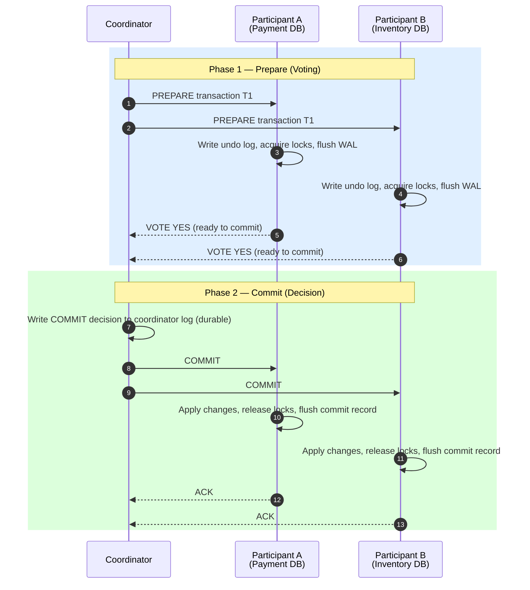
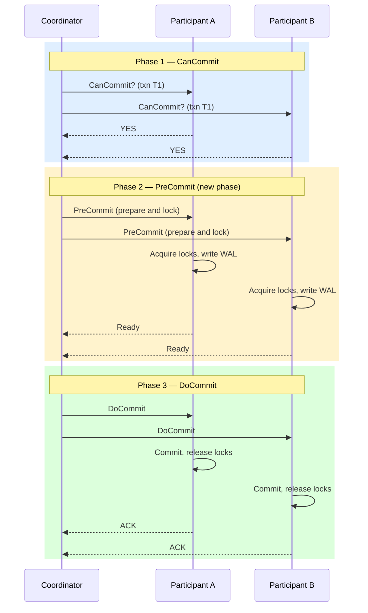

# Two-Phase Commit (2PC) & Three-Phase Commit (3PC)

:::info[Who this guide is for]
- **New learners** — start at [The Problem: Why Is This Hard?](#the-problem-why-is-this-hard) and [The Restaurant Analogy](#the-restaurant-analogy) to build intuition before looking at how 2PC works.
- **Senior engineers** — jump to [2PC Internals & WAL](#2pc-internals--wal), [Failure Modes](#failure-modes-in-depth), [XA Transactions](#xa-transactions), or [When to Use 2PC vs Alternatives](#when-to-use-2pc-vs-alternatives).
:::

---

## The Problem: Why Is This Hard?

Imagine you are building an **e-commerce checkout** service. When a customer places an order, your system needs to:

1. Debit `$100` from the customer's **payment database** (Postgres on server A)
2. Reserve `1 unit` of stock in the **inventory database** (MySQL on server B)
3. Create an order record in the **orders database** (Postgres on server C)

If you do these three steps in sequence and the second step crashes, you've charged the customer's card but not reserved stock. You now have **inconsistency across your system boundaries**.

A single local database transaction doesn't help here — you have **three separate databases** that each know nothing about each other.

:::note[The Core Challenge]
A local `BEGIN; ...; COMMIT;` gives you ACID guarantees within one database. But there is no built-in mechanism to make that atomicity span across multiple, independent databases.
:::

---

## The Restaurant Analogy

Think of 2PC like a **restaurant hosting a group dinner**. The event coordinator (Coordinator) calls every table captain (Participant) before the dinner starts:

**Phase 1 — Calling Around (Prepare):**
> "Can everyone commit to attending the dinner this Saturday?" Each captain checks with their table and says **"Yes, we'll be there"** (and marks it in their calendar), or **"No, sorry, conflicts"**.

**Phase 2 — Final Confirmation (Commit or Cancel):**
> If everyone said yes → The coordinator sends the final confirmation: **"Dinner is on! See you Saturday."** Each captain now makes it official.
> If anyone said no → The coordinator calls everyone back: **"Dinner is cancelled."** Everyone erases the reservation.

The key insight: **No one actually shows up until everyone has confirmed.** This is atomic commitment across multiple parties.

---

## Two-Phase Commit (2PC)

Two-Phase Commit (2PC) is a synchronous protocol designed to achieve **atomic transaction commits** across multiple independent resources such as database nodes or message brokers.

The protocol relies on a central **Coordinator** and multiple **Participants**.

### Mechanics of 2PC



#### Phase 1: Prepare (Voting Round)

1. The coordinator sends a `PREPARE` message to all participants along with the transaction ID.
2. Each participant **performs all transaction work** up to the commit boundary:
   - Writes **undo log** entries (to roll back if aborted).
   - Acquires all necessary **row/table locks**.
   - Flushes changes to its **Write-Ahead Log (WAL)** on durable storage.
3. Participants vote:
   - **VOTE YES** — "I have done my work, acquired locks, and flushed to durable storage. I am ready to commit."
   - **VOTE NO** — "I encountered an error (constraint violation, timeout, disk failure). Abort the transaction."

:::important
Once a participant votes YES, it is **obligated to commit** if the coordinator later sends a COMMIT. It cannot unilaterally abort. This is what makes 2PC blocking.
:::

#### Phase 2: Commit or Abort

**Happy path (all votes YES):**
1. Coordinator writes the **COMMIT decision** to its own transaction log first (durable write — this is the point of no return).
2. Coordinator broadcasts `COMMIT` to all participants.
3. Each participant applies the pending changes, releases locks, writes a commit record, and sends an `ACK`.

**Abort path (any vote NO or timeout):**
1. Coordinator writes an `ABORT` decision to its log.
2. Coordinator broadcasts `ABORT` to all participants.
3. Each participant uses its **undo log** to roll back changes, releases locks, and sends an `ACK`.

---

## 2PC Internals & WAL

### What happens inside a Participant during Prepare?

```
Participant WAL during Phase 1:
┌─────────────────────────────────────────────────────────┐
│ [LSN 1001] BEGIN  txn=T1                                │
│ [LSN 1002] UPDATE accounts SET balance=balance-100      │
│            WHERE id=42  (old_val=500, new_val=400)      │
│ [LSN 1003] PREPARE txn=T1 xid=2PC-global-id            │
│            ← WAL fsync() called here                    │
│            ← Row locks held, transaction "in-doubt"     │
└─────────────────────────────────────────────────────────┘
```

The participant is now in an **in-doubt** state. It holds locks and has durable undo data, but hasn't committed or rolled back. It **waits** for the coordinator's Phase 2 decision.

### Coordinator Transaction Log

The coordinator's log is the single most critical piece of state:

```
Coordinator Log:
[T1] STARTED    — 2025-01-15 10:00:00.001
[T1] PREPARED   — participants=[DB-A, DB-B, DB-C]
[T1] ALL VOTED YES — 10:00:00.050
[T1] DECISION: COMMIT ← durable fsync here (point of no return)
[T1] COMMIT SENT to DB-A ← 10:00:00.055
[T1] COMMIT SENT to DB-B ← 10:00:00.057
[T1] ACK from DB-A        ← 10:00:00.060
[T1] ACK from DB-B        ← 10:00:00.062
[T1] COMPLETED
```

The `DECISION: COMMIT` log entry is the **point of no return**. Once this is written durably, the coordinator will retry sending `COMMIT` messages until all participants acknowledge — even across coordinator restarts.

---

## Failure Modes In-Depth

### 1. Participant Crashes Before Voting

```
[Coordinator] -PREPARE→ [DB-A] ✓ VOTE YES
[Coordinator] -PREPARE→ [DB-B] 💥 (DB-B crashes before responding)

Coordinator action: Wait for timeout → ABORT
DB-A action: Receives ABORT → rolls back → releases locks ✅
DB-B action: On restart, sees no PREPARE in WAL → no-op ✅
```
**Result:** Clean abort. No inconsistency.

### 2. Participant Crashes After Voting YES (The Blocking Problem)

```
[DB-A] sent VOTE YES → holds locks → waits...
[DB-A] 💥 crashes mid-wait

On recovery, DB-A sees its WAL:
  [PREPARE txn=T1] ← in-doubt state
  No COMMIT or ABORT record

DB-A MUST contact the coordinator to learn the decision.
Until it does, DB-A holds its locks — potentially blocking all readers/writers.
```

**How PostgreSQL handles this:** Uses `pg_prepared_xacts` to persist in-doubt transactions across restarts. A recovery process queries the coordinator for the decision.

### 3. Coordinator Crashes After Writing COMMIT Decision

```
Coordinator log: [T1] DECISION: COMMIT ← written durably
Coordinator 💥 crashes before sending COMMIT to participants

Participants DB-A, DB-B: Still in in-doubt state, holding locks ∞

On coordinator restart:
  Recovery reads log: sees DECISION: COMMIT for T1
  Re-sends COMMIT to all participants
  Participants check their WAL → see PREPARE → apply COMMIT ✅
```

**Result:** Eventually consistent, but participants are blocked for the duration of the coordinator's recovery window (seconds to minutes).

### 4. Network Partition Between Coordinator and Participants

```
[Coordinator] sent COMMIT to DB-A ✓
[Coordinator]  ─── network partition ───  [DB-B]

DB-A: Committed ✅
DB-B: Still in-doubt, holding locks ∞ (can never resolve without coordinator)
```

This is the **fundamental unsolvability** of 2PC under network partitions. A participant that cannot reach the coordinator is permanently blocked — it cannot unilaterally commit or abort, because:
- If it commits and the decision was ABORT → inconsistency.
- If it aborts and the decision was COMMIT → inconsistency.

---

## Spring Boot 2PC Code Representation

A logical coordinator managing participants in a 2PC workflow:

```java
@Service
@RequiredArgsConstructor
@Slf4j
public class TwoPhaseCommitCoordinator {
    private final List<TransactionParticipant> participants;
    private final CoordinatorLogRepository coordinatorLog;

    public void executeTransaction(String txnId, List<Operation> operations) {
        List<TransactionParticipant> preparedParticipants = new ArrayList<>();
        coordinatorLog.record(txnId, "STARTED");

        try {
            // ─── Phase 1: Prepare ───────────────────────────────────────
            for (Operation op : operations) {
                TransactionParticipant participant = getParticipant(op);
                log.info("Sending PREPARE to {} for txn {}", participant.getName(), txnId);

                if (!participant.prepare(txnId, op)) {
                    throw new PrepareFailedException(
                        "Participant " + participant.getName() + " voted NO");
                }
                preparedParticipants.add(participant);
            }

            // ─── All voted YES: write durable commit decision ──────────
            coordinatorLog.record(txnId, "DECISION:COMMIT"); // point of no return

            // ─── Phase 2: Commit ────────────────────────────────────────
            for (TransactionParticipant participant : preparedParticipants) {
                retryUntilSuccess(() -> participant.commit(txnId)); // must commit
            }
            coordinatorLog.record(txnId, "COMPLETED");

        } catch (PrepareFailedException e) {
            coordinatorLog.record(txnId, "DECISION:ABORT");

            // Abort all that voted YES
            for (TransactionParticipant prepared : preparedParticipants) {
                try {
                    prepared.abort(txnId);
                } catch (Exception abortEx) {
                    log.error("ABORT failed for {}, txn {}. Manual intervention required.",
                        prepared.getName(), txnId, abortEx);
                    // In production: alert ops team, update monitoring
                }
            }
            throw new TransactionException("Transaction " + txnId + " aborted", e);
        }
    }

    private void retryUntilSuccess(Runnable action) {
        // In production: retry with exponential backoff
        // The commit MUST eventually reach every participant
        action.run();
    }
}
```

---

## Limitations of 2PC

| Limitation | Description | Impact |
|:---|:---|:---|
| **Blocking Protocol** | Participants hold locks from Phase 1 until they receive the Phase 2 decision | Reduces throughput, increases tail latency, causes lock amplification under load |
| **Coordinator SPOF** | Coordinator crash after writing COMMIT but before notifying participants leaves them in-doubt holding locks | Requires coordinator HA (clustering/leader election) |
| **Network Partition** | A partitioned participant cannot safely commit or abort without the coordinator's decision | Indefinite blocking — violates availability |
| **Not Cloud-Native** | 2PC requires persistent, stateful connections and XA drivers that don't work with HTTP-based microservices or cloud databases | Only viable for collocated JDBC resources |
| **Performance** | Two synchronous network round trips + two durable fsyncs per participant for every transaction | Practical ceiling of ~100–500 TPS per coordinator |

---

## XA Transactions

The **XA Standard** (X/Open DTP) is the industry specification for implementing 2PC across heterogeneous resources. It defines:

- **XA Resource** — any system that can participate in a distributed transaction (databases, message brokers).
- **Transaction Manager (TM)** — the coordinator that manages the XA lifecycle.
- **Resource Manager (RM)** — each participant (e.g., PostgreSQL, ActiveMQ).

### Java XA with Spring Boot (JTA/Atomikos)

```java
// application.yml — using Atomikos JTA transaction manager
spring:
  jta:
    enabled: true
    atomikos:
      datasource:
        primary:
          xa-data-source-class-name: org.postgresql.xa.PGXADataSource
          xa-properties:
            serverName: primary-db
            databaseName: orders
        secondary:
          xa-data-source-class-name: com.mysql.cj.jdbc.MysqlXADataSource
          xa-properties:
            serverName: inventory-db
            databaseName: inventory
```

```java
@Service
@Transactional // JTA @Transactional — spans BOTH datasources
public class OrderService {
    @Autowired private OrderRepository orderRepo;      // DataSource: primary-db
    @Autowired private InventoryRepository inventoryRepo; // DataSource: secondary-db

    public Order placeOrder(CreateOrderCommand cmd) {
        // Both of these writes are wrapped in a single XA transaction
        // Atomikos will coordinate 2PC between PostgreSQL and MySQL
        Order order = orderRepo.save(Order.from(cmd));
        inventoryRepo.reserve(cmd.getProductId(), cmd.getQuantity());
        return order;
        // On method exit: Atomikos calls xa.prepare() on both DBs,
        // then xa.commit() if both return XA_OK
    }
}
```

:::warning[XA in Practice]
XA transactions are **notoriously slow and operationally complex**. The `prepare()` → `commit()` round trips add 5–20ms per transaction. Most modern architectures avoid XA entirely in favor of the **Saga Pattern** or **Transactional Outbox Pattern**.
:::

---

## Three-Phase Commit (3PC)

Three-Phase Commit (3PC) is an evolution of 2PC that adds a **pre-commit phase** to eliminate the blocking problem under coordinator failure.

```
Phase 1          Phase 2           Phase 3
[CanCommit] ──► [PreCommit] ──►  [DoCommit]
(Voting)        (Lock + Promise)  (Final Apply)
```

### How 3PC Eliminates Blocking

The key insight: 3PC allows participants to **make a unilateral decision on timeout**:

| Phase | Coordinator Crashes | Participant Action on Timeout |
|:---|:---|:---|
| After **CanCommit** | Before PreCommit sent | Participants can safely **ABORT** (nobody is locked yet) |
| After **PreCommit** | Before DoCommit sent | Participants can safely **COMMIT** (they know everyone acknowledged PreCommit) |

This is possible because PreCommit is a quorum acknowledgment — every participant that receives PreCommit knows every other participant also received it. So committing unilaterally is safe.

### 3PC Sequence



### Why 3PC is Not Used in Practice

1. **Still not partition-tolerant.** In the event of a network partition during PreCommit, participants on different sides of the partition can independently decide differently (one aborts, one commits) — leading to inconsistency.
2. **Three round trips** instead of two — significantly higher tail latency.
3. **Complexity** — implementation is far more complex with little practical benefit given that Paxos/Raft-based consensus is now available for coordinator HA.

**Verdict:** 3PC is a theoretical improvement. Almost no production database systems implement 3PC. The modern solution to coordinator SPOF is making the **coordinator itself highly available** via Paxos/Raft (as Google Spanner does with its TrueTime-based coordinators).

---

## When to Use 2PC vs Alternatives

| Situation | Recommendation | Reason |
|:---|:---|:---|
| Two JDBC datasources in the same JVM, < 200 TPS | 2PC (XA via Atomikos/Narayana) | Simplest correct solution for collocated resources |
| Microservices with independent HTTP-based APIs | **Saga Pattern** | 2PC requires stateful connections; HTTP is stateless |
| High-throughput writes (> 1000 TPS) | **Outbox Pattern + CDC** | 2PC blocking is prohibitive at scale |
| Cross-database event publishing | **Transactional Outbox** | Atomic write to event store inside local transaction |
| Financial ledger with strict ACID guarantees | 2PC or **Google Spanner** | Spanner gives 2PC semantics with distributed coordinator HA |

---

## Senior Interview Questions

### Q: A participant has voted YES in Phase 1. The coordinator then crashes. What happens?

**A:** The participant is in an **in-doubt state**. It holds its locks and cannot proceed. It must periodically poll the coordinator (or a designated recovery coordinator) to learn the decision. Modern databases like PostgreSQL expose `pg_prepared_xacts` for exactly this purpose. During the outage window, any thread needing those locked rows will block — potentially indefinitely. This is why 2PC is not suitable for high-contention or long-lived transactions.

### Q: What is the "point of no return" in 2PC and why does it matter?

**A:** The point of no return is when the coordinator durably writes the `COMMIT` decision to its own transaction log. Before this, the coordinator can safely abort. After this, the coordinator is obligated to drive every participant to commit — it will retry forever if necessary. The durability of this log entry is what makes the protocol correct even under coordinator crashes.

### Q: How does XA differ from logical 2PC in application code?

**A:** XA is a standardized protocol (X/Open DTP) that provides a C API (`xa_prepare`, `xa_commit`, `xa_rollback`) implemented by each Resource Manager (database driver). A JTA Transaction Manager (Atomikos, Narayana) acts as the coordinator and calls these APIs. Logical 2PC (as in the application-level code above) is a custom implementation that mirrors the same concepts without using the XA standard — useful for resources that don't support XA.

### Q: What is lock amplification in 2PC and how does it impact production systems?

**A:** Lock amplification means that a single distributed transaction holds locks in multiple databases simultaneously from the end of Phase 1 until all Phase 2 ACKs are received. If you have 10 operations, you're holding 10 locks across 10 participants for the entire Phase 2 round trip time. Under concurrent load, this causes **lock waits to cascade** — transactions waiting for Phase 2 to complete block other transactions, increasing average latency non-linearly. At high TPS, a single slow Phase 2 participant can back-pressure the entire system.

---

## See Also

- [Saga Pattern](./saga-pattern.md) — Eventual consistency alternative to 2PC for microservices
- [Transactional Outbox Pattern](./outbox-pattern.md) — Reliable event publishing without distributed transactions
- [Data Consistency Deep Dive](./data-consistency.md) — Isolation levels, MVCC, WAL internals
- [Scaling Reads](./scaling-reads.md) — Understand how replication lag and data consistency relate to scaling read throughput
- [Scaling Writes](./scaling-writes.md) — Explore sharding, partitioning, write pipelines, and how distributed transactions fit into write-scaling architectures

