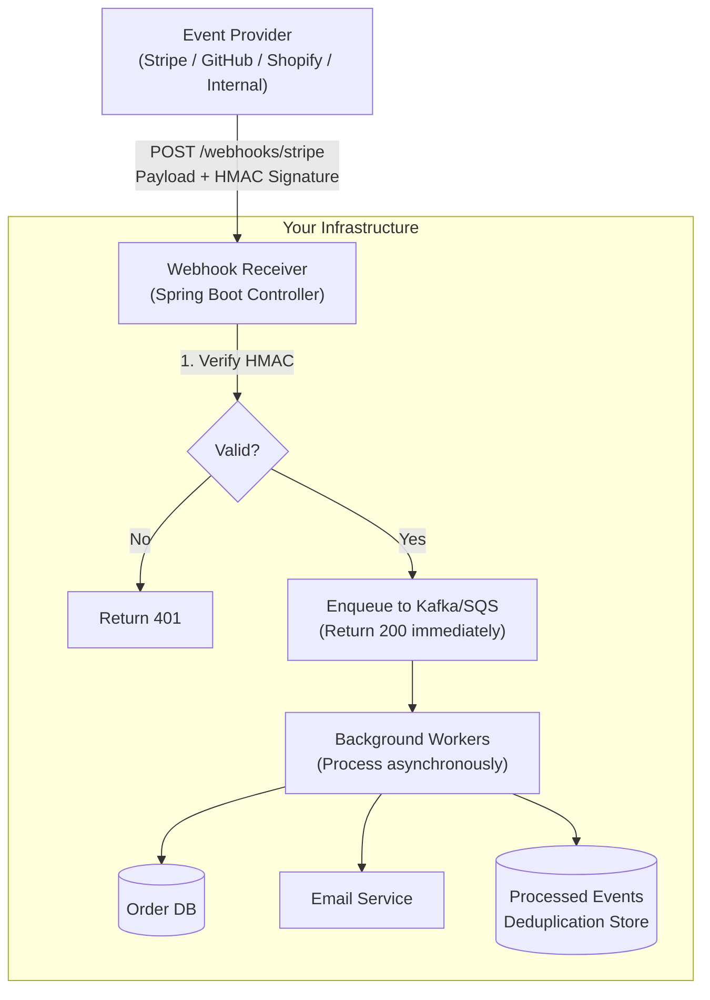

# Webhooks

A **Webhook** is an event-driven HTTP callback mechanism where a system (the **provider**) calls a pre-registered URL on your system (the **receiver**) in real time, the moment an event occurs — rather than requiring you to poll for changes repeatedly.

> **The fundamental contract:** You tell the provider "here is a URL to POST to whenever something interesting happens." When it happens, you receive an HTTP POST with the event payload within milliseconds.

---

## 👶 Beginner: Polling vs. Webhooks

The difference is whether *you* ask or *they* tell:

```text
POLLING (Inefficient — Like refreshing your email every 5 seconds):
Your App: "Hey Stripe, did payment_id=pi_123 complete yet?"
Stripe:   "Nope."
Your App: "How about now?"
Stripe:   "Still no."
[47 more identical exchanges over 90 seconds]
Your App: "Now?"
Stripe:   "Yes! Here are the details."
→ 49 API calls wasted, potential rate-limit violations, 90-second delay

WEBHOOK (Efficient — Like setting up a notification):
Step 1 (setup): "Stripe, POST to https://api.yourapp.com/webhooks/stripe 
                  whenever payment.succeeded fires."
Step 2 (90 seconds later):
Stripe → POST https://api.yourapp.com/webhooks/stripe
         Body: { "type": "payment.succeeded", "data": { "paymentId": "pi_123", ... } }
Your App: Processes in < 100ms. Order confirmed. Email sent.
→ 1 HTTP call. Real-time.
```

---

## 🏗️ Architecture: Receiving Webhooks at Scale



**The critical constraint:** Most providers (Stripe, GitHub, Shopify) expect an HTTP 2xx response **within 5–30 seconds**. If your endpoint is slow or returns 5xx, providers will retry — and if you're not idempotent, you'll process the event multiple times.

---

## 🔐 Security: HMAC-SHA256 Signature Verification

Never process a webhook payload without verifying it was sent by the legitimate provider. Anyone who knows your endpoint URL can send fake events.

### How HMAC Signing Works

```text
Provider side:
  1. Takes your webhook secret key (e.g., "whsec_abc123xyz")
  2. Computes: HMAC-SHA256( key=secret, message=timestamp + "." + raw_body )
  3. Sends in header: "Stripe-Signature: t=1720000000,v1=abc123def456..."

Your side:
  1. Extract timestamp + signature from header
  2. Check: |current_time - timestamp| < 300 seconds  (replay attack prevention)
  3. Recompute HMAC with your stored secret
  4. Compare using constant-time equality (prevents timing attacks)
  5. If match: payload is authentic. If not: reject with 401.
```

### Spring Boot: Production-Grade HMAC Verification

```java
// WebhookController.java
@RestController
@RequestMapping("/webhooks")
@Slf4j
public class WebhookController {

    @Value("${stripe.webhook.signing-secret}")
    private String stripeSigningSecret;

    private final WebhookEventQueue eventQueue;
    private final WebhookSignatureVerifier signatureVerifier;

    @PostMapping(value = "/stripe", consumes = MediaType.APPLICATION_JSON_VALUE)
    public ResponseEntity<Void> handleStripeWebhook(
            @RequestBody byte[] rawBody,        // MUST be raw bytes — not parsed JSON
            @RequestHeader("Stripe-Signature") String signatureHeader,
            HttpServletRequest request) {

        // Step 1: Signature verification BEFORE any processing
        SignatureVerificationResult result = signatureVerifier.verify(
            rawBody, signatureHeader, stripeSigningSecret
        );

        if (!result.isValid()) {
            log.warn("Webhook signature invalid: reason={}, ip={}",
                result.getFailureReason(), request.getRemoteAddr());
            return ResponseEntity.status(HttpStatus.UNAUTHORIZED).build();
        }

        // Step 2: Parse only AFTER verification
        StripeWebhookEvent event = parseEvent(rawBody);

        // Step 3: Enqueue for async processing — respond 200 IMMEDIATELY
        // Never do actual work here! The provider is waiting for your 200.
        eventQueue.enqueue(new WebhookEnvelope(
            event.getId(),          // Unique event ID for deduplication
            event.getType(),
            rawBody,
            Instant.now()
        ));

        log.info("Webhook received and enqueued: eventId={}, type={}", event.getId(), event.getType());
        return ResponseEntity.ok().build();
    }
}
```

```java
// WebhookSignatureVerifier.java
@Component
public class WebhookSignatureVerifier {

    private static final long MAX_TIMESTAMP_AGE_SECONDS = 300; // 5 minutes

    public SignatureVerificationResult verify(byte[] payload, String signatureHeader, String secret) {
        try {
            // Parse: "t=1720000000,v1=abc123def456,v1=olderSignature"
            Map<String, List<String>> parts = parseSignatureHeader(signatureHeader);

            String timestamp = parts.getOrDefault("t", List.of()).stream().findFirst()
                .orElseThrow(() -> new SecurityException("Missing timestamp in signature header"));

            // Replay attack prevention: reject webhooks > 5 minutes old
            long webhookTime = Long.parseLong(timestamp);
            long currentTime = Instant.now().getEpochSecond();
            if (Math.abs(currentTime - webhookTime) > MAX_TIMESTAMP_AGE_SECONDS) {
                return SignatureVerificationResult.failed("Timestamp too old — possible replay attack");
            }

            // Compute expected signature
            String signedPayload = timestamp + "." + new String(payload, StandardCharsets.UTF_8);
            String expectedSignature = computeHmacSha256(signedPayload, secret);

            // Check against all v1 signatures (Stripe rotates signing keys occasionally)
            boolean matched = parts.getOrDefault("v1", List.of()).stream()
                .anyMatch(sig -> constantTimeEquals(sig, expectedSignature));

            return matched
                ? SignatureVerificationResult.valid()
                : SignatureVerificationResult.failed("Signature mismatch");

        } catch (Exception e) {
            log.error("Signature verification threw exception", e);
            return SignatureVerificationResult.failed("Verification error: " + e.getMessage());
        }
    }

    private String computeHmacSha256(String data, String secret) throws Exception {
        Mac mac = Mac.getInstance("HmacSHA256");
        SecretKeySpec keySpec = new SecretKeySpec(
            secret.getBytes(StandardCharsets.UTF_8), "HmacSHA256"
        );
        mac.init(keySpec);
        byte[] hash = mac.doFinal(data.getBytes(StandardCharsets.UTF_8));
        return Hex.encodeHexString(hash);
    }

    // CRITICAL: Use constant-time comparison to prevent timing attacks
    // String.equals() short-circuits on first mismatch — attackers can measure response time
    private boolean constantTimeEquals(String a, String b) {
        return MessageDigest.isEqual(
            a.getBytes(StandardCharsets.UTF_8),
            b.getBytes(StandardCharsets.UTF_8)
        );
    }
}
```

---

## ♻️ Idempotent Event Processing

Providers retry failed deliveries. If your endpoint returns 500 or times out, you'll receive the same event 2–5 times. Your processing **must be idempotent** — processing the same event twice must produce the same result as processing it once.

```java
// WebhookEventProcessor.java
@Component
@Slf4j
@RequiredArgsConstructor
public class WebhookEventProcessor {

    private final OrderService orderService;
    private final ProcessedWebhookEventRepository processedEvents;  // Redis or DB

    @KafkaListener(topics = "webhook-events.stripe", groupId = "webhook-processors")
    @Transactional
    public void processStripeEvent(WebhookEnvelope envelope) {
        String eventId = envelope.getEventId();

        // Idempotency guard: skip if already processed
        if (processedEvents.existsById(eventId)) {
            log.info("Duplicate webhook event {} — already processed, skipping", eventId);
            return;
        }

        try {
            switch (envelope.getEventType()) {
                case "payment.succeeded" -> handlePaymentSucceeded(envelope);
                case "payment.failed"    -> handlePaymentFailed(envelope);
                case "charge.refunded"   -> handleRefund(envelope);
                case "customer.deleted"  -> handleCustomerDeleted(envelope);
                default -> log.info("Unhandled webhook type: {}", envelope.getEventType());
            }

            // Mark as processed AFTER successful handling (within same transaction)
            processedEvents.save(ProcessedWebhookEvent.builder()
                .eventId(eventId)
                .eventType(envelope.getEventType())
                .processedAt(Instant.now())
                .build());

        } catch (Exception e) {
            log.error("Failed to process webhook eventId={} type={}",
                eventId, envelope.getEventType(), e);
            throw e; // Re-throw to trigger Kafka retry / DLQ
        }
    }

    private void handlePaymentSucceeded(WebhookEnvelope envelope) {
        PaymentSucceededEvent event = envelope.parseAs(PaymentSucceededEvent.class);

        // Idempotent: findByPaymentId + check current status before updating
        Order order = orderService.findByPaymentId(event.getPaymentId());
        if (order.getStatus() == OrderStatus.PAID) {
            log.info("Order {} already marked as PAID — idempotent skip", order.getId());
            return;
        }

        orderService.markAsPaid(order.getId(), event.getPaymentId(), event.getAmountCharged());
        log.info("Order {} marked as PAID via payment {}", order.getId(), event.getPaymentId());
    }
}
```

---

## 📤 Sending Webhooks: Being a Provider

If you're building a platform that exposes webhooks to your customers:

### Webhook Delivery Service with Retry & Exponential Backoff

```java
// WebhookDeliveryService.java
@Service
@RequiredArgsConstructor
@Slf4j
public class WebhookDeliveryService {

    private final WebhookSubscriptionRepository subscriptions;
    private final WebhookDeliveryAttemptRepository deliveryAttempts;
    private final RestTemplate restTemplate;

    // Max retry attempts with exponential backoff
    private static final int MAX_ATTEMPTS = 5;
    private static final long[] RETRY_DELAYS_SECONDS = {10, 60, 600, 3600, 86400};
    // Retries at: 10s, 1min, 10min, 1hr, 24hrs — common industry pattern

    @Async
    public void deliverEvent(String eventType, String entityId, Object payload) {
        List<WebhookSubscription> subscribers = subscriptions.findActive(eventType);

        for (WebhookSubscription subscription : subscribers) {
            scheduleDelivery(subscription, eventType, entityId, payload, 0);
        }
    }

    @Async
    @Scheduled(fixedDelay = 30_000)
    public void retryFailedDeliveries() {
        List<WebhookDeliveryAttempt> due = deliveryAttempts.findRetriable(Instant.now());
        for (WebhookDeliveryAttempt attempt : due) {
            scheduleDelivery(
                attempt.getSubscription(),
                attempt.getEventType(),
                attempt.getEntityId(),
                attempt.getPayload(),
                attempt.getAttemptNumber()
            );
        }
    }

    private void scheduleDelivery(WebhookSubscription sub, String eventType,
                                   String entityId, Object payload, int attemptNumber) {
        String rawBody = toJson(payload);
        String signature = computeHmacSha256(rawBody, sub.getSigningSecret());

        HttpHeaders headers = new HttpHeaders();
        headers.setContentType(MediaType.APPLICATION_JSON);
        headers.set("X-Webhook-Event", eventType);
        headers.set("X-Webhook-Delivery-Id", UUID.randomUUID().toString());
        headers.set("X-Webhook-Signature-256", "sha256=" + signature);
        headers.set("X-Webhook-Attempt", String.valueOf(attemptNumber + 1));

        try {
            ResponseEntity<String> response = restTemplate.exchange(
                sub.getCallbackUrl(),
                HttpMethod.POST,
                new HttpEntity<>(rawBody, headers),
                String.class
            );

            if (response.getStatusCode().is2xxSuccessful()) {
                log.info("Webhook delivered: eventType={}, url={}, attempt={}",
                    eventType, sub.getCallbackUrl(), attemptNumber + 1);
                deliveryAttempts.markDelivered(sub.getId(), entityId, attemptNumber + 1);
            } else {
                scheduleRetry(sub, eventType, entityId, payload, attemptNumber + 1,
                    "HTTP " + response.getStatusCode());
            }
        } catch (Exception e) {
            scheduleRetry(sub, eventType, entityId, payload, attemptNumber + 1, e.getMessage());
        }
    }

    private void scheduleRetry(WebhookSubscription sub, String eventType,
                                String entityId, Object payload, int attemptNumber, String failureReason) {
        if (attemptNumber >= MAX_ATTEMPTS) {
            log.error("Webhook delivery permanently failed after {} attempts: url={}, event={}",
                MAX_ATTEMPTS, sub.getCallbackUrl(), eventType);
            deliveryAttempts.markFailed(sub.getId(), entityId, failureReason);
            // Consider notifying the subscriber that their endpoint is unreachable
            return;
        }

        long delaySeconds = RETRY_DELAYS_SECONDS[Math.min(attemptNumber, RETRY_DELAYS_SECONDS.length - 1)];
        Instant nextAttemptAt = Instant.now().plusSeconds(delaySeconds);

        deliveryAttempts.scheduleRetry(
            sub.getId(), eventType, entityId, toJson(payload), attemptNumber, nextAttemptAt, failureReason
        );

        log.warn("Webhook delivery failed (attempt {}), retry scheduled at {}: url={}, reason={}",
            attemptNumber, nextAttemptAt, sub.getCallbackUrl(), failureReason);
    }
}
```

### Webhook Subscription Management

```java
// REST API for customers to register their webhook endpoints
@RestController
@RequestMapping("/api/webhook-subscriptions")
@RequiredArgsConstructor
public class WebhookSubscriptionController {

    private final WebhookSubscriptionService subscriptionService;

    @PostMapping
    public ResponseEntity<WebhookSubscriptionDto> createSubscription(
            @RequestBody @Valid CreateWebhookSubscriptionRequest request,
            @AuthenticationPrincipal OAuthPrincipal principal) {

        // Validate the URL is reachable (send a test event)
        subscriptionService.verifyEndpoint(request.getUrl());

        // Generate a signing secret — customer must store this securely
        String signingSecret = "whsec_" + generateSecureRandom(32);

        WebhookSubscription subscription = subscriptionService.create(
            principal.getAccountId(),
            request.getUrl(),
            request.getEventTypes(),  // ["payment.succeeded", "payment.failed"]
            signingSecret
        );

        return ResponseEntity.status(HttpStatus.CREATED)
            .body(WebhookSubscriptionDto.from(subscription, signingSecret)); // Show secret ONCE
    }
}
```

---

## 📊 Delivery Guarantees & Event Ordering

Webhooks provide **at-least-once delivery** — events may arrive more than once if the network is unreliable. They do NOT guarantee ordering.

```text
Webhook Delivery Guarantees:
  Exactly-once: ❌ Not provided (requires idempotent consumers)
  At-least-once: ✅ Retries ensure eventual delivery
  Ordering:      ❌ Not guaranteed — event 2 may arrive before event 1

Example of out-of-order delivery:
  Stripe sends: [payment.created, payment.succeeded] at t=0 and t=100ms
  Your network: payment.succeeded arrives first (t=50ms), payment.created arrives second (t=200ms)
  
  Solution: Always check current state before processing:
    "Is the order already in PAID state? Skip the payment.succeeded event."
```

---

## 🔀 Webhooks vs. Other Event Delivery Mechanisms

| Mechanism | Best For | Latency | Delivery Guarantee | Ordering |
| :--- | :--- | :--- | :--- | :--- |
| **Webhooks** | Server-to-server push across org boundaries | Near real-time | At-least-once | ❌ |
| **Message Queue (Kafka/SQS)** | Internal service-to-service events | Near real-time | At-least-once / exactly-once | ✅ Kafka |
| **Polling** | Simple, low-frequency checks | High | Exact | ✅ |
| **WebSockets** | Real-time bidirectional (browser ↔ server) | Real-time | No retries | ✅ |
| **SSE** | Server push to browser (unidirectional) | Real-time | No retries | ✅ |

> **When to use webhooks vs. Kafka:** Use Kafka for internal microservice communication. Use webhooks for **crossing organizational or network boundaries** (your system notifying a customer's system, or integrating with a third-party SaaS).

---

## ⚠️ Pros vs. Cons

| Pros | Cons |
| :--- | :--- |
| **Real-time** — events arrive as they happen, not on polling schedule | **No guaranteed ordering** — events may arrive out-of-sequence |
| **Efficient** — zero wasted API calls for unchanged state | **Endpoint must be public** — firewall/VPN environments require special handling |
| **Simple protocol** — plain HTTPS POST, any language/framework | **Reliability is receiver's responsibility** — if endpoint is down, events may be lost |
| **Push model** — receiver doesn't need to know event timing | **Security complexity** — HMAC verification, idempotency, and replay protection required |

---

## ❗ Common Gotchas & Anti-Patterns

1. **Processing Synchronously in the Endpoint:**
   - *Anti-Pattern:* Calling your database, sending emails, and processing business logic before returning 200.
   - *Fix:* Return 200 in < 1 second. Enqueue to Kafka/SQS. Process asynchronously.

2. **Not Verifying Signatures:**
   - *Anti-Pattern:* Accepting any POST to `/webhooks/stripe` without verifying the `Stripe-Signature` header.
   - *Fix:* Signature verification is mandatory. Skip it and anyone can POST fake payment confirmations to your endpoint.

3. **Missing Idempotency:**
   - *Anti-Pattern:* `payment.succeeded` processed twice (due to provider retry after timeout) → order double-fulfilled, customer charged twice for rewards points.
   - *Fix:* Store processed event IDs in Redis with TTL. Check before processing every event.

4. **Storing Raw Body as Parsed JSON:**
   - *Anti-Pattern:* Reading `@RequestBody WebhookEventDto event` — Spring parses the JSON before you can verify the signature. Signature is over the raw bytes.
   - *Fix:* Always consume as `@RequestBody byte[] rawBody` or `@RequestBody String rawBody`. Parse AFTER verification.

5. **Not Testing Webhook Handling Locally:**
   - *Anti-Pattern:* "I'll test this in production when Stripe sends real events."
   - *Fix:* Use `stripe listen --forward-to localhost:8080/webhooks/stripe` for local development. Stripe CLI replays real events to your local server.
